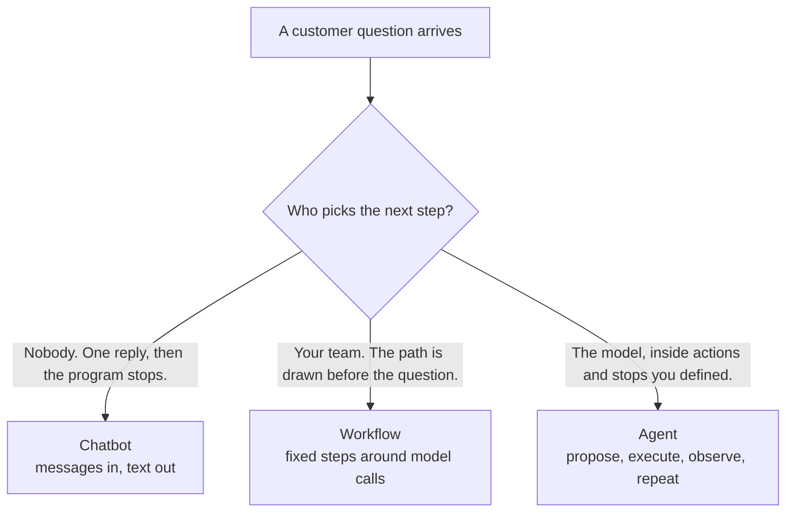
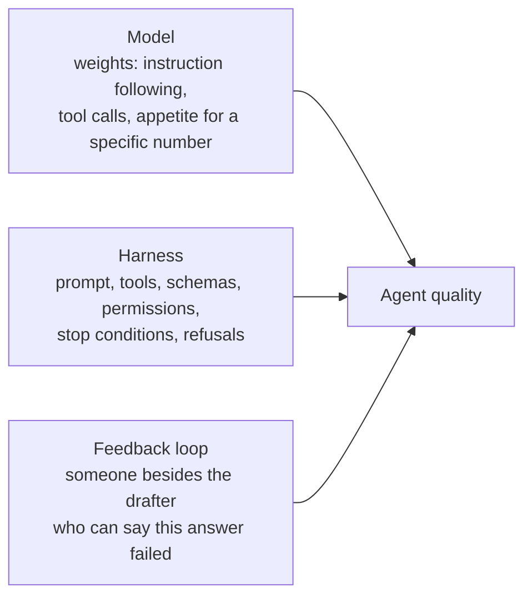
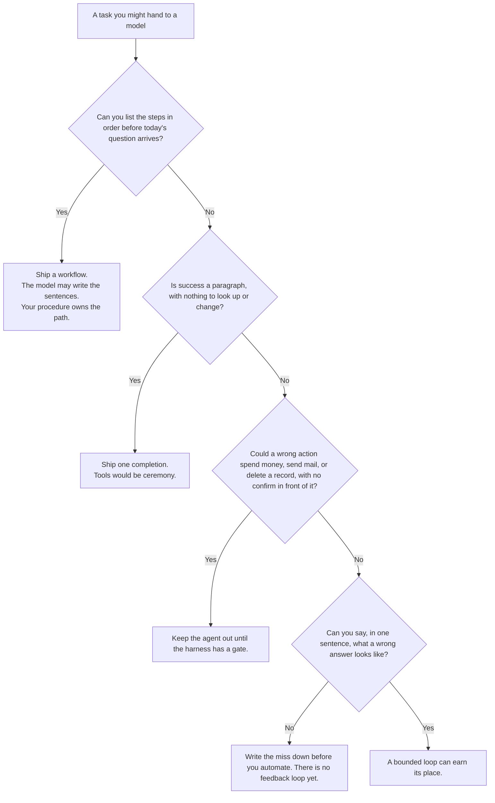

# Ch 1. What an agent is

Saturday, just after the pour-over rush, a regular sets a half-empty bag of house coffee on the counter at Hearth Lane Café.

"These aren't for me," she says. "Can I bring them back? And can you mail a cardamom bun to my sister in another state?"

Three products could stand behind that counter and produce a paragraph. A chatbot. A workflow. An agent. To the customer they can sound identical. They are different products, and a team that treats them as the same thing will staff, measure, and ship the wrong one.

This chapter names the difference, then gives you one equation to carry through the rest of the book: **agent quality = Model × Harness × Feedback loop**. The running example is the Local Shop Concierge for Hearth Lane Café, a fictional neighborhood shop at 12 Hearth Lane, North Mill. Later chapters grow that concierge. This one starts where a lot of products accidentally start: a polite voice that has never opened the shop's own rules.

## 1.1 Three answers, three products

Picture the same question landing on three systems your team could ship this quarter.

**A chatbot** is one conversation turn. The customer speaks. A model writes a paragraph. The program ends. The only state is the transcript you chose to keep. The binder under the counter — returns, shipping, hours — stays closed, because the program was never handed a way to open it. If the paragraph says "of course, thirty days, and we ship pastries nationwide," that number is a guess wearing the voice of a shop rule. The cash drawer, the inventory, and the shipping label are untouched. The customer heard confidence. The shop did not consult itself.

**A workflow** is a procedure written before the question arrived. Someone already knows the path: open the returns page, then ask the model to phrase an answer from that page. The model may still write the sentences. It does not choose the page. The procedure does. For "what is the return window?" that is often the right product. You can draw the branches on a whiteboard on Friday, before Saturday's question exists. The workflow is boring in the best sense: the same question walks the same path.

**An agent** is a model inside a loop. The model may choose the next action from a set you defined, see what happened, and choose again, until a stop condition you also defined. The model proposes. The **harness** — the software around the model — performs the action and writes down what came back. For the coffee-and-bun question, the model might open the policy, or the FAQ, or both, or a page that does not exist and then recover from the error. You did not write a branch for every combination. You wrote the allowed actions, the shape of those actions, and the rule that ends the loop.

The distinction that matters in a product review is **who picks the next step**.

| | Who picks the next step | What the model is allowed to touch | Shape you can draw in advance |
|---|---|---|---|
| Chatbot | Nobody. One call, then stop. | The messages you sent. | A single arrow: question to paragraph |
| Workflow | Your procedure. | Whatever the current step hands it. | A flowchart with named branches |
| Agent | The model, inside bounds you set. | The tools you registered, one action at a time. | A loop, plus a list of allowed tools and stop rules |

Run the café question through all three:

- The chatbot answers from general knowledge and the persona you gave it. It has not opened a file. "Thirty days, and yes we ship pastries" is a prior, the model's habit from other shops, sitting where a Hearth Lane rule should be.
- A workflow for this exact question is short: read the policy, then one completion whose prompt contains that text. Correct, and enough, when you already know the policy is the document that matters.
- The agent earns its place when you stop wanting a new branch for every combination. "Is the bun safe for someone with a nut allergy, and is bike delivery open on Saturday for a twenty-dollar order?" may need the FAQ and the policy, in an order that depends on what the first document said. The loop is how the product handles that without becoming a thicket of special cases.

Chapter 2 builds that loop. This chapter stays with the chatbot on purpose. You want the ungrounded answer visible before any machinery is added. The lab at the end runs that bare conversation so the miss is a transcript, not a hypothetical.

## 1.2 Quality is three factors multiplied

Treat agent quality as a product of three factors a team can change separately. "Product" here is a design reminder: a factor near zero dominates, the way it does in multiplication. Use the reminder to choose the next edit. A review can name the weak factor without a spreadsheet.

**Model** is the weights behind the reply. Instruction following lives here. So does the habit of returning a structured tool call when a tool is offered, the amount of text the model can hold, and the appetite for inventing a precise number. You select a model. This book does not train one.

**Harness** is everything the team writes around the model. The persona. The list of tools. The schemas that say what an argument looks like. The code that actually reads a file. The checks that keep a path inside the shop's documents. The stop conditions. How much randomness you allow. What the product is forbidden to do. Chapters 1–3 keep that harness small. Later chapters add memory, reusable procedures, permissions, and a human confirm. Those additions are still harness. A new vendor name does not create a new category.

**Feedback loop** is how a wrong answer becomes a change. At the start of this book, the feedback loop is a person. You read the reply, you write down the miss, you decide whether the next edit is a prompt, a tool, or a different model. Later the loop is a checker, a saved example, a trace, a metric. The job stays the same. Something other than the drafting model has to be able to say "this failed."

A factor near zero dominates:

- Model near zero: the endpoint returns prose and never a tool call. The Chapter 2 loop has nothing to execute. A warmer persona cannot open the policy by itself.
- Harness near zero: this chapter. The model can be strong and still have no way to see the shop. It answers anyway, because a chat completion is trained to answer.
- Feedback near zero: the paragraph sounds finished, nobody records the invented return window, and the team edits whichever factor they enjoy. The next demo cannot say whether the edit mattered.

The same customer question points at three different repairs:

| What you saw | Factor to move | What changes |
|---|---|---|
| The reply states a return window the program could not have looked up | Harness | Give the concierge a way to read the policy, and require a citation (Chapter 2) |
| The read exists, and this model never uses it | Model | Point the product at a model that emits tool calls (Chapter 3) |
| The file was right, the file was read, and the reply still drops the citation | Feedback | Record the miss now. A checker that rejects uncited claims comes later in the book |

A review that spends the week on a larger model, while the concierge still cannot see the shop, is moving the wrong factor. A review that adds a tool, while nobody is reading the answers, is moving a different wrong factor.

### What to measure before you have a dashboard

You need a sentence you can score on one transcript.

- **Grounding.** Did the answer name a shop fact the program could actually have seen?
- **Citation.** Did it point at a document, or only sound sure?
- **Action boundary.** Did it offer to refund, ship, or email, when the product has no such action?
- **Which factor moved.** If the notes omit whether you edited the prompt, the tools, or the model, the next demo is a new anecdote.

"It hallucinated" is a label. "It said 30 days" is data. Quote the sentence.

## 1.3 When an agent is the wrong product

An agent is the wrong product when the steps already have names, when a single draft is the whole task, or when a wrong action is expensive and nothing stands in front of it.

Ship a **workflow** when the branch exists before the input does. "Print today's hours from the FAQ on the door sign" is a file read. A model in a loop adds a way to skip the file, which is a new failure mode on a task that did not need one. "Pack coffee orders under $40 with a six-dollar shipping line" is arithmetic plus the policy file. Ordinary code should own that.

Ship **one completion** when the task is a draft and nothing is looked up or changed. "Rewrite the cardamom bun description so it fits on a tent card" is a chatbot-shaped job. The success test is "a paragraph exists," and a person can see the card.

Ship an **agent** when the next action depends on the last observation, and drawing every branch in advance becomes a second program you will not maintain. The concierge question that might need the policy, or the FAQ, or both, or another read after an error string, is that case. Bound it anyway: a short tool list, a documents folder, a step cap.

Keep the agent out when the action spends money, sends mail, or deletes a row, until the harness has a confirm step. Later chapters add autonomy tiers for that decision. The early labs only read files and print text. If a reply offers to refund the customer, the offer is fiction. The process has no refund function. In a product review, treat that sentence as a failure mode: the voice promised work the system cannot perform.

"The domain is messy" is a weak reason on its own. Sometimes the mess is a policy nobody has written down. Write the policy. Then decide whether the reader of that file is a function or a model.

## 1.4 The shop the rest of the book keeps

The product in this book is a **Local Shop Concierge** for Hearth Lane Café. It runs as a desktop program beside the shop's own files: a teaching product a practitioner can trace, and a product shape a manager can staff and measure. The same shop carries the story from the first reply through the capstone.

The rules are specific on purpose. A generic retail guess should look wrong the moment you hold it next to the binder:

- Opened coffee is final sale. Unopened bags, valve seal intact, come back within 14 days as Hearth card credit. The café does not give cash refunds.
- Pastries and anything refrigerated are not shipped. Coffee under $40 ships inside the United States for $6.00.
- Local bike delivery is $4.50, free over $35, Tuesday through Friday only, within 3 miles of the shop.
- The café is closed Monday. Tuesday through Friday the hours are 7:30–15:30.
- Cardamom buns contain wheat, butter, and almonds. There is no nut-free prep area.
- The Wi-Fi password is printed on the paper receipt. It is absent from the FAQ. A concierge that invents one has failed, however helpful the sentence sounds.

Those sentences live in the shop documents the Chapter 2 lab is allowed to read. Chapter 1's program does not read them. The gap is the demonstration. A confident paragraph and a grounded paragraph can share a tone. Only one of them had a document in reach.

By the capstone in Chapter 26, one recorded run of the same concierge is expected to:

- read shop files
- query inventory
- fetch a page and compare a price
- remember a constraint, such as an allergy or a budget, across a restart
- propose a cart that a separate checker can reject
- wait for a person to confirm before an order is written
- open a ticket when something is out of stock
- leave a trace and a metric for the finished task

That system is the destination, described so the early chapters have a product to grow into. The work of this chapter is the first measurement: a concierge persona, one reply, and a written list of what it got wrong. Every later chapter adds one piece of harness or feedback and keeps the shop. When a new idea arrives — memory, a skill, a protocol, an autonomy tier — the test is whether it changes what the concierge does on a café task.

## 1.5 What goes wrong while the binder stays closed

A bare completion fails in ways that look like good service. That is why the failure is a product problem, not only a model problem.

**It invents a shop.** Return windows, fees, hours, and prices arrive fully formed. The program had no document, no database, and no tool. The number came from the weights. Customers cannot hear the difference. A demo that shows the paragraph and hides the trace will ship the invention.

**It cites a source it never opened.** A path in the answer is costume when nothing was read. Citation, later, is a harness feature: the tool result carries a path, and the persona asks the model to copy it. In this chapter there is no path to copy. If one appears, record it as an invented citation.

**It offers work it cannot do.** "I'll refund that to your card and print a label" is a sentence. The process has no refund and no label. In a real support product, that sentence is how a customer leaves believing an action is in flight while the back office received nothing.

**A hedge is a different result, and it still belongs in the notes.** "I don't know the shop's policy" is a different miss from a confident "30 days." A hedge is the model declining a guess. A specific window is a guess the program could not have checked. Later harness will ask the model to abstain when the documents are silent. Abstention instructions are harness. This chapter leaves them off so the bare behavior is visible.

A second question is worth asking once you have seen the first. What time does the café open on Monday, and what is the Wi-Fi password? Monday is a real shop fact: the café is closed. The password is not written in the FAQ at all. A bare model will often supply both, smoothly.

## 1.6 How the book uses the café

Read the chapter for the idea. Run the lab when you want the idea to meet a real model. Write down what the model did. Then name which of the three factors you would move. Models differ. The three failure modes from your own run are the data.

The early labs are supposed to miss. Chapter 1's persona asks the model to sound like the counter and to be specific. It hands over no documents. Chapter 2 adds the loop and a cite-or-say-you-don't-know instruction together, which is two changes at once, useful as a before-and-after and too muddy to call a controlled experiment. Chapter 3 holds the harness still and swaps only the model. That is the comparison you can attribute.

The file reads in later labs happen on the machine where the program runs. If the model itself is a hosted service, the prompt leaves that machine as part of the request. Once tools exist, the text of any file the agent read leaves with the next request too. Chapter 3 treats that as a product decision: where the conversation lives, and who is allowed to see the shop's documents. Chapter 1 sends only the persona and the question.

## Lab

Hello Concierge is one completion and no tools. Setup, the command, what to write down, and what a connection error means are in the lab:

[labs/ch01-what-an-agent-is/README.md](../../labs/ch01-what-an-agent-is/README.md)

## Takeaway

A chatbot drafts. A workflow follows a path you already drew. An agent chooses the next allowed action, sees the result, and chooses again, inside stops you defined. Quality collapses when the model, the harness, or the feedback loop is missing. The next chapter puts a loop around the model so a shop rule can be read before it is quoted.
