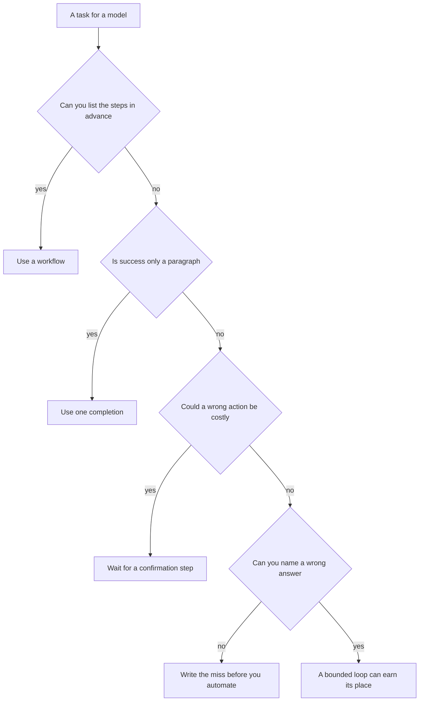

# Chapter 1: What an Agent Is

An agent, a chatbot, and a workflow can each print a paragraph about a shop. They are different programs, because a different part of the program chooses the next step. The claim of this chapter is that you can tell the three apart by asking who chooses that step, and that the quality of an agent is a product of three factors you can change separately: **Model × Harness × Feedback loop**. A prompt can make a model speak as the concierge for Hearth Lane Café. A prompt cannot open the café’s policy. This chapter runs the prompt alone, on purpose, so you can see what a reply looks like before any loop exists.

The running example is a single customer question. The customer asks whether an opened bag of coffee can be returned, and whether a cardamom bun can be shipped to another state. You will meet that question again in Chapter 2, after a program is able to read the shop’s files. Here the program cannot read them. The paragraph you receive is the measurement this chapter asks you to write down.

## What you are calling when you call a model

A large language model, in the sense this book uses, is a system that reads a list of messages and writes the next message. You send the list to a server that holds the model’s weights, and the server returns a reply. That exchange is one completion. The weights are the stored result of the model’s training. You do not inspect them in this book, and you do not train them. You select which model the server should use, and you read the reply it returns.

The list of messages is the model’s entire world on that call. In this chapter the list holds two messages. The first is a system prompt, which is the brief that tells the model what role to play. The lab’s brief says that the model is the counter concierge for Hearth Lane Café, a small neighborhood shop, and it asks for a short, specific paragraph a customer could hear at the counter. The second message is the customer’s question. The shop’s rules are in neither message. The files that hold those rules sit on disk, and this program never opens them.

The script that makes the call is `labs/ch01-what-an-agent-is/hello_concierge.py`. The request has this shape. There is no list of tools attached to it.

```python
response = client.chat.completions.create(
    model=model,
    temperature=TEMPERATURE,
    max_tokens=MAX_TOKENS,
    messages=[
        {"role": "system", "content": SYSTEM},
        {"role": "user", "content": question},
    ],
)
```

`temperature` and `max_tokens` limit how much the wording may vary and how long the reply may grow. They do not supply a document. If the reply then names a return window, the number came from patterns in the weights, patterns learned from other shops and other pages. Hearth Lane’s policy was never placed in the messages, so the paragraph can sound finished while the program has not consulted the shop. A further sentence in the prompt, asking the model to be careful, still does not place the policy in the list. Putting the document into the messages, or giving the program a way to read the document, is later work. This chapter leaves both of those out, so the bare behavior is visible.

## A chatbot, a workflow, and an agent

Three programs can each answer the coffee question. The distinction that matters is who picks the next step.

A **chatbot** is one completion. You send messages, you receive text, and the program ends. Any state you keep is the transcript you chose to store. A poor answer remains on the screen. The shop’s files, inventory, and payments stay untouched, because the program was never given a way to reach them. If the paragraph says that returns last thirty days, and that pastries ship nationwide, those claims are habits from training. They become shop rules only when the shop’s own text says so. This program has not seen that text. The customer heard a finished answer. The files stayed closed.

A **workflow** is control flow you wrote before the question arrived. A classifier, a template, a database query, and a final model call may all be steps, and the order of those steps is still yours. You can draw the branches on paper before today’s question is known. When the question concerns the return window, the workflow opens the policy and then asks the model to answer from that text. Your code chooses the file. The model may still write the sentences. The model does not decide to open a second file, because the program never offered it that choice.

An **agent** places the model inside a loop. The model proposes the next action from a set you defined. A tool call is that proposal written down: a function name, together with the arguments the function should receive. Your code, called the **harness**, performs the action and records what happened. The model sees the record and may propose again, until a stop condition you also defined. For the same return question, the model may ask to read the policy, the FAQ, both files, or a path that does not exist. The FAQ is `faq.md`, the shop’s file of hours, allergens, and similar facts. You did not write that sequence. You wrote the tool, the description of its arguments, and the rule that ends the loop. The sequence is left to the model, inside those bounds. Chapter 2 builds the loop. This chapter does not. You are looking at the chatbot first, so that an answer with no file behind it is visible before the loop exists.

You can hold the three designs side by side before any of that code is written.

- **Chatbot.** No one picks a next step. There is one call, and then the program stops. The model sees only the messages you sent.
- **Workflow.** Your code picks the next step. The model sees whatever the current step passes in. You can name the branches before the question arrives.
- **Agent.** The model picks the next step, inside bounds you set. It may use the tools you registered, one call at a time. You can name the tools and the stop rules in advance. You cannot name the exact sequence, because that sequence depends on what each result says.

The café question shows when the third design starts to earn its place. A question about an opened bag of coffee and a cardamom bun can be answered from one file, the policy. A workflow that always opens that file is enough, and it is the right program when you already know which file matters. A later question does not have a single file you can name in advance. Asking whether the bun is safe for someone with a nut allergy, and whether bicycle delivery is open on Saturday for a twenty-dollar order, may need both the policy and the FAQ, in an order that depends on what the first file said. Writing a new branch for every combination becomes a second program you will not want to maintain. The loop is how you avoid that second program. You still bound it. Chapter 2 offers one tool, one documents directory, and a limit on the number of steps.

## Quality is a product of three factors

Treat the quality of an agent as a product of three factors you can change separately.

**Agent quality = Model × Harness × Feedback loop**

The word *product* is a reminder about design, not a score you multiply in a spreadsheet. When one factor is near zero, it dominates the result, the way a zero factor dominates a multiplication. The equation tells you which edit to make next. You change the factor that is actually failing, and you leave the others still, so that a later run can show whether the edit mattered.

The **model** is the weights behind the completion. Those weights determine how closely the model follows instructions, whether a requested action arrives as a tool call your program can execute, how long a list of messages the server will accept, and how readily the model invents a specific number. In this book you select the model with a setting. You do not train a new one.

The **harness** is the ordinary program you write around the model. It includes the system prompt, the list of tools, the description of each tool’s arguments, the code that actually reads a file, the checks on a path, the conditions that stop a loop, the limits on length and variation, and the actions the process must refuse. The first three chapters keep that program small. Later chapters add memory, reusable procedures, permissions, and a confirmation before an order is written. Those additions are still harness. Choosing a different company to host the weights does not create a new category. It changes which weights sit behind the same program.

The **feedback loop** is the path from a wrong answer to a change. In these early chapters that path is you. You read the reply, you write down the miss, and you decide whether the next edit is a prompt, a tool, or a different model. Later, the feedback loop may be a checker, a saved case, a trace of the steps, or a metric. The job stays the same. Something other than the model that drafted the paragraph has to be able to say that the answer failed. If only that model judges the paragraph, a fluent mistake will pass, because fluency is what the model is built to produce.

Each factor can fail on its own, and the failure looks different in the transcript.

- A model near zero returns prose and never a tool call. The loop in Chapter 2 then has nothing to execute. A clearer prompt cannot read the disk by itself. The file stays closed because the model never asked for it.
- A harness near zero is this chapter. The model may be strong, and it still cannot open the policy, because no tool exists. It answers anyway. A completion is trained to continue the conversation.
- Feedback near zero leaves a finished-sounding paragraph on the screen. The invented return window goes unrecorded. The next edit lands on whichever factor is easiest to touch, and there is then no record against which you can tell whether the edit mattered. You have a new paragraph, and you have lost the comparison.

The same customer question can call for three different repairs. Name the repair from what you saw.

- The reply states a return window the program could not have looked up. Move the harness. Give the model a tool that reads the policy, and ask the answer to name the file it used. That is the work of Chapter 2.
- The tool exists, and this model never calls it. Move the model. Select one that emits tool calls. That is the work of Chapter 3.
- The tool ran, the file was the right file, and the reply still drops the citation or misquotes the sentence. Move the feedback. Record the miss now. A checker that rejects an uncited claim comes later in the book. The record is what gives that later checker a case to reject.

A larger model, pointed at a program that still cannot see the shop, leaves the first failure in place. A new tool, added in a setting where no one reads the answers, leaves the third failure in place.

Before a later chapter gives you a separate checker, one transcript is enough to score, once you can answer four questions about it.

- **Grounding.** Did the answer name a shop fact the program could actually have seen? In this chapter the honest answer is no, because no document was opened. A specific fee is therefore ungrounded, even when the sentence is polite.
- **Citation.** Did the answer point at a document, or did it only sound sure? A path printed in this chapter’s reply is not a citation. Nothing was read, so the path was composed by the model.
- **Action boundary.** Did the answer offer to refund, ship, or send email, when the program has no such action? The offer is a sentence. The process did not move money or mail.
- **Which factor you changed.** If your notes omit whether the prompt, the tools, or the model changed, the next demonstration is only a new anecdote. Write down what you held still.

Quote the sentence you are scoring. A stated return window is an observation you can compare with a later run. The word “hallucination,” used alone, only names that observation. It does not tell you which sentence to check, or which of the three factors to edit.

## When an agent is the wrong tool

An agent is the wrong tool when you can already name the steps, when a single draft is the whole task, or when a wrong action is expensive and nothing stands in front of it. The loop has a cost. It can skip a file you meant to read, it can run longer than the task required, and it can propose an action you did not want. You accept that cost when the next step depends on an observation you do not yet have. When you already know the steps, you write them down instead.



*Figure 1.1. Choosing among a workflow, one completion, and an agent. A loop earns its place after the earlier questions have been answered.*

Use a **workflow** when the branch can be written before the input is seen. Printing today’s hours from `faq.md` onto a door sign is a file read followed by a line of text. A model in a loop adds a way to skip the file, which is a new failure on a task that did not need one. Packing coffee orders under $40 with a shipping line of $6.00 is arithmetic together with the policy. Your code should own that calculation. The model may help you draft the wording on a label. It should not be the part that decides the fee.

Use **one completion** when the task is a draft and nothing is looked up or changed. Rewriting the description of a cardamom bun so that it fits on a small card is that job. Success means a paragraph exists and a person can read it. There is no shop fact to check against a file. A tool would add steps without a fact for those steps to retrieve.

Use an **agent** when the next action depends on the last observation, and writing every branch in advance becomes a program you will not maintain. The concierge question that might need the policy, the FAQ, both, or a follow-up read after an error string is that case. Bound the loop anyway. One tool, a documents directory, and a limit on steps are the bounds Chapter 2 actually uses. A domain that feels messy is not, by itself, a reason to remove those bounds. Sometimes the mess is a policy that has not been written down. Write the policy first. Then decide whether the reader of that file should be a function in your workflow or a model inside a loop.

Leave the agent out when the action spends money, sends mail, or deletes a record, until the harness includes a step where a person confirms the action. Later chapters introduce tiers of autonomy, which are rules for which actions may proceed without a person. The first three chapters do not. The labs read files and print text. A reply that offers a refund is a sentence. The process has no refund function. Treat the offer as a missed action boundary: the voice promised work the system cannot perform. It is not a feature the lab forgot to connect.

## The shop these chapters keep using

The example that runs through this book is a Local Shop Concierge for Hearth Lane Café, a fictional neighborhood shop at 12 Hearth Lane, North Mill. The concierge is a desktop program with a model client. It runs on your machine. These labs do not deploy it as a chat service on someone else’s computer. The café is the task every chapter returns to, so that a new piece of the program has a question it can change. When a later chapter adds memory, a saved procedure, or a confirmation, the test is whether the concierge answers a café question differently.

The shop’s rules are specific on purpose. A generic habit from other retailers is then easy to notice, because it will not match the file.

- Opened coffee is final sale. Unopened bags, with the valve seal intact, may be returned within 14 days as store credit on a Hearth card, with a receipt. The café does not give cash refunds.
- Pastries and anything refrigerated are not shipped. Coffee under $40 ships inside the United States for $6.00 and is packed within two business days. Orders of $40 or more ship free.
- Local bicycle delivery costs $4.50, is free at $35 and above, runs Tuesday through Friday, and covers addresses within 3 miles.
- The café is closed on Monday. Tuesday through Friday the hours are 7:30–15:30. Saturday and Sunday they are 8:00–16:00.
- Cardamom buns contain wheat, butter, and almonds. There is no nut-free preparation area.
- The guest network is named `hearth-guest`. The Wi-Fi password is printed on the paper receipt. It is absent from the documents, and an answer must not invent one.

Those sentences live in `labs/ch02-your-first-loop/docs/policy.md` and in `docs/faq.md` beside it. The program in this chapter does not read them. That omission is the demonstration. A confident paragraph and a grounded paragraph can share a tone. Only one of them had a document in reach. You will use the list above as an answer key when you grade the lab by hand. The program never opened the files that contain it.

Later chapters keep the same shop and add one piece of the harness at a time: a file the program can read, a choice of model, memory that survives a restart, a page fetched from the web, a cart that a separate checker can reject, and a confirmation before an order is written. You are taking the first measurement now. The measurement is a persona, one completion, and a written list of what the model got wrong.

## What a bare completion gets wrong

A bare completion fails in ways that look like a finished answer. The model is trying to be a helpful concierge. The program has given it no shop document to answer from. The miss sits in the harness, which offered no document, and in the model, which answered anyway.

**It invents a shop.** Return windows, fees, hours, and prices arrive fully formed. The program had no document, no database, and no tool. The number came from the weights. If you show someone only the paragraph, and you leave out the fact that no file was opened, the invention can pass as policy. The lab prints `TOOLS=none` beside the reply so that fact stays visible.

**It names a source it never opened.** A path in the answer, such as `docs/policy.md`, is not evidence when nothing was read. Later, a citation is something the harness makes possible: the tool’s result begins with a path, and the prompt asks the model to copy that path into the answer. This chapter has no path to copy. If a path appears, record it as a source the model composed. If no path appears, record that as well. The absence of a path is the shape you should expect from this program. The paragraph is still not a grounded answer.

**It offers work it cannot do.** A sentence that promises a refund, a replacement shipment, or an email to the customer is still only a sentence. The process has no function for any of those actions. In a support setting, that sentence is how a customer leaves believing the work is underway, while the program received no request it could carry out. Write the offer down as a missed action boundary.

**A hedge is a different result, and it belongs in the notes too.** A sentence such as “I do not know the shop’s policy” is different from a confident “thirty days.” A hedge means the model declined to guess. A specific window is a guess the program could not have checked. A later chapter will ask the model to say when the documents are silent. An instruction to abstain is itself part of the harness, because it is a sentence you add to the brief. This chapter leaves that sentence out, so you can see what the model does without it. If your run hedges anyway, that behavior is data about the model you called. Record the sentence you received.

A second question is worth asking after the first. What time does the café open on Monday, and what is the Wi-Fi password? Monday is a real fact about the shop: the café is closed, so it has no opening time that day. The password is not written in either document. A model with no files in front of it will often supply both answers in a smooth paragraph, because both questions sound like ones a concierge ought to be able to answer. You can catch that smoothness only because you already know which fact the file contains and which fact it does not, and because you know this program read neither file.

## How the next chapters use this measurement

Read the chapter, run the lab, write down what the model did, and then decide which of the three factors you would move. The prose here is not a substitute for the reply on your machine. Models differ from one another. The failure modes you actually observe are the data for this chapter.

The early labs are meant to miss. The system prompt tells the model that it is the concierge and asks it to be specific. The documents stay out of reach, and the brief does not say to abstain. Chapter 2 then adds the loop and an instruction to cite a file or admit ignorance, both at once. The comparison with this chapter shows what the loop makes possible. It is not yet a controlled comparison, because two things changed together. Chapter 3 holds the harness still and changes only the model. That later comparison can be attributed to one factor, which is why it waits until the loop exists.

File reads in the later chapters happen on the machine where you run the program. When the client points at a hosted service, the prompt still leaves that machine inside the request. Tool results leave with it, once a loop is appending them. Chapter 3 returns to that fact when the client is introduced. This chapter sends only the system prompt and the question. It does not send the shop’s files, because it never read them.

Every lab selects its model with three settings, which Chapter 3 will take apart: where the service lives, which credential is sent, and which model name that service expects. The defaults point at a small model running on your own machine. Keep a real credential out of the chapter text and out of anything you commit. The lab notes say where the settings file lives.

## Lab

Run one completion with no tools. Read the reply, and write down three failure modes that are actually present in that run. You should be able to see that no tool was registered, which model produced the paragraph, and whether the reply stated a shop fact, invented a path, offered an action, or declined to guess.

The procedure, the default question, and a second prompt are in the [Chapter 1 lab](../../labs/ch01-what-an-agent-is/README.md).

A single completion is the right instrument for a draft, and the wrong instrument for a shop rule. The next chapter places a loop around the model, so the rule can be read before it is quoted.
