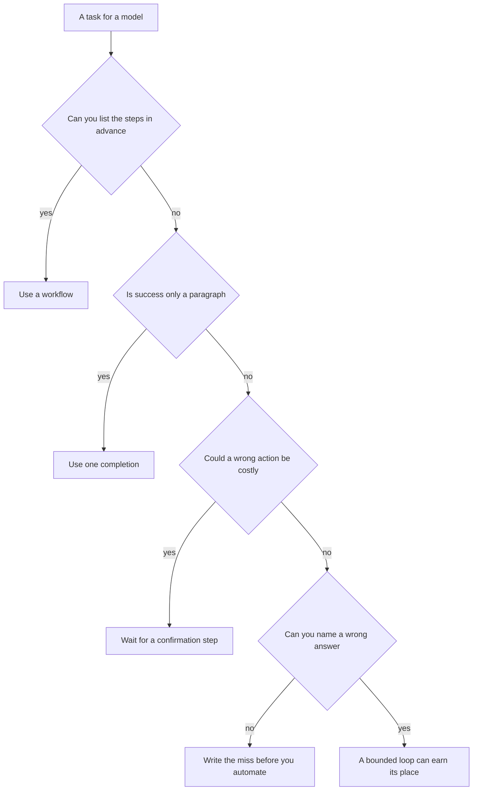

# Chapter 1: What an Agent Is

An agent is a model inside a loop: it chooses the next action from a set you defined, sees the result, and chooses again, until a stop condition you also defined. A chatbot is one model call that returns text and then stops. A workflow is a procedure whose branches you wrote before the question arrived. This chapter separates those three designs and states the product equation used for the rest of the book: **Model × Harness × Feedback loop**. The running example is a desktop concierge for a fictional café. The same customer question behaves differently under each design, and the lab makes the ungrounded case visible by running one completion with no tools.

## Chatbots, Workflows, and Agents

Three programs can each print a paragraph about a return. The distinction that matters, in a design review as much as in an implementation, is who picks the next step.

A **chatbot** sends messages and receives text. The program then ends. Any state is the transcript you choose to keep. A poor answer remains on the screen. The shop’s files, inventory, and payments stay untouched, because the program was never given a way to reach them. If the paragraph says that returns last thirty days and that pastries ship nationwide, that number is a prior the model brought from other shops. The customer heard confidence. The shop’s own rules were never consulted.

A **workflow** is control flow written in advance. A classifier, a template, a database query, and a final model call may all be steps, and the order of those steps is still yours. You can draw the branches before today’s question arrives. When the question concerns the return window, the workflow opens the policy and then asks the model to answer from that text. Your code chooses the file. The model may still write the sentences.

An **agent** places the model inside a loop. The model proposes an action from a set you defined. Your code — the **harness** — performs the action and records the observation. The model sees that observation and may propose again, until a stop condition you defined. For the same return question, the model may read the policy, the FAQ, both, or a path that does not exist and then recover from the error. You wrote the tool, its schema, and the rule that ends the loop. The particular sequence is left to the model, inside those bounds.

- **Chatbot.** No one picks a next step: one call, then stop. The model sees the messages you sent. In advance, the picture is a single arrow from question to paragraph.
- **Workflow.** Your code picks the next step. The model sees whatever the current step passes in. In advance, the picture is a flowchart with named branches.
- **Agent.** The model picks the next step, inside bounds you set, and may use the tools you registered, one call at a time. In advance, the picture is a loop, plus the allowed tools and the stop rules.

The café concierge makes the difference concrete. A customer asks whether an opened bag of coffee can be returned, and whether a cardamom bun can be shipped to another state.

Under the chatbot in this chapter, the answer comes from the model’s weights and from the system prompt. No file has been opened. A stated return window is a prior. It is a shop rule only when the shop’s own text says so, and this program has not seen that text.

A workflow for this exact question is short. Read the policy, then make one completion whose prompt contains that file. The result can be correct, because you already know which document matters.

An agent earns its place when a new branch for every combination of facts would become a second program. A question about a nut allergy and about Saturday bike delivery for a twenty-dollar order may need the FAQ and the policy, in an order that depends on what the first file said. Chapter 2 builds that loop. This chapter runs the chatbot on purpose, so the ungrounded answer is visible first.

## Agent Quality

Treat agent quality as a product of three factors a team can change separately:

**Agent quality = Model × Harness × Feedback loop**

*Product*, here, is a design reminder. A factor near zero dominates the result, and the equation is how you choose the next edit.

The **model** is the weights behind the completion. It determines how well instructions are followed, whether a requested action arrives as a structured tool call, how long a context is accepted, and how readily a specific number is invented. In this book you select the model. Training it is outside the scope.

The **harness** is everything written around the model: the system prompt, the tool list, argument schemas, the code that actually reads a file, path checks, stop conditions, sampling limits, and the actions the process must refuse. Chapters 1–3 keep the harness small. Later chapters add memory, skills, permissions, and confirmations. Those additions remain harness. A new vendor name does not create a new category.

The **feedback loop** is the path from a wrong answer to a change. In these early chapters that path is a person. You read the reply, record the miss, and decide whether the next edit is a prompt, a tool, or a different model. Later, the feedback loop may be a checker, a saved case, a trace, or a metric. The job stays the same. Something other than the drafting model has to be able to say that the answer failed.

- A model near zero returns prose and never a tool call. The loop in Chapter 2 then has nothing to execute. A clearer prompt cannot read the disk by itself.
- A harness near zero is this chapter. A strong model still cannot open the policy. It answers anyway, because a chat completion is trained to answer.
- Feedback near zero leaves a finished-sounding paragraph. The invented return window goes unrecorded, and the next edit lands on whichever factor is easiest to touch. There is then no way to tell whether the edit mattered.

The same customer question can call for three different repairs.

- The reply states a return window the program could not have looked up. Move the **harness**: give the model a tool that reads the policy, and require a path citation. That is Chapter 2.
- The tool exists, and this model never calls it. Move the **model**: select one that emits tool calls. That is Chapter 3.
- The tool ran, the file was right, and the reply still drops the citation. Move **feedback**: record the miss now. A checker that rejects uncited claims comes later in the book.

Move the factor that is actually near zero. A larger model, aimed at a program that still cannot see the shop, leaves that failure in place. A new tool, added where no one reads the answers, leaves that failure in place.

Before a dashboard exists, one transcript is enough to score, once four questions about it have answers.

- **Grounding.** Did the answer name a shop fact the program could actually have seen?
- **Citation.** Did it point at a document, or only sound sure?
- **Action boundary.** Did it offer to refund, ship, or email, when the product has no such action?
- **Which factor moved.** If the notes omit whether the prompt, the tools, or the model changed, the next demonstration is only a new anecdote.

Quote the sentence. A stated return window is an observation. The word “hallucination,” used alone, only names that observation.

## When an Agent Is the Wrong Tool

An agent is the wrong tool when the steps can already be named, when a single draft is the whole task, or when a wrong action is expensive and nothing stands in front of it.

*Figure 1.1. Choosing among a workflow, one completion, and an agent.*

Use a **workflow** when the branch can be written before the input is seen. Printing today’s hours from the FAQ onto a door sign is a file read. A model in a loop adds a way to skip the file, which is a new failure on a task that did not need one. Packing coffee orders under $40 with a six-dollar shipping line is arithmetic together with the policy. Code should own that calculation.

Use **one completion** when the task is a draft and nothing is looked up or changed. Rewriting a cardamom-bun description so that it fits on a tent card is that job. Success means a paragraph exists and a person can see the card. Tools would add steps without a fact to check.

Use an **agent** when the next action depends on the last observation, and writing every branch in advance becomes a program you will not maintain. The concierge question that might need the policy, the FAQ, both, or a follow-up read after an error is that case. Bound the loop anyway: one tool, a documents directory, and a step cap.

Leave the agent out when the action spends money, sends mail, or deletes a record, until the harness includes a confirmation step. Later chapters introduce autonomy tiers. Chapters 1–3 do not. The labs read files and print text. A reply that offers a refund is a sentence; the process has no refund function. Treat the offer as a failure mode: the voice promised work the system cannot perform.

A messy domain, by itself, is a weak reason to add an agent. Sometimes the mess is a policy that has not been written down. Write the policy first. Then decide whether the reader of that file should be a function or a model.

## The Local Shop Concierge

The product that runs through this book is a **Local Shop Concierge** for Hearth Lane Café, a fictional neighborhood shop at 12 Hearth Lane, North Mill. It runs on the practitioner’s machine: a desktop program with a model client, which a team can trace and a manager can staff and measure. These labs do not deploy it as a hosted chat product.

The shop rules are specific on purpose, so a generic retail prior is easy to spot.

- Opened coffee is final sale. Unopened bags, valve seal intact, may be returned within 14 days as store credit on a Hearth card, with a receipt. The café does not give cash refunds.
- Pastries and anything refrigerated are not shipped. Coffee under $40 ships in the United States for $6.00 and is packed within two business days.
- Local bike delivery costs $4.50, is free at $35 and above, runs Tuesday through Friday, and covers addresses within 3 miles.
- The café is closed on Monday. Tuesday through Friday the hours are 7:30–15:30. Saturday and Sunday they are 8:00–16:00.
- Cardamom buns contain wheat, butter, and almonds. There is no nut-free preparation area.
- The guest network is named `hearth-guest`. The Wi-Fi password is printed on the paper receipt. It is absent from the FAQ, and the concierge must not invent one.

Those sentences live in the shop documents used from Chapter 2 onward. The program in this chapter does not read them. That omission is the demonstration. A confident paragraph and a grounded paragraph can share a tone. Only one of them had a document in reach.

Chapter 26 is the same concierge with the harness filled in. One recorded run is expected to read shop files, query inventory, fetch a page and compare a price, remember a constraint such as an allergy or a budget across a restart, propose a cart that a separate checker can reject, wait for a person to confirm before an order is written, open a ticket when an item is out of stock, and leave a trace and a metric for the finished task.

This chapter takes the first measurement: a concierge persona, one completion, and a written list of what the model got wrong. Each later chapter adds one piece of harness or one piece of feedback and keeps the same shop. When a new idea appears — memory, a skill, a protocol, an autonomy tier — the test is whether it changes what the concierge does on a café task.

## What a Bare Completion Gets Wrong

A bare completion fails in ways that look like good service. The failure is a product problem and a model problem at once.

**It invents a shop.** Return windows, fees, hours, and prices arrive fully formed. The program had no document, no database, and no tool. The number came from the weights. A demonstration that shows the paragraph and hides the missing trace will ship the invention.

**It cites a source it never opened.** A path in the answer is costume when nothing was read. Citation, later, is a harness feature: the tool result carries a path, and the prompt asks the model to copy it. This chapter has no path to copy. If one appears, record it as an invented citation.

**It offers work it cannot do.** A sentence that promises a refund or a shipping label remains a sentence. The process has neither function. In a support product, that sentence is how a customer leaves believing an action is underway, while the back office received nothing.

**A hedge is a different result, and it still belongs in the notes.** “I do not know the shop’s policy” differs from a confident “30 days.” A hedge is the model declining a guess. A specific window is a guess the program could not have checked. Later harness will ask the model to abstain when the documents are silent. An abstention instruction is itself harness. This chapter leaves it off, so the bare behavior is visible.

A second question is worth asking after the first. What time does the café open on Monday, and what is the Wi-Fi password? Monday is a real shop fact: the café is closed. The password is not written in the FAQ at all. A bare model will often supply both, smoothly.

## How to Read the Chapters That Follow

Read the chapter, run the lab, write down what the model did, and then decide which factor moved. The prose is not a substitute for the trace on your machine. Models differ. The failure modes you observe are the data.

The early labs are meant to miss. The system prompt here tells the model that it is the concierge and asks it to be specific. The shop documents stay out of reach, and there is no instruction to abstain when unsure. Chapter 2 adds the loop and a cite-or-admit-ignorance instruction together, so the comparison with this chapter is a before-and-after with two changes at once. Chapter 3 holds the harness still and swaps only the model. That comparison can be attributed to one factor.

*Desktop-first* means file reads happen on the machine where the program runs. When the client points at a hosted API, the prompt — and, in later chapters, any tool results — still leaves the machine inside the request. Chapter 3 returns to that point. This chapter sends only the system prompt and the question.

Every lab selects a provider with three settings: where the API lives, which credential is sent, and which model name that server expects. The defaults are a small local model. Chapter 3 is where those settings move and the harness stays put. Credentials stay out of the chapter text and out of the repository.

## Lab

Run one completion with no tools. Read the reply, and write down three failure modes that are actually present in that run. You should be able to see that no tool was registered, which model produced the paragraph, and whether the reply made a specific shop claim or hedged.

Procedure, the default question, and a second prompt are in the [Chapter 1 lab](../../labs/ch01-what-an-agent-is/README.md).

A single completion is the right instrument for a draft, and the wrong instrument for a shop rule. The next chapter places a loop around the model, so the rule can be read before it is quoted.
