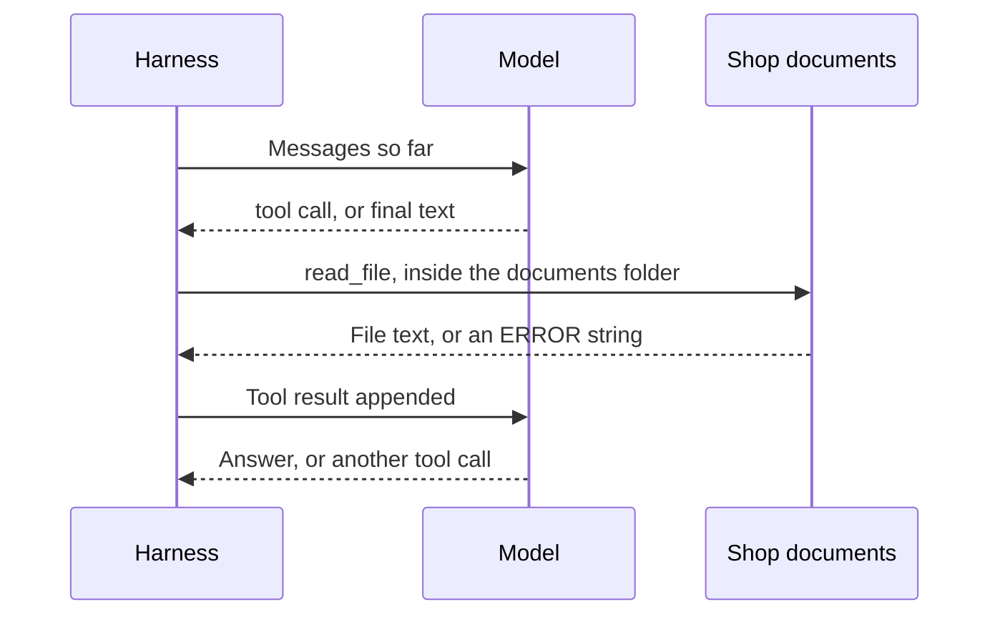
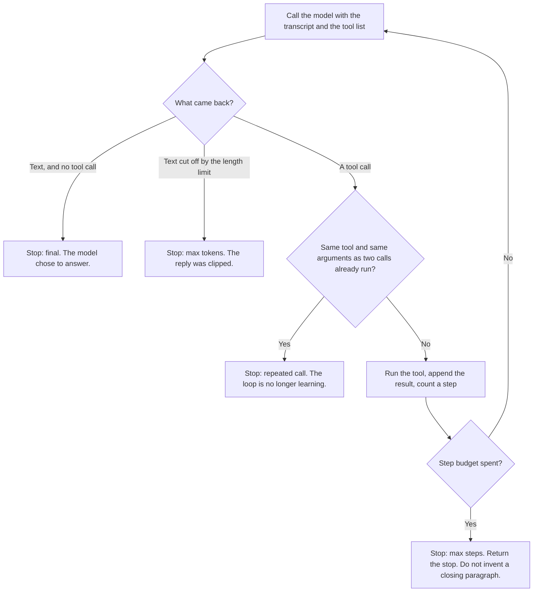

# Chapter 2: The Agent Loop

Chapter 1 sent one completion and let the model talk about a shop it could not see. This chapter places the model in a loop: the model perceives the transcript, proposes a tool call, your process runs that tool, the result is appended, and the cycle repeats until a stop condition fires. The only tool is `read_file`, confined to `labs/ch02-your-first-loop/docs/`. The claim of this chapter is concrete: **the loop is the product; the prompt is a brief for the loop.**

The lab script is `labs/ch02-your-first-loop/file_agent.py`. It uses the shared harness in `labs/common/loop.py` and `labs/common/tools.py`.

## How the Loop Works

The loop has four steps. Each step has an owner. Mixing the owners up is how a team gives the model a filesystem, or forgets to show it the error it needs in order to recover.

**Perceive.** The model sees a list of messages: the system prompt, the customer’s question, and every tool result so far. It does not see the filesystem. On this turn, a fact that is absent from that list is absent from the model’s world. Perception is a designed surface. Whatever you leave out, the model will fill from habit.

**Reason.** You call the model. The call is opaque. You do not inspect weights. You inspect the object that comes back: assistant text, one or more `tool_calls`, or both. “Reasoning” here names that choice, visible only in the object. A private chain of thought is not required for the product to work, and you should not need one to operate the loop.

**Act.** If tool calls are present, your code runs them. The model does not open files. `read_file` in `labs/common/tools.py` does. That split is the security boundary later chapters tighten. In this chapter the boundary is a check that the path stays under one directory. The concierge may read the shop’s markdown. It may not read environment files, hidden names, or a path that climbs out of the documents folder with `..`.

**Observe.** You append a message with `role: tool`, whose `tool_call_id` matches the call, and then you call the model again. The observation is data, including an `ERROR:` string. “That file is not here, and these files are” is a useful observation, because the model can correct a message it can see. An exception that kills the process is a lost observation. The model cannot correct a crash it never sees.



*Figure 2.1: The agent loop. The model perceives the message list and proposes the next step. The harness executes the allowed tool and appends the observation. The cycle repeats until a stop condition fires.*

The implementation is `run_file_agent` in `labs/common/loop.py`. Each iteration makes one completion with the same `tools` list, appends the assistant message, and either returns the text or dispatches every tool call:

```python
response = client.chat.completions.create(
    model=model,
    messages=messages,
    tools=[READ_FILE_TOOL],
    temperature=TEMPERATURE,
    max_tokens=MAX_TOKENS,
)
```

The request does not include a `tool_choice` field. Chapter 3 explains why: Ollama’s compatible endpoint does not support that field. The consequence belongs here as well. A model is allowed to skip the tool and answer at once. In the lab, that behavior appears as a final answer with an empty trace. Treat that answer as you treated the Chapter 1 reply. The loop was present. The model did not use it. Record the skip, so the next edit knows which factor moved.

A grounded path through the Hearth Lane question looks like this:

1. The user asks about opened coffee and about shipping a cardamom bun out of state.
2. The model calls `read_file` with `policy.md`.
3. The harness returns the file, prefixed with `PATH: docs/policy.md`.
4. The model answers that opened coffee is final sale and that pastries are not shipped, and both claims carry `(docs/policy.md)`.

The first read may be the wrong file. Suppose the model opens `faq.md`, looking for a shipping rule, and the FAQ says that returns and shipping live in the policy. That miss is useful. The model sees it, opens `policy.md`, and only then states the rule. The recovery is the product. A single stronger sentence in the prompt cannot open a file.

A second question, used in the Chapter 3 lab, needs both files. The delivery fee is only in the policy. The closed day is only in the FAQ. The same loop handles that question without a new branch: two tool calls, two observations, then text. That is the reason to use a loop, instead of hard-coding a step that always reads `policy.md`.

The system prompt, `SYSTEM_PROMPT` in `labs/common/loop.py`, still matters. It names the two files and tells the model to cite a path or to say that it does not know. The prompt is a brief for the loop. It is not the component that reads the disk. If you remove `run_file_agent` and keep the prompt, you are back in Chapter 1.

## How a Tool Is Specified

A tool the model can call has four parts you should be able to write down before you implement it. If the four parts are vague, the model will invent a fifth behavior, and the harness will either crash or silently do something you did not mean.

| Part | What it answers | `read_file` in this lab |
|---|---|---|
| Name | Which action is this? | `read_file`. The only name the dispatcher accepts. |
| Arguments | What must the model supply? | One string, `path`, relative to the docs directory. `policy.md` and `faq.md` exist. |
| Returns | What comes back on success? | UTF-8 text beginning with `PATH: docs/...`, so a citation has something true to copy. |
| Errors | What comes back on failure, and does the loop survive? | A string beginning with `ERROR:`. A missing file, a `..` segment, an absolute path, a hidden name, or non-UTF-8 text. The loop continues. |

The schema sent to the server is `READ_FILE_TOOL` in `labs/common/tools.py`. The description is documentation for the model. It tells a small model which file holds returns and which file holds hours. That description is part of the harness. It steers. It does not enforce the directory limit. The function does.

The function refuses the following paths, and it returns text in each case:

- `../.env`, `docs/../../.env`, and any other `..` segment
- absolute paths, such as `/etc/passwd`
- hidden names, such as `.env`
- a symlink inside `docs/` whose target resolves outside `docs/`

On a missing file, the error names the markdown files that do exist, so the next turn can recover:

```text
ERROR: docs/secret.md not found. Available markdown: faq.md, policy.md.
```

Argument parsing has the same shape. Providers send `function.arguments` as a JSON string. Some local stacks hand you a dictionary. `parse_arguments` accepts both. Invalid JSON becomes an `ERROR:` tool result that shows the expected shape, `{"path": "policy.md"}`, and the loop continues inside the step budget. An unknown tool name—a refund, an email, a shell command—is the same kind of result: `ERROR: unknown tool 'send_email'. Only read_file is available.`

Returns are capped at 12,000 characters (`MAX_FILE_CHARS`). The two shop files are far smaller. The cap keeps a later document from silently filling the context window. Truncation is marked in the tool result with `[truncated by harness]`, so the observation stays honest. An observation that pretends to be the whole file, after cutting it, teaches the model a false picture of the shop.

The dispatcher is a closed set. `_dispatch` calls `read_file`, or it returns an unknown-tool error. There is no `eval`, no shell, and no rule of the form “the model supplied a path, so open it from the repository root.” The docs directory is an argument to `run_file_agent`. The Chapter 2 script passes `labs/ch02-your-first-loop/docs`. The Chapter 3 script passes that same directory. Aiming the tool at the repository root requires an edit to the harness, and that edit should be reviewed as a harness change, because it changes what the concierge is allowed to touch.

`read_file` is a sensor. It lets the model perceive one folder. Later chapters add tools that change the world—carts, tickets, messages—and the same four-part contract still applies. A tool without an error shape is a tool that fails in private.

The directory limit can be inspected without a model. The lab README gives that check. You should see an `ERROR:` line, and you should not see the contents of an environment file.

## When the Loop Stops

A loop without a stop is a stuck process and, on a hosted model, a bill. Stops are how the harness keeps a promise the model cannot keep by itself: this task will end. `AgentResult.stopped` records which reason fired. Read that tag before you read the prose, and ask for it in any demo.



*Figure 2.2: Stop conditions. Final means the model stopped calling tools. It does not mean the answer is true. The other three stops keep the loop from running without a new observation.*

**`final`.** The model returned a message with no tool calls. The harness treats the assistant text as the customer-facing answer and returns it. This is the success path, including the path on which the model skipped the tool. *Final* means the model stopped calling tools. It does not mean the answer is true. A polished paragraph with an empty tool log is a final stop. It is a different event from a paragraph that arrived after the policy was read.

**`max_steps`.** `DEFAULT_MAX_STEPS` is 6, counted in model calls, not in tool calls. A question about this shop needs at most two reads. Six leaves room for a bad path, an error result, and a retry. When the budget is spent, `run_file_agent` returns a stop message and does not compose a customer answer from the tool trace. Writing that closing paragraph inside the harness would hide the overrun. The lab prints the trace, so the reads that did happen remain visible.

**`repeated_call`.** The same tool name and the same JSON arguments may run twice. The second result includes a note: this file was already read, so answer now. A third identical call stops the loop. A model that re-reads `policy.md` forever would otherwise spend the whole step budget and say nothing new. The signature includes the arguments, so reading `policy.md` and then `faq.md` is not a repeat. The stop is about spinning, not about using more than one document.

**`max_tokens`.** If a turn ends with `finish_reason == "length"` and there is no tool call, the harness stops and labels the stop `max_tokens`. `MAX_TOKENS` is 800, set in `labs/common/client.py`. A limit that is too small cuts a reply in the middle of a sentence. On some providers it can also cut the JSON of a tool call’s arguments. That case usually appears as an `ERROR:` about invalid JSON on the next observation, and the model may retry until the step budget ends. If you see truncated arguments, raise `MAX_TOKENS`. That constant is harness. It is separate from the provider switch in `.env`.

The lab script prints the stop tag after the answer:

```text
--- stop: final after 2 model call(s) ---
```

When you compare two models in Chapter 3, compare this line as well as the prose.

## How Answers Cite Their Sources

The tool result begins with a path header:

```text
PATH: docs/policy.md
```

The system prompt tells the model to carry that path into the answer, in parentheses, as `(docs/policy.md)`. A fee, an hour, or a return window without a path is not yet a grounded answer, even when the sentence happens to match the file. You can check the match only because the path tells you which file to open.

`file_agent.py` prints a soft note when the final text does not contain `docs/`. That note is feedback for the person running the lab. It is not a checker. It does not retry the model. It looks for a substring, so a model can satisfy it with a path it never read. A real check opens the cited file and confirms that the sentence is in it. Chapter 11 separates the checker from the drafter. Your job here is to notice that a citation is a claim about a file, and that claims about files are verifiable in a way that a confident tone is not.

Use these shop facts as an answer key when you grade a run by hand.

| Claim | File | What the file says |
|---|---|---|
| Opened coffee | `docs/policy.md` | Final sale |
| Unopened coffee | `docs/policy.md` | 14 days, receipt, Hearth card credit, no cash |
| Ship a cardamom bun | `docs/policy.md` | Pastries are not shipped |
| Coffee shipping under $40 | `docs/policy.md` | $6.00, United States only, packed in 2 business days |
| Local delivery fee | `docs/policy.md` | $4.50, free at $35 and above, Tuesday–Friday, within 3 miles |
| Closed day | `docs/faq.md` | Monday |
| Weekday hours | `docs/faq.md` | Tuesday–Friday, 7:30–15:30. Saturday and Sunday, 8:00–16:00 |
| Cardamom bun allergens | `docs/faq.md` | Wheat, butter, and almonds |
| Guest network | `docs/faq.md` | `hearth-guest` |
| Wi-Fi password | neither file | Printed on the paper receipt. An invented password is a failure even when a path is cited |

The Wi-Fi question is worth asking on purpose. A sound trace reads `faq.md`, may report the network name `hearth-guest`, and then declines to invent a password. A weak trace prints a plausible string and sometimes cites the FAQ as if the silence were a source. The FAQ’s silence is the test. A product that must answer every question will fail this one by design.

A question the shop does not cover, such as whether it sells live crabs, has the same shape. The files are silent. The grounded behavior is to say that they do not say. A made-up menu item is a miss.

Citations are harness work in two places. Your code adds the `PATH:` header. The instruction to copy that path into the answer is something the model may ignore. When the model ignores it, you have a feedback item. Changing an adjective in the prompt is optional. Recording the miss is the work.

## What Goes Wrong After a File Can Be Read

Opening the documents creates failures a closed binder cannot have. These are the failures a shipped concierge will actually show.

**The model skips the tool.** The stop is `final`. The tool log is empty. The paragraph may be fluent and wrong, which is Chapter 1 wearing a Chapter 2 label. The harness allowed the skip because forcing a tool call is not portable across the providers in Chapter 3. Measure the skip. Do not treat it as a prompt problem until you have seen the same question on a model that does call tools.

**The model reads the wrong file, then recovers.** That is the loop earning its cost. An error, or a file that lacks the fact, should be followed by a second read. If the trace shows the recovery, the product is working even when the first choice was clumsy.

**The model reads the right file and still misquotes it.** Opened coffee is final sale. The unopened rule—14 days, a receipt, store credit—is the trap. A model that applies the unopened rule to an opened bag has the document and the wrong sentence. The trace proves the file was seen. It does not prove the sentence was faithful. That is why a person, and later a checker, compares the claim to the file.

**The model cites a path it did not read.** The soft check looks for the letters of a path. A review that stops at the soft check will pass costume citations. Open the file.

**The loop spins.** Repeated reads of the same file, or a walk that never settles into an answer, should hit a stop you can name. If a demo instead shows a long pause and then a smooth paragraph, ask whether the harness invented that paragraph after giving up. In this design, it does not. The stop message is the honest result.

**The model offers a refund.** The tool list has no refund. A sentence that promises one is the action-boundary failure from Chapter 1, now with a trace beside it. Nothing in the log moved money.

## What a Trace Should Show

A demo of the concierge is incomplete without the trace. On one real question, keep four things next to the customer-facing paragraph:

- Which documents were opened, and whether each result began with `PATH:` or `ERROR:`.
- The stop reason and the step count: `final`, `max_steps`, `repeated_call`, or `max_tokens`.
- Whether each shop fact in the answer appears in the cited file. Place the file’s line next to the model’s line.
- What the product did when the documents are silent. The Wi-Fi password, and a question the shop does not sell, are the probes.

Those four are leading indicators. Later chapters add cost, latency, confirmations, and a separate checker. They do not replace the trace. A support metric that counts “the customer received a reply” will score an invented return window as a success.

The trace also says where to spend the next change. Empty traces point at the model, or at a schema the model cannot see. A new paragraph of persona will not open the file. Full traces whose sentences still drift point at feedback: nobody is rejecting an uncited or misquoted claim. Traces that show tools you never meant to offer mean the contract is too loose, and that is harness.

The unit tests in `labs/common/test_harness.py` cover the directory limit, invalid JSON, unknown tools, the step cap, and the repeated-call stop, and they do so without a server.

## Lab

The exercise answers a return question and a shipping question from the shop documents, using `read_file` and path citations. From one real run, record the trace, the stop tag, the step count, and whether each shop fact appears in the cited file. If the trace is empty, record that emptiness. The harness did not force a tool call.

Setup, the extra questions, and the checks you can run without a model are in [`labs/ch02-your-first-loop/README.md`](../../labs/ch02-your-first-loop/README.md).

The loop is the product. The prompt tells the model which files exist and how to cite them. The loop is what opens a file, confines the path, returns errors as text, and refuses to run forever. A stronger sentence in the system prompt does not place `read_file` on the disk. A working `read_file` still needs a person, or a later checker, to confirm that the citation matches the file.
