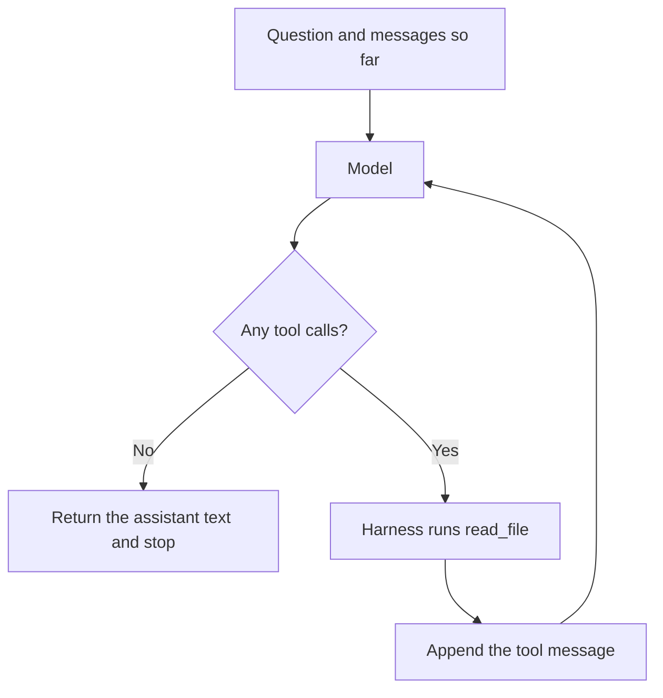

# Chapter 2: The Agent Loop

Chapter 1 sent one completion and let the model talk about a shop it could not see. This chapter places the model in a loop: the model perceives the transcript, proposes a tool call, your process runs that tool, the result is appended, and the cycle repeats until a stop condition fires. The only tool is `read_file`, confined to `labs/ch02-your-first-loop/docs/`. The claim of this chapter is concrete: **the loop is the product; the prompt is not.**

The lab script is `labs/ch02-your-first-loop/file_agent.py`. It uses the shared harness in `labs/common/loop.py` and `labs/common/tools.py`.

## How the Loop Works

The loop has four steps. Each step corresponds to a part of the program.

**Perceive.** The model sees a list of messages: the system prompt, the customer’s question, and every tool result so far. It does not see the filesystem. On this turn, a fact that is absent from that list is absent from the model’s world.

**Reason.** You call the model. The call is opaque. You do not inspect weights. You inspect the object that comes back: assistant text, one or more `tool_calls`, or both.

**Act.** If tool calls are present, your code runs them. The model does not open files. `read_file` in `labs/common/tools.py` does. That split is the security boundary you will tighten in later chapters. In this chapter the boundary is a check that the path stays under one directory.

**Observe.** You append a message with `role: tool`, whose `tool_call_id` matches the call, and then you call the model again. The observation is data. An illegal or missing path comes back as a string that begins with `ERROR:`. An exception that kills the process is a lost observation. The model cannot correct a crash it never sees.



*Figure 2.1: The agent loop. The model perceives the message list and proposes the next step. The harness executes the allowed tool and appends the observation. The cycle repeats until a stop condition fires.*

The implementation is `run_file_agent` in `labs/common/loop.py`. Each iteration makes one completion with the same `tools` list, appends the assistant message, and either returns the text or dispatches every tool call:

```python
response = client.chat.completions.create(
    model=model,
    messages=messages,
    tools=[READ_FILE_TOOL],
    temperature=TEMPERATURE,
    max_tokens=MAX_TOKENS,
)
```

The request does not include a `tool_choice` field. Chapter 3 explains why: Ollama’s compatible endpoint does not support that field. The consequence belongs here as well. A model is allowed to skip the tool and answer at once. In the lab, that behavior appears as a final answer with an empty trace. Treat that answer as you treated the Chapter 1 reply. The loop was present. The model did not use it.

A grounded path through the Hearth Lane question looks like this:

1. The user asks about opened coffee and about shipping a cardamom bun out of state.
2. The model calls `read_file` with `policy.md`.
3. The harness returns the file, prefixed with `PATH: docs/policy.md`.
4. The model answers that opened coffee is final sale and that pastries are not shipped, and both claims carry `(docs/policy.md)`.

A second question, used in the Chapter 3 lab, needs both files: the delivery fee is in the policy, and the closed day is in the FAQ. The same loop handles that question without a new branch. Two tool calls, two observations, then text. That is the reason to use a loop, instead of hard-coding a step that always reads `policy.md`.

The system prompt, `SYSTEM_PROMPT` in `labs/common/loop.py`, still matters. It names the two files and tells the model to cite a path or to say that it does not know. The prompt is a brief for the loop. It is not the component that reads the disk. If you remove `run_file_agent` and keep the prompt, you are back in Chapter 1.

## How a Tool Is Specified

A tool the model can call has four parts you should be able to write down before you implement it.

| Part | `read_file` in this lab |
|---|---|
| Name | `read_file`. The only name the dispatcher accepts. |
| Arguments | One string, `path`, relative to the docs directory. `policy.md` and `faq.md` are the paths that exist. |
| Returns | UTF-8 text beginning with `PATH: docs/...`, so the model can cite what it was shown. |
| Errors | A string beginning with `ERROR:`. A missing file, a `..` segment, an absolute path, a hidden name, or non-UTF-8 text. The loop continues. |

The schema sent to the server is `READ_FILE_TOOL` in `labs/common/tools.py`. The description is documentation for the model. It tells a small model which file holds returns and which file holds hours. That description is part of the harness. It does not enforce the directory limit. The function does.

The function refuses the following paths, and it returns text in each case:

- `../.env`, `docs/../../.env`, and any other `..` segment
- absolute paths, such as `/etc/passwd`
- hidden names, such as `.env`
- a symlink inside `docs/` whose target resolves outside `docs/`

On a missing file, the error names the markdown files that do exist, so the next turn can recover:

```text
ERROR: docs/secret.md not found. Available markdown: faq.md, policy.md.
```

Argument parsing has the same shape. Providers send `function.arguments` as a JSON string. Some local stacks hand you a dictionary. `parse_arguments` accepts both. Invalid JSON becomes an `ERROR:` tool result that shows the expected shape, `{"path": "policy.md"}`, and the loop continues inside the step budget. An unknown tool name is the same kind of result: `ERROR: unknown tool 'send_email'. Only read_file is available.`

Returns are capped at 12,000 characters (`MAX_FILE_CHARS`). The two shop files are far smaller. The cap keeps a later document from silently filling the context window. Truncation is marked in the tool result with `[truncated by harness]`, so the observation stays honest.

The dispatcher is a closed set. `_dispatch` calls `read_file`, or it returns an unknown-tool error. There is no `eval`, no shell, and no rule of the form “the model supplied a path, so open it from the repository root.” The docs directory is an argument to `run_file_agent`. The Chapter 2 script passes `labs/ch02-your-first-loop/docs`. The Chapter 3 script passes that same directory. Aiming the tool at the repository root requires an edit to the harness.

The directory limit can be inspected without a model. The lab README gives that check. You should see an `ERROR:` line, and you should not see the contents of an environment file.

## When the Loop Stops

A loop without a stop is a stuck process and, on a hosted model, a bill. This harness stops for four reasons. `AgentResult.stopped` records which one fired.

**`final`.** The model returned a message with no tool calls. The harness treats the assistant text as the customer-facing answer and returns it. This is the success path, including the path on which the model skipped the tool. *Final* means the model stopped calling tools. It does not mean the answer is true.

**`max_steps`.** `DEFAULT_MAX_STEPS` is 6, counted in model calls, not in tool calls. A question about this shop needs at most two reads. Six leaves room for a bad path, an error result, and a retry. When the budget is spent, `run_file_agent` returns a stop message and does not compose a customer answer from the tool trace. Writing that closing paragraph inside the harness would hide the overrun. The lab prints the trace, so the reads that did happen remain visible.

**`repeated_call`.** The same tool name and the same JSON arguments may run twice. The second result includes a note: this file was already read, so answer now. A third identical call stops the loop. A model that re-reads `policy.md` forever would otherwise spend the whole step budget and say nothing new. The signature includes the arguments, so reading `policy.md` and then `faq.md` is not a repeat.

**`max_tokens`.** If a turn ends with `finish_reason == "length"` and there is no tool call, the harness stops and labels the stop `max_tokens`. `MAX_TOKENS` is 800, set in `labs/common/client.py`. A limit that is too small cuts a reply in the middle of a sentence. On some providers it can also cut the JSON of a tool call’s arguments. That case usually appears as an `ERROR:` about invalid JSON on the next observation, and the model may retry until the step budget ends. If you see truncated arguments, raise `MAX_TOKENS`. That constant is harness. It is separate from the provider switch in `.env`.

The lab script prints the stop tag after the answer:

```text
--- stop: final after 2 model call(s) ---
```

When you compare two models in Chapter 3, compare this line as well as the prose. A polished paragraph that stopped as `final` with an empty tool log is a different event from a paragraph that stopped as `final` after `policy.md` was read.

## How Answers Cite Their Sources

The tool result begins with a path header:

```text
PATH: docs/policy.md
```

The system prompt tells the model to carry that path into the answer, in parentheses, as `(docs/policy.md)`. A fee, an hour, or a return window without a path is not yet a grounded answer, even when the sentence happens to match the file. You can check the match only because the path tells you which file to open.

`file_agent.py` prints a soft note when the final text does not contain `docs/`. That note is feedback for you. It is not a checker. It does not retry the model. It looks for a substring, so a model can satisfy it with a path it never read. Chapter 11 separates the checker from the drafter. Your job here is to open the cited file and confirm that the sentence is actually in it.

Use these shop facts as an answer key when you grade a run by hand.

| Claim | File | What the file says |
|---|---|---|
| Opened coffee | `docs/policy.md` | Final sale |
| Unopened coffee | `docs/policy.md` | 14 days, receipt, Hearth card credit, no cash |
| Ship a cardamom bun | `docs/policy.md` | Pastries are not shipped |
| Coffee shipping under $40 | `docs/policy.md` | $6.00, United States only, packed in 2 business days |
| Local delivery fee | `docs/policy.md` | $4.50, free at $35 and above, Tuesday–Friday, within 3 miles |
| Closed day | `docs/faq.md` | Monday |
| Weekday hours | `docs/faq.md` | Tuesday–Friday, 7:30–15:30 |
| Cardamom bun allergens | `docs/faq.md` | Wheat, butter, and almonds |
| Wi-Fi password | neither file | Printed on the paper receipt. An invented password is a failure even when a path is cited |

The Wi-Fi question is worth asking on purpose. A sound trace reads `faq.md` and then declines to invent a password. A weak trace prints a plausible string. The FAQ’s silence is the test. The lab README includes that question, together with the no-model check of the directory limit. The unit tests in `labs/common/test_harness.py` cover the directory limit, invalid JSON, unknown tools, the step cap, and the repeated-call stop, and they do so without a server.

Citations are harness work in two places. Your code adds the `PATH:` header. The instruction to copy that path into the answer is something the model may ignore. When the model ignores it, you have a feedback item. Changing an adjective in the prompt is optional. Recording the miss is required.

## Lab

The exercise answers a return question and a shipping question from the shop documents, using `read_file` and path citations. From one real run, record the trace (which path was requested, and whether the first line was `PATH:` or `ERROR:`), the stop tag and the step count, and whether each shop fact in the answer appears in the cited file. Place the file’s line next to the model’s line. If the trace is empty, record that emptiness. The harness did not force a tool call.

Setup and the extra questions are in [`labs/ch02-your-first-loop/README.md`](../../labs/ch02-your-first-loop/README.md).

The loop is the product; the prompt is not. The prompt tells the model which files exist and how to cite them. The loop is what opens a file, confines the path, returns errors as text, and refuses to run forever. A stronger sentence in the system prompt does not place `read_file` on the disk. A working `read_file` still needs you, or a later checker, to confirm the citation.
