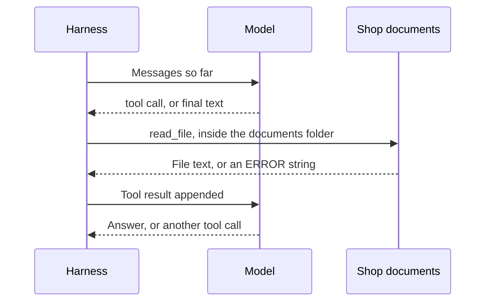
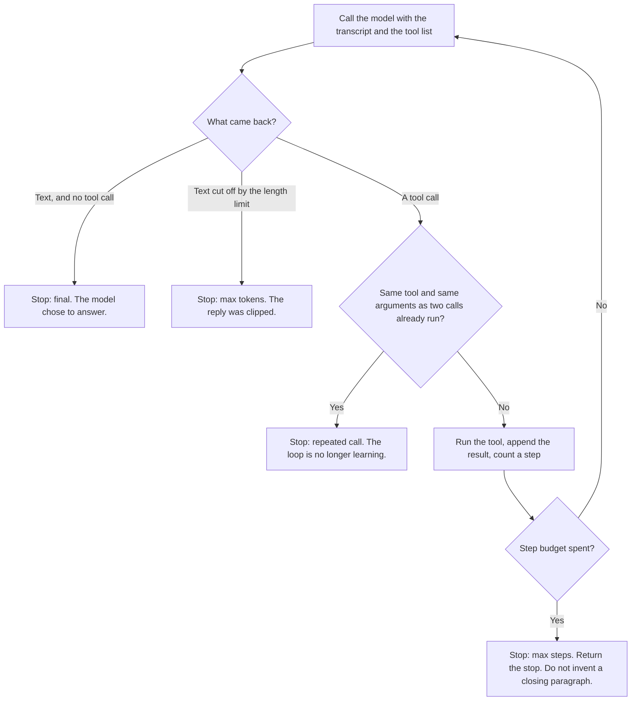

# Chapter 2: The Agent Loop

The agent loop is the product. The model perceives a transcript, proposes a tool call, the harness runs that tool, the observation is appended, and the cycle repeats until a stop condition fires. The prompt is a brief for that loop: it names the documents and asks for a citation, or for an admission that the documents are silent. This chapter specifies the four steps, the contract a tool must meet, the conditions that end the loop, and the requirement that a shop fact in the answer point at the file that contains it. The only tool reads a file, and only inside the shop’s documents. Take the loop away, and the same prompt is the chatbot from Chapter 1.

## Perceive, Reason, Act, Observe

Each step has an owner. Mixing the owners up is how a team gives the model a filesystem, or withholds the error the model needs in order to recover.

**Perceive.** The model sees a list of messages: the system prompt, the customer’s question, and every tool result so far. The filesystem itself stays outside that list. On this turn, a fact absent from the messages is absent from the model’s world. Perception is a designed surface. Whatever you leave out, the model fills from habit.

**Reason.** The harness calls the model. The call is opaque: the weights stay uninspected, and the object that comes back is what you inspect. That object is assistant text, one or more tool calls, or both. “Reasoning,” here, names that choice as it appears in the object. A private chain of thought is unnecessary for the product to operate.

**Act.** When tool calls are present, the harness runs them. The model proposes a read. The harness opens the file. That split is the security boundary later chapters tighten. In this chapter the boundary is a directory. The concierge may read the shop’s markdown, and the path must stay inside that folder. Environment files, hidden names, and paths that climb out with `..` are refused.

**Observe.** The harness appends a tool message whose identifier matches the call, then calls the model again. The observation is data, and an error string is data. “That file is not here, and these files are” is a useful observation, because the model can correct a message it can see. An exception that kills the process is a lost observation. The model cannot correct a crash it never received.

*Figure 2.1. The agent loop: propose, execute, observe, repeat.*

Each turn is one completion with the same tool list. The harness appends the assistant message, then either returns the text or runs every proposed tool call. The request includes no field that forces a particular tool. Chapter 3 gives the reason: one local server used in this book rejects that field, so the shared client omits it. The consequence belongs here. A model may skip the tool and answer at once. In the lab, that behavior is a final answer with an empty trace. The loop was present. The model left it unused. Record the skip, so the next edit knows which factor moved.

A grounded pass through the Hearth Lane question looks like this.

1. The customer asks about opened coffee and about shipping a cardamom bun out of state.
2. The model asks to read the policy.
3. The harness returns the file, prefixed with the path `docs/policy.md`.
4. The model answers that opened coffee is final sale and that pastries are not shipped, and both claims carry that path.

The first read may be the wrong file. The model might open the FAQ looking for a shipping rule and find a sentence that points at the policy. That miss is useful. The model sees it, opens the policy, and only then states the rule. The recovery is what the loop is for. A stronger sentence in the prompt still cannot open a file.

A question used in Chapter 3 needs both files. The delivery fee lives only in the policy. The closed day lives only in the FAQ. The same loop handles that question without a new branch: two tool calls, two observations, then text. That is the reason to pay for a loop, rather than hard-coding a step that always reads the policy.

## The Tool Contract

A tool the model can call has four parts, and those parts should be writable before the tool is built. Vague parts invite a fifth behavior, which the harness will either crash on or perform in silence.

- **Name.** Which action is this? Here the name is `read_file`, and it is the only name the dispatcher accepts.
- **Arguments.** What must the model supply? One string: a path relative to the documents directory. The policy and the FAQ are the files that exist.
- **Returns.** What comes back on success? The file’s text, beginning with a path header such as `PATH: docs/policy.md`, so a citation has something true to copy.
- **Errors.** What comes back on failure, and does the loop survive? A string beginning with `ERROR:`, for a missing file, a `..` segment, an absolute path, a hidden name, or text that is not valid UTF-8. The loop continues.

The description sent with the schema is documentation aimed at the model. It may say which file holds returns and which file holds hours. That description belongs to the harness. It steers. The function enforces the directory limit.

The function refuses the following, and it returns text in each case.

- Any `..` segment, including an attempt to reach an environment file.
- An absolute path.
- A hidden name.
- A link inside the documents folder whose target resolves outside that folder.

When a file is missing, the error names the markdown files that do exist, so the next turn can recover. A typical result says that the requested name was not found, and that the available files are the FAQ and the policy.

Arguments have the same discipline. Some providers send them as a JSON string. Some local stacks send a dictionary. The harness accepts both. Invalid JSON becomes an error result that shows the expected shape — a path pointing at the policy — and the loop continues inside the step budget. An unknown tool name, such as a refund, an email, or a shell command, is the same kind of result: only `read_file` is available.

Successful reads are capped at 12,000 characters. The two shop files are far smaller. The cap keeps a later document from silently filling the context window. When the harness truncates, it marks the cut in the tool result, so the observation stays honest. An observation that presents a fragment as the whole file teaches the model a false picture of the shop.

The dispatcher is a closed set. It runs `read_file`, or it returns an unknown-tool error. Model text is never evaluated as code, there is no shell, and a path the model supplies is never opened from the repository root. The documents directory is an argument to the loop. This chapter and Chapter 3 both pass the shop’s documents folder. Pointing the tool at the repository root would be a harness change, because it changes what the concierge is allowed to touch.

`read_file` is a sensor. It lets the model perceive one folder. Later chapters add tools that change the world — carts, tickets, messages — and the same four-part contract still applies. A tool with no error shape fails in private.

The directory limit can be checked without calling a model. The lab notes give that check. The result should be an error line, and the contents of an environment file should stay unseen.

## Stop Conditions

A loop without a stop is a stuck process and, on a hosted model, an open bill. Stops are how the harness keeps a promise the model cannot keep for itself: this task ends. The result records which reason fired. Read that tag before the prose, and ask for it in any demonstration.

*Figure 2.2. The four stops. “Final” means the model stopped calling tools.*

**Final.** The model returned a message with no tool calls, and the harness treats that text as the customer-facing answer. The path on which the model skipped the tool is included. *Final* means the model stopped calling tools. Whether the answer is true is a separate question. A polished paragraph with an empty tool log is one event. A paragraph that arrived after the policy was read is another.

**Maximum steps.** The budget is six calls to the model, counted in model calls rather than in tool calls. A question about this shop needs at most two reads. Six leaves room for a bad path, an error, and a retry. When the budget is spent, the harness returns the stop and leaves the customer-facing paragraph unwritten. Writing that paragraph inside the harness would hide the overrun. The trace still shows the reads that did happen.

**Repeated call.** The same tool and the same arguments may run twice. The second result notes that the file was already read and that an answer is now due. A third identical call stops the loop. Otherwise a model that re-reads the policy forever spends the whole budget and says nothing new. The signature includes the arguments, so the policy and then the FAQ count as two observations. The stop is about spinning in place.

**Maximum tokens.** If a turn ends because it hit the length limit, and there is no tool call, the harness labels the stop accordingly. The limit in these labs is 800 tokens. Too small a limit cuts a reply mid-sentence. On some providers it can also cut the arguments of a tool call. That case usually appears next as an invalid-JSON error, and the model may retry until the step budget ends. Raising the token limit is a harness edit, separate from the provider switch in Chapter 3.

The lab reports the stop after the answer, including how many model calls were used. When Chapter 3 compares two models, compare that line together with the prose.

## Citations

A tool result begins with a path header, for example `PATH: docs/policy.md`. The system prompt tells the model to carry that path into the answer, in parentheses. A fee, an hour, or a return window with no path is an ungrounded answer, even when the sentence happens to match the file. The path is what tells a reviewer which file to open.

The lab adds a soft note when the final text contains no document path. That note is feedback for the person running the exercise. It retries nothing, and it only looks for a substring, so a model can satisfy it with a path that was never read. A real check opens the cited file and confirms that the sentence is there. A later chapter separates that checker from the drafter. The work here is to treat a citation as a claim about a file. Claims about files can be checked. A confident tone cannot.

Grade a run against the shop’s own text.

- **Opened coffee**, in `docs/policy.md`: final sale.
- **Unopened coffee**, in `docs/policy.md`: 14 days, a receipt, Hearth card credit, and no cash refund.
- **Shipping a cardamom bun**, in `docs/policy.md`: pastries are not shipped.
- **Coffee shipping under $40**, in `docs/policy.md`: $6.00, United States only, packed within two business days.
- **Local delivery**, in `docs/policy.md`: $4.50, free at $35 and above, Tuesday through Friday, within 3 miles.
- **Closed day**, in `docs/faq.md`: Monday.
- **Hours**, in `docs/faq.md`: Tuesday through Friday, 7:30–15:30; Saturday and Sunday, 8:00–16:00.
- **Cardamom-bun allergens**, in `docs/faq.md`: wheat, butter, and almonds, with no nut-free preparation area.
- **Guest network**, in `docs/faq.md`: `hearth-guest`.
- **Wi-Fi password**: neither file. It is printed on the paper receipt. An invented password is a failure even when a path is cited.

The Wi-Fi question is worth asking on purpose. A sound trace reads the FAQ, may report the network name, and then declines to invent a password. A weak trace prints a plausible string, and sometimes cites the FAQ as though silence were a source. The FAQ’s silence is the test. A product required to answer every question will fail this one by design.

A question the shop does not cover has the same shape. Asked whether the café sells live crabs, the files are silent. The grounded reply says that they do not say. A made-up menu item is a miss.

Citations are harness work in two places. The code adds the path header. The instruction to copy that path into the answer is one the model may ignore. An ignored instruction is a feedback item. Revising an adjective in the prompt is optional. Recording the miss is the work.

## Failures That Appear Once a File Can Be Read

Opening the documents creates failures a closed binder cannot have. These are the failures a shipped concierge will actually show.

**The model skips the tool.** The stop is final, and the tool log is empty. The paragraph may be fluent and wrong: Chapter 1, under a Chapter 2 label. The harness allows the skip, because forcing a tool call is not portable across the providers in Chapter 3. Measure the skip. Treat it as model behavior until the same question has been seen on a model that does call tools.

**The model reads the wrong file, then recovers.** That recovery is the loop earning its cost. An error, or a file that lacks the fact, should be followed by a second read. A trace that shows the recovery means the product is working, even when the first choice was clumsy.

**The model reads the right file and still misquotes it.** Opened coffee is final sale. The unopened rule — fourteen days, a receipt, store credit — is the trap. A model that applies the unopened rule to an opened bag has the document and the wrong sentence. The trace shows that the file was seen. Faithfulness is a further question, which is why a person, and later a checker, compares the claim with the file.

**The model cites a path it did not read.** The soft check looks for the letters of a path. A review that stops there will accept costume citations. Open the file.

**The loop spins.** Repeated reads of the same file, or a walk that never settles on an answer, should hit a stop you can name. A long pause followed by a smooth paragraph raises a question: did the harness compose that paragraph after giving up? In this design, the stop message is the result.

**The model offers a refund.** The tool list contains no refund. A sentence that promises one is the action-boundary failure from Chapter 1, now with a trace beside it. Nothing in the log moved money.

## What a Trace Should Show

A demonstration of the concierge is incomplete without the trace. Beside the customer-facing paragraph, keep four things from one real question.

- Which documents were opened, and whether each result began with a path header or an error.
- The stop reason and the step count: final, maximum steps, repeated call, or maximum tokens.
- Whether each shop fact in the answer appears in the cited file, with the file’s line next to the model’s line.
- What the product did when the documents are silent. The Wi-Fi password, and a product the shop does not sell, are the probes.

Those four are leading indicators. Later chapters add cost, latency, confirmations, and a separate checker. They sit on top of the trace. A support metric that counts “the customer received a reply” will score an invented return window as a success.

The trace also says where the next change belongs. An empty trace points at the model, or at a schema the model cannot see. Another paragraph of persona will leave the file closed. A full trace whose sentences still drift points at feedback: an uncited or misquoted claim is still being accepted. A trace that shows a tool you never meant to offer means the contract is too wide, and that width is harness.

Shared tests cover the directory limit, invalid arguments, unknown tools, the step cap, and the repeated-call stop, without contacting a model server. The lab notes say how to run them.

## Lab

Answer a return question and a shipping question from the shop documents, with path citations. From one real run, record the trace, the stop, the step count, and whether each shop fact appears in the cited file. An empty trace is itself the observation. The harness did not force a tool call.

Setup, further questions, and the checks that run without a model are in the [Chapter 2 lab](../../labs/ch02-your-first-loop/README.md).

The loop is what opens a file, confines the path, returns errors as text, and refuses to run forever. The prompt tells the model which files exist and how to cite them. A working read still needs a person, or a later checker, to confirm that the citation matches the file.
