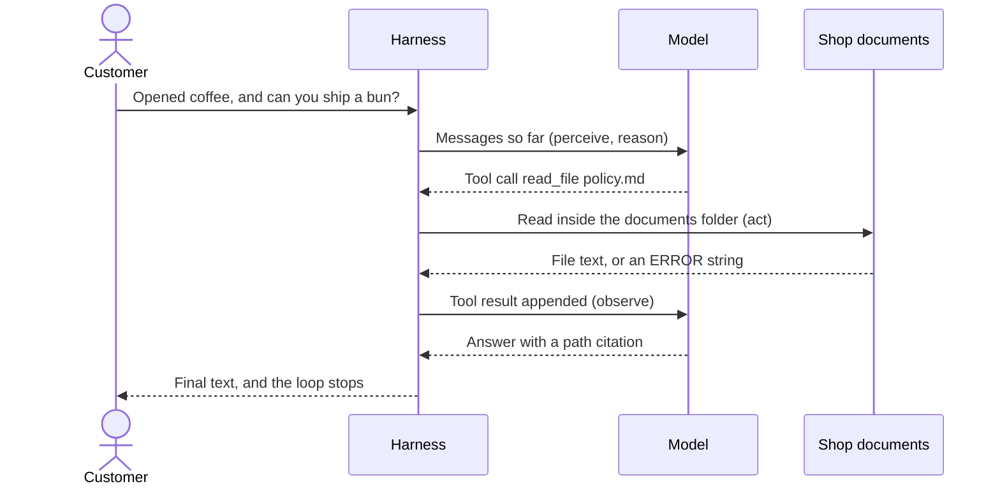
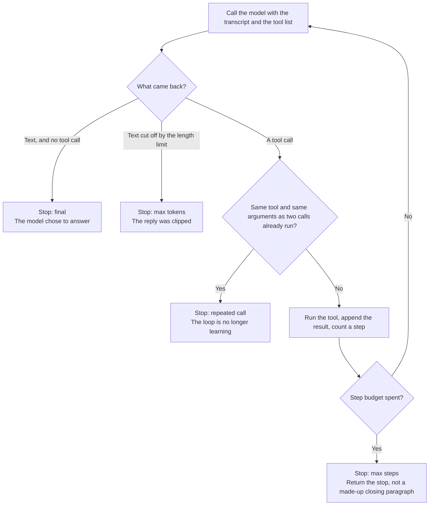

# Ch 2. Your first loop

Part I — Foundations

The same customer is still at the counter. The bag of opened coffee is still between you. This time the binder is unlocked.

Watch what a useful concierge actually does. It does not recite a policy from memory. It reaches for a document, reads what is there, and sometimes reaches for the wrong one first. Suppose it opens the FAQ, looking for the shipping rule, and the FAQ says returns and shipping live in the policy. That miss is useful. The concierge sees the miss, opens `policy.md`, and only then tells the customer that opened coffee is final sale and that pastries are not shipped. The recovery is the product. A single clever sentence in the persona cannot open a binder.

Chapter 1 let the model talk about a shop it could not see. This chapter puts the model in a loop: perceive the transcript, let it propose a tool call, run that tool in your process, append the result, and repeat until a stop condition fires. The only tool is `read_file`, limited to the shop's documents folder. The claim to carry out of the chapter is small and practical: **the loop is the product; the prompt is a brief for the loop.**

## 2.1 Four beats: perceive, reason, act, observe

Say the loop as four beats. Each beat has an owner. Mixing the owners up is how teams accidentally give the model a filesystem, or forget to show it the error it needs in order to recover.

**Perceive.** The model sees a list of messages: the system prompt, the customer's question, and every tool result so far. It does not see the café's disk. A fact that is absent from that list is absent from the model's world on this turn. Perception is a designed surface. Whatever you leave out, the model will fill from habit.

**Reason.** You call the model. The call is opaque. You do not inspect weights in this loop. You inspect the object that comes back: assistant text, one or more tool calls, or both. "Reasoning" here is a name for that choice, visible only in the object. A paragraph of private chain-of-thought is not required for the product to work, and you should not need one to operate the loop.

**Act.** If the model proposed tool calls, your code runs them. The model does not open files. `read_file` does. That split is the security boundary the rest of the book tightens. In this chapter the boundary is simple and already worth having: a directory check. The concierge may read the shop's markdown. It may not wander into environment files, hidden names, or a path that climbs out of the documents folder with `..`.

**Observe.** You append the tool result, tied to the call that asked for it, and you call the model again. The observation is data. An error string is data. "That file is not here, and these files are" is a better observation than a crashed process, because the model can correct a message it can see. An exception that kills the program is a lost observation. The customer sees a failure. The model never gets a turn to recover.

A grounded pass on the Saturday question looks like this:

1. The customer asks about opened coffee and shipping a cardamom bun out of state.
2. The model calls `read_file` on `policy.md`.
3. The harness returns the file, headed by the path it actually opened.
4. The model answers: opened coffee is final sale, pastries are not shipped, and both claims carry the policy path.

A later question needs both files. The delivery fee lives only in the policy. The closed day lives only in the FAQ. The same loop handles that with two reads and two observations, then text. Nobody adds a branch called "if the question mentions delivery and hours." That missing branch is why the loop is worth paying for.

The system prompt still matters. It names the two files, says which facts live in which file, and tells the model to cite a path or to say it does not know. The prompt is the brief. The loop is what opens a file. Delete the loop and keep the brief, and you are back in Chapter 1: a confident voice and a closed binder.

One consequence belongs in the product story now, and Chapter 3 explains the provider reason. The harness does not force the tool. A model is allowed to skip `read_file` and answer immediately. The trace is empty. The stop tag still says the model finished. Treat that answer the way you treated Chapter 1. The loop existed. The model declined to use it. That is a model observation, recorded so the next edit knows which factor moved.

## 2.2 A tool is a contract

A tool the model can call has four parts you should be able to say out loud before anyone implements it. Product language and engineering language meet here. If the four parts are fuzzy, the model will invent a fifth behavior, and the harness will either crash or silently do something you did not mean.

| Part | What it answers | `read_file` in the café |
|---|---|---|
| Name | Which action is this? | `read_file`, the only name the dispatcher accepts |
| Arguments | What must the model supply? | One relative path, such as `policy.md` or `faq.md` |
| Returns | What comes back on success? | The file's text, headed by the path that was opened, so a citation has something true to copy |
| Errors | What comes back on failure, and does the loop survive? | A text error for a missing file, a path that tries to escape, an absolute path, a hidden name, or a file that is not text. The loop continues |

The schema is the model's user manual for the tool. The description can tell a small model that returns live in the policy and hours live in the FAQ. That description is harness. It steers. It does not enforce. The function enforces the jail: the documents directory is the world, and paths that climb out of it come back as an error string rather than as file contents.

Errors are part of the contract because recovery is part of the product. A miss should name the markdown files that do exist, so the next turn can choose one of them. Invalid arguments should come back as text the model can read, including the shape that was expected, rather than as a stack trace the customer never sees and the model never gets. An unknown tool name — a refund, an email, a shell command the persona felt like calling — is the same kind of result: an error that says only `read_file` is available, and the loop continues inside the step budget.

Returns are capped. The two shop files are small. The cap exists so a later, longer document cannot silently fill the window. When the harness truncates, it says so in the tool result. An observation that pretends to be the whole file, after cutting it, teaches the model a lie about the shop.

The dispatcher is a closed set. It runs `read_file`, or it returns an unknown-tool error. There is no general "do what the text says," no shell, and no rule that a path from the model may be opened relative to the whole project. The documents directory is chosen by the program. Aiming the tool at the rest of the machine would be a harness change, reviewed as a harness change, because it changes what the concierge is allowed to touch.

The major tool in this chapter is deliberately dull. `read_file` is a sensor: it lets the model perceive one folder. It is an actuator only in the weak sense that reading is an action with a side effect of "the bytes entered the transcript." Later chapters add tools that change the world — carts, tickets, messages — and the same four-part contract still applies. A tool without an error shape is a tool that fails in private.

## 2.3 Stop conditions are product requirements

A loop without a stop is a stuck process and, on a hosted model, a bill. Stops are how the harness keeps a promise the model cannot keep by itself: this task will end.

This harness stops for four reasons. The result records which one fired. Practitioners read that tag before they read the prose. Product managers should ask for it in any demo.

**Final.** The model returned a message with no tool calls. The harness treats the assistant text as the customer-facing answer. This is the success path, and it is also the path where the model wrongly skipped the tool. "Final" means "the model stopped calling tools." It does not mean "the answer is true." A pretty paragraph with an empty tool log is a final stop. It is a different event from a paragraph that arrived after the policy was read.

**Max steps.** The budget in this lab is six model calls, not six tool calls. A question about this shop needs at most two reads. Six leaves room for a bad path, an error result, and a retry. When the budget is spent, the harness returns a stop message and does not write a customer answer from the tool trace. Inventing the closing paragraph inside the harness would hide the overrun. The trace is the result. Hiding it behind a smooth sentence would be the harness lying about why the concierge stopped.

**Repeated call.** The same tool name and the same arguments may run twice. The second result includes a nudge: you already read this file, answer now. A third identical call stops the loop. A model that re-reads the policy forever will otherwise burn the whole step budget while saying nothing new. Reading the policy and then the FAQ is a new call, because the arguments differ. The stop is about spinning, not about using more than one document.

**Max tokens.** If a turn ends because the length limit cut it off, and there is no tool call, the harness stops and labels the reason. The limit lives with the other sampling choices in the harness. A limit that is too small cuts a reply mid-sentence. On some providers it can also cut a tool call's arguments, which usually shows up as an error about invalid structure on the next observation. The model then gets a chance to retry until the step budget ends. Raising the limit is a harness edit. It is a different edit from switching providers, and a review should keep those edits apart.

When you compare two models in Chapter 3, compare the stop tag and the tool log beside the prose. A paragraph that stopped as final with an empty log is a model that declined the binder. A paragraph that stopped as final after `policy.md` was read is a concierge that did the job, and you can then grade the sentences against the file.

## 2.4 Citations are how a claim becomes checkable

The tool result starts with a path header, the file the harness actually opened. The brief tells the model to carry that path into the answer, in parentheses. A fee, an hour, or a return window without a path is not yet a grounded answer, even when the sentence happens to match the file. You can check the match because the path tells a person which file to open.

A soft note in the lab can flag an answer that never mentions the documents folder. That note is feedback for the person running the lab. It does not retry the model. It looks for a substring, so a model can satisfy it with a path it never read. A real check opens the cited file and confirms the sentence is in it. Separating the checker from the drafter is a later chapter's job. The job here is to notice that a citation is a claim about a file, and claims about files are verifiable in a way that confident tone is not.

Use the shop as an answer key when you grade a run by hand:

| Claim | Document | What the shop says |
|---|---|---|
| Opened coffee | Policy | Final sale |
| Unopened coffee | Policy | 14 days, receipt, Hearth card credit, no cash |
| Ship a cardamom bun | Policy | Pastries are not shipped |
| Coffee shipping under $40 | Policy | $6.00, US only |
| Local delivery fee | Policy | $4.50, free at $35 and above, Tuesday–Friday, within 3 miles |
| Closed day | FAQ | Monday |
| Weekday hours | FAQ | Tuesday–Friday, 7:30–15:30 |
| Cardamom bun allergens | FAQ | Wheat, butter, and almonds |
| Wi-Fi password | Neither | Printed on the paper receipt. An invented password is a failure even when a path is cited beside it |

Ask the Wi-Fi question on purpose. A good trace reads the FAQ and then refuses to invent a password. The network name is in the FAQ. The password is not. A bad trace prints a plausible string and, sometimes, cites the FAQ as if the silence were a source. The FAQ's silence is the test. A product that must answer every question will fail this one by design.

Citations are harness work in two places. The path header is added by your code, so the model is shown a source it can copy. The instruction to copy it is followed, or ignored, by the model. When the instruction is ignored, you have a feedback item. Changing an adjective in the prompt is optional. Recording the miss is the work.

## 2.5 What goes wrong once the binder is open

Opening the binder creates new failures. They are more interesting than a closed binder, and they are the ones a shipped concierge will actually have.

**The model skips the tool.** The stop is final. The tool log is empty. The paragraph may be fluent and wrong, which is Chapter 1 wearing a Chapter 2 costume. The harness allowed the skip because forcing a tool call is not portable across the providers in Chapter 3. Measure the skip. Do not explain it away as "the prompt needs to be stricter" until you have seen the same question on a model that does call tools.

**The model reads the wrong file, then recovers.** That is the loop earning its cost. An error or a file that lacks the fact should be followed by a second read. If the trace shows the recovery, the product is working even when the first choice was clumsy.

**The model reads the right file and still misquotes it.** Opened coffee is final sale. The unopened rule — 14 days, receipt, store credit — is the trap. A model that applies the unopened rule to an opened bag has the document and the wrong sentence. That miss is why a person, and later a checker, compares the claim to the file. The trace proves the file was seen. It does not prove the sentence was faithful.

**The model cites a path it did not read.** The soft check looks for the letters of a path. A review that stops at the soft check will pass costume citations. Open the file.

**The loop spins.** Repeated reads of the same file, or a walk that never settles into an answer, should hit a stop you can name. If the demo instead shows a long pause and then a smooth paragraph, ask whether the harness invented that paragraph after giving up. In this design, it does not. The stop message is the honest product behavior.

**The model offers a refund.** The tool list has no refund. A sentence that promises one is the action-boundary failure from Chapter 1, now with a trace beside it. The trace makes the failure easier to see: nothing in the log moved money.

## 2.6 What a product manager should ask of a trace

A demo of the concierge is incomplete without the trace. Ask for four things on one real question, and keep them next to the customer-facing paragraph.

- **Which documents were opened,** and whether each result was the file or an error.
- **The stop reason and the step count.** Final, max steps, repeated call, or max tokens.
- **Whether each shop fact in the answer appears in the cited file.** Quote the file line next to the model line.
- **What the product did when the documents are silent.** The Wi-Fi password and a question the shop does not sell ("Do you sell live crabs?") are the probes. The grounded behavior is to say the files do not say.

Those four are leading indicators for a concierge. Later chapters add cost, latency, confirmations, and a separate checker. They do not replace the trace. A support metric that counts "the customer got a reply" will score an invented return window as a success.

The product implication is where to spend the next week. If traces are empty, you have a model problem or a schema the model cannot see, and a new paragraph of persona will not open the file. If traces are full and the sentences still drift, you have a feedback problem: nobody is rejecting an uncited or misquoted claim. If traces show the model trying tools you never meant to offer, the contract is too loose, and that is harness.

## Lab

The Chapter 2 lab wires `read_file` to the shop documents and runs the Saturday question through the loop. Commands, the extra questions, the answer key, and the checks you can run without a model are in the lab:

[labs/ch02-your-first-loop/README.md](../../labs/ch02-your-first-loop/README.md)

## Takeaway

The loop is the product. The prompt tells the model which files exist and how to cite them. The loop opens a file, keeps the path inside the shop's documents, returns errors as text the model can read, and refuses to run forever. A stronger sentence in the persona does not put `read_file` on the disk. A working `read_file` still needs a person, or a later checker, to confirm the citation matches the file.
