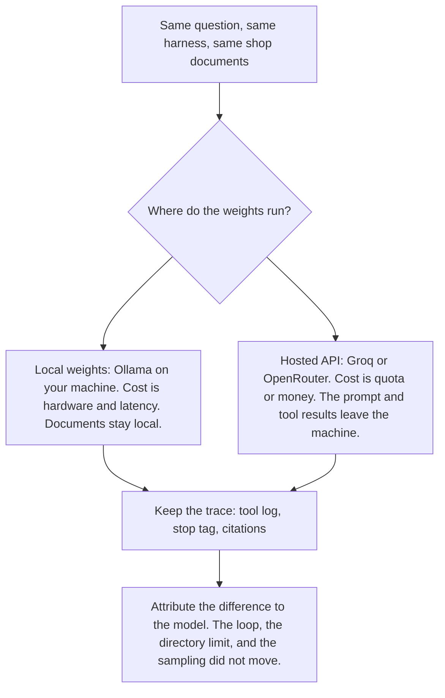
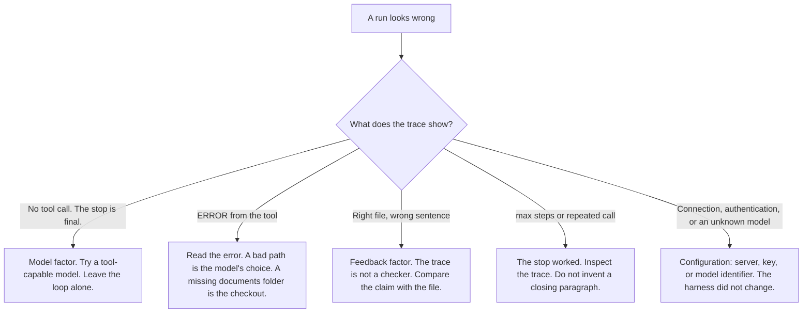

# Chapter 3: Local and Hosted Models

Chapter 2 spoke of “the model” as if the name picked out a single object. In these labs the model is an HTTP server that speaks a subset of the OpenAI chat-completions API. This chapter keeps the harness unchanged and moves only three settings: `BASE_URL`, `API_KEY`, and `MODEL`. The lab script, `labs/ch03-models-without-the-pain/swap_model.py`, imports `run_file_agent` and reads the Chapter 2 documents.

The practical claim is this: **swap the model client, and keep the harness stable.** For a product decision, that split is what makes a comparison interpretable. If the prompt, the tools, and the sampling constants move at the same time as the weights, you cannot say which factor changed the result.

The question used for the comparison asks how much local delivery costs and which day the café is closed. A grounded answer cites `docs/policy.md` for $4.50 (free at $35, Tuesday through Friday, within 3 miles) and `docs/faq.md` for Monday. One model may read both files and cite both. Another may answer with a round number and a wrong closed day, and leave the tool log empty. Nothing in the shop changed between those runs. The weights did.

## Where the Weights Run

The weights can run in two places. The loop does not care which, until you look at cost, latency, tool-call reliability, and who else can read the shop’s documents.

**Local weights**, in these labs, mean [Ollama](https://ollama.com/download) on your machine. The process that serves `http://localhost:11434/v1` loads the model. There is no per-token invoice. A café policy sent as a prompt stays on that machine, unless you have pointed Ollama itself at a remote host. You pay in memory, disk, and latency. The models that fit this setup are small instruct models. They also drop tool calls more often. A dropped tool call looks, in the product, like a concierge that never opened the documents.

A **hosted API**, here Groq or OpenRouter, means someone else’s GPUs. Both can speak the same client shape as the local server. You send an API key. You pay in money or in a quota, and the latency is often lower than a small model on a laptop. The request body leaves your machine. That body includes the system prompt, the question, and—once the loop is running—the tool results. `read_file` still executes locally. The bytes it returns are then copied into the next completion request. For a hosted run, both of the following are true: the file was read on your machine, and the file was sent to the provider. The fictional Hearth Lane documents are safe to send. A supplier contract, a customer list, or a real password is a different decision. Do not point a hosted client at a document you would not send to that provider.



*Figure 3.1: A fair model comparison. The harness stays fixed. What changes is which weights see it, how reliably they call tools, and whether the shop text leaves the machine.*

What stays fixed between the two:

- `labs/common/loop.py` — the loop, the stop conditions, and the system prompt
- `labs/common/tools.py` — the schema and the directory limit
- `labs/ch02-your-first-loop/docs/` — the shop text
- `TEMPERATURE` and `MAX_TOKENS` in `labs/common/client.py`

What changes is which weights see that harness, how reliably they fill `tool_calls`, and whether the prompt leaves the machine.

Use the local default while you are editing the loop. A local server that is down fails where you can see it, and you are not paying a provider to watch a bug. Use a hosted model when you need a cleaner tool-call trace in order to confirm the harness, or when you are making the comparison this chapter asks for.

## How an OpenAI-Compatible Client Selects a Model

The Python package is `openai`. Compatibility is a product decision. It means the call keeps a stable shape—messages in, a tool list beside them, text or tool calls out—while three settings select the server:

```python
client = OpenAI(
    base_url=base_url,
    api_key=api_key,
    timeout=120.0,
    max_retries=0,
)
client.chat.completions.create(
    model=model,
    messages=messages,
    tools=[READ_FILE_TOOL],
    temperature=TEMPERATURE,
    max_tokens=MAX_TOKENS,
)
```

That construction is `make_client`, together with the call inside `run_file_agent`.

| Setting | What you are choosing | What a review should hear |
|---|---|---|
| `BASE_URL` | Origin of the HTTP API, including the `/v1` prefix the SDK appends routes to. Ollama default: `http://localhost:11434/v1`. | Whose machine sees this conversation? |
| `API_KEY` | Bearer token. Ollama requires a non-empty string and ignores the value (`ollama`). A hosted API checks it. | Which account is billed, and who can rotate the secret? |
| `MODEL` | Model identifier the server expects. The identifier is not portable across vendors. Ollama default: `llama3.2`. | Which weights, and do they call tools that run in our process? |

`labs/common/client.py` loads those values from the repository-root `.env` through `python-dotenv`, and it does not override variables already set in the process. A missing `BASE_URL` or `MODEL` falls back to the Ollama defaults. A forgotten file then fails as a connection error you can read. A missing `API_KEY` becomes `ollama`. An empty `API_KEY` stays empty, and `require_settings` exits. The harness will not replace a blank hosted key with the Ollama placeholder.

Every lab script prints `describe_runtime()` before the request:

```text
BASE_URL=http://localhost:11434/v1
MODEL=llama3.2
API_KEY=set (value hidden)
```

The key’s value is not printed. If it appears inside an exception string, `redact` removes it. Copy `.env.example` to `.env`. Do not commit `.env`. The example file is the contract. The ignored file is the secret.

Commented provider blocks also live in `.env.example`. Uncomment one provider and comment the others, so a single origin and a single model name are active. Two active `MODEL=` lines are easy to misread: the loader’s later assignment is the one that takes effect. Sampling constants stay in the harness, not in the provider block. If temperature changes between the local run and the hosted run, you no longer know which factor moved.

| Provider | `BASE_URL` | `API_KEY` | Example `MODEL` | Tool note |
|---|---|---|---|---|
| Ollama | `http://localhost:11434/v1` | `ollama` | `llama3.2` | Small and local. It sometimes skips the tool. `llama3.1` is the larger local fallback. |
| Groq | `https://api.groq.com/openai/v1` | your Groq key | `llama-3.3-70b-versatile` | Use a model marked for local tool use. `llama-3.1-8b-instant` is the smaller option in the same family. |
| OpenRouter | `https://openrouter.ai/api/v1` | your OpenRouter key | `meta-llama/llama-3.3-70b-instruct` | Identifiers look like `vendor/name`. Confirm on the model page that tools are supported. |

Providers retire model identifiers. If the HTTP error says the model is unknown, replace it with a current identifier from that provider’s model list, and leave `loop.py` unchanged. Treat a stale identifier as configuration. Otherwise the next person will edit the harness for a problem the harness does not have.

`max_retries=0` is deliberate. A local server that is not running should fail on the first attempt. The SDK’s default retry sleep makes a stopped Ollama process look like a hang.

## How to Choose an Instruct Model

The labs need an **instruct** model: weights trained to follow a chat template of system, user, assistant, and tool roles. A base model only continues text. It will not reliably emit `tool_calls`. Pointing the concierge at one looks like a broken loop. It is a model-selection mistake. The symptom is an empty tool log or a confused transcript. The repair is a different model name.

**Tool-capable**, in this book, means the provider documents that the model can return structured tool calls your process will run. Some hosted products run tools on their side: web search, code execution, a browser that lives in their cloud. Those tools never call `read_file` in your process. A run that browses the web instead of opening the policy is that mismatch. Models such as `groq/compound` are the example. They are the wrong fit for this lab. Use a model marked, in Groq’s documentation, for local tool use.

OpenRouter can route a model that cannot call tools, if that is the identifier you asked for. The failure is either an HTTP error or a final prose answer with an empty trace, depending on the model. The tool flag on the model page is what to check before the run. A comparison against a chat-only model measures the wrong capability and then tempts a team to rewrite the loop.

The default is constrained in three ways. It fits a desktop: the Ollama tag `llama3.2` is a small instruct model. It is documented as able to call tools on Ollama’s OpenAI-compatible `/v1/chat/completions` route, and `llama3.2` is the name this repository’s `.env.example` uses. You can replace it without editing Python.

`llama3.2` will sometimes ignore the tool and answer in prose. That behavior is useful evidence about the model factor. The Chapter 2 script prints a note when a final answer arrives with an empty tool log. Before you rewrite the loop, change only `MODEL`.

Fallbacks that keep the same client:

- Local: pull `llama3.1`, then set `MODEL=llama3.1`. Llama 3.1 is the model Ollama’s own tool-calling notes used first. It is larger than 3.2.
- Groq: `MODEL=llama-3.3-70b-versatile` or `MODEL=llama-3.1-8b-instant`, with `BASE_URL=https://api.groq.com/openai/v1`.
- OpenRouter: a current tool-capable identifier such as `meta-llama/llama-3.3-70b-instruct`, after you confirm the slug.

Use the small local model for day-to-day edits to the loop. Use a hosted model when you want a second trace of the same question. You do not need a public leaderboard. You need the stop tag, the tool log, and the two citations.

Hold sampling fixed during that comparison. `TEMPERATURE` is `0.2` and `MAX_TOKENS` is `800`, both in `labs/common/client.py`. A low temperature keeps policy wording stable across reruns. A high temperature increases paraphrase, and it also increases malformed tool arguments. Eight hundred tokens are enough for two short tool calls and a paragraph that includes paths. If you change either constant between the Ollama run and the Groq run, you no longer know which factor moved. Edit them when you are studying the constant, and write down that you edited them.

## How Providers Differ at the Edges

Providers disagree on the edges of “compatible.” The shared client absorbs the disagreements that would otherwise fork the concierge into one agent per vendor. Knowing the list keeps a review from treating a protocol mismatch as a failure of the shop’s policy.

**`tool_choice` is omitted.** Ollama’s OpenAI-compatible API accepts `tools` and does not accept `tool_choice`. Groq does accept `tool_choice`. The shared client omits the field so that one request shape runs on both. The cost is real: the harness cannot force `read_file`. A skipped call is model behavior you observe in the trace. Forcing the tool would split the client by provider, and this chapter keeps one client.

**`messages[].name` is omitted.** Groq’s compatible API rejects that field with HTTP 400. Tool results in this loop carry `role`, `tool_call_id`, and `content` only. That set is enough for Ollama and for Groq. If you add `name` while debugging a trace, Groq runs fail and Ollama runs do not, and the failure is easy to misread as a property of the model.

**Arguments.** Providers usually send `function.arguments` as a JSON string. Some local stacks send a dictionary. The loop accepts either form. Invalid JSON is an `ERROR:` observation, and the process continues. The model sees that error on the next turn and can send `{"path": "policy.md"}`.

**Content shape.** Some servers return assistant content as a list of parts. `message_text` flattens string parts and parts of the form `{type: text}` before the lab prints them. This chapter does not grow a special case for each vendor. One normalizer belongs in the harness. A new provider quirk belongs first in your lab notes, and in `labs/common/` only when the same code must keep running.

**Ollama must already be serving, and the tag must already be pulled.** A `BASE_URL` that points at `localhost` does not start the daemon and does not download weights. Pulling `llama3.2` and running the server are setup steps, documented in the repository README. A connection error in this chapter is that setup. It is not a defect in `swap_model.py`.

**A hosted error is usually configuration.** A rejected key, an unknown model identifier, or a model with no tool support should change a setting, not the loop. The local placeholder `ollama` is a non-empty string the local server ignores. Leaving it in place when you change the origin produces an authentication error. Keep the previous trace. If you change the prompt, the tool, and the model in the same edit, you can no longer tell which change produced the new trace.

## How to Read a Failed Run



*Figure 3.2: Where to send a bad run. A skipped tool goes to the model, a misquote goes to feedback, and a dead server goes to configuration.*

Several misses are easy to misname:

- Changing the prompt, the tool description, and the provider in one sitting produces a better demo and no knowledge. The discipline of this chapter is the same script, the same documents, and a different settings file.
- A compound model, or any model whose tools run on the provider’s servers, can “succeed” without opening the policy. A plausible fee from the public web, or from habit, is still a failed run if the requirement is to answer from the shop’s files.
- A local model is sometimes blamed for a server that is down. Connection refused on the local origin is setup.
- A citation comparison can forget the action boundary. A model can read both files, cite both files, and still offer to book the delivery itself. The tool list cannot book anything. Score the offer as a failure even when the fee and the closed day are correct. Grounding and permission are different scores.
- Data leaves in the tool result, not only in the question. Teams remember that the prompt is sent. The file contents ride along on the next turn. A hosted comparison on real customer mail is a disclosure. The fictional shop exists so the lab can be honest about that fact without leaking a real document.

## What to Fix Before Comparing Models

A comparison answers which weights should stand behind this harness. It is interpretable only when the harness is held fixed. Write down, before the first run:

- The question. This chapter’s question needs both documents, so a model cannot look competent by reading one file.
- The documents, the tool list, the stop rules, and the sampling constants (`TEMPERATURE` `0.2`, `MAX_TOKENS` `800`, `DEFAULT_MAX_STEPS` `6`).
- The two or three candidates, each confirmed as instruct and tool-capable, with tools that run in your process.
- Whether each candidate is local or hosted, because a hosted run is also a decision about who sees the documents.

Score each trace the same way:

- Did `policy.md` get read, and did `faq.md` get read?
- What stop fired, and after how many model calls?
- Do $4.50 and Monday each cite the file that actually contains them?
- Did any answer invent a number, a day, or an action the tool list does not contain?

Bring both traces to the review. A hosted model that cites both files has demonstrated the harness. It has also demonstrated that the documents left the machine. A small local model that skips the tool has demonstrated a reliability gap you can measure. Either result can be the right product choice. Neither result is a reason to fork the loop per vendor.

Put the costs a shop would feel next to the traces. Local: machine size, wait time, and the rate of empty tool logs. Hosted: price or quota per finished answer, wait time, and the fact that tool results are copied to the provider. The unit is a finished answer. A run that stops at `max_steps` without a customer-ready paragraph still spent the calls. Count it.

## Lab

Run the Chapter 2 agent twice, once on Ollama and once on Groq or OpenRouter, changing only `.env` between the runs. For each run, keep the printed `BASE_URL` and `MODEL`, the tool log, the stop tag and the step count, and whether $4.50 and Monday each have a citation you can verify in the file. The script also prints `TEMPERATURE` and `MAX_TOKENS`. If those numbers differ between your two runs, you edited the harness, and the comparison is no longer the one this chapter asks for.

The switch steps, the answer key, and the failure notes are in [`labs/ch03-models-without-the-pain/README.md`](../../labs/ch03-models-without-the-pain/README.md).

Swap the model client, and keep the harness stable. `BASE_URL`, `API_KEY`, and `MODEL` select the weights. The loop, the directory limit, the stop conditions, and the sampling constants are the product you are building. A provider quirk that forces a fork in `loop.py` is a harness defect worth repairing once, in the shared client. It is a weak reason to keep a second agent for each vendor.
