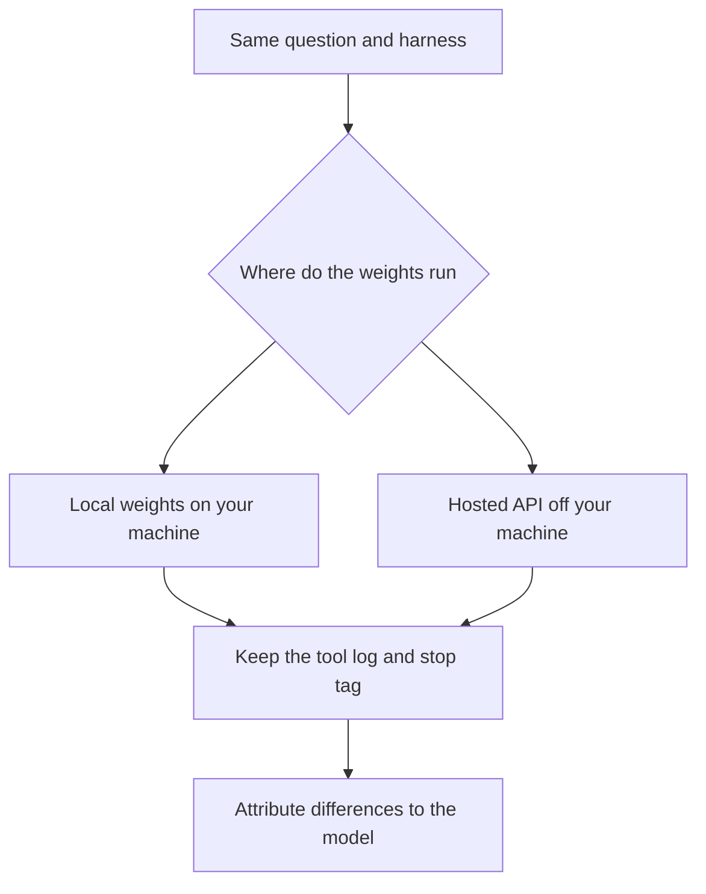
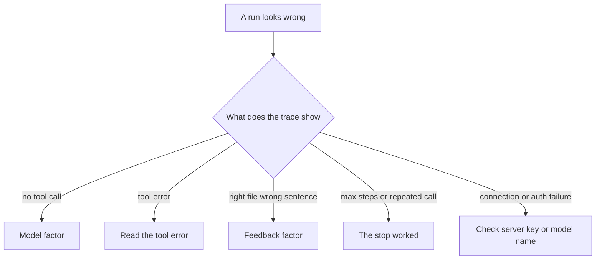

# Chapter 3: Local and Hosted Models

Chapter 2 calls “the model” as if that were one object sitting inside the loop. In these labs the model is a server that accepts a chat request and returns a reply. You choose which server, and which weights that server should use, with three settings, and you leave the rest of the program alone. The claim of this chapter is that you swap the model client and keep the harness stable. If the prompt, the tools, and the limits on sampling move at the same time as the weights, the new transcript no longer tells you which factor changed.

The comparison uses one question from the same shop. A customer asks how much local delivery costs, and which day the café is closed. A grounded answer cites the policy for the fee, which is $4.50, free at $35 and above, Tuesday through Friday, within 3 miles of 12 Hearth Lane. It cites `faq.md`, the shop’s file of hours and similar facts, for the closed day, which is Monday. One model may read both files and cite both. Another may offer a round number and the wrong day, with no tool call in the log. The shop stayed the same. The harness stayed the same. The weights changed. That is the comparison this chapter teaches you to read.

## Where the weights run

The loop in Chapter 2 does not contain the weights. It sends a request to a server that does. The request travels over HTTP, which means your program sends a message to an address and waits for a message back. The address can name a program on your own machine, or a program in someone else’s data center. The loop is indifferent to that choice. Cost, waiting time, how often a tool call appears, and who else can read the shop’s documents are where the choice shows up.

**Local weights**, in these labs, mean a program called Ollama running on your machine. It serves the address `http://localhost:11434/v1` and loads the model into that machine’s memory. There is no bill that grows with the length of the reply. A café policy placed in a prompt stays on that machine, unless you have pointed Ollama itself at a remote host. You pay in memory, disk, and waiting. The models that fit a desktop are small models trained to follow instructions, and they drop tool calls more often than a larger hosted model does. In the transcript, a dropped tool call looks like a concierge that answered without opening the policy. The loop ran. The model did not use it. You met that case in Chapter 2, and this chapter is where you can ask whether a different set of weights would have used the tool.

A **hosted service**, here Groq or OpenRouter, means the weights run on someone else’s machines. Both services accept the same shape of request as the local server. You send a key, and you pay in money or in a quota. The wait is often shorter than the wait for a small model on a laptop. The body of the request leaves your machine. That body includes the system prompt, the customer’s question, and, once the loop is running, the text of every tool result. The file is still read by your program, on your disk. The bytes that came back are then copied into the next request. On a hosted run, both sentences are true. The file was read locally, and the file was sent to the provider. The Hearth Lane documents are fictional, and they are safe to send for this exercise. A supplier contract, a list of real customers, or a real password is a different decision. Point a hosted client only at text you would deliberately hand to that provider.



*Figure 3.1. A fair comparison holds the harness fixed and changes only where the weights run.*

Figure 3.1 is the discipline of the chapter. What stays fixed is the loop, the conditions that stop it, the system prompt, the tool and its directory limit, the shop documents, and the two sampling constants in `labs/common/client.py`: a temperature of 0.2, and a maximum of 800 tokens. What changes is which weights see that harness, how reliably those weights return tool calls, and whether the prompt leaves the machine.

Use the local default while you are editing the loop. A local server that is not running fails in front of you, and you are not paying a provider to watch a bug. Use a hosted model when you need a cleaner tool-call trace to confirm that the harness works, or when you are making the comparison this chapter describes. The point of the second run is the difference you can attribute to the model, because the harness did not move.

## One client and three settings

The labs speak to every server through one client, the OpenAI Python package. An application programming interface, an API, is the set of requests a server agrees to accept. “OpenAI-compatible” means the local server and the hosted servers accept the same chat request the package already knows how to send: a list of messages, a list of tools beside them, and a reply that is either text or one or more tool calls. You construct the client once. Three settings select the server. The construction lives in `make_client`, in `labs/common/client.py`.

```python
client = OpenAI(
    base_url=base_url,
    api_key=api_key,
    timeout=120.0,
    max_retries=0,
)
```

Automatic retries are off. A local server that is down should fail on the first attempt, where you can see it. The package’s usual retry would sleep and try again, and a stopped Ollama would look like a hang.

The three settings are read from a file named `.env` at the root of the repository. A value already present in the process environment takes precedence over the file. You will edit that file between runs. You will not edit `swap_model.py`, and you will not edit the loop.

- **`BASE_URL` is where the API lives.** It is the address of the HTTP service, including the `/v1` prefix the client appends its routes to. These notes call that address the origin. The local default is `http://localhost:11434/v1`. Before a run, you should be able to say which machine will see the conversation.
- **`API_KEY` is the credential sent with the request.** It is a bearer token: a secret the request carries so the server can tell which account is calling. The local server requires a non-empty string and ignores the value. The placeholder is the word `ollama`. A hosted service checks the key. Before a run, you should be able to say which account would be billed, and who can rotate the secret. The lab prints that a key is set, and it hides the value. If the value leaks into an error message, the client strips it.
- **`MODEL` is which weights the server should use.** It is the identifier that server expects. Identifiers do not travel across companies. The local default is `llama3.2`. The same name sent to Groq or to OpenRouter is not a request for the same weights. Before a run, you should be able to say whether those weights are documented to call tools that run in your process.

If the origin or the model name is missing, the local defaults apply, so a forgotten file fails as a connection error you can read rather than as a crash inside the settings loader. A missing key becomes the local placeholder. An empty key stays empty, and the run stops. The harness will not quietly replace a blank hosted key with the word `ollama`.

The example file in the repository, `.env.example`, is the contract for the three names. The local copy, `.env`, is the secret, and it stays out of version control. Keep a single provider active in that file. If two lines both assign `MODEL`, the later assignment is the one that takes effect, and it is easy to grade the wrong weights. Sampling stays in the harness, in `TEMPERATURE` and `MAX_TOKENS`. If the temperature differs between the local run and the hosted run, the model is no longer the only thing that moved, and you are no longer comparing weights alone.

The three providers these labs use are the following.

- **Ollama, on your machine.** The origin is `http://localhost:11434/v1`, the key is `ollama`, and the model is `llama3.2`. The weights stay on the machine. This model sometimes skips the tool. A larger local fallback is `llama3.1`, after that model has been installed. The lab notes give the installation step.
- **Groq, hosted.** The origin is `https://api.groq.com/openai/v1`, the key is your Groq key, and one model these notes use is `llama-3.3-70b-versatile`. Choose a model the provider marks for tool use that runs in your process. `llama-3.1-8b-instant` is a smaller option on the same service.
- **OpenRouter, hosted.** The origin is `https://openrouter.ai/api/v1`, the key is your OpenRouter key, and one model these notes use is `meta-llama/llama-3.3-70b-instruct`. Identifiers there look like a vendor name, a slash, and a model name. Confirm on the model’s page that tools are supported before you spend a run.

Providers retire identifiers. An error that says the model is unknown is repaired by a current name from that provider’s list. The loop stays as it is. A stale name is configuration. Editing the harness to accommodate it assigns the failure to the wrong factor.

## Choosing a model the labs can use

The labs need an **instruct** model. That word means the weights were trained to follow a chat template: a system message, a user message, an assistant message, and a tool result, each with a role. A base model was trained only to continue text. It will not reliably emit a tool call. Pointing the concierge at a base model looks like a broken loop, because the tool log stays empty or the transcript never settles into a call your program can run. The repair is a different value of `MODEL`. The loop was not the part that failed.

**Tool-capable**, in this book, means the provider documents that the model can return structured calls your own process will run. Some hosted products run tools on their side: a web search, code execution, or a browser in their data center. Those tools never open the shop’s files. A run that searches the public web, on a task whose requirement was to open the policy, has used the wrong kind of tool. Groq’s compound models are the example to avoid here. Their tools run on Groq’s servers, and they do not call the `read_file` function in your process. Use a model marked for local tool use, meaning the tool runs where your Python is running.

OpenRouter will route whatever identifier you asked for, including a model that can only chat. The failure is either an HTTP error or a final paragraph with an empty trace, depending on the model. The tool flag on the model’s page is the check to make before the run. Measuring a chat-only model, and then rewriting the loop to compensate, answers a question this chapter is not asking. The question is how two tool-capable models behave behind one harness.

The default is constrained in three ways that you can check without reading the weights. It fits on a desktop. Its provider documents tool calls on the chat route these labs use. You can replace it by editing `MODEL` and nothing else. The local name `llama3.2` meets those constraints, and it will sometimes ignore the tool and answer in prose. That behavior is evidence about the model factor from Chapter 1. Before you rewrite the loop, change only the model name, run the same script, and keep the previous trace beside the new one.

Fallbacks that keep the same client are these.

- On your machine, use `llama3.1` after it has been installed. It is larger than `llama3.2`, and it is the model Ollama’s own notes on tool calling used first.
- On Groq, use `llama-3.3-70b-versatile` or `llama-3.1-8b-instant`.
- On OpenRouter, use a current tool-capable identifier such as `meta-llama/llama-3.3-70b-instruct`, after you have confirmed the name.

Day-to-day edits to the loop belong on the small local model. A second trace of the same question is the reason to call a hosted model. The record you keep is the stop tag, the tool log, and the two citations.

Hold sampling fixed during that comparison. Temperature is a number that tells the server how much the wording may vary from one run to the next. The value 0.2, stored as `TEMPERATURE` in `labs/common/client.py`, keeps policy wording stable. A high temperature increases paraphrase, and it also increases the chance that a tool’s arguments arrive malformed. The café question is a quoting task. Leave the constant low while you compare providers. The length limit, `MAX_TOKENS`, is 800. That budget covers two short tool calls and a paragraph that includes paths. If a run stops because it hit the length limit, or a tool result says the arguments were cut off, you raise `MAX_TOKENS` and you write down that you raised it. You do not begin by switching providers. Switching providers at the same moment would change two factors, and you would no longer know which one repaired the trace.

## Where compatible servers disagree

“Compatible” describes the center of the request, not every field at the edge. The shared client absorbs the disagreements that would otherwise become a separate agent for each provider. When a run fails, the first question is whether the failure is one of these known disagreements, which are harness and configuration, or a difference in the weights.

**The request does not force a tool.** Ollama accepts a list of tools and rejects a field, `tool_choice`, that would require a particular tool. Groq accepts that field. The shared client omits it, so one request runs on both servers. Chapter 2 already lived with the consequence: the model is allowed to skip `read_file` and answer at once. The cost is real. The harness cannot force the file to be read. A skipped call is model behavior, and you can see it because the tool log is empty and the stop tag is `final`. Forcing the tool would split the client by provider. This chapter keeps one client, and it treats the skip as a result to record.

**Tool results carry no extra name field.** Groq’s compatible API rejects a `name` field on a message with an HTTP 400 error. A tool result in this loop has a role, a call identifier, and content. That set is enough for Ollama and for Groq. If you add the name while you are debugging a trace, the hosted run fails and the local run continues. The failure is then easy to blame on the weights. It belongs to a field the hosted server refuses.

**Arguments may arrive as text or as a structure.** Some servers send the tool’s arguments as a JSON string, which is a small text format for labeled values. Some local stacks send a dictionary, which is the same labels already parsed. The loop accepts both. Invalid JSON becomes an error observation, and the process continues. On the next turn the model can read the error and send a path such as `policy.md`. An exception that killed the process would be a lost observation, which is the rule Chapter 2 already stated.

**Assistant text may arrive in parts.** Some servers return a list of parts rather than one string. One function, `message_text`, flattens those parts before the lab prints them. This chapter adds no special case for each vendor. A new disagreement belongs in your lab notes first. It belongs in `labs/common/` only when the same program has to keep running for every provider you use.

**The local server must already be running, and the weights must already be present.** An address on your machine does not start Ollama, and it does not download a model. Installing the model and starting the server are setup, described with the labs. A connection error at the start of this chapter is that setup. It is not a defect in `swap_model.py`.

**A hosted failure is usually a setting.** A rejected key, an unknown model name, or a model with no tool support calls for a change in `.env`. The local placeholder `ollama` is a non-empty string the local server ignores. Left in place after you change `BASE_URL` to a hosted origin, it produces an authentication error. Keep the previous trace. Change one setting. A single edit that also changes the prompt and the tool leaves the new trace unexplained.

## How to read a run that looks wrong

A wrong-looking paragraph is not yet a diagnosis. Chapter 1 asked you to name the factor you would move. This chapter gives you a trace to name it from: the tool log, the stop tag, and the text of the reply. Read the trace before you edit anything.



*Figure 3.2. A bad run is attributed to the model, to feedback, to a stop the harness already enforced, or to configuration.*

Let us walk the delivery question through the branches in Figure 3.2, because each branch is a different edit.

1. The stop is `final`, and the tool log is empty. The model never called `read_file`. That is the model factor. Try a model documented for local tool use, and leave the loop alone. A fluent paragraph about “about five dollars” and “closed Sundays” is this branch, even when the prose sounds like a concierge.
2. The log shows a tool call, and the result begins with `ERROR:`. Read the error. A bad path is the model’s choice, and the loop is giving it a chance to recover. A missing documents directory is a problem in the checkout, which is configuration of the files, not of the weights.
3. The log shows that the policy and `faq.md` were both read, and the sentences still disagree with the files. The fee is wrong, the day is wrong, or the path is missing. That is the feedback factor from Chapter 1. The trace is not a checker. You open the cited file and compare the sentence with the text. Recording the miss is the action this chapter asks for. Rewriting the loop is not.
4. The stop is `max_steps` or `repeated_call`. The stop worked. Inspect the reads that did happen. The harness does not then compose a customer-facing paragraph to hide the overrun.
5. The process never reached a reply. The error is a refused connection, a rejected key, or an unknown model name. Check the server, the key, and `MODEL`. The harness did not change. A connection error against `localhost` means Ollama is not serving. An authentication error against a hosted origin often means the local placeholder key is still in the file.

Several misses are easy to assign to the wrong factor, and each one has a trace that gives it away.

- Changing the prompt, the tool description, and the provider in one sitting produces a smoother demonstration and no knowledge of which edit mattered. The discipline here is the same program, the same documents, and a different settings file.
- A model whose tools run on the provider’s servers can look busy without opening the policy. A plausible fee, taken from the public web or from habit, is a failed run when the requirement is to answer from the shop’s files. The tool log will show a search, or it will fail to show `read_file`. Either way, the shop’s files stayed closed.
- A local model is sometimes blamed for a server that is simply down. A refused connection on the local origin is setup, described with the labs.
- A trace that shows a tool you never registered, or a read outside the shop’s documents directory, means the harness moved. Chapter 2’s dispatcher accepts `read_file` only, and only inside that directory. Widening either limit is an edit to the program around the model. It is not a property of the weights, and it is not repaired by a new value of `MODEL`.
- A careful score of citations can still miss the action boundary. A model may read both files, cite both, and then offer to book the delivery. The tool list can book nothing. The offer is a failure even when the fee and the closed day are right. Grounding and permission are different scores, and Chapter 1 asked you to keep them separate.
- The privacy question sits in the tool result as well as in the question you typed. The prompt is sent on the first call. The file contents travel on the next call, inside the tool message. A hosted comparison that pastes real customer mail into the prompt, or that points `read_file` at a real inbox, discloses that mail to the provider. The fictional shop exists so the lab can be precise about this fact without using anyone’s private text. If you would not email the file to the provider, do not put the provider’s address in `BASE_URL` while that file is in the loop.

A comparison answers which weights should stand behind this harness. It is interpretable when the harness is held fixed. Before the first run, write down the question, and note that a correct answer has to touch both documents. Write down the tool list, the stop rules, and the sampling constants. Name two or three candidate models. Confirm that each one is an instruct model whose tools run in your process, and note which candidates are local and which are hosted. A hosted run is also a decision about who sees the documents.

Score every trace the same way.

- Did the run read the policy, and did it read `faq.md`?
- Which stop fired, and after how many calls to the model?
- Do the fee of $4.50 and the closed day of Monday each cite the file that actually contains them?
- Did the answer invent a number, a day, or an action the tool list does not contain?

Bring both traces to the comparison. A hosted model that cites both files has shown that the harness can work, and it has also shown that the documents left the machine. A small local model that skips the tool has shown a reliability gap you can measure on this question. Either result can be the right choice for a given shop. Neither result is a reason to keep a separate loop for each provider.

Place the costs next to the traces, in units of one finished answer. Locally, the costs are the size of the machine, the wait, and how often the tool log is empty. On a host, the costs are the price or the quota for the calls, the wait, and the copying of tool results to the provider. A run that hits the step limit without a paragraph the customer could read still spent those calls. Count it. A pretty paragraph with an empty log is not a cheaper success. It is a different event, and Chapter 2 already asked you to tell those events apart by the stop line.

## Lab

Run the Chapter 2 agent twice. Use the local server once, and use Groq or OpenRouter once. Change only the three settings between the runs. For each run, keep the printed origin and model name, the tool log, the stop and the step count, and whether $4.50 and Monday each have a citation you can verify by opening the file. The script also prints the sampling constants. If those numbers differ between the two runs, the harness moved, and the comparison is no longer the one this chapter describes.

Switching providers, the answer key, and notes on common failures are in the [Chapter 3 lab](../../labs/ch03-models-without-the-pain/README.md).

The three settings select the weights. The loop, the directory limit, the stop conditions, and the sampling constants are the program you are building. A provider disagreement that forces a second loop is a defect in the harness, and it belongs in the shared client, repaired once.
