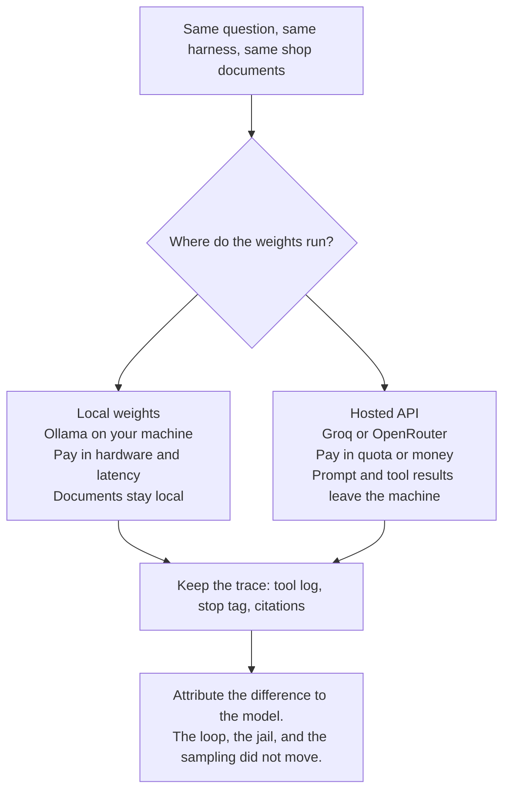
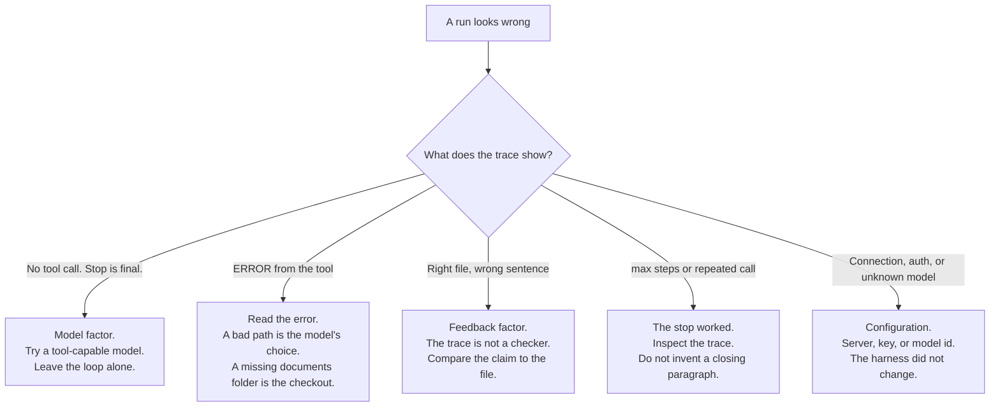

# Ch 3. Models without the pain

Part I — Foundations

On Monday the café compares two weekend transcripts of the same question: "How much is local delivery, and which day are you closed?"

Both concierges had the same binder, the same tool, the same stop rules, and the same instruction to cite a path or admit the documents were silent. One of them opened the policy and the FAQ, then answered: delivery is $4.50, free at $35, Tuesday through Friday, within three miles, and the café is closed Monday, with each fact tied to the file that holds it. The other said something like "about five dollars, and we're closed Sundays," and the tool log was empty.

Nothing in the shop changed between those runs. The person behind the counter changed. In software, that person is the model: which weights answered, and whether those weights ran on the café's own machine or on someone else's. This chapter keeps the harness still and moves only that choice. The claim to keep: **swap the model client; keep the harness stable.**

## 3.1 Where the weights live

Two places can run the weights. The loop does not care which, until you look at cost, latency, tool-call reliability, and who else can read the shop's documents.

**Local weights** mean the model runs on a machine you control. In these labs that machine is yours, and the usual server is [Ollama](https://ollama.com/download): a local process that speaks the same style of chat API the labs already use. There is no per-token invoice. A café policy sent as a prompt stays on that machine, unless you have pointed the local server itself at a remote host. You pay in memory, disk, and waiting. The models that fit a laptop are the small instruct models. They also drop tool calls more often. A dropped tool call looks, in the product, like the concierge who never opened the binder.

**A hosted API** means someone else's GPUs. Groq and OpenRouter are the two this book uses, because both can speak the same client shape as the local server. You send a key. You pay in money or a quota, and you often wait less. The request body leaves your machine. That body includes the system prompt, the question, and — once the loop is running — the tool results. `read_file` still runs locally. The bytes it returns are then copied into the next request. "The file was read on our machine" and "the file was sent to the provider" are both true for a hosted run. A policy file is fine to send when it is the fictional Hearth Lane binder. A real supplier contract, a customer list, or a Wi-Fi password is a different decision. Do not point a hosted client at a document you would not email to that provider.

What stays put between the two:

- The loop, the stop conditions, and the system prompt
- The tool schema and the directory jail
- The shop documents
- The sampling choices: how random the reply is allowed to be, and how long a reply may grow

What changes is which weights see that harness, how reliably they fill in a tool call, and whether the prompt leaves the machine.

Use the local default while you are still changing the loop. A broken local server fails in front of you, and you are not paying a provider to watch a bug. Use a hosted model when you want a cleaner tool-call trace to confirm the harness, or when you are doing the comparison this chapter is about. The point of the comparison is a difference you can attribute to the model, because the harness did not move.

## 3.2 One client, three settings

The labs speak to every provider through one OpenAI-compatible client. "Compatible" is a product decision, not a compliment. It means the call keeps a stable shape — messages in, a tool list beside them, text or tool calls out — while three settings select the server:

| Setting | What a practitioner is choosing | What a product manager should hear |
|---|---|---|
| Where the API lives | The origin of the chat service, including the version prefix the client expects | "Whose machine sees this conversation?" |
| The key | A bearer token. A local server may ignore the value and still require a non-empty string. A hosted API checks it. | "Which account is billed, and who can rotate the secret?" |
| The model name | The id that server expects. Names are not portable across vendors. | "Which weights, and do they actually call tools?" |

The Python package is the ordinary OpenAI client, pointed at whichever origin you chose. One construction serves Ollama, Groq, and OpenRouter. The lab prints the origin and the model name before the request, and it hides the key. If a crash report would have included the key, the harness strips it. The key lives in a local configuration file that is not part of the book. The template is. That split is the whole secret-handling story for these chapters: the example is safe to commit, the real file is not.

The names you will see in the lab template:

| Provider | Where it lives | Example model | Tool note |
|---|---|---|---|
| Ollama | Your machine | `llama3.2` | Small, local, sometimes skips the tool. `llama3.1` is the larger local fallback. |
| Groq | `api.groq.com` | `llama-3.3-70b-versatile` | Needs a model marked for tool use that runs in *your* process. `llama-3.1-8b-instant` is the smaller option in the same family. |
| OpenRouter | `openrouter.ai` | `meta-llama/llama-3.3-70b-instruct` | Ids look like `vendor/name`. Confirm on the model page that tools are supported. |

Model ids get retired. When the error says the model is unknown, the fix is a current id from that provider's list. The loop does not need an edit because a vendor renamed a product. Treat a stale id as configuration, and say so in the notes, or the next person will "fix" the harness for a problem the harness does not have.

Two configuration habits save reviews. Use one provider block at a time, so a single origin and a single model name are active. And keep the sampling constants in the harness, not in the provider block. If temperature changes between the local run and the hosted run, you no longer know which factor moved.

## 3.3 What "instruct" and "tool-capable" mean for the café

The labs need an **instruct** model: weights trained to follow a chat template, with roles for the system, the user, the assistant, and the tool result. A base model that only continues text will not reliably emit tool calls. Pointing the concierge at one looks like a broken loop. It is a model-selection mistake. The symptom is an empty tool log or a confused transcript. The repair is a different model name.

**Tool-capable** means the provider documents that this model can return structured tool calls your process will run. That phrase is easy to skim and expensive to get wrong. Some hosted products run tools on *their* side: web search, code execution, a browser that lives in their cloud. Those tools never call `read_file` in the café's process. A run that "browses" instead of opening the policy is that mismatch. Groq's compound-style models are the example to remember. They are the wrong tool for this lab. You want a model marked for local tool use, meaning your program performs the action.

OpenRouter will route a model that cannot call tools at all, if that is the id you asked for. The failure shows up as an HTTP error, or as a final prose answer with an empty trace, depending on the model. The model page's tool flag is the thing to check before the run. A bake-off against a chat-only model measures the wrong capability and then tempts the team to rewrite the loop.

Small local models remain the right default for day-to-day work on the harness. `llama3.2` will sometimes ignore the tool and answer in prose. That is useful data about the model factor. The Chapter 2 lab says so when a final answer arrives with an empty tool log. Before anyone rewrites the loop, change only the model and run the question again.

The Chapter 3 question is chosen so a correct answer has to touch both files. The delivery fee is only in the policy: $4.50, free at $35 and above, Tuesday through Friday, within three miles. The closed day is only in the FAQ: Monday. One model may read both and cite both. Another may answer from habit and cite nothing. That pair of traces is the bake-off. You do not need a leaderboard. You need the stop tag, the tool log, and the two citations.

Hold sampling still during the bake-off. The harness uses a low temperature, so policy wording stays stable across reruns, and a token budget large enough for two short tool calls plus a paragraph with paths. If you change either constant between the local run and the hosted run, the comparison is no longer the one this chapter asks for. Edit them when you are studying the knob, and write down that you edited them.

## 3.4 Quirks that look like product bugs

Providers disagree on the edges of "compatible." The shared client absorbs the disagreements that would otherwise fork the concierge into one agent per vendor. Knowing the list keeps a review from treating a protocol mismatch as a café-policy failure.

**The client does not force a tool.** Ollama's compatible API accepts a tool list and rejects the field that would force a particular tool. Groq accepts that field. The shared client omits it, so one request shape runs on both. The cost is real and visible: the harness cannot demand `read_file`. A skip is a model behavior you record. Forcing the tool would split the client by provider, and this chapter keeps one client.

**Tool results stay small.** Some compatible APIs reject a tool message that carries an extra name field. The loop sends the role, the id that ties the result to the call, and the content. That is enough for the providers in this book. Adding the extra field to "make the trace clearer" breaks the hosted run and leaves the local run looking fine, which is exactly how a team misreads a client bug as a model bug.

**Arguments are usually a JSON string, and sometimes already an object.** The loop accepts both. Invalid structure becomes an error observation, not a crashed process. The next turn can try again with a path the schema asked for. That is the quirk you want the model to see.

**Reply text is sometimes a list of parts.** One normalizer flattens that into text before a lab prints it. A new provider quirk belongs in the lab notes first, and in the shared client only when the same code has to keep running. Growing a special case per vendor inside the loop is how the harness stops being the stable product.

**A local origin does not start the server or download the weights.** Configuration that points at your machine assumes the process is already up and the model tag is already present. A connection error on this chapter is that setup. The swap script is doing what it should: failing once, in front of you, instead of sleeping through a retry that looks like a hang.

**Hosted errors are mostly configuration.** A rejected key, an unknown model id, or a model that has no tool support should change a setting, not the loop. Keep the previous trace. If the prompt, the tool, and the model change in the same edit, the chapter's comparison is gone.

When a run misbehaves, change one setting or one harness constant, run the same question, and keep both traces. The decision diagram above is the review. It sends a skipped tool to the model, a misquote to feedback, and a dead server to configuration. It keeps the team from "fixing" all three in one pull request and then celebrating a demo that cannot be explained.

## 3.5 What to ask before a model bake-off

A bake-off is a product exercise. It answers "which weights should stand behind this harness," and it is only interpretable when the harness is boringly fixed.

Freeze, in writing, before the first run:

- The question. This chapter's question needs both documents, so a model cannot look competent by reading one file.
- The documents, the tool list, the stop rules, and the sampling constants.
- The two or three model candidates, each one confirmed as instruct and tool-capable, with tools that run in your process.
- Whether each candidate is local or hosted, because a hosted run is also a data-sharing decision.

Score each trace the same way:

- Did the policy get read, and did the FAQ get read?
- What stop fired, and after how many model calls?
- Do $4.50 and Monday each cite the file that actually contains them?
- Did any answer invent a number, a day, or an action the tool list does not contain?

Bring the pair of traces to the review, not a single winning paragraph. A hosted model that cites both files has demonstrated the harness. It has also demonstrated that the binder left the building. A small local model that skips the tool has demonstrated a reliability gap you can measure. Either result can be the right product choice. Neither result is a reason to fork the loop per vendor.

The costs to put next to the traces are the ones a café would feel. Local: machine size, wait time, and the rate of empty tool logs. Hosted: price or quota per finished answer, wait time, and the fact that tool results are copied to the provider. "Finished answer" is the unit. A run that stops at max steps without a customer-ready paragraph still spent the calls. Count it.

Provider quirks that force a fork in the loop are harness bugs worth fixing once, in the shared client. They are a weak reason to keep a second concierge per vendor. The product you are building is the loop, the jail, the stops, and the sampling. The model is a setting in front of that product.

## 3.6 What goes wrong when the model is the only thing that moved

**The team changes three things and calls it a model test.** A new prompt, a new tool description, and a new provider in one afternoon produce a better demo and zero knowledge. The chapter's discipline is dull on purpose. Same script. Same documents. Different settings file.

**A compound or server-side tool model "succeeds" without the policy.** The transcript may contain a plausible delivery fee from the public web, or from habit. The café's file never opened. If the product requirement is "answer from our binder," that run failed, however fluent it is.

**The local model is blamed for a server that is down.** Connection refused on the local origin is setup. The swap did not break. The process that should be serving the weights is absent, or the tag was never pulled.

**The hosted model is blamed for a key still set to the local placeholder.** Hosted APIs check the token. The local placeholder is a non-empty string the local server ignores. Leaving it in place when you change the origin produces an authentication error, which is configuration, visible and dull.

**A citation bake-off forgets the action boundary.** A model can read both files, cite both files, and still offer to book the bike delivery itself. The tool list cannot book anything. Score the offer as a failure even when the fee and the closed day are perfect. Grounding and permission are different scores.

**Data leaves in the tool result, not only in the question.** Teams remember that the prompt is sent. They forget that the file contents ride along on the next turn. A hosted bake-off on real customer mail is a disclosure. The fictional shop exists so the lab can be honest about that fact without leaking a real one.

## Lab

The Chapter 3 lab runs the Chapter 2 loop twice: once on a local configuration, once on Groq or OpenRouter, changing only the settings file. The switch steps, the answer key, and the failure notes are in the lab:

[labs/ch03-models-without-the-pain/README.md](../../labs/ch03-models-without-the-pain/README.md)

## Takeaway

Swap the model client. Keep the harness stable. Where the API lives, which key you send, and which model name you ask for select the weights. The loop, the jail, the stop conditions, and the sampling constants are the product. A provider quirk that would force a second agent per vendor is a reason to fix the shared client once, then go back to comparing traces.
