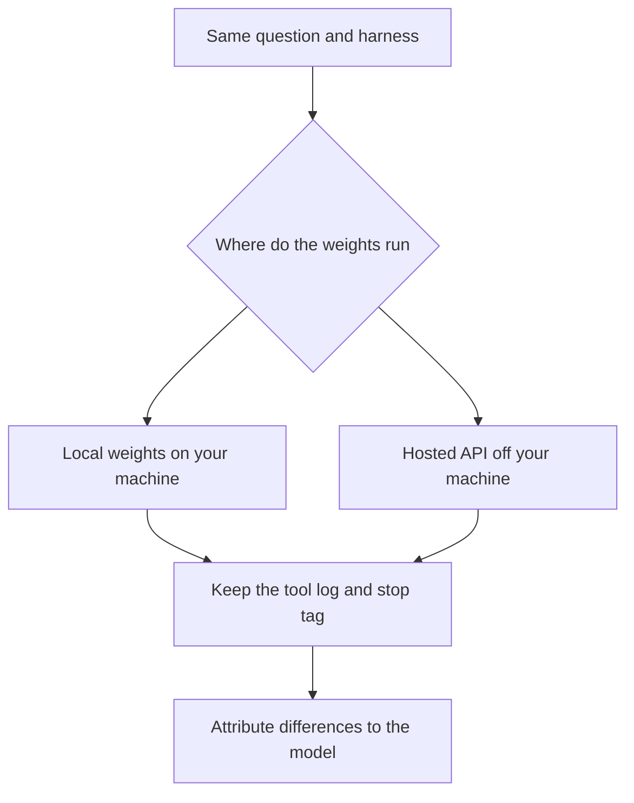
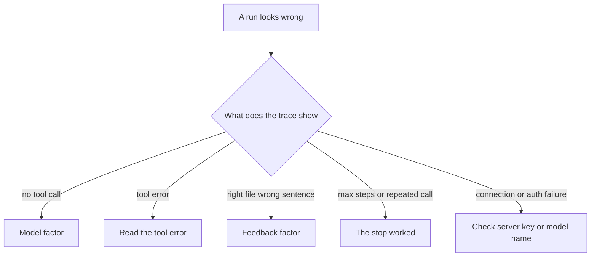

# Chapter 3: Local and Hosted Models

In these labs, a model is an HTTP server that speaks a subset of the OpenAI chat-completions API. You select it with three settings — where the API lives, which credential is sent, and which model name that server expects — and you leave the harness unchanged. **Swap the model client, and keep the harness stable.** That split is what makes a comparison interpretable: if the prompt, the tools, and the sampling limits move together with the weights, the result no longer says which factor changed. This chapter contrasts local weights with a hosted API, and it shows how one compatible client keeps the loop from Chapter 2 intact across both.

The comparison question asks how much local delivery costs, and which day the café is closed. A grounded answer cites the policy for $4.50 — free at $35 and above, Tuesday through Friday, within 3 miles — and cites the FAQ for Monday. One model may read both files and cite both. Another may offer a round number and the wrong closed day, with an empty tool log. The shop stayed the same. The weights changed.

## Where the Weights Run

Weights can run in two places. The loop itself is indifferent. Cost, latency, how often a tool call appears, and who else can read the shop’s documents are where the choice shows up.

**Local weights**, here, mean [Ollama](https://ollama.com/download) on your machine. The process that serves the local API loads the model. There is no per-token invoice. A café policy sent as a prompt stays on that machine, unless Ollama itself has been pointed at a remote host. The cost is memory, disk, and waiting. The models that fit a desktop are small instruct models, and they drop tool calls more often. In the product, a dropped tool call looks like a concierge that never opened the binder.

A **hosted API**, here Groq or OpenRouter, means someone else’s machines. Both speak the same client shape as the local server. You send a key, and you pay in money or in a quota. The wait is often shorter than a small model on a laptop. The request body leaves your machine: the system prompt, the question, and — once the loop is running — the tool results. The file is still read locally. Its text is then copied into the next request. On a hosted run, both statements are true. The file was read on your machine, and the file was sent to the provider. The fictional Hearth Lane documents are safe to send. A supplier contract, a customer list, or a real password is a different decision. Point a hosted client only at text you would deliberately send to that provider.

*Figure 3.1. A fair comparison holds the harness fixed and changes only where the weights run.*

What stays fixed is the loop, the stop conditions, the system prompt, the tool schema, the directory limit, the shop documents, and the sampling constants: temperature 0.2, and a maximum of 800 tokens.

What changes is which weights see that harness, how reliably they return tool calls, and whether the prompt leaves the machine.

Use the local default while the loop is being edited. A local server that is down fails in front of you, and a provider is not being paid to watch a bug. Use a hosted model when a cleaner tool-call trace is needed to confirm the harness, or when you are making the comparison this chapter describes.

## One Client, Three Settings

Compatibility is a product decision as much as a library choice. The call keeps one shape — messages in, a tool list beside them, text or tool calls out — while three settings select the server. The client is the OpenAI Python package. Automatic retries are off, so a local server that is down fails on the first attempt. A retry sleep would make that outage look like a hang.

- **Where the API lives** (`BASE_URL`). This is the origin of the HTTP API, including the `/v1` prefix the client appends routes to. The local default is `http://localhost:11434/v1`. A review should be able to say whose machine sees the conversation.
- **Which credential is sent** (`API_KEY`). This is a bearer token. The local server requires a non-empty string and ignores its value; the placeholder is `ollama`. A hosted API checks the key. A review should be able to say which account is billed, and who can rotate the secret.
- **Which weights** (`MODEL`). This is the identifier the server expects. Identifiers do not travel across vendors. The local default is `llama3.2`. A review should be able to say whether those weights call tools that run in your process.

The labs read the three settings from a file at the repository root. A value already present in the process environment takes precedence. If the origin or the model name is missing, the local defaults apply, and a forgotten file fails as a connection error you can read. A missing key becomes the local placeholder. An empty key stays empty, and the run stops: a blank hosted key is never quietly replaced by that placeholder.

Every lab prints the origin and the model before the request, and reports that a key is set while hiding its value. If the value leaks into an error message, it is stripped. The example file in the repository is the contract. The local copy is the secret, and it stays out of version control. Keep a single provider active. Two model names in the same file are easy to misread, because the later assignment is the one that takes effect. Sampling constants stay in the harness. If temperature differs between the local run and the hosted run, the model is no longer the only thing that moved.

The three providers used in this book are these.

- **Ollama (local).** Origin `http://localhost:11434/v1`, key `ollama`, model `llama3.2`. It is small, it stays on the machine, and it sometimes skips the tool. `llama3.1` is the larger local fallback.
- **Groq (hosted).** Origin `https://api.groq.com/openai/v1`, your Groq key, model `llama-3.3-70b-versatile`. Choose a model marked for tool use that runs in your process. `llama-3.1-8b-instant` is the smaller option in the same family.
- **OpenRouter (hosted).** Origin `https://openrouter.ai/api/v1`, your OpenRouter key, model `meta-llama/llama-3.3-70b-instruct`. Identifiers look like `vendor/name`. Confirm on the model page that tools are supported before you spend a run.

Providers retire identifiers. An error that says the model is unknown is repaired by a current name from that provider’s list. The loop stays as it is. A stale name is configuration. Editing the harness for it assigns the failure to the wrong factor.

## Choosing an Instruct Model

The labs need an **instruct** model: weights trained to follow a chat template with system, user, assistant, and tool roles. A base model continues text, and it will not reliably emit tool calls. Pointing the concierge at one looks like a broken loop. It is a selection mistake. The symptom is an empty tool log, or a transcript that never settles into a tool call. The repair is a different model name.

**Tool-capable**, in this book, means the provider documents that the model can return structured calls your own process will run. Some hosted products run tools on their side — web search, code execution, a browser in their cloud. Those tools never open the shop’s files. A run that browses the public web, where the task was to open the policy, is that mismatch. Groq’s compound models are the example, and they are the wrong instrument for this lab. Use a model marked for local tool use.

OpenRouter will route a chat-only model if that is the identifier you asked for. The failure is an HTTP error, or a final paragraph with an empty trace, depending on the model. The tool flag on the model page is the check to make before the run. Measuring a chat-only model, and then rewriting the loop to compensate, answers a question this chapter is not asking.

The default is constrained in three ways. It fits a desktop. Its provider documents tool calls on the chat-completions route. It can be replaced without editing the program. The local tag `llama3.2` meets those constraints, and it will sometimes ignore the tool and answer in prose. That behavior is evidence about the model. Before the loop is rewritten, change only the model name.

Fallbacks that keep the same client:

- Locally, use `llama3.1` after it has been installed. It is larger than 3.2, and it is the model the local server’s own tool-calling notes used first.
- On Groq, use `llama-3.3-70b-versatile` or `llama-3.1-8b-instant`.
- On OpenRouter, use a current tool-capable identifier such as `meta-llama/llama-3.3-70b-instruct`, after the name is confirmed.

Day-to-day edits to the loop belong on the small local model. A second trace of the same question is the reason to use a hosted model. A public leaderboard is unnecessary. The record is the stop tag, the tool log, and the two citations.

Hold sampling fixed during that comparison. Temperature 0.2 keeps policy wording stable across reruns. A high temperature increases paraphrase, and it also increases malformed tool arguments. Eight hundred tokens cover two short tool calls and a paragraph that includes paths. Change either constant only when that constant is the object of study, and write down that it changed.

## Where Compatible APIs Disagree

“Compatible” frays at the edges. The shared client absorbs the disagreements that would otherwise become one agent per vendor.

**Nothing in the request forces a tool.** The local server accepts a tool list and rejects a field that requires a particular tool. Groq accepts that field. The shared client omits it, so one request runs on both. The cost is real: the harness cannot force a file to be read. A skipped call is model behavior, visible in the trace. Forcing the tool would split the client by provider. This chapter keeps one client.

**Messages carry no extra name field.** Groq’s compatible API rejects that field. A tool result here has a role, a call identifier, and content. That set is enough for the local server and for Groq. Adding the name while debugging a trace makes the hosted run fail while the local run continues, and the failure is easy to blame on the weights.

**Arguments may arrive as text or as a structure.** The loop accepts a JSON string or a dictionary. Invalid JSON becomes an error observation, and the process continues. On the next turn the model can see the error and send a path that points at the policy.

**Assistant text may arrive in parts.** Some servers return a list of parts rather than one string. One normalizer flattens those parts before they are shown. This chapter adds no special case per vendor. A new quirk belongs in the lab notes first, and in the shared client only when the same program has to keep running for every provider.

**The local server must already be running, and the weights must already be present.** An address on the local machine starts nothing and downloads nothing. Installing the model and starting the server are setup, described with the labs. A connection error in this chapter is that setup.

**A hosted failure is usually a setting.** A rejected key, an unknown model name, or a model with no tool support calls for a change of configuration. The local placeholder is a non-empty string the local server ignores. Left in place after the origin changes, it produces an authentication error. Keep the previous trace. A single edit that changes the prompt, the tool, and the model leaves the new trace unexplained.

## Reading a Failed Comparison

*Figure 3.2. A bad run goes to the model, to feedback, or to configuration.*

Several misses are easy to misname.

- Changing the prompt, the tool description, and the provider in one sitting produces a smoother demonstration and no knowledge. The discipline here is the same program, the same documents, and a different settings file.
- A model whose tools run on the provider’s servers can look successful without opening the policy. A plausible fee, taken from the public web or from habit, is a failed run when the requirement is to answer from the shop’s files.
- A local model is sometimes blamed for a server that is simply down. A refused connection on the local origin is setup.
- Scoring citations can overlook the action boundary. A model may read both files, cite both, and still offer to book the delivery. The tool list can book nothing. The offer is a failure even when the fee and the closed day are right. Grounding and permission are different scores.
- The disclosure is in the tool result as well as in the question. The prompt is sent, and the file contents travel with the next turn. A hosted comparison that uses real customer mail is a disclosure. The fictional shop exists so the lab can be precise about that fact.

A comparison answers which weights should stand behind this harness. It is interpretable when the harness is held fixed. Before the first run, write down the question — this one needs both documents — together with the tool list, the stop rules, and the sampling constants. Name two or three candidates, each confirmed as an instruct model whose tools run in your process, and note which are local and which are hosted. A hosted run is also a decision about who sees the documents.

Score every trace the same way.

- Were the policy and the FAQ both read?
- Which stop fired, and after how many model calls?
- Do $4.50 and Monday each cite the file that actually contains them?
- Did any answer invent a number, a day, or an action the tool list does not contain?

Bring both traces to the review. A hosted model that cites both files has shown that the harness works, and that the documents left the machine. A small local model that skips the tool has shown a reliability gap you can measure. Either result can be the right product choice. Neither result is a reason to keep a separate loop for each vendor.

Place the costs a shop would actually feel next to the traces. Locally, those costs are machine size, waiting, and the rate of empty tool logs. On a host, they are price or quota per finished answer, waiting, and the copying of tool results to the provider. The unit is a finished answer. A run that hits the step limit without a customer-ready paragraph still spent the calls. Count it.

## Lab

Run the Chapter 2 agent twice: once on the local server, and once on Groq or OpenRouter, changing only the three settings between the runs. For each run, keep the printed origin and model name, the tool log, the stop and the step count, and whether $4.50 and Monday each have a citation you can verify in the file. The run also prints the sampling constants. If those numbers differ between the two runs, the harness moved, and the experiment is no longer the one this chapter describes.

Switching providers, the answer key, and notes on common failures are in the [Chapter 3 lab](../../labs/ch03-models-without-the-pain/README.md).

The three settings select the weights. The loop, the directory limit, the stop conditions, and the sampling constants are the product under construction. A provider quirk that forces a second loop is a harness defect, and it belongs in the shared client, repaired once.
