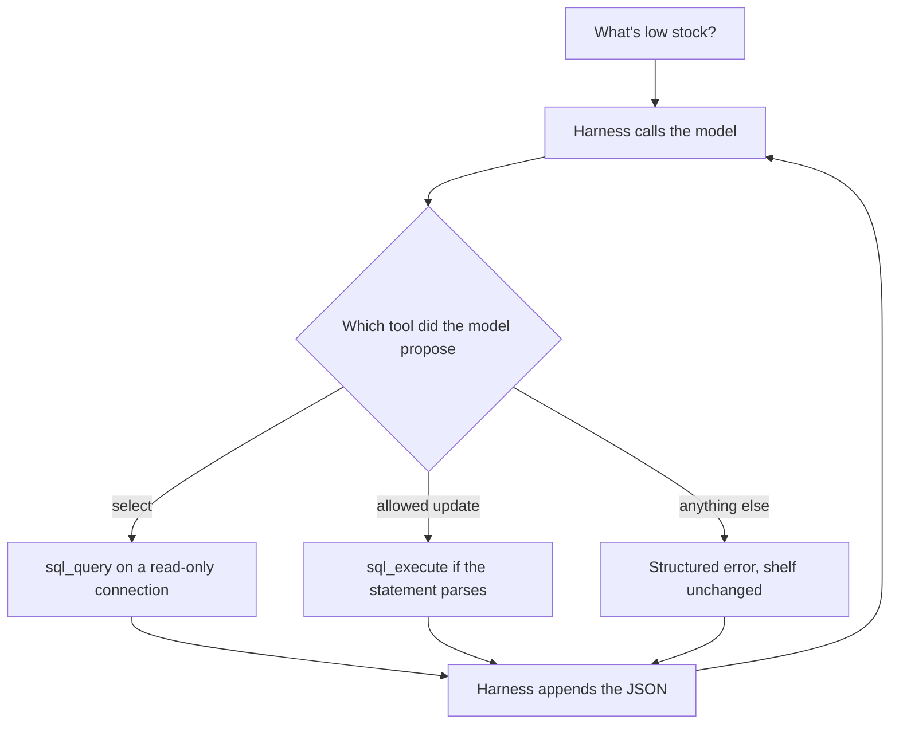

# Chapter 4: Tools and Sensors

Chapter 2 gave the concierge one sensor. `read_file` copies a shop document into the message list, and the model can then quote a return window it has actually seen. That sensor cannot see the shelf. A customer, or a Tuesday opener, can ask what is low, and the policy file does not contain a count. The claim of this chapter is that tools are the model's sensors and actuators, and that a bad tool makes a capable model look careless. The model does not perceive the database. It perceives the tool result your harness placed in the conversation. It does not update a row. It proposes a call, and the harness either applies a change you allowed or returns an error the next turn can use.

The running example is the back room at Hearth Lane Café. The opener asks, "What's low stock?" The shelf lives in a small SQLite database, `shop.db`, with a `products` table and an `inventory` table. Low stock, in this shop, means `on_hand` is less than or equal to `reorder_point`. A second, much narrower tool can set an on-hand count. It cannot place a supplier order, send email, or take payment. Those are different actions, and this chapter does not offer them.

## 4.1 Tools as the model's sensors and actuators

A **sensor** is a tool that reports the world and leaves it unchanged. `read_file` is a sensor. `sql_query` is a sensor. The harness runs a statement, receives rows, and appends those rows as the tool message. After that call, the database matches what it was before the call. The model may now name a count, because the count was copied into the messages. If the tool never ran, a fluent "about four bags" is the same failure as the invented return window in Chapter 1. The number came from habit, not from the shelf.

An **actuator** is a tool that changes the world. `sql_execute`, in the form this chapter allows, sets `inventory.on_hand` for one sku. A cart, a ticket, and an email would be actuators too. The model still only proposes the call. The harness performs it, then reports what happened. A sentence in the reply that says "I ordered twelve bags from the roaster" is an action boundary from Chapter 1, now sitting next to a database you can open. If the tool log shows no successful write, the shelf did not move, and the sentence is false even when it sounds like a concierge who did the work.

Hold the two roles apart when you design the list. A sensor with a wide description ("run any SQL") is an actuator that has not admitted what it is. The model will use the tool it was offered. If the only tool that can see the shelf can also drop a table, a question about oat milk is one bad statement away from an empty back room. The repair is not a sterner sentence in the prompt. The repair is a second tool, with a smaller contract, or no write tool at all until you can name the write.

The description is part of the sensor. The model chooses a tool from the name, the description, and the argument names you registered. For this shelf the description should say which tables exist, which columns matter, and what "low" means. If you leave "low" undefined, the model will invent a threshold. Ten feels like a low number. It is not this café's rule. House blend in the two-pound bag has nine on the shelf and a reorder point of four, so it is not low. Espresso beans have five on the shelf and a reorder point of five, so they are low, because the rule is `<=`, not `<`. That rule belongs in the tool description and in the result the model reads. It does not belong in a hope that the model shares your definition.

The tables the lab creates are these.

```sql
CREATE TABLE products (
  sku TEXT PRIMARY KEY,
  name TEXT NOT NULL,
  category TEXT NOT NULL,
  unit TEXT NOT NULL,
  reorder_point INTEGER NOT NULL
);

CREATE TABLE inventory (
  sku TEXT PRIMARY KEY REFERENCES products(sku),
  on_hand INTEGER NOT NULL CHECK (on_hand >= 0),
  par INTEGER NOT NULL
);
```

`par` is the most that fits on the shelf. It is not the reorder point. A restock that sets `on_hand` above `par` does not fit, and the write tool in this chapter refuses it. The seed the lab rebuilds on each run is small on purpose, so you can check a paragraph against seven rows.

| sku | name | on_hand | reorder_point | par | low? |
|---|---|---|---|---|---|
| HB-12 | House blend 12oz | 4 | 6 | 18 | yes |
| HB-2LB | House blend 2lb | 9 | 4 | 10 | no |
| ES-1KG | Espresso beans 1kg | 5 | 5 | 12 | yes |
| OM-32 | Oat milk 32oz | 3 | 8 | 16 | yes |
| MLK-1 | Whole milk gallon | 11 | 4 | 12 | no |
| ALM-1 | Almond meal | 1 | 2 | 4 | yes |
| FL-01 | Paper filters | 7 | 2 | 8 | no |

Four rows are low: almond meal, espresso beans, house blend 12oz, and oat milk. A grounded answer names those, with the counts the tool returned, and does not add the two-pound coffee because nine feels small.

Walk the question through a cooperative run.

1. The harness seeds `shop.db` and starts the message list with the brief and "What's low stock?" The model has not seen a count.
2. The model proposes `sql_query` with one `SELECT` that joins `products` to `inventory` and keeps rows where `on_hand <= reorder_point`.
3. The harness runs that statement on a read-only connection, caps the rows, and appends a JSON result. The result names the columns and the four rows.
4. The model answers from those rows. The stop tag is `final`. You compare the paragraph to the JSON, the way Chapter 2 asked you to compare a sentence to `policy.md`.



*Figure 4.1. The model proposes a tool. The harness decides whether the shelf is read, written, or left alone, and the next turn sees that outcome.*

The result has to be legible. A dump of tuples with no column names invites the model to swap `par` and `on_hand`. House blend would then sound as if four were the maximum and eighteen were on the shelf. The tool result in this lab is JSON with `columns` and `rows`, so the next turn can point at `on_hand` by name. A sensor that returns an unlabeled blob has done only half its job. It fetched the fact and then hid which fact it fetched.

The same loop from Chapter 2 runs this tool list. `run_tool_agent` in `labs/common/loop.py` is that loop with the tools and the dispatcher passed in. Stop conditions are unchanged: a final message, six model calls, a third identical call, or a completion cut off by the token limit. The café question needs one read. Six leaves room for a bad statement, the error, and a repaired `SELECT`. The harness still does not send `tool_choice`, for the reason Chapter 3 recorded. A model may skip the tool and invent a shelf. The tool log is empty when that happens. Record it as model behavior. Do not widen the tool until the log shows a call.

## 4.2 Designing safe SQL tools (read vs write)

The dangerous design is one function that accepts a string and executes it. The opener asked what is low. The model, trying to be helpful, sends an `UPDATE`, or a second statement after the `SELECT`, or `ATTACH` pointed at a file that is not the shelf. Your program was the part that ran it. Blaming the weights leaves the next question just as able to wipe `inventory`.

Split the work into two tools with two connections.

**`sql_query` reads.** It opens SQLite with a read-only URI (`mode=ro`). A write that reaches that connection fails inside SQLite, which is the barrier you want even if your own checks miss a verb. The harness also classifies the string before it runs. The statement must be one `SELECT` or a `WITH` query. A semicolon is rejected, so a second statement never starts. Comments are rejected, so the classifier is not asked to parse them. Words that mean a write, or that mean "open another file," are rejected even inside a statement that begins with `SELECT`. `load_extension` is in that list. So is `ATTACH`. A read-only connection will still attach another database; the URI flag does not save you from a sensor that can see files you did not put in `shop.db`. The classifier closes that hole. The connection remains the backstop for a write the classifier did not name.

**`sql_execute` writes one shape, and it does not run the model's text.** The allowed statement is an absolute set of one count:

```text
UPDATE inventory SET on_hand = <integer> WHERE sku = '<sku>'
```

`parse_restock` either returns that sku and that integer, or it returns nothing. On nothing, the tool returns a refusal and the shelf is unchanged. On a pair, the harness checks that the sku exists and that the integer sits between zero and that sku's `par`. Only then does it run a statement it wrote itself, with bound parameters:

```python
conn.execute(
    "UPDATE inventory SET on_hand = ? WHERE sku = ?",
    (on_hand, sku),
)
```

The model's string is not concatenated into SQL. A parser bug can at worst propose a sku and a count. It cannot become `DROP TABLE`, because that text is never executed. This is the same division Chapter 2 used for paths. The model proposes. The function decides what is actually done.

Prefer the read tool as the default. The lab's `parse_restock` starts by refusing every write, so a run of "What's low stock?" can succeed while a run that tries to change the shelf is told no. You add the parser when you want the actuator, not before. A shop that only needed the opener to *see* low stock should ship the sensor and leave the actuator unplugged. An actuator is a new way to be wrong.

`par` is enforced in the harness, not in the prompt. Setting HB-12 to 16 is inside the par of 18: four bags on the shelf, plus a case of twelve, is sixteen. Setting it to 99 is a fiction about the shelf. The tool returns `above_par` and does not store 99. A model that then tells the opener the shelf holds 99 has ignored the tool result. You can see that in the trace. The defect is not that SQLite lacks a check. The check is in your code, and the observation says so.

Two more boundaries belong in the contract, because the voice will offer them.

- The write does not order from a roaster or a dairy. It sets a count the café believes is on the shelf. A purchase order is a different actuator, with a supplier, a price, and a confirmation. Chapter 26 is where a full restock is composed. This chapter stops at the shelf.
- The write does not answer a policy question. Returns and shipping remain in `docs/policy.md`. If the model uses `sql_query` to decide whether an opened bag can come back, the tool result will not contain that rule. The grounded reply says the shelf tables do not hold the return window, and points at the document tool when one is registered. This lab does not register `read_file`. Do not let a count stand in for a policy.

A string check that only asks whether the text starts with `SELECT` is not the design above. `SELECT` can carry a forbidden word, and a write can be disguised as a request to the read tool. The model will send that request if the read tool is the one that usually works. Your classifier and the read-only connection exist so that request becomes an error instead of a mutation. When you describe the run, say which tool ran and whether `ok` was true. "The model queried the database" hides the difference between a read and a write.

## 4.3 Timeouts, retries, idempotency

The loop's step budget counts calls to the model. It does not count wall-clock time inside a tool. A sensor that never returns holds the process inside a single step. On a hosted model the request is already in flight, and a local SQLite file is usually too small to matter. The contract is still worth writing now. The next sensor may be a supplier page or a payment call, and the shape of the failure should already be familiar.

This lab puts a progress handler on the read connection. If the statement runs longer than `QUERY_TIMEOUT_S` (two seconds), SQLite interrupts it. Inside the harness that failure is retryable, as is a lock (`busy`). A syntax error, a forbidden statement, and a missing sku are not. Running those again will fail the same way. Retrying them spends a step and teaches the model that repetition is the repair.

The retry belongs in the harness, and it is narrow.

- Retry a timeout or a busy lock once, with the same statement. The model sees one tool result. The JSON includes `attempts: 2` when the second try happened, so the trace shows the retry without a second model call. If the second try still failed, `retryable` is false. The harness has spent the retry. The next repair is a different statement, or an admission that the read did not finish.
- Do not retry `not_select`, `forbidden_sql`, `bad_sql`, `unknown_sku`, or `above_par`. Those need a different call, which is the model's next turn, or they need to be abandoned.
- Do not retry a write that returned `applied`. The next section's idempotency key covers the case where the client did not see the success and sends the same write again.

The café makes the idempotency rule concrete. The opener wants HB-12 brought up by a case. Two designs are easy to confuse.

An **increment** says "add 12." The first call takes the shelf from 4 to 16. A retry, because the response was lost or the model repeated itself, takes it from 16 to 28. Twenty-eight is above par, or if you failed to check par, it is now the number the next shift believes. The shelf was counted twice.

An **absolute set** says "on_hand is 16." The model is supposed to have read 4, decided the shelf should hold 16, and written 16. A retry writes 16 again. The count does not move on the second call. The tool still should not depend on that accident. Record the write under an **idempotency key** the caller supplies, such as `restock-2026-09-30-HB-12`. The first success stores the key and the JSON result in `applied_writes`. The second call with the same key returns that JSON with `replayed: true` and does not `UPDATE` again.

The key has to name the operation, not only the SQL text. A key that is the sentence `UPDATE inventory SET on_hand = 16 WHERE sku = 'HB-12'` collapses Tuesday's restock and next month's restock into one stored result. Include the day, or a restock id a person assigned. The lab's check uses `restock-2026-09-30-HB-12` for that reason. A missing key is `missing_key`, and nothing is written. The model can repair the call by sending a key. It should not repair the call by inventing a second, silent write.

```mermaid
flowchart TD
  call["sql_execute with a key"]
  seen{"Key already stored"}
  replay["Return the stored result, replayed true"]
  parse{"parse_restock accepts it"}
  refuse["write_not_allowed, shelf unchanged"]
  bounds{"Sku exists and count is within par"}
  apply["UPDATE with bound parameters, store the key"]
  call --> seen
  seen -->|yes| replay
  seen -->|no| parse
  parse -->|no| refuse
  parse -->|yes| bounds
  bounds -->|no| refuse
  bounds -->|yes| apply
```

*Figure 4.2. A repeated key does not move the shelf. A statement that does not parse does not run.*

The lab rebuilds `shop.db` at the start of each process, so a count you set does not become the next chapter's memory. Idempotency here is about one process applying a write once. Durability across mornings is Chapter 6, and it is the wrong tool for a number that is supposed to come from the shelf. If you need the count after the script exits, open `shop.db` before you start the script again. The next start replaces the file so the low-stock question stays checkable.

## 4.4 Structured errors the model can recover from

Chapter 2 returned failures as strings that begin with `ERROR:`. That worked for a missing file, because the string named the files that do exist and the recovery was "ask for one of those." A SQLite exception is a worse observation. `near "FROM": syntax error` may be enough for a strong model and opaque for a small one. The model either apologizes and invents a shelf, or it sends the same broken statement until the step budget ends. You experience that as a dumb concierge. The tool result did not say what to do next.

This chapter's tools return one JSON object. The fields are stable, so the next turn can branch on them instead of paraphrasing a driver message.

```json
{
  "ok": false,
  "code": "not_select",
  "retryable": false,
  "message": "sql_query only runs a single read-only SELECT.",
  "hint": "Join products to inventory and select sku, name, on_hand, reorder_point where on_hand <= reorder_point. Writes belong in sql_execute."
}
```

`ok` is the first question. True means the rows, or the write, are in the object. False means the shelf was not reported, or was not changed, and `message` explains the refusal. `code` is a short name your prompt can mention: `not_select`, `forbidden_sql`, `timeout`, `busy`, `bad_sql`, `unknown_sku`, `above_par`, `write_not_allowed`, `missing_key`, `no_database`. `retryable` is true only when an identical call might still succeed. In this lab the harness spends that chance itself, once, and the result the model sees is then `retryable: false`. The model should not loop on it. `hint` is the recovery, written by you, not by the database. A hint may name the legal `SELECT`. A hint that suggests trying `DROP` is a second bug in the tool.

A few codes are worth meeting on purpose.

- **`forbidden_sql` / `not_select`.** The read tool will not change the shelf. The hint points at `sql_execute` only when the user actually asked for a change. For "what's low stock?" the repair is a `SELECT`. If the model switches to the write tool in order to answer a question, the write tool should refuse, and the model should go back to the read. You want that path to be visible in the log, not a successful `UPDATE` that happened to return some text.
- **`write_not_allowed`.** `parse_restock` returned nothing. In the starter, it always returns nothing, so every write looks like this until you fill the function in. The honest answer to the opener is the low-stock list, plus a sentence that the count was not changed. A model that says the shelf was updated has ignored `ok: false`.
- **`timeout`.** The read was interrupted. `attempts` shows the harness retry. If the code is still `timeout`, the statement is too expensive for this tool. The model should not replace it with a write.
- **`unknown_sku` and `above_par`.** The statement parsed, and the harness still refused it. The hint names the sku list or the par. The recovery is a new count or a new sku, after a read, not a second attempt with the same arguments.

Do not raise out of the tool. An exception that kills the process is a lost observation, which is the rule from Chapter 2. The dispatcher catches a bad argument and returns JSON. The loop continues inside the step budget. The model gets a turn in which it can read `code`.

The same model looks competent or careless depending on the result you hand back.

- The tool returns the four low rows, with column names. The paragraph names almond meal, espresso beans, house blend 12oz, and oat milk, and leaves whole milk off the list. The trace shows `sql_query` and `ok: true`. The model had something true to copy.
- The tool returns the word `error` and nothing else. The paragraph apologizes and offers a round count. The trace shows a tool call. The observation did not contain a shelf. The next edit is the tool result, not a larger model.
- The tool accepts any statement and the log shows a `DROP` or an `UPDATE` the opener did not ask for. The paragraph may sound practical. The shelf is wrong. The next edit is the contract: read-only connection, classifier, and a parser in front of the write.
- The tool returns `ok: false` after a refused write, and the paragraph says the case was put away. The observation was good. The model did not use it. That is the feedback factor from Chapter 1. Record the sentence next to the JSON. A later checker can reject a claim of a write when no result has `code` `applied`.

Bad tool design looks like a dumb model because the only artifact most people read is the paragraph. The tool log is how you refuse that reading. Empty log: the model never looked. `ok: false` and a confident count: the model looked and ignored the refusal. `ok: true` and the wrong sku: compare the row to the sentence before you touch the weights. A write you did not mean to expose: the harness moved, in the sense of Chapter 3, and a different `MODEL` will not close the hole.

## Builder takeaway

Bad tool design looks like a dumb model. The shelf is invisible until a sensor copies it into the message list, and it changes only when an actuator you bounded actually runs. Give the read and the write different tools, return JSON the next turn can branch on, retry only the failures that are worth retrying, and make a repeated write return the first result instead of counting the shelf twice. When the paragraph is wrong, read the tool result before you replace the model.

## Lab

Seed the café shelf, ask what is low, and keep the write path refused until your parser accepts one absolute `UPDATE`. From a real run, record the tool JSON, the stop, and whether each count in the answer appears in that JSON. A write that returns `ok: false` must not be described as a stocked shelf.

The steps, the `--check` that does not call a model, and the write you are asked to allow are in the [Chapter 4 lab](../../labs/ch04-tools-and-sensors/README.md).

The concierge can now see a shelf and, when you allow it, set one count. It still cannot remember, an hour later, which of those facts the opener will need. The next chapter is about what you put in the message list, and what you leave in a note instead.
