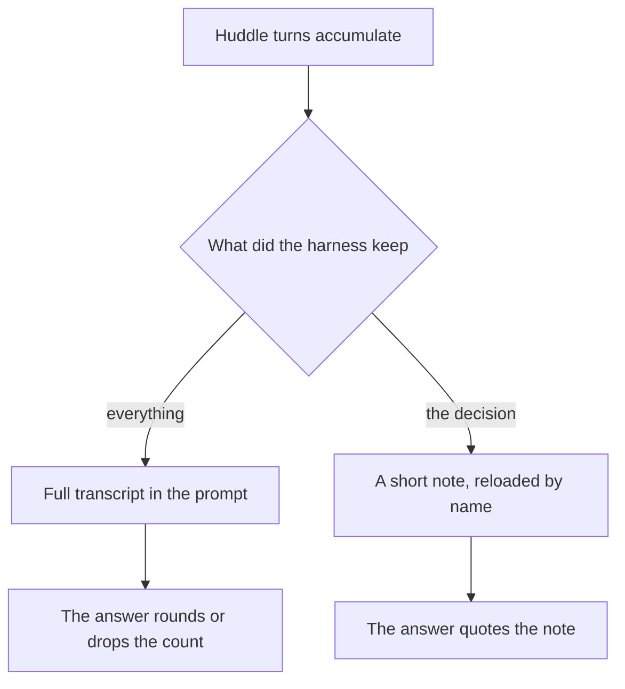
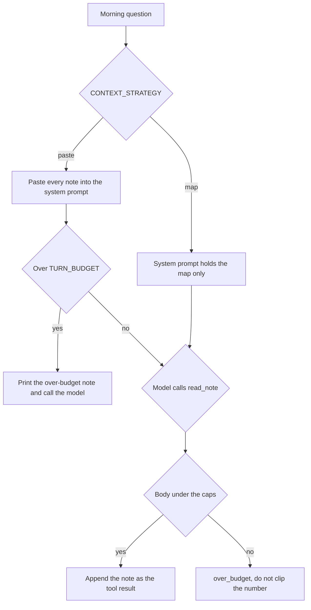

# Chapter 5: Context Engineering

The shelf tool from Chapter 4 answers "what's low stock?" in one or two model calls. A Tuesday restock huddle does not. Noor, Ellis, and Maya talk through the rain, a sweetness complaint, a picnic the café already declined, and then the decisions that actually bind the next shift: twelve cartons of oat milk, twelve bags of house blend, no cardamom buns on Wednesday, twenty-four on Thursday. If you append every turn to the message list and ask the morning question at the end, the numbers are somewhere in the prompt. They are also buried. The claim of this chapter is that the context window is a budget the harness spends, and that spending it is design work. A careful system prompt does not decide which fact survives. The program that builds the message list does.

**Context engineering** is the name for that work: choosing what enters the prompt, in what form, and at what moment. It is harness work. The model will attend to whatever you placed in front of it, and it will fill a gap when the fact it needs was summarized away or pushed into the middle of a long transcript.

## 5.1 Context windows and context rot

A **context window** is the maximum the server will read on one call: the system brief, the messages so far, the tool definitions, and the reply it is about to write. The practical budget is smaller than that maximum. A long request costs more, returns later, and leaves the model more places to look. Fitting inside the window is not the same as being heard.

**Context rot** is what happens as low-value text accumulates. The fact you care about is still in the prompt, and the answer drops it, rounds it, or replaces it with a nearby sentence that was easier to attend to. Rot starts before the window is full. A huddle that fits in a few thousand characters can still hide "12 cartons" under the rain, the porridge bowl, and a joke about the doormat. Small models are quicker to answer from the last thing said. Larger models are not immune. A fluent recap that says "we talked about dairy and the bakery" is rot when the next shift needed a number.

The lab's huddle is `labs/ch05-context-engineering/dialogue.md`. It is the corpus for this chapter, the way `policy.md` was the corpus for Chapter 2. The decisions, said more than once so a note-taker cannot miss them, are these.

- Order **12 cartons** of oat milk, sku OM-32, on the usual Wednesday dairy delivery. Three cartons are on the shelf. Fifteen after delivery is under the par of 16.
- Order **12 bags** of house blend, sku HB-12. Four are on the shelf. Sixteen after the case is under the par of 18.
- Do not order the two-pound coffee, the espresso beans, whole milk, paper filters, or a rush bag of almond meal. Espresso beans are at the reorder point, so Chapter 4 would call them low. The huddle still chose not to order them today, because a delivery before Friday would crowd the par. Low stock is a measurement. The order list is a decision.
- Wednesday cardamom buns: **none**. Maya is out, and almond meal (ALM-1) is one bag.
- Thursday cardamom buns: **24**, not the usual 36.
- The bun recipe does not change because one guest found a bun sweet.
- The mill picnic was declined. The café is not catering it.
- The Wi-Fi password is not in the notes. It is printed on the paper receipt, which is the same silence as the FAQ in Chapter 2.

The rain, the grinder, the porridge bowl, and the doormat are in the transcript so that a dump has something to bury the numbers under. They are not decisions.

If the harness keeps the transcript as the message list, the morning question — how many cartons of oat milk, and how many buns on Thursday — is a retrieval problem you did not have to create. The numbers were known at the end of the huddle. The program's job was to put them where the next call can find them, and to leave the rain out. Printing `INITIAL_CONTEXT_CHARS` beside `TURN_BUDGET` makes the spend visible. A prompt that is over the budget you chose is not a vibe. It is a number you can compare on the next run.



*Figure 5.1. Context rot is a fact left inside a transcript. A note is the same fact stored where the next turn can open it.*

Two failure modes are easy to mix up with a weak model.

- The model never calls `read_note`, and the system prompt holds only a map. The number was available and was not loaded. That is a skipped tool, the Chapter 2 pattern, now over notes the agent itself filed.
- The model calls `read_note` on a file that is the entire huddle. The tool refuses because the file is over the per-note cap. The model then says "about a dozen" anyway. The observation said the body was not returned. The paragraph filled the gap. Record both the refusal and the guess.

A larger window does not retire the problem. It delays the turn on which the rain outweighs the carton count. The harness still has to decide what the next question is allowed to see.

## 5.2 Lossy summaries vs durable notes

A **summary** is a compression. It keeps the shape of the afternoon and drops the details that make the shape actionable. "We talked about dairy and the bakery, and we left most of the coffee alone" is a fair sentence about the huddle. It cannot answer the morning question. Twelve and twenty-four are not recoverable from it. A model that has only the summary will supply a plausible number, because a concierge is trained to answer. That number is the invented shop fact from Chapter 1, produced by a file you wrote.

A **durable note** is a file the harness can reload by name. It keeps the sku, the quantity, and the day. It is allowed to be dull. Dull is the point. The morning shift does not need the transcript's timing. It needs a paragraph it can execute.

A durable orders note, faithful to the huddle, looks like this.

```markdown
# Tuesday orders

- OM-32 oat milk: order 12 cartons, Wednesday dairy delivery.
  Three on the shelf; 15 after delivery; par is 16.
- HB-12 house blend 12oz: order 12 bags.
  Four on the shelf; 16 after; par is 18.
- Do not order: HB-2LB, ES-1KG, MLK-1, FL-01, or a rush of ALM-1.
```

A durable bakery note looks like this.

```markdown
# Wednesday and Thursday buns

- Wednesday cardamom buns: none. Maya is out. ALM-1 on_hand is 1.
- Thursday cardamom buns: 24, not the usual 36.
- The recipe does not change. One sweetness complaint is not a decision.
```

A lossy summary, stored on purpose so you can see the difference, looks like this.

```markdown
# Tuesday huddle

We talked about dairy and the bakery and left most of the coffee alone.
```

Keep the summary in its own file if a person wants a recap. Do not make it the only file the next turn can open. Do not paste the summary *and* the transcript into the prompt "to be safe." That spends the budget twice and puts the rain back in front of the model. If the summary contradicts a durable note — "we might cater the picnic" against a note that says the picnic was declined — the model has two sources and no rule. The harness should not have offered both as equal text.

What must not become a note:

- The Wi-Fi password, including a guess a staffer almost wrote on the chalkboard. The huddle's decision is that the password stays off the page. A note that records a guess becomes a fact the morning concierge will quote.
- The sweetness complaint as a recipe change. The decision was the opposite. A note that says "consider less sugar" is a new policy the shop did not adopt.
- The picnic as an acceptance. The café declined. A summary that says "picnic came up" is how a later turn answers "yes" to catering.
- The whole transcript under a new name. `transcript.md` is the huddle with a heading. The lab's read cap refuses it. That refusal is the lesson, not a defect in the tool.

Who writes the note is a harness choice. The reliable path in the lab is `file_durable_notes`, ordinary Python that reads the dialogue and writes the files. You can see the bytes on disk before any model speaks. The optional path is `write_note`, a tool the model calls during the huddle, with the same cap: one file name inside `notes/`, a body under 800 characters, no path that climbs out of the directory. The cap is the actuator bound from Chapter 4. A model that tries to stash the entire huddle in one note gets `over_budget` and can split the note. A model that writes `../.env` gets `bad_name`. The function writes the file. The model does not get a pen that reaches the rest of the disk.

File the note while the fact is in view. The end of the huddle is when twelve cartons are still a sentence someone just said. The next morning is too late to reconstruct them from a summary. This is the same reason Chapter 2 reads the policy before it quotes a fee. The source has to enter the system before the claim is made. Here the source is a note you write, and the later claim is the morning answer.

## 5.3 Just-in-time context (map, not manual)

The **manual** is the folder pasted into the system prompt: every note, in full, on every question. The **map** is a list of names and titles, small enough to include every time.

```text
orders.md — Tuesday orders (310 chars)
bakery.md — Wednesday and Thursday buns (240 chars)
summary.md — Tuesday huddle (78 chars)
```

Just-in-time context means the body stays on disk until the question needs it. The model calls `read_note` with a name from the map. An oat-milk question needs `orders.md`. It does not need `bakery.md`, and it must not treat `summary.md` as the source of a count. A bun question needs `bakery.md`. The harness returns that file, or a refusal, and the model answers from the tool result.

This is `read_file` from Chapter 2, pointed at notes the café just wrote. The contract has the same four parts.

- **Name.** `list_notes` returns the map. `read_note` takes one file name. `write_note` creates one.
- **Arguments.** A single `name` such as `orders.md`. Slashes, hidden names, and names that do not end in `.md` are `bad_name`.
- **Returns.** On success, JSON with the body, the character count, and how much of the turn budget is spent. The body is the whole note. A clipped quantity is worse than a refusal, because the model will treat the fragment as the decision.
- **Errors.** `not_found` lists the names that exist. `over_budget` names the cap and tells the model not to guess. The process does not crash.

The map is part of the contract, the way the tool description was part of the SQL sensor. A map of `note1.md`, `note2.md`, `note3.md` forces the model to open files at random. A title that says "Tuesday orders" is why `orders.md` is the first call for a carton question. If the title is wrong — the bakery plan filed under `orders.md` with a heading about milk — the model will open the right name and read the wrong fact. Fix the title when you file the note. Do not add a second copy of the body to the prompt to compensate.

`CONTEXT_STRATEGY` in the lab is the switch between the two designs. `paste` is the manual. `map` is the map. The starter ships on `paste`, so the first morning run shows you the spend. You set it to `map` after the notes are split. The script prints `INITIAL_CONTEXT_CHARS` and `TURN_BUDGET` so the comparison is a number, not an impression. The question text stays the same across the two runs. If you change the question and the strategy together, you will not know which edit preserved the 12.

Just-in-time fails in a few ways you should write down when you see them.

- The model answers from the map's titles and never calls `read_note`. Titles in this lab do not include the quantities, if you wrote them that way. A number in the answer then came from the weights, or from a pasted transcript you thought you had removed.
- The model opens `summary.md` because it is short and the budget allows it, then states a count the summary does not contain. The tool succeeded. The source was the wrong source. Compare the sentence to the body, as you did with citations in Chapter 2.
- The model opens `transcript.md`, receives `over_budget`, and guesses. The refusal worked. The paragraph did not honor it.
- The strategy is still `paste`, so `read_note` is irrelevant. The model may not call it. You are measuring the manual, which is a useful measurement once. It is not the design you leave in place.

## 5.4 Budgets: what enters the prompt and when

A **budget** is a number you pick before the run. This lab uses two. `PER_NOTE_CAP` is 800 characters, the most one note may contain if `read_note` is allowed to return it. `TURN_BUDGET` is 2000 characters, the most the next turn should spend on notes. The dialogue is several times the per-note cap, which is why the starter's `transcript.md` cannot be reloaded. The numbers are small so the failure shows up on a laptop, not so that 800 is a universal constant. A later shop can raise the cap. It should still have a cap, and it should still refuse a file that would drop a quantity in the middle.

What enters the prompt, and when, is a list you can write down.

| What | When | Why |
|---|---|---|
| System brief: role, and the rule not to guess | Every call | Stable instructions |
| The morning question | Every call | The task |
| The map: names, titles, sizes | Every call, under `map` | Lets the model choose a file |
| One note body | After `read_note`, if it fits both caps | The source for this question |
| The raw huddle | Not by default | Buries the numbers and the declined picnic |
| Chatter, a password guess, a recipe change nobody adopted | Not at all | Becomes a false shop fact |
| The lossy summary, as the only source of a count | Not for this question | The count is gone |

Under `map`, the first call carries the brief, the question, and the catalog. The note enters as a tool message, which is the observation in the Chapter 2 loop. If the note does not fit, the tool returns `over_budget` with `retryable` false. The hint says not to guess. Silent truncation is the wrong kindness here. Chapter 2 marks a cut file with `[truncated by harness]` because a policy quote can be checked against the rest of the file by a person. A restock count that was sliced out of the note cannot be checked by the model. It will invent the missing half. Refusal keeps the gap visible.

The harness enforces the budget. A line in the prompt that says "be concise" does not. Concise is a hope about the reply. The budget is a length check on the way in. When `paste` exceeds `TURN_BUDGET`, the starter still sends the text and prints a note, so you can see rot happen. That is a broken setting left in the scaffold on purpose. The repair you make is `CONTEXT_STRATEGY = "map"`, plus notes that fit under the cap. After that change, `read_note` is what spends the budget, one file at a time, and a file over the cap never enters the messages.



*Figure 5.2. The strategy picks what the first call contains. The read tool picks what is allowed in afterward.*

Score the morning answer the way Chapter 3 scored a delivery fee. Bring the trace.

- What was `CONTEXT_STRATEGY`, and what was `INITIAL_CONTEXT_CHARS` next to `TURN_BUDGET`?
- Which notes were read, and did each result have `ok: true` or `code: over_budget`?
- Does the answer contain 12 cartons and 24 buns, and do those numbers appear in a note the trace actually returned?
- Did the answer change the recipe, accept the picnic, or invent a Wi-Fi password? Those sentences are in the huddle as temptations. They are not decisions. A paragraph that promotes them has treated chatter as policy.

The same question under `paste` and under `map` is the comparison. Hold the model still. Hold the dialogue still. Change the strategy, and change the files `file_durable_notes` writes. If both change and the answer improves, you have a better morning and no record of which edit did it. That is the discipline from Chapter 3, applied to the message list instead of to `MODEL`.

Notes are not a second memory for the whole life of the café. They are the record of this huddle, reloaded for the next question about this huddle. Priya's allergy does not belong in `orders.md` under a heading about oat milk, or it will be pasted into a restock prompt that should not see it. Durable facts about a guest, across mornings and across processes, are the next chapter. The notes folder is a poor place to keep them, because nothing in this design marks a note stale.

## Builder takeaway

Context is harness work, not vibes. The window is a budget. A summary that drops the carton count will be answered with a guess. A durable note, a map of those notes, and a cap that refuses the transcript are how the morning question stays attached to the huddle. Decide what enters the prompt and when. Print the size. When the number disappears, change the strategy before you change the model.

## Lab

File the Tuesday huddle into notes the next turn can open, then ask how many cartons of oat milk and how many Thursday buns. Compare a pasted folder with a map plus `read_note`. Write down the character counts and whether each number in the answer was actually returned by a note.

The dialogue, the commands, and the two functions you are asked to change are in the [Chapter 5 lab](../../labs/ch05-context-engineering/README.md).

A note is a file for one task. It does not, by itself, remember a guest tomorrow after the process has exited. The next chapter is that store, and the obligation to forget.
