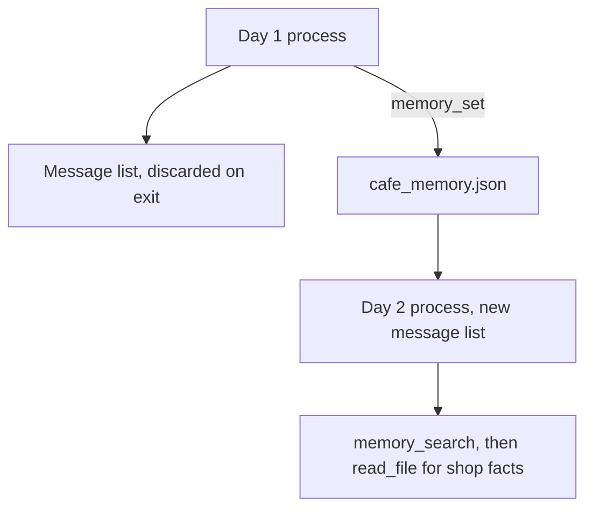
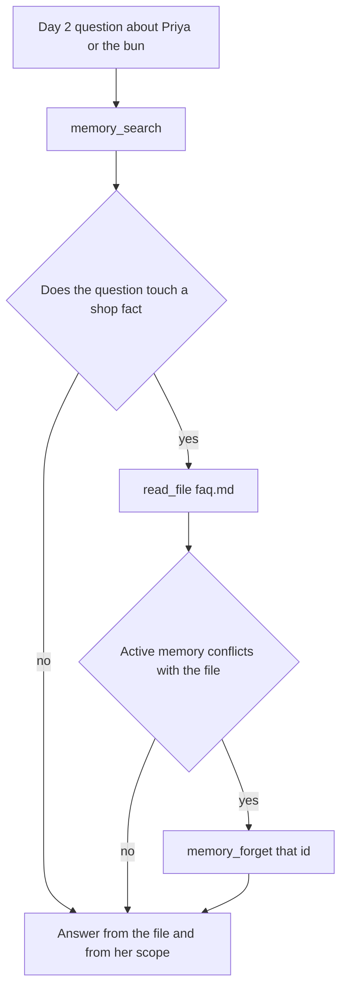

# Chapter 6: Memory

Chapter 5 left the Tuesday decisions in a notes folder so the next question could open them. That folder is not a memory of the guests. Close the process and the message list is gone. The notes remain only because they are files, and nothing in that design says which sentence is still true on Wednesday, or which sentence was one person's allergy copied onto the whole café. The claim of this chapter is that durable memory is a store with a small API — get, set, search, and forget — and that a store which cannot invalidate a record will be quoted later as fact. Memory without invalidation becomes fiction.

The guest who makes the problem concrete is Priya, from an office in North Mill. On day 1 the staff says: she is allergic to almonds, she takes oat milk in a pour-over, and her office order has to stay at or under \$40. On day 2 the process is new. The concierge has to know those constraints, and it has to refuse two stories the store will otherwise tell. The first is a seeded belief, already on disk, that cardamom buns are nut-free. The FAQ says the buns contain wheat, butter, and almonds. The second is the leap from Priya to the shop: because she is allergic, Hearth Lane is now a nut-free café. It is not. The menu still sells the bun. There is also no nut-free preparation area, so the concierge cannot promise Priya a safe bun either. Both directions are failures. One forgets her constraint. The other rewrites the shop.

## 6.1 Session memory vs durable memory

**Session memory** is the message list for this process. It holds the system brief, the staff note, and every tool result the loop has appended. It is how the model sees what happened on this turn. When the process exits, the list is gone. A chat window that still shows yesterday's transcript is a copy someone chose to reload. The model does not retain it on its own. Chapter 1's bare completion had no memory beyond the two messages you sent. The loop in Chapter 2 remembers only by accumulation, and only until the script ends.

**Durable memory** is a store the next process can open. In this lab it is a JSON file, `memory/cafe_memory.json`, written with a replace so a crash in the middle of a write leaves the previous file in place. The morning quiz starts with an empty message list and the same file. If Priya's allergy lived only in yesterday's chat, the concierge offers her a cardamom bun. The file is the difference.

Do not implement durable memory by pasting yesterday's transcript into today's system prompt. That rebuilds context rot from Chapter 5 and calls it remembering. The rain, the refused picnic, and a guess at the Wi-Fi password would sit beside the allergy, and the model would treat them as one pile. Durable memory is small, addressed, and typed. A record has an id, a scope, a kind, a source, a date, and a status. It is not a second context window.



*Figure 6.1. The message list dies with the process. The store is the only bridge, and day 2 still checks the FAQ before it trusts a shop belief.*

The shelf database from Chapter 4 is a poor substitute for this store. The lab rebuilds `shop.db` so the low-stock question stays checkable, and a count on a shelf is a measurement, not a preference. Priya's budget is not a row in `inventory`. The notes folder from Chapter 5 is a poor substitute too. A note has no status. You cannot mark "cardamom buns are nut-free" forgotten and still audit that the café once believed it. You would delete the file, and the next concierge would deny the mistake had been stored. The memory file keeps the row.

What belongs in the store is a fact the shop documents do not already hold. Hours, allergens, and the return window live in `faq.md` and `policy.md`. Copying "closed Monday" into memory creates a second source. When the hours change, one of the copies will be stale, and the model will have no reason to prefer the file. Search memory for the guest. Read the file for the shop. If they conflict on a shop fact, the file wins, and the memory record is a candidate for `memory_forget`.

## 6.2 User preferences and constraints

A **preference** is a choice the guest can survive if you miss it. Priya takes oat milk in a pour-over, not dairy. Forgetting that makes a worse drink. It does not send her to the hospital. Store it as `kind: preference`, `scope: customer:priya`.

A **constraint** is a limit the harness should be able to check, not only a sentence the model might mention. Two constraints arrive in the same staff note.

- She is allergic to almonds. The FAQ says cardamom buns contain almonds, and that there is no nut-free preparation area. A bun in her bag is a failed constraint even if the paragraph was polite.
- Her office order stays at or under \$40. That number happens to match the coffee shipping threshold in the policy. It is not that rule. Her ceiling is about her order. The policy's threshold is about the shop's shipping fee. Do not merge them into one memory that says "free shipping starts at \$40 because of Priya." If you answer a shipping question, read `policy.md`. If you answer her office order, search memory.

Scope is the field that keeps those facts in their lane. `customer:priya` is her constraint. `shop` is a belief about the café, and this chapter is stingy about those. A shop-scoped record that restates the FAQ will drift. A shop-scoped record that generalizes one guest is the failure in the next section. The tool rejects a scope that is neither `shop` nor `customer:` followed by a short name. "Everyone" is not a scope. The error is `bad_scope`, and the hint tells the model to use `customer:priya` for her allergy. That refusal is harness. A sentence in the prompt that says "be careful with scope" does not stop the write.

Kind is a small set: `preference`, `constraint`, `belief`. An allergy stored as a belief is harder to audit, because a belief is the word this chapter uses for a claim that might be wrong. Use `belief` for the seeded mistake about the buns. Use `constraint` for the allergy. The morning quiz can then search for constraints on `customer:priya` without also swallowing every shop opinion.

Each record stores a source and a date. "Staff note, day 1" is a source. "Unattributed note from last month" is the source on the seeded belief, and the date on that row is `2026-08-02`. A record with no source is a rumor the next process cannot challenge. The tool rejects an empty source. It does not, by itself, expire a record on a date. Expiry is a policy you would add when a preference is explicitly temporary ("avoiding dairy this month"). Until you have that policy, the date is there so a person, or a later checker, can see age. The quiz does not treat August's bun belief as fresh. It treats it as a conflict with the file.

`memory_set` appends. It does not overwrite a different sentence that happens to be about the same guest. Silent overwrite hides the conflict: yesterday's "oat milk" replaced by a bad write, with no row left to compare. Two active records can disagree. That disagreement is visible to `memory_search`. The repair is an explicit `memory_forget` on the one that lost, not a set that erases it.

Day 1, done by a cooperative model, leaves the seed belief untouched and adds three records.

| text | scope | kind |
|---|---|---|
| Priya is allergic to almonds. | customer:priya | constraint |
| Priya takes oat milk in a pour-over, not dairy. | customer:priya | preference |
| Priya's office order stays at or under \$40. | customer:priya | constraint |

The seeded row is still active until something forgets it.

| text | scope | kind | status |
|---|---|---|---|
| Cardamom buns are nut-free. | shop | belief | active, until forget |

If the tool log on day 1 is empty, none of Priya's rows were stored. The paragraph may sound attentive. The file will not contain her allergy in the morning. That is the skipped-tool failure, now on a write. Record it, and do not grade the quiz as a test of memory the process never saved.

## 6.3 Stale beliefs and spurious generalizations

A **stale belief** is a record that was stored and is no longer true. The seed is the example you do not have to wait for. "Cardamom buns are nut-free" is active when day 2 starts. It contradicts `faq.md`: the buns contain wheat, butter, and almonds. A concierge that searches memory and stops there will tell Priya the bun is safe. The search worked. The store was fiction. The repair is the file, then forget. Read `faq.md`. On the conflict, call `memory_forget` on `mem_buns_nutfree`. Answer from the file: the bun contains almonds, and there is no nut-free preparation area, so the shop cannot promise her one.

A forgotten row stays in the file with `status: forgotten`. Search skips it. `memory_get` still returns it. The audit question — "did we ever have a note that the buns were nut-free?" — has an answer that is not a second active belief. Deleting the row makes the concierge sincere and unaccountable. The next person cannot see what was invalidated, or why. Keep the row. Change the status. Chapter 11's checker can refuse an answer that quotes a forgotten id as if it were active. This chapter's job is to make that status exist.

A **spurious generalization** takes one guest's constraint and writes it onto the shop, or onto every customer. Priya is allergic to almonds. The café is not therefore nut-free. The menu still sells cardamom buns to guests who want them. A `memory_set` with scope `shop` and a text such as "The café is nut-free" is the write the lab asks you to refuse in `rejects_generalization`. Until that function returns `refused_generalization`, the write succeeds, and day 2 will search it up as policy. The prompt tells the model not to do this. The function is what makes the refusal true when the model does it anyway. That split is the tool contract from Chapter 2: the description influences the call, and the code decides.

The generalization also runs in the other direction, and the FAQ is what stops it. Because the shop sells almond buns, a careless reply tells Priya the kitchen can "just leave the almonds out." The FAQ forbids that promise. There is no nut-free preparation area. Her constraint means the bun is not in *her* order. It does not mean the shop can produce a nut-free version. A sound answer uses both sources: memory for the constraint, `faq.md` for the bun and the prep area. Neither source alone is the whole reply.

Other leaps the quiz is built to tempt:

- Her \$40 ceiling becomes the shop's shipping policy. The policy already has a \$40 line for coffee, and the reason is the policy. Quote the file for shipping. Quote memory for her office order. Do not cite her as the origin of the fee.
- Her oat-milk preference becomes "the café no longer stocks whole milk." MLK-1 is a shelf count from Chapter 4. One guest does not zero it.
- An old belief stays active because forget was never called. The starter's `memory_forget` returns `forget_not_implemented` and does not touch the file. You can watch a careful model *try* to invalidate the bun belief and fail. The search after the quiz still shows the row. That is the fiction surviving a restart. Implementing forget is the edit. Swapping the model is not, until the function writes `status`.

Stale and generalized records fail the morning in the same way. The paragraph sounds like service. The bag is wrong, or the shop rule is wrong. The feedback is a quiz you wrote in advance, not a vibe check on the tone. Chapter 1 asked you to name a wrong answer before you automate. These questions are that list.

1. Priya is picking up a pour-over and a pastry. What must not be in her order, and can we promise a nut-free cardamom bun? A sound answer keeps almonds, and the bun, out of her order, and refuses the promise because of `faq.md`.
2. A new hire asks whether Hearth Lane is a nut-free café now, because Priya is allergic. A sound answer says no. Her scope is `customer:priya`. The shop still sells the bun.
3. What is the ceiling on her office order? A sound answer says \$40, from an active memory record, or says the store does not have it if day 1 never wrote the row. It does not invent a ceiling, and it does not restate the shipping fee as if it were her budget.

A fourth probe, after forget works: forget the budget record, start a new process, and ask the ceiling again. The store must not still be active. If the answer is \$40 and search still returns the row, forget is a no-op and the quiz caught it.



*Figure 6.2. Guest facts come from memory. Shop facts come from the FAQ. A conflict invalidates the memory record instead of averaging the two.*

Each quiz item in the lab is a fresh message list. Session memory from the first answer must not leak into the second, or you will not know whether the store carried the fact or the previous paragraph did. The file is shared. The messages are not. That is the measurement.

## 6.4 Memory APIs: get / set / search / forget

Four tools are enough, plus `read_file` when the question touches a shop fact. The shapes below are what the lab registers. Results are the same JSON as Chapter 4: `ok`, `code`, `retryable`, `message`, `hint`.

**Get** loads one row by id, including a forgotten row.

```json
{ "id": "mem_buns_nutfree" }
```

`not_found` means the id is not in the file. It does not mean the guest has no preferences. Use search for that.

**Set** appends one row. It does not take an id. The harness assigns `mem_` plus a short random suffix, sets `updated` to the date, and sets `status` to `active`.

```json
{
  "text": "Priya is allergic to almonds.",
  "scope": "customer:priya",
  "kind": "constraint",
  "source": "staff note, day 1"
}
```

Refusals you should see in a trace, rather than discover as a polluted file: `empty_text`, `too_long` (the cap is 500 characters, so a transcript cannot hide in one row), `bad_scope`, `bad_kind`, `bad_source`, and `refused_generalization` once you implement the guard. None of these are retryable. The repair is a different argument, not the same call again.

**Search** returns active rows whose text, scope, kind, or id contains the query. Forgotten rows are omitted. An empty query lists active memory, capped at twenty rows. A miss is `ok: true` with an empty list and a hint not to invent a preference. An empty list is not a license to fall back on a stereotype about café regulars.

```json
{ "query": "Priya", "scope": "customer:priya" }
```

**Forget** marks one id forgotten and saves the file. It does not delete the row.

```json
{ "id": "mem_buns_nutfree" }
```

Until you fill the function in, the code is `forget_not_implemented` and the hint names the assignment: set `status` to `forgotten` and save. After you fill it in, search must hide the row and get must still show `status`. The starter's search already skips non-active rows, so you should not have to change search to make forget visible. If you delete the row instead, get returns `not_found` and the audit is gone. The lab's `--check` looks for that difference, on a temporary copy of the store, without a model.

The write path has the same manners as `sql_execute`. Validate, then write. `rejects_generalization` runs after the scope and kind are known to be well formed. The starter returns nothing, which means "allow." Your edit returns `refused_generalization` for a shop-scoped claim that the café is nut-free, or that every customer shares one guest's allergy or budget. A customer-scoped allergy is allowed. The point of the guard is the scope, not a ban on storing the word "almond."

Do not write every utterance. The huddle's rain, from Chapter 5, is not a preference. A tool the model can call on any turn will be called on turns that feel personal and are not durable. The day-1 prompt says what may be stored. The length cap and the scope check limit the damage when the model stores more than that. Read the file after the run. A record you did not expect is a harness bug if the tool accepted it, and a model miss if the tool's hint already told it not to. Those are different edits.

Session memory stays out of this API. There is no `memory_set` for "the previous assistant sentence." If you want the model to see a tool result, the loop has already appended it. Saving it into the JSON file would pin a paragraph that Chapter 5 worked to keep out of the next prompt.

Restart is the test. Day 1 exits. Day 2 is a new process: new messages, same path on disk. Print the path in the header so you know which file you are grading. `--reset` copies the seed back, which drops Priya's rows and restores the nut-free belief. Use it when you want a clean morning, and say so in your notes. A quiz graded against a store you reset halfway through is a different experiment.

Place the four outcomes next to each other before you change a prompt.

- **Empty tool log on day 1.** Nothing was stored. The morning cannot remember. Model factor, or a tool description the model is not using. The file is the evidence.
- **Rows stored, quiz skips search.** The answer may be right by luck. It is not grounded in the store. Ask for the search line in the trace.
- **Search returns the nut-free belief, and the answer agrees with it.** The FAQ was not used, or was used and discarded. Feedback factor if the file was read, harness factor if `read_file` was not on the tool list. In this lab it is on the list.
- **Forget was called and the code is `forget_not_implemented`.** The model did the right proposal. The actuator is still the stub. That is the edit this chapter asks for. A new model will propose the same call to the same stub.

## Builder takeaway

Memory without invalidation becomes fiction. Session memory is the message list, and it dies with the process. Durable memory is a small store of scoped facts the documents do not already hold, with get, set, and search, and with forget that marks a row instead of pretending it was never written. A guest's allergy is not a shop policy. A stale belief that contradicts `faq.md` is a row to invalidate, not a source to average with the file. When the morning is wrong, open the JSON before you open the prompt.

## Lab

Reset the store to the seeded belief, remember Priya's constraints, then run the quiz in a new process. Implement forget, and refuse a shop-wide generalization. Write down what the file contained after each process, and whether a forgotten row stayed out of search and stayed visible to get.

The questions, the commands, and the two stubs are in the [Chapter 6 lab](../../labs/ch06-memory/README.md).

The concierge can see a shelf, choose what enters the prompt, and carry a guest's constraint across a restart. It still has no saved procedure for *how* the shop restocks, separate from the facts of one Tuesday. That is the next chapter's subject, and it is a different object from the memory file you just wrote.
