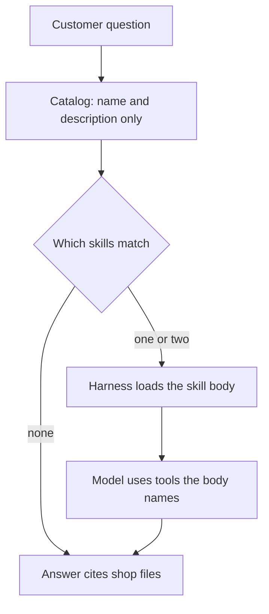

# Chapter 7: Skills as Portable Procedures

**Part:** Part II — Harness

A tool lets the concierge read a file. A system prompt tells it to play the counter at Hearth Lane Café. Neither of those is a procedure for a kind of task. The claim of this chapter is that a **skill** is procedural knowledge written as a file the harness can find, load, and version. The model follows the file once the file is in the message list. The file does not run itself, and a sentence buried in an old chat transcript is not a skill. Portable skills beat prompt archaeology: the procedure lives where a diff can show what changed.

The running example is two procedures the café actually needs. One recommends a menu item when the customer states an allergy or a budget. The other says how a shop fact must be cited. You will change the concierge by editing those markdown files. You will not retune the model, and you will not hide the new rule inside a longer system prompt.

## 7.1 Skills = procedural knowledge as files

Chapter 2 put the citation rule in the system prompt: read a file before you state a fee, and carry the path into the answer. That was the right place when the program had one tool and two documents. A concierge that also recommends food, drafts a restock, and answers a shipping question collects more procedures than one brief can hold without becoming a second policy nobody can find. A skill is how you take one of those procedures out of the brief and put it in a file.

A skill, in this book, is a UTF-8 markdown file with two parts. The top is a short header the harness can read without loading the rest. The body is the procedure: when to use it, the steps, what to refuse, and what the answer must contain. The header is for discovery, which is the next section. The body is what a cooperative model is supposed to follow after the harness has copied that body into the messages.

Here is the shape, not a finished café procedure. The lab file starts even emptier, with the steps left for you to write.

```markdown
---
name: cite-sources
description: How to attach a shop document path to a fee, hour, or rule.
---

# Cite sources

## When to use

The customer asked for a shop fact, or you are about to state one.

## Steps

1. Read the shop file that holds the fact.
2. Copy the path from the tool result into the answer.
3. If the files are silent, say so.

## Refuse

Do not invent a path. Do not offer a refund, a shipment, or an email.
```

The header between the `---` lines is a small block of labeled fields. `name` is the identifier the harness uses. `description` is the one sentence a catalog can show before anyone loads the body. The headings underneath are ordinary markdown. They are instructions to the model, in the same sense that Chapter 2's system prompt was a brief. They are not code. Nothing in the file opens `policy.md`. Opening the file is still the `read_file` tool, and the harness is still the program that runs the tool.

That split is the whole point of calling this procedural knowledge. The knowledge is the order of work: which document to open for a return, what to do when the customer has a nut allergy, when to stop and say the documents do not say. The model is good at following a clearly written order of work once the text is in front of it. The model is a poor place to store the order of work, because the next session does not inherit yesterday's prompt unless you put it there again. A file survives the session.

Hearth Lane already has the facts. Opened coffee is final sale. Unopened bags may come back within 14 days as Hearth card credit, with a receipt, and the café does not give cash. Cardamom buns contain wheat, butter, and almonds, and there is no nut-free preparation area. The bun is $4.75. Those sentences live in `policy.md` and `faq.md`, the same documents Chapter 2 reads. A recommendation skill does not restate them as a new source of truth. It tells the concierge to read the FAQ before it names a pastry, to refuse a nut-free promise, and to respect a budget the customer actually stated. If the skill and the FAQ disagree, the FAQ wins, and the skill is the file you correct. Chapter 6's warning applies here in miniature: a procedure that remembers a price the menu no longer charges has become fiction. The skill should point at the document. It should not become a second menu.

You can walk a single question through the file without pretending the model did anything clever. A customer says: "What can you recommend for someone who cannot eat nuts, under six dollars?" A loaded recommendation skill tells the harness's model to read the FAQ, to reject the cardamom bun because of the almonds, and to consider the house espresso at $3.50 or the pour-over at $4.25, both under the budget, noting that oat milk is an add-on and that "oat milk is available" is not an allergen clearance. The skill does not itself know the prices. The read does. If the trace never shows `faq.md`, the recommendation is the Chapter 1 failure again: a fluent concierge with the shop's folder closed. The skill made the miss easier to see, because you can point at the step the run skipped.

Write a skill the way you would write a short duty sheet for a new hire on their second Saturday, not the way you would write a persona. Name the inputs the customer might give (allergy, budget, opened versus unopened). Name the files to read. Name the sentence that must appear when the documents are silent. Name the actions the concierge must not offer. Leave the voice alone. "You are warm and brief" belongs in the system prompt, once. It does not belong in every procedure.

A skill file the model never receives is a document on disk, which is useful for you and invisible to the completion. The harness has to place the body into the message list, or into a tool result the model asked for, before the procedure can affect the answer. Print the name of every skill you loaded, the way Chapter 2 prints each tool result. A later complaint is then answerable: the procedure was in the prompt, or it was not.

## 7.2 Skill discovery and progressive disclosure

If you paste every procedure into the system prompt, you are back to one brief, only longer. Chapter 5's name for the failure is context rot: as the window fills with text the question did not need, the model follows the relevant lines less reliably. Two skills that both say "be careful" in different ways will also contradict each other in ways you will not notice until a customer does. The repair is progressive disclosure. The harness shows a little first, and loads the body only when the task calls for it.

Three layers are enough for this café.

- **Catalog.** A name and a one-line description for every skill, small enough to sit in the system prompt on every turn. The model, or a short matcher you wrote, uses the catalog to choose. The body stays on disk.
- **Body.** The markdown procedure, loaded for the one or two skills this question needs. The body enters the messages as harness text, labeled with the skill name, so it is clearly an instruction you supplied.
- **References.** Extra notes the body points at, loaded only if a step says to read them. A recommendation skill might point at `faq.md` through the existing `read_file` tool rather than embedding the menu. The menu remains a document. The skill remains a procedure.

Discovery is a harness job. You can implement it in more than one way, and the lab lets you choose, as long as the choice is visible in the trace. A simple matcher looks for words in the question ("recommend", "allergic", "budget") and loads `recommend.md`. A model-driven matcher shows the catalog and lets the model request a skill by name through a tool such as `load_skill`. Both are harness designs. What is not a design is hoping the model remembers a procedure that was never offered.



*Figure 7.1. Progressive disclosure. The catalog is small and always present. The body is loaded for the skills this question needs.*

The café questions fall on different rows of that figure, and that is how you know the catalog is doing its work.

A return question needs the citation skill and the policy. It does not need the recommendation procedure. Loading both teaches the model a pastry workflow in the middle of a refund rule, which is how two procedures start to interfere. A recommendation question needs the recommendation skill and, because the answer will state prices, the citation skill as well. A question about Monday's hours needs the citation skill only. A question that matches nothing should still answer from the system prompt and the tools, or say that the documents do not say. An empty match is a result. It is not a reason to load the whole directory.

Descriptions earn their keep at this layer. "Helps with café stuff" matches every question and therefore matches none of them in any useful way. "Choose a menu item when the customer gives an allergy or a budget; read the FAQ; do not promise a nut-free order" matches a recognizable kind of task. Write the description for the matcher you actually use. If the matcher is a human reading the catalog during the lab, the sentence still has to be specific, because the lab's second half is to change the sentence and watch the load change.

Cap how many bodies you load. Two is a reasonable budget for these exercises. A question that seems to need five procedures is often one question that should be split, or a catalog whose descriptions are too broad. Record the names you loaded next to the answer. The Chapter 1 habit still applies: write down which factor you changed. If you rewrote the description and the body in one edit, you will not know which line changed the behavior.

There is a failure mode that looks like a successful load. The trace says `SKILL: recommend.md`, and the answer still suggests the cardamom bun to someone who cannot eat nuts. The procedure was present. The model did not follow it, or the procedure never mentioned almonds and you only thought it did. Open the file you loaded and read the step. If the step is missing, the harness file is wrong. If the step is present and the sentence ignores it, you have a feedback item: something other than a fluent paragraph has to notice the miss. Chapter 11 will separate a checker from the drafter. In this chapter you notice it yourself, with the skill text and the answer side by side.

Keep the catalog honest when you add a file. A skill that exists on disk and is absent from the catalog will not be discovered. A catalog line whose file you deleted will send the loader looking for a missing path. Return that as an `ERROR:` observation, in the style of Chapter 2, rather than as a crash. The model can then answer without that procedure, and you can see the gap in the trace.

## 7.3 Versioning skills like code

Prompt archaeology is what happens when the procedure lives in a chat window, a slide, or a colleague's memory of "what we told the model last Thursday." The next person pastes a different brief. The model sounds the same. The return window quietly becomes thirty days, which is a number Hearth Lane does not use. A skill directory under version control is the opposite arrangement. The procedure is a file. The history of the file is the history of the procedure. You can diff it, review it, and put it back.

Treat the skill the way Chapter 2 treats the tool contract: as something you can pin to a run. A practical pin has three fields you can write down without a new system.

- **Path.** `skills/recommend.md` or `skills/cite-sources.md`. The lab uses those two names.
- **Version.** A line in the header, such as `version: 3`, that you increment when the steps change. Git history is the fuller record. The line is what a trace can print without asking you to remember a commit.
- **Shop documents it depends on.** The recommendation skill depends on the FAQ's allergens and prices. If someone edits the bun's price in `faq.md` and the skill still says "under six dollars means the bun," the skill's version should change too, or the skill should stop embedding the price and keep pointing at the file. Pointing is the sturdier habit.

A run should print the skill names and versions it loaded, next to `MODEL`. Chapter 3 taught you to hold the harness still while you swap weights. A skill edit is a harness edit. If you change `recommend.md` and the model name in one afternoon, the new allergy behavior cannot be attributed. Change the markdown, run the same question, and keep the previous answer. The model stays put. That is the comparison this chapter asks for.

Review a skill change the way you would review a small patch to the shop's duty sheet. Read the diff. Ask whether a step still matches `policy.md` and `faq.md`. Ask whether the description still matches the body, because discovery uses the description and the model follows the body. Ask whether the refusal is still there. A patch that adds a friendlier tone and quietly deletes "do not promise a nut-free order" is a behavior change, even if the prose got warmer. The warmth is easy to like. The deleted refusal is the part a customer with an allergy will meet.

Some edits are breaking, and you want the breakage to be loud. If `cite-sources.md` changes the citation from `(docs/policy.md)` to a different shape, older notes you took in Chapter 2 will no longer match. That is a reason to version the skill and to say so in the write-up, not a reason to keep the rule only in your head so that nothing appears to break. A procedure you cannot bear to diff is a procedure you cannot safely change.

Who is allowed to edit the file matters as much as where it lives. In this chapter, you edit it. The model may suggest a wording. It does not write the file unless you have given it a tool that writes the file, and this lab does not. Chapter 25 returns to the idea of an agent proposing a skill patch, and it insists on an eval gate and a human merge. The preview is short because the caution is the whole later chapter: a model that rewrites its own procedures, with no check against the shop's documents, will launder a mistake into the harness. The file will then look authoritative. Authority was the reason you moved the procedure out of the chat window. Keep the merge in human hands until a later chapter builds the gate.

Store skills next to the lab that uses them, in `labs/ch07-skills-as-portable-procedures/skills/`. Do not store them inside the system prompt string in Python. A string in Python can be versioned too, and Chapter 2's prompt is versioned that way, because it is one brief. A growing library inside a string is how prompt archaeology sneaks back into the repository: the diff is a wall of quoted text, and reviewers stop reading it. Markdown files diff as steps and headings. That is the format you want a teammate to review on a Friday.

When a shop rule changes, change the document that is the source of truth first, then the skill if the skill duplicated the rule. Opened coffee is final sale because `policy.md` says so. A skill that repeats "final sale" is a convenience and a risk. After a policy edit, search the skill directory for the old sentence. The search is ordinary and dull, and it is the maintenance this design buys you. A rule that existed only inside a prompt you typed in a playground cannot be searched.

## 7.4 Skills vs tools vs system prompt

The three objects fail differently, and the repair goes to a different place. Mixing them up is how a team grows a prompt until nobody knows which paragraph is load-bearing.

The **system prompt** is the brief that is present on every turn. It names the role, the action boundary, and the catalog of skills. For this café it still says that the speaker is the counter concierge, that refunds and shipments are sentences the process cannot perform, and that shop facts come from tools. It stays short because it is always paid for, in context and in the chance that a later paragraph contradicts an earlier one. Chapter 1's persona fits here. A twelve-step recommendation workflow does not.

A **tool** is a function the harness runs. It has the contract from Chapter 2: a name, arguments, a success result, and an error result the loop can carry back. `read_file` is a tool. A later SQL query is a tool. A tool changes what the model can perceive, or, when you add actuators in later chapters, what the program can change in the world. The description of the tool tells the model when a call is appropriate. The description is not a substitute for a multi-step procedure that involves several calls and a refusal.

A **skill** is text. It does not open a file, query a table, or place an order. It tells the model how to use the tools you already registered, and how to shape the answer. It is loaded when the catalog says it is relevant, so it is absent from turns that do not need it. It is versioned as a file, so a behavior change is a diff.

| | System prompt | Skill | Tool |
|---|---|---|---|
| What it is | Role, boundaries, catalog | A procedure in a file | A function the harness runs |
| When it is present | Every turn | When the harness loads it | Registered; runs only if called |
| Executes an action | No | No | Yes |
| Typical failure | Too long, self-contradictory | Wrong skill loaded, or a stale step | A contract the model cannot use, or an error that never returns |

*Figure 7.2. Three harness objects. A skill is not a weaker tool, and a tool is not a procedure you forgot to write down.*

You can place a new café requirement by asking three questions.

1. Must every turn see this sentence? If it is the role or a hard refusal ("do not invent a Wi-Fi password"), keep it in the system prompt.
2. Does the program have to do something in the world, or fetch a fact the model cannot see? That is a tool. Citing a path is not a tool. Reading the file so there is a path to cite is a tool.
3. Is this a sequence you want only for one kind of task, and that you want to edit without redeploying a prompt essay? That is a skill.

The recommendation task is a skill plus a tool. The tool reads `faq.md`. The skill says to apply the allergy and the budget after the read, and to cite the path. Putting the allergy workflow into the tool description overloads the contract: the tool's job is to return the file, including the header `PATH: docs/faq.md`. Putting the workflow into the system prompt works for a demo and fails the disclosure test in section 7.2 as soon as you add a second workflow.

A skill that says "issue the refund" has repeated the action-boundary miss from Chapter 1. The voice promised work. The process has no refund function. The skill's refusal section exists so the procedure and the tool list tell the same story. If you later add a refund tool, Chapter 16's autonomy rules apply: some actions are automatic, some wait for a person, some are never offered. A skill does not get to promote an action into existence by describing it vividly.

The factors from Chapter 1 still sort the misses, now that a skill load is visible.

- The catalog never offered `recommend.md`, so the model guessed a pastry. That is the harness. Fix the catalog or the loader.
- The skill loaded, and this model ignored the almond step. Try the same file with a model that follows instructions more reliably, and keep the file still. That is the model factor, measured the way Chapter 3 measured a tool skip: one harness, two transcripts.
- The skill loaded, the FAQ was read, and the answer still calls the bun nut-free, or states $4.75 with no path. The procedure and the document were available. The miss is feedback. Write the quoted sentence next to the step it broke. Do not "fix" it by adding a third copy of the price to the system prompt.

A trace you can score has the same bones as Chapter 2, plus the skill lines.

- Which skill files were loaded, with version if you keep one.
- Which tools ran, and whether each result began with `PATH:` or `ERROR:`.
- Whether each shop fact in the answer appears in the file the citation names.
- Whether a refusal in the skill was honored. The nut-free promise and the offer to ship a pastry are the probes.

The soft check in the early labs looked for the letters `docs/` and could be satisfied by a path the tool never opened. A skill does not repair that. It gives you the procedure you meant the model to follow, so your review has a text to compare. You still open `faq.md` before you accept the sentence about almonds.

Skills compose with the rest of the harness without replacing it. Memory from Chapter 6 might recall that this customer avoids nuts. The skill still says to read the current FAQ, because a memory can be stale and a bun recipe can change. A web page in Chapter 8 might show a different price. The citation skill says to name the source you actually read, not to blend the numbers into one confident total. A protocol boundary in Chapter 9 might move `read_file` into another process. The skill text does not care which process returned the bytes, as long as the observation still carries a path. That indifference is a virtue. The procedure stays portable when the transport changes.

## Lab

Add two skill files, `skills/recommend.md` and `skills/cite-sources.md`. Wire a small loader so the concierge can see the catalog and can place a skill body into the prompt when the question needs it. Then change the concierge's behavior by editing the markdown only. Leave the model settings alone between the two runs, and keep both transcripts. The write-up should show the skill names that were loaded, the shop facts you checked against `policy.md` or `faq.md`, and the diff in the markdown that explains the change in the answer.

The starter files, the questions, and what to turn in are in the [Chapter 7 lab](../../labs/ch07-skills-as-portable-procedures/README.md).

## Builder takeaway

Portable skills beat prompt archaeology. A procedure you can name, load on purpose, and diff in review will still be there on Monday. A clever paragraph you typed into a chat window will not. Keep the system prompt short, keep tools as the functions that touch the world, and keep the how-to in a file whose version the trace can print. When the answer is wrong, the skill text tells you whether the harness forgot to load the procedure, the procedure itself is stale, or the model declined to follow a file it was shown.
