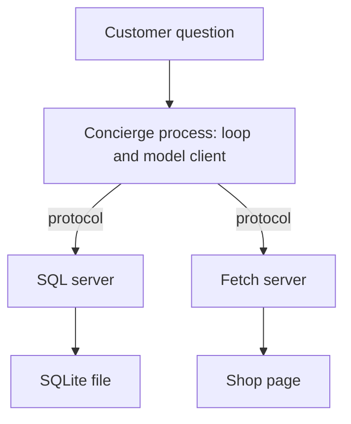

# Chapter 9: Protocols and the Open Agent Stack

**Part:** Part II — Harness

Chapter 3 kept one client in front of several model servers by speaking a chat request those servers already shared. The tools, though, still lived in the same Python process as the loop. The claim of this chapter is that a protocol does for tools and for neighboring agents what that shared chat request did for weights: it fixes the messages, so the harness can outlive any one model vendor and any one copy of a function. The concierge should call SQL and fetch through that boundary, not by importing the database and the HTTP library itself.

The running example is the price comparison from Chapter 8, split across processes. One server owns the shop database. Another owns `fetch_page`. The concierge process owns the loop and the model client. It does not open SQLite, and it does not call the network except to speak the protocol. A second program, later, can be a restock worker or a support agent and can use the same servers without copying the café's prompts.

## 9.1 Why protocols beat one-off integrations

An integration is one-off when the concierge reaches into a library by name. It imports the database driver, it knows that the price lives in `products.price_cents`, and it calls `httpx` with a URL it built. That program works. It also means every new agent that needs a price must learn the same tables, and a change of database is a change of the agent. A swap of model vendors is supposed to be an edit to `.env`. A swap of tools should not require a fork of the prompt.

A **protocol** is a set of messages two processes agree to exchange, independent of the language either one is written in. The agreement names the methods, the fields, and what a success and a failure look like. Either side can be replaced by something that speaks the same messages. You already depend on one such agreement. The chat request is a protocol between the harness and the model server. `MODEL` can change. The loop stays. This chapter adds a second agreement, between the harness and the tools, so the tools can leave the loop's process too.

The reasons to pay for that boundary are practical, and they show up on the café even at lab scale.

- **More than one client.** The concierge answers a customer. A restock job in Chapter 10 needs the same inventory. A support agent in Chapter 19 will need the same policy facts. One server, several clients, is cheaper than three copies of the query with three slightly different column names.
- **A place to put permission.** Chapter 2 jailed `read_file` to a directory inside the process. A separate server can be jailed again, by the operating system, to a database file and nothing else. The model process does not have the database credentials if it only speaks the protocol. Chapter 21 will care about this when untrusted page text is in the loop. The split is worth making before that chapter.
- **Tests without a model.** A contract test can send a tool call and read the rows. It does not need a model, and it does not flake because a paragraph was worded differently. Chapter 12 will build evals for answers. This chapter builds tests for the messages those answers depend on.
- **A vendor change that stays local.** If the chat protocol and the tool protocol are different boundaries, you can change `MODEL` without rewriting SQL, and you can change SQL without shopping for a new model. Chapter 3's rule was: do not move two factors in one edit. Protocols are how you keep the factors in different files.

The costs are real, and a one-file lab should not pretend otherwise. You now have a schema to version, a process to start, and a failure mode where the server is simply down. A connection error to a tool server is configuration, like a connection error to the model API. It is not a dumb model. For a single script and a single tool, in-process functions remain reasonable. The moment a second client appears, or the tool can touch something you do not want the model process to touch, the protocol earns the extra process.



*Figure 9.1. The concierge speaks a protocol. The servers own the database and the fetch. The model vendor sits behind the concierge and does not own either tool.*

An integration you will regret looks like a tool whose body is "run whatever the model typed." The protocol does not make that safe. It only moves the unsafe function into another process, where it is still unsafe. The servers in this chapter expose a small set of named operations. The SQL server accepts a read that you have bounded. The fetch server accepts a URL on the allowlist from Chapter 8. A new operation is a schema change, which section 9.4 will ask you to test, not a string the model invents at runtime.

## 9.2 MCP: tools, resources, prompts

The protocol these labs use for that boundary is **MCP**, the Model Context Protocol. It is an open protocol, first published by Anthropic, for connecting a host application to servers that provide context. The host in this book is the harness: the concierge process that also holds the model client. An MCP server is a process that advertises what it can do and answers requests. Messages are JSON-RPC, a small standard in which each call has a method name, parameters, and an id, and each response carries the same id plus a result or an error. A server on your machine often speaks the protocol on standard input and standard output, which means the host starts the process and writes messages to it. A remote server can speak over HTTP instead. The lab uses the local form so you can read the bytes.

MCP is not a model, and it is not a brand of agent. It does not, by itself, decide autonomy, and it does not make a fetched page trustworthy. It is a way to list and call capabilities without baking one vendor's function-calling dialect into the tool process. The model still sees tools because the host translates a server's list into the tool list on the chat request. If you change vendors, you change that translation in the host. The SQL server stays.

Three primitives cover what the café needs to expose. The protocol defines more than these, including ways for a server to ask the host to sample a model. You can ship a useful concierge without those extras. Learn the three, and implement the ones the lab names.

**Tools** are functions the model may call. Each tool has a name, a description, and a JSON Schema for its arguments. JSON Schema is a format for saying which fields are required and what types they have. You already wrote one, inline, for `read_file`. An MCP server lists its tools when the host sends `tools/list`. When the model emits a tool call, the host sends `tools/call` with the name and the arguments, and it appends the server's result to the message list as the observation. `sql_query` and `fetch_page` are tools. The model chooses them the way it chose `read_file`: from the description, under the step budget, with errors returned as text.

A list response is a document you can read. The shape below is the idea of `tools/list`, trimmed to one tool. A real server also answers an initialize handshake before this call. The lab scaffold includes that handshake so you can see the order. Your work is the tool list and the call.

```json
{
  "jsonrpc": "2.0",
  "id": 1,
  "result": {
    "tools": [
      {
        "name": "sql_query",
        "description": "Run a read-only SELECT against the shop database.",
        "inputSchema": {
          "type": "object",
          "properties": {
            "sql": { "type": "string" }
          },
          "required": ["sql"]
        }
      }
    ]
  }
}
```

**Resources** are data the host can read by URI, a string that names a thing the way a URL does. A product row might be `shop://products/cardamom-bun`. The host lists resources and reads one, then places the text into context. The model does not have to invent a SELECT to see a row the host already decided to attach. The difference from a tool is who is in charge. A tool runs because the model asked. A resource is application-controlled: the harness chooses to include it, which is the same judgment as choosing to load a skill body in Chapter 7. Use a resource for a stable snapshot you want the model to see up front, such as today's bun price. Use a tool when the model must choose among many rows or run a query you cannot predict.

**Prompts** are templates the server offers for a person, or for the harness, to select. A prompt named `cite-sources` can carry the citation procedure from Chapter 7, served over the protocol instead of read from a path the model guesses. Prompts are user-controlled in the protocol's own terms: listing them does not silently inject them into every turn. That matches progressive disclosure. The catalog can mention the prompt. The body is fetched when a question needs the procedure. The lab may expose the citation text as a prompt. It must expose SQL and fetch as tools. Do not collapse the three primitives into one bag of strings. The concierge's trace should say which primitive returned the bytes.

A call the host sends looks like any other JSON-RPC request. The host, not the model, writes this message. The model only sees the tool list you translated and the text you append afterwards.

```json
{
  "jsonrpc": "2.0",
  "id": 2,
  "method": "tools/call",
  "params": {
    "name": "fetch_page",
    "arguments": { "url": "http://127.0.0.1:8765/shop.html" }
  }
}
```

The server's result should carry the same headers Chapter 8 asked for: the URL, the status, and a clear label that the page text is untrusted. The SQL server's result should carry rows, or an `ERROR:` if the statement is not a read, if it tries to write, or if it reaches outside the shop file. Keep those refusals inside the server. A host that "just this once" opens the database itself has broken the chapter's rule. The concierge uses MCP only.

Walk one customer question across that boundary so the ownership stays visible. The customer asks whether the public bun price matches the register.

1. The host starts both servers and sends `initialize`. Each result includes a revision string. The host prints them next to `MODEL`, because a protocol change is a harness change and Chapter 3 asked you to notice those.
2. The host sends `tools/list` to each server and builds one tool list for the chat request. The model never sees JSON-RPC. It sees `sql_query` and `fetch_page`, with the descriptions the servers returned. If a description is empty, the model is guessing, and the fix is the server, not a longer persona.
3. A cooperative model calls `fetch_page` with the shop URL, then `sql_query` with a read for the bun. The host translates each call into `tools/call` and appends the text result. The page text stays labeled untrusted. The row comes back as cents.
4. The model writes the comparison. The host does not add a price the servers did not return. If a server was down, the observation is an error, and the answer should say the register or the page could not be read.

A model that answers with $4.75 and an empty tool log has not used MCP. The number may match the FAQ because the FAQ is famous inside this book, or because you leaked it into the system prompt. Either way the servers were idle. Record the idle trace the way you recorded a skipped `read_file`. The repair is a model that emits tool calls, or a catalog of descriptions the model can act on. Opening SQLite inside the concierge to "help it along" removes the evidence this chapter is trying to collect.

Resources and prompts sit in the same walk when you choose to use them. Before step 3 the host might read `shop://products/cardamom-bun` and place the row in the system context, and it might load the `cite-sources` prompt so the answer has a procedure for naming the URL and the table. Those are host decisions, made before the model speaks. If you load them, print their URIs or names. A hidden preload is how a demo looks grounded while the tool log stays empty. Prefer showing the read.

The concierge process, after this split, is allowed to import the model client and a small MCP host. It is not allowed to import the database driver or the HTTP library. A code review can enforce that with a search. If `sqlite3` or `httpx` appears in the concierge file, the protocol is decorative. The lab's write-up should say where those imports live, and the answer should be "only in the servers."

Startup order is part of the contract. The host starts the server, sends `initialize`, and only then asks for tools. If `initialize` fails, there is no tool list to offer the model, and the run stops with a harness error rather than a concierge who invents a price. Log the server's protocol version. Section 9.4 says what to do when it moves.

MCP replaced a pile of one-off plugins with one message shape. It did not replace judgment. A tool with a vague description will be called at the wrong time, in-process or not. A fetch server that accepts every URL is the Chapter 8 allowlist failure, moved one process to the right. Put the allowlist in the server, where a second client cannot forget it.

## 9.3 A2A and multi-agent messaging (survey)

MCP connects an agent to tools and data. It is the wrong shape for "ask the restock agent to draft a purchase order and send me the draft." That second job is agent-to-agent messaging. **A2A**, the Agent2Agent protocol introduced by Google, is one open design for it. This section is a survey. The lab does not implement A2A. Chapter 23 is where multi-agent roles get a full treatment. You need enough of the vocabulary now to see why a second protocol exists, and why a swarm of unconstrained model calls is not that protocol.

A2A treats another agent as a remote service with a published description. An **agent card** is a JSON document that advertises who the agent is, where it listens, what it can do, and how a caller authenticates. The concierge can read a card for a restock agent the way a person reads a menu: it learns that this agent drafts coffee orders and does not learn the supplier password. Discovery is the card. It is not a prompt that says "you have a friend who knows suppliers."

Work arrives as a **task**. A task has an id and a lifecycle. It is submitted, it is worked on, it may pause because a person has to confirm a total, and it ends completed, canceled, or failed. Those states are the protocol's business, recorded by the runtime that holds the task, not implied by the last sentence in a transcript. Chapter 10 will store a similar lifecycle in a checkpoint for a single agent. A2A is that idea between two agents.

The caller and the remote agent exchange **messages** on the task. The result comes back as an **artifact**: a draft purchase order, a cited price table, a refusal. The concierge receives the artifact. It does not receive the remote agent's tool traces unless the card and the task agree to share them. That is the point of the split. The restock agent can use an MCP SQL server and an MCP fetch server of its own. The customer-facing concierge quotes the artifact and does not hold supplier credentials in its prompt.

Picture one café afternoon, still as a design and not as code you must write here. The counter is low on house coffee. The concierge creates a task whose text is "draft a restock for house coffee; do not place an order." The restock agent's card says it can draft and that placement is out of scope. The agent reads inventory through MCP, fetches the public page through MCP, and returns an artifact: twelve bags, the register's price, the page's price, and a note that a person must confirm. If the page contained a sentence telling the agent to email a secret, that sentence is the restock agent's problem to refuse, inside its own tool boundaries. The concierge never saw `.env`. Chapter 16's confirm step sits on the task state `waiting for a person`, not on a cheerful "I went ahead and ordered."

The survey has a warning built in, and Chapter 23 will repeat it with more force. Unconstrained multi-agent setups disappoint because each model adds a place to drift, and nobody owns the schema of the handoff. A2A's contribution, for a builder, is the constraint: a card, a task, an artifact, a lifecycle you can log. You do not need a second protocol to have two functions in one process. You need it when a second agent, with a different permission, must do work the first agent should not be able to do itself.

Skills in an agent card are not the same object as Chapter 7's markdown skills, though the word is shared in the industry. A card's skill is an advertised capability ("I draft restocks"). A file in `skills/` is a procedure the harness loads. When you read a card, translate it into the question this book already uses: what can this agent perceive, what can it change, and what artifact will you demand before you trust it. If the card cannot answer, do not send it a task.

## 9.4 Contract tests on schemas and versions

A protocol that only lives in a blog post will drift the first time someone renames a column. A **contract test** is a check, run without a model, that the messages still have the shape you documented. It is the feedback factor from Chapter 1, applied to bytes instead of to a paragraph.

The tests that belong on the café servers are dull, and that is why they work.

- **List shape.** `tools/list` returns `sql_query` and, on the fetch server, `fetch_page`. Each has a name, a description, and an `inputSchema`. Required fields are still required. If someone removes `sql` from the schema, the test fails before a model improvises an argument.
- **Happy path.** A known read, fixed in the test, returns the cardamom bun at 475 cents. The test looks at the row, not at a sentence. The FAQ says $4.75. The database seed should match the FAQ. If you change one, change the other, and expect the test to notice.
- **Refusals.** A statement that is not a read, a URL off the allowlist, and a missing product return an error result. They do not return an empty success that the model will cheerfully treat as "free."
- **Version.** The initialize result names a protocol revision and a server revision you control, such as `shop-sql/1`. The host refuses a major revision it does not understand. An unknown revision is a stop, not a prompt to "do your best."

Versions deserve a rule you can apply without a committee. An additive change, such as a new optional field on a row, can stay on the same major number if old clients may ignore it. A breaking change, such as renaming `price_cents` to `price` or changing cents to a float, is a new major number. The contract test pins the major number. Chapter 3 told you to repair a stale model id in `.env` rather than fork the loop. Repair a stale tool schema in the server and the test, rather than teaching the prompt the new column name in prose and hoping every client hears it.

The host has a contract too. It must pass `tools/call` arguments through as structured fields. It must not ask the model to build the JSON-RPC message in its head and then eval that text. It must surface a server error as an observation that begins with `ERROR:`, so the loop from Chapter 2 can recover or admit ignorance. A host that hides a downed server behind a synthetic price has failed the contract even if the JSON schema still parses.

Write the tests against the server, imported or started as a subprocess, with no call to `chat.completions`. The early harness tests in `labs/common/test_harness.py` are the model for this habit: they check the jail and the stops, and they do not call the OpenAI API. A contract test that needs a model will be skipped on the day you most need it, because the model is slow or the key is absent. Keep the suite boring.

When a test fails, resist the repair that moves the assertion to match the bug. If the bun comes back as 500 cents, the seed or the page drifted. Fix the source of truth. If the tool disappeared from `tools/list`, the server regressed. The concierge's prompt cannot list a tool the server no longer offers, except as a lie the model may still try to call.

A failed café run still sorts into the factors you already have, once the servers are separate processes.

- **The server never came up,** or `initialize` returned a revision the host refuses. Configuration. Start the process, or update the host and the test together. Do not paper over it with a price in the prompt.
- **`tools/list` succeeds and the model never calls a tool.** Model factor, same as an empty Chapter 2 trace. The protocol is fine.
- **`tools/call` returns `ERROR:` for a legal read.** The server or the seed is wrong. Read the error before you edit the prompt. A missing table is not a weak model.
- **Both calls succeed and the paragraph blends the cents into a third number.** Feedback. The contract held. The sentence did not. Keep the tool results in the write-up beside the paragraph.
- **The concierge imported the database "temporarily."** The harness moved. You no longer have a protocol boundary to maintain, and the next client will copy the import.

Hold one side still when you debug. A new `MODEL` and a new SQL schema on the same afternoon will produce a different price and no owner. Change the server, re-run the contract test, then run the concierge. Or change only `.env`, and require the contract test to stay green so you know the rows did not move under you.

Contract tests do not prove the paragraph is good. A server can return 475 cents and the model can still say five dollars. That remaining gap is why Chapter 11 separates a checker, and why Chapter 12 turns misses into cases. The protocol's job is narrower: when the model asks a legal question of the shop, the bytes that come back are the bytes you tested. Grounding starts there. Without it, a citation skill is citing a channel you no longer control.

Record, in the lab write-up, the server revision the initialize call returned and the test command you ran. A demo that shows only the concierge's paragraph has hidden the boundary this chapter exists to build.

## Lab

Expose the shop SQL read and the page fetch as MCP servers. The concierge must obtain prices and page text through those servers only. It must not import the database driver or the HTTP client. Add contract tests that lock the tool schemas, the bun's price in cents, the allowlist refusal, and the server version. Leave A2A as a survey. You do not need a second agent for this lab.

The scaffolds, the message shapes, and what to turn in are in the [Chapter 9 lab](../../labs/ch09-protocols-and-open-stack/README.md).

## Builder takeaway

Protocols let the harness outlive any one model vendor. MCP is how the concierge reaches tools, resources, and prompts without embedding one provider's client in the tool process. A2A is the surveyed shape for handing a task to another agent and getting an artifact back. Neither protocol is a substitute for a small schema and a test that fails when the schema moves. Hold the model still when you change a server, and hold the server still when you change `MODEL`, so the next broken price has a process you can name.
