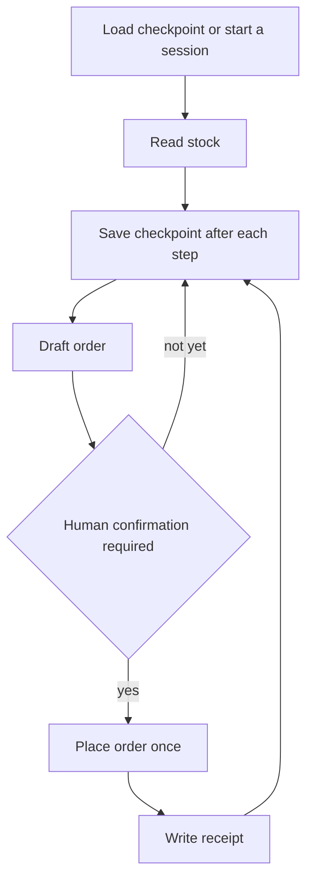
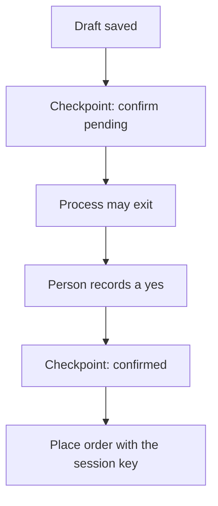

# Chapter 10: Runtime for Long-Running Agents

**Part:** Part II — Harness

A chat completion lives inside one request. A restock does not. It reads inventory, drafts an order, waits for a person, places the order once, and writes a receipt. The process can be killed in the middle. The claim of this chapter is that work which outlasts one context window needs a **runtime**: a session identity, a checkpoint on disk, a sandbox around files and network, and a place for state that must not live only in the prompt. A longer context window is not that runtime. The window is a view. The checkpoint is the record of what has already happened.

The running example is a house-coffee restock for Hearth Lane. The register knows a par level and a quantity on hand. The job should order the difference once. You will kill the process after the draft and start it again. The second start must finish the receipt without placing a second order. Polite prose on both runs is not success. One purchase order is success.

## 10.1 Sessions, checkpoints, resume

A **session** is the identity of one piece of work. "Restock house coffee, Tuesday" is a session. The next Tuesday is a different session, even if the customer-facing voice sounds the same. Give the session an id you generate in the harness, such as `restock-1842`, and put that id on every log line and every side effect. A transcript without a session id cannot be resumed, because you cannot tell which draft it belongs to.

A **checkpoint** is a durable record the harness writes at step boundaries. It is a file or a row, not the message list. It names the session, the step now in progress or last completed, the idempotency key for any side effect, and the external ids that side effect returned. It is small. It does not need the model's chain of thought. It does need enough to continue without guessing.

**Resume** means a new process loads the checkpoint and proceeds from the next unfinished step. The model may be called again to explain the draft or to format a note to the manager. The model is not asked whether the order was already placed. The checkpoint answers that. If the checkpoint says the order id exists, the place step is skipped.

The restock in the lab is four steps, on purpose, so there is a middle where a kill is unambiguous.

1. **Read stock.** Query the shop database for the sku, the quantity on hand, and the par level. This step has no side effect outside the session. It is safe to repeat. The observation is data.
2. **Draft the order.** Compute the quantity to order, or ask the model to propose a draft from the rows you just fetched. The draft is a proposal. Nothing has been sent to a supplier. Store the draft fields in the checkpoint so a resume does not invent a different quantity.
3. **Place the order.** This is the side effect. A mock ledger appends one purchase order. The call carries an idempotency key derived from the session id, not from the prose of the draft. A second call with the same key returns the original order id and does not append a second row.
4. **Write the receipt.** Record the order id, the sku, the quantity, and the session id in the checkpoint and in a receipt the manager can read. Repeating this step updates the same receipt. It does not place the order again.



*Figure 10.1. A restock is a session with a checkpoint after each step. Placement runs only when the checkpoint says it has not run, and only after confirmation.*

Kill the process after the draft has been saved and before the ledger append. That is the lab's interesting failure. On resume, the runtime loads `restock-1842`, sees that stock was read and the draft exists, sees that no order id is stored, and continues. If you kill after the append and before the receipt, resume must load the order id from the ledger using the idempotency key and write the receipt only. The dangerous bug is a resume that starts at step 1 in a fresh prompt and places again because the model does not remember dying.

Idempotency is the property that makes the dangerous bug detectable and then preventable. An operation is idempotent when repeating it with the same key does not repeat the effect. The mock ledger's rule is: one row per idempotency key. The checkpoint's rule is: if `order_id` is already filled, do not call place. You want both rules. The checkpoint avoids a needless call. The ledger saves you when the process dies after the append and before the checkpoint write, which is a real window, not a pedantic one. Write the ledger first or write them so a replay can reconcile. A design that stores the order id only in the assistant's message loses it when the process dies, and the next process will order twice.

A checkpoint you can resume from is concrete enough to paste into a note. The values below are the shape of a session after the draft and before placement, which is the moment the lab asks you to kill. Your file may use different field names. It has to carry the same facts.

```json
{
  "session_id": "restock-1842",
  "sku": "house-coffee",
  "status": "needs_confirm",
  "completed_steps": ["read_stock", "draft_order"],
  "on_hand": 4,
  "par": 16,
  "draft_qty": 12,
  "idempotency_key": "restock-1842",
  "order_id": null,
  "confirm_status": "pending"
}
```

On a clean resume the runtime loads this object first and only then builds a prompt. `draft_qty` stays 12 unless a person voids the draft. `order_id` stays null until the ledger returns one. A second start that does not read this file is not a resume. It is a new session that happens to share a sku, and it must not reuse the idempotency key.

What you store is part of the design.

- Session id, sku, and the step name.
- Input versions: which database file, which skill version if a skill drafted the note, which page URL if you fetched one. Chapter 7's pin belongs here.
- Draft quantity and the par level you used, so a resume does not recompute against a stock count that changed underneath you without noticing. If stock can change, the checkpoint should say so and a person should look. Silent recompute is how a killed job orders a different number than the one a manager already read.
- Idempotency key and order id once they exist.
- Confirmation, in the next section.

What you do not store in the checkpoint: the API key, the contents of `.env`, a full copy of a customer inbox, or a chain of thought you cannot explain. The checkpoint will be read by the next process and may be read by a person. Treat it as a shop record.

The message list is still useful. It is how the model perceives the draft you chose to show it. On resume you may rebuild a short prompt from the checkpoint: here is the session, here is the draft, here is the order id if any, please write the manager's note. That prompt is a projection of the record. If the projection and the checkpoint disagree, the checkpoint wins and you have a bug in the projection. Chapter 5's context budget is why the projection stays short. You do not resume a long restock by replaying every token of the first attempt. You resume from the step.

A session that is finished should say so. `status: complete` on the checkpoint, with the receipt path, means a third run prints the receipt and does not touch the ledger. Re-opening a completed session to "try a better quantity" is a new session with a new idempotency key, which is a human decision. The runtime does not make that decision because the model produced a more confident paragraph.

## 10.2 Sandboxing file and network access

A loop that runs for minutes has more chances to touch the wrong thing than a loop that answers one policy question. Chapter 2's directory jail was a sandbox of a modest kind: `read_file` refused paths outside `docs/`. A long-running restock needs the same honesty about two resources, files and network, and a clear statement of what the jail does not stop.

**Files.** Give the session a work directory, `sessions/restock-1842/`, and write the checkpoint and the receipt there. The tool that reads shop documents may still read the shop's docs, and the SQL tool may read the shop database. The model does not get a tool that takes an arbitrary path. It does not get `.env`. It does not get the repository root "so it can be helpful." A path the model supplies is checked the way Chapter 2 checked `..` and absolute paths. Failures return `ERROR:` and the session continues.

**Network.** The allowlist from Chapter 8 still applies, and it applies for the life of the session. A restock may fetch the static shop page. It may not fetch a URL the model composed after reading that page. Put the allowlist in the tool or in the MCP fetch server, not in a sentence the model can override. If the job does not need the network, give it no fetch tool. An absent tool is a smaller sandbox than a tool that promises to be careful.

**Process.** Do not add a shell tool whose argument is model text. Chapter 2's dispatcher was a closed set for the same reason. A long job does not earn a shell by being long. If you need a new capability, name it, schema it, and contract-test it as in Chapter 9.

Two layers are easy to blur, and the chapter is a good place to keep them apart. The **tool jail** stops a confused or malicious instruction from calling a function you did not offer, and it stops an offered function from accepting a path or a URL outside its rules. That is the threat these labs are built for: the model proposes, the harness disposes. An **operating-system sandbox** stops the process itself from opening a file even if the tool has a bug, using a container, a restricted user, or a similar mechanism. The tool jail is what you implement in the lab. The operating-system sandbox is what you add when the process runs untrusted code or handles real customer data. A path check is not a container. Say which one you built. Chapter 17's work-agent blueprint will assume both exist in a product. This chapter asks you to build the one you can read, and to name the one you deferred.

The lethal pattern later chapters flag is the combination of private data, untrusted input, and a way to send data out. A restock that can read `.env`, can read a fetched page, and can POST anywhere is that pattern even if every individual tool seemed reasonable. The runtime is where you refuse the combination. Narrow the files. Narrow the hosts. Do not add an outbound mail tool because the draft "might want to notify the supplier." Notification can be a sentence in the receipt a person reads.

A sandbox also has a budget. Chapter 2 stopped the loop at six model calls. A long job may need more calls, and it still needs a ceiling: maximum model calls per session, maximum fetches, maximum ledger writes. The ceiling for ledger writes in this lab is one per session. Hitting a ceiling writes the checkpoint as `stopped` with a reason, the way `max_steps` did, and it does not invent a closing order to hide the stop.

## 10.3 Background work and human handoff

Some steps are waiting, and waiting should not be a model call. A supplier page that is slow, or a manager who is on the floor until the lunch rush ends, is not a reason to sit in `chat.completions` and re-send the draft. The runtime records the wait and can exit. Tokens are not a clock.

Mark the checkpoint `waiting` and name what would resume it: a timestamp to retry a fetch, or a confirmation that is still missing. The process ends. That is a successful pause, not a crash. A later start loads the session and continues. Background, in this chapter, means the work has a durable next step and the process does not have to stay alive to remember it. It does not mean a hidden thread that places orders while nobody is looking.

Human handoff is the pause you will actually use on the restock. Drafting can be automatic. Placing an order spends the café's money, even in a mock ledger, so the step waits until a person confirms. Chapter 16 will define the tiers: auto, confirm, and never. The mapping for this job is the one the later lab will repeat. Reading stock and drafting are auto. `place_order` is confirm. Charging a card or emailing a supplier is never, and there is no tool for either.

The confirmation is a field the runtime checks, not a sentence the model believes.

- `confirm_status`: `pending` or `confirmed`.
- `confirmed_by`: an identifier of the person, even if the lab uses the literal string `manager`.
- `confirmed_at`: when the decision was recorded.

You might represent the human's yes as a file the lab tells you to create, or as a flag you pass on the command line. Either way the runtime writes the field into the checkpoint before it calls place. A transcript that says "the manager said yes" does not satisfy the check. Models are willing to write that sentence. The ledger must not move because they did.



*Figure 10.2. The handoff is a checkpoint the person updates. The process does not have to stay running while the manager is on the floor.*

Design the handoff so a person can actually use it, which is a product requirement and not a flourish. Show the sku, the quantity, the par level, and the two prices if a page was fetched. Show the session id. Ask for a yes on that draft, not on a vague "proceed." If the draft changes after the yes, the confirmation is void and the status returns to pending. Otherwise a resume could swap twelve bags for forty after the manager agreed to twelve. Bind the yes to a hash or a copy of the draft fields stored beside it.

A refusal is a result. `confirm_status: refused` ends the session without a ledger line. The receipt says the draft was refused. A later model call does not get to overturn the refusal by rephrasing the order. A new session can start if a person wants a different draft. The old session stays refused.

Background work has a failure of its own: a session left `waiting` forever. The runtime should be able to list sessions that are not complete. The lab can be a single session, and the habit still matters. A checkpoint directory you never look at is a queue you forgot you had. Print the session id and the status whenever the process starts and whenever it exits.

## 10.4 State you must not hide in the prompt alone

The prompt is a view the model reads. It is lossy once you summarize, it vanishes when the process dies, and it is writable by the model on the next turn. Several facts of a restock are too important to exist only there.

**Whether the order was placed.** If the only copy of "I already ordered twelve bags" is an assistant message, resume will not see it unless you replay that message, and a fresh prompt will place again. The order id lives in the ledger and in the checkpoint.

**The idempotency key.** The model does not invent this key and does not need to see it. The runtime derives it from the session id. A model-chosen key is a key the model can change between turns, which defeats the ledger rule.

**The confirmation.** Covered above. A quote of the manager inside the draft is not a confirmation. The field is.

**The quantity that was agreed.** Store the number. Showing it to the model is fine. Letting the model be the only storage is how a summary step "rounds" twelve to a case of sixteen and the case becomes the order.

**Which sources were read.** If the draft mentions a page price, store the URL and the quote, or store that the fetch failed. Chapter 8's comparison should survive a resume. A summary that keeps the number and drops the URL is how an ungrounded price re-enters the job after you had already done the work to ground it.

**Secrets.** They were never supposed to be in the prompt. A long job increases the temptation to paste a supplier token "so the agent can finish overnight." The runtime's place step uses a mock. A real token would live in the tool's environment, outside the messages, and Chapter 21 will insist on that split. The checkpoint does not get a copy for convenience.

**Skill and policy versions.** If `skills/recommend.md` is not what drafted the restock, a restock skill's version still belongs on the checkpoint once you have one. A complaint next week should be replayable against the procedure that actually ran. Chapter 22 will call this observability. The seed of it is writing the version down beside the order id.

Rebuild the prompt from those records when you call the model. A resume prompt can be short and factual.

```text
Session restock-1842. Sku house-coffee. On hand 4, par 16, draft quantity 12.
Confirmation: confirmed by manager. Order id: none yet.
Write a one-line note for the manager. Do not change the quantity.
```

The runtime, not the model, decides whether place runs after that note. If the note says "make it 20," the runtime ignores the new number or voids the confirmation. It does not parse the note as a command. Untrusted text includes the model's own later prose when that prose tries to edit the record. The record is updated by tools you named.

You can see the bug this section exists to prevent without any subtlety. Run the job until the draft is saved. Kill it. Start again with an empty message list and a loader that ignores the checkpoint. Count the ledger rows. Two rows means the order lived in the prompt you threw away. One row, with the same order id both times you print it, means the runtime held the state. The lab asks you to demonstrate the second outcome and to keep the ledger in the write-up.

Read a bad resume the way Chapter 3 taught you to read a bad trace. The ledger and the checkpoint are the trace.

- Two ledger rows for one session id mean place ran twice. The idempotency key was missing, or the ledger ignored it, or the second run used a new key for the same work. The prose of the note is irrelevant.
- One ledger row and a checkpoint that still says `order_id` null mean the receipt step never reconciled. Resume should look up the key in the ledger and fill the field, not place again.
- A checkpoint stuck at `needs_confirm` after you thought you confirmed means the yes landed in the transcript and not in the field. Place must not have run. If it did, the runtime trusted the wrong store.
- A draft quantity that changed across the kill, with no new confirmation, means the model recomputed the order on resume. Pin the draft in the checkpoint and treat a new number as a new session.
- A receipt that mentions a page price with no URL stored means the summary ate the citation. Chapter 8's rule still applies after a restart.

None of these are repaired by raising `MAX_TOKENS` or by pasting the first transcript into the second call. That paste is the longer context this chapter refuses to treat as a runtime. If you cannot explain the ledger with the checkpoint file alone, the state was in the prompt, and the job is not yet resumable.

Feedback, again, is something other than the drafting model. Here the something is the ledger count and the checkpoint status. A beautiful manager's note with two purchase orders is a failed session. Chapter 14 will talk about counting finished work in production. You can count now, in a JSON file, before any of that infrastructure exists. One session, one key, one order.

A longer context does not close the kill window. It does not store the confirmation outside the model. It does not stop a second process from starting at step 1. Buy a runtime before you buy a larger window. The window is how the model reads the next step. The runtime is how the café avoids paying for the same coffee twice.

## Lab

Run a multi-step house-coffee restock. Stop the process after the draft checkpoint and before a second placement. Resume from the checkpoint, with a human confirmation recorded in the session, and show that the ledger contains one order. Include the checkpoint file in what you turn in. A solution that remembers the order only inside the model transcript does not meet the lab.

The steps, the scaffold, and the kill-and-resume procedure are in the [Chapter 10 lab](../../labs/ch10-runtime-for-long-running-agents/README.md).

## Builder takeaway

Long jobs need a runtime, not a longer context. A session id, a checkpoint, an idempotent place step, a sandbox around files and hosts, and a human yes stored as data will survive a killed process. The prompt can describe that state. It cannot be the only place the state exists. When you score the restock, count ledger rows before you grade the prose.
