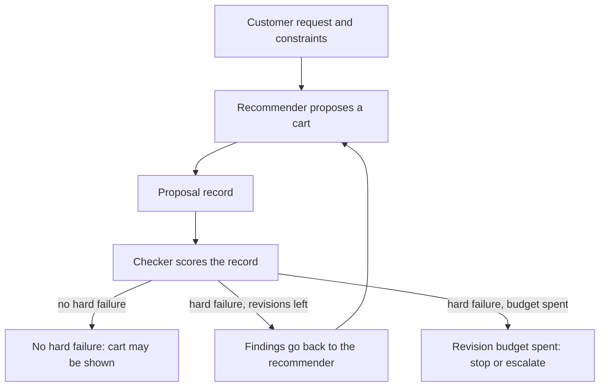
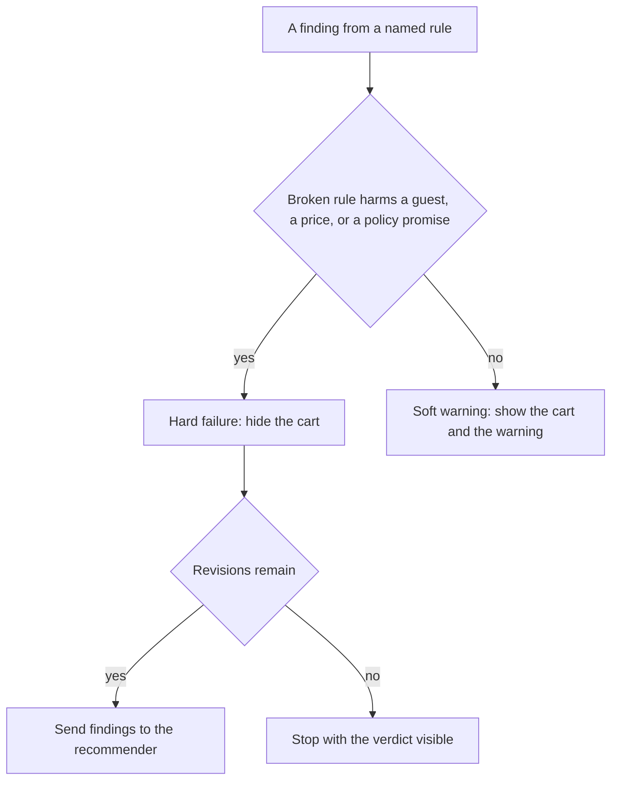
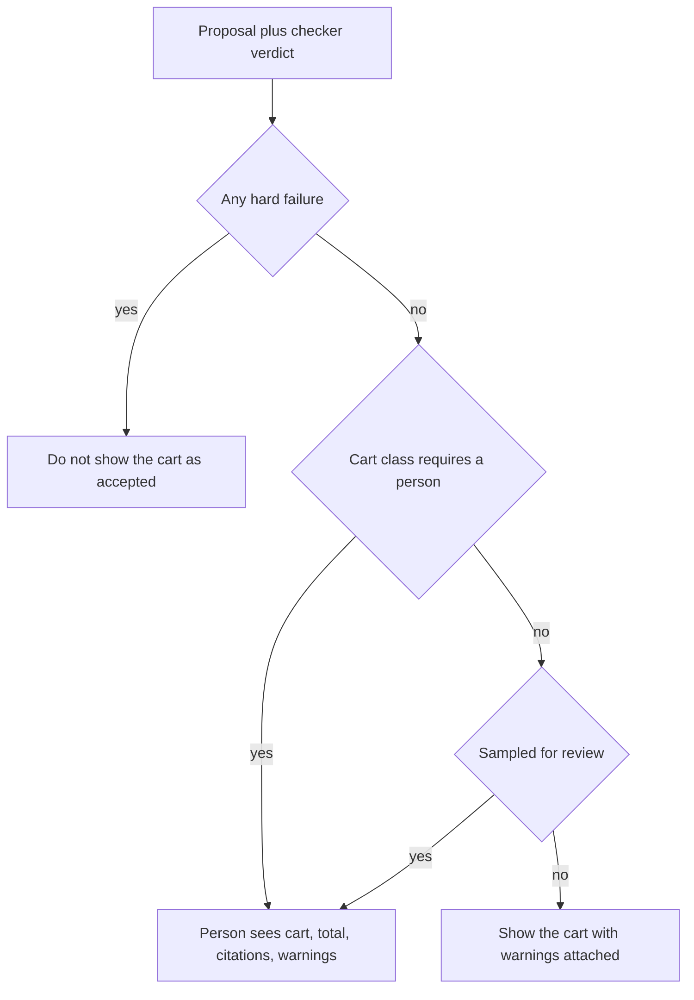

# Chapter 11: Verification Loops

**Part III — Feedback loop**

Chapter 2 can open `docs/policy.md` and still tell a customer that an opened bag of coffee may come back within fourteen days. The trace shows the read. The sentence quotes the wrong rule. Chapter 1 already named the repair for that kind of miss: something other than the model that drafted the paragraph has to be able to say the answer failed. This chapter builds that something. The claim is that a cart, a refund sentence, or a shipping promise needs a **checker** that did not write it. The model that proposes the work is the doer. The checker is a separate step, with rules you can name, and it can refuse the work before a customer sees it. An agent that skips this step will ship confident mistakes, because fluency is what the draft was trained to produce.

The running example is no longer a single paragraph about returns. Maya, who runs the counter on weekdays, asks the concierge for a cart: two cardamom buns and a 12-ounce bag of house coffee, for a regular who avoids nuts, with a budget of $20, to be picked up. A recommender proposes the cart in a small structured record. A checker then looks at that record against the shop’s catalog, the policy, and the customer’s constraints. The buns are $4.75 each. They contain almonds. The FAQ says there is no nut-free preparation area. Two buns plus the bag already need a price citation, an allergen decision, and a total that is the sum of the lines rather than a number the model found pleasing. The rest of this chapter is what that checker is allowed to reject, what it only warns about, and when a person is the right next reader.

## 11.1 Separate the checker from the doer

The doer in this chapter is a **recommender**. It reads the request and proposes a cart. The proposal is data, not a paragraph. A paragraph can hide a missing price inside a friendly sentence. A record makes the price, the quantity, the fulfillment method, and the citation into fields a program can read. One proposal looks like this.

```json
{
  "id": "cart-maya-saturday",
  "customer_id": "sam",
  "budget_cents": 2000,
  "avoid_allergens": ["nuts"],
  "fulfillment": "pickup",
  "claims_nut_free_prep": false,
  "items": [
    {"sku": "cardamom-bun", "qty": 2, "citations": ["docs/faq.md"]}
  ],
  "stated_total_cents": 950
}
```

Prices are deliberately absent from the items. The shop’s prices live in the catalog the harness trusts, which for these chapters is the same set of facts as `docs/faq.md` and `docs/policy.md`. House espresso is $3.50. A pour-over is $4.25. A cardamom bun is $4.75. A 12-ounce bag of house coffee is $18.00. Oat milk as an add-on is $0.75. If the proposal were allowed to name its own unit price, a model that wanted the cart to look cheap could write the bun down as a dollar. The checker would then be grading a story the doer also invented. Chapter 2 made the same point about policy sentences: the path header is added by the harness, and the model is asked to copy it. Here the catalog is the header. The recommender may choose a SKU and a quantity. It does not get to choose what the SKU costs or which allergens it carries.

The checker is a function the harness runs after the proposal exists. It receives the proposal, the catalog, and the policy facts it needs. It returns a verdict. It does not chat with the customer. It does not “fix” the cart by quietly deleting the buns and presenting the result as what the recommender said. A silent rewrite makes the trace lie. The next person to read the log will think the model chose the safe cart. The model chose the buns. The checker is the part that refused them.



*Figure 11.1. The recommender proposes. The checker scores. A revision sends the findings back as an observation. The checker does not rewrite the cart.*

Figure 11.1 is a loop, and it is the same shape as Chapter 2 with a different actor in the middle. In Chapter 2 the model proposes a tool call and the harness reports what the file contained. Here the model proposes a cart and the harness reports which rules the cart broke. The revision budget is the cousin of `DEFAULT_MAX_STEPS`. Two revisions are enough for a missing citation and a recount. Six revisions of the same almond bun are a stuck loop, and the harness should stop with the findings visible rather than invent a closing paragraph that says the order is ready.

You can run the checker as a second call to the same model, with a sterner prompt. That arrangement is still a checker in the organizational sense: a separate turn, a separate instruction, a verdict instead of a draft. It is a weak checker for the failures this chapter cares about. A model that just offered the buns to a nut-avoiding guest will often look at its own cart and call it reasonable, especially when the prose mentions almonds in a subordinate clause (“the buns do contain almonds, but many guests are fine with them”). Chapter 1’s feedback factor was the requirement that something *other than the drafting model* be able to fail the answer. A second sample from the same weights, asked “are you sure?”, is still those weights. Use a second model call for judgments that have no source of truth in your system, such as whether a sentence sounds like the counter. Use ordinary code for judgments that do: the sum, the allergen list, the citation path, the shipping rule.

The information boundary is the design. The recommender sees the request, the tool results you chose to give it, and, on a revision, the findings. The checker sees the proposal and the shop’s sources of truth, whether or not the recommender looked them up. That second part is the point of separating the roles. If the checker could only see what the recommender remembered to quote, a skipped file would become an invisible file. The checker opens the catalog row for `cardamom-bun` and reads `allergens: wheat, butter, almonds`. It does not read a field on the proposal called `allergens` that the model filled in as an empty list.

Authority has to be boring. The recommender cannot set a flag that marks the checker’s finding as advisory when the finding is a hard failure. The harness decides what is hard, in code you can review. A sentence in the system prompt that says “never sell nuts to this guest” is a wish. The checker’s allergen rule is the wish made executable. When they disagree, the checker wins, and the disagreement is a trace you keep. Chapter 7’s skills are still the right place to tell the recommender how to propose a better cart the first time. A skill is not a substitute for the check. A model can ignore a markdown file. It cannot ignore a function the harness runs after the proposal is parsed, unless you forget to call the function.

Parse failures are checker results too. A proposal that is not valid JSON, a quantity that is a string, or an unknown SKU never reaches the allergen rule. Return a hard finding, `unknown_sku` or `bad_proposal`, and stop. Do not ask the model to “try to interpret” a broken record. Chapter 4’s habit for tools applies here: a structured error the caller can recover from. The caller, on a revision, is the recommender. It should see `unknown_sku: cardamom_bun` (underscore, not the real id) and the list of real ids, the way `read_file` returns `ERROR:` and the names of the files that do exist.

The lab in this chapter keeps the recommender as a set of saved proposals, so you can grade the checker without waiting on a model. A later exercise can put a live model in the recommender’s seat. The checker stays the same function. That split is the Chapter 3 lesson applied to feedback. You can swap the doer. You should not have to rewrite the rules that protect the guest.

## 11.2 What to verify (policy, citations, constraints, totals)

A checker that tries to verify “quality” will verify whatever the author remembered that afternoon. Write down the classes of claim the shop can be hurt by, and implement those. For the concierge, four classes cover the cart.

**Policy.** The policy file is the source of truth for returns, shipping, damage, and local delivery. The checker encodes the rules that a cart can violate, not the whole prose of the file. Pastries, drinks, milk, and anything refrigerated do not ship. Coffee ships inside the United States only, not to PO boxes or freight forwarders. Bike delivery runs Tuesday through Friday, within 3 miles, and it does not run on Saturday, Sunday, or Monday. A proposal whose `fulfillment` is `ship` and whose items include `cardamom-bun` is a policy failure even when the total is correct and every line cites `docs/faq.md`. The citation proves the price. It does not prove that a bun can board a truck. Opened-coffee returns are a policy check on answers, more than on carts: if the customer’s bag is already open, a proposed exchange that uses the fourteen-day unopened rule is the Chapter 2 misquote, caught by a rule instead of by you and a highlighter.

Keep the encoded rule next to a quote from the file, in a comment or in the test name, and change both in one review when the shop changes its mind. A checker that says shipping is free under $40 is a second, false policy. The file says the fee on coffee orders under $40 is $6.00, and that orders of $40 or more ship free.

**Citations.** Every line that states a shop fact the customer will rely on needs a source the harness actually has. For a cart line, that means each item carries a citation whose path is one of the documents you trust, `docs/faq.md` for a menu price and `docs/policy.md` for a shipping or delivery rule. An empty list is a hard failure, `missing_citation`. A path the shop does not publish, such as `docs/blog.md` or a URL the model composed, is the same failure. Chapter 2’s soft note looked for the letters `docs/` anywhere in the paragraph. That note is a classroom hint. It is satisfied by a path the trace never opened. The checker does the stronger thing: the citation must be in the allowed set, and the fact being cited must be the kind of fact that document holds. A bun priced from `docs/policy.md` is a suspicious citation, because the policy file states that menu prices live in the FAQ. You can start by requiring any allowed path, and tighten to “price cites the FAQ, fulfillment cites the policy” once the first suite is green.

The checker does not ask the model whether the citation “seems supportive.” It looks at the path, and for an answer-shaped claim it looks at the quoted span. If you stored the tool result from `read_file`, the span after `PATH:` is what the model was allowed to know. A citation string with no matching read in the trace is the fake citation from Chapter 1, now rejected automatically.

**Constraints.** Constraints are facts about this request that the catalog and the clock must respect. Sam avoids nuts. The catalog says the cardamom bun contains almonds. Your rule has to decide that “nuts” includes almonds, or the guest’s own word will not match the ingredient’s name and the cart will pass. Write the expansion down: treating `nuts` as covering almonds, walnuts, pecans, and hazelnuts is a product decision, and it belongs in the checker, not in a hope that the model knows culinary usage. The FAQ’s other constraint is sharper than a single item: there is no nut-free preparation area, so a proposal that claims one is lying about the shop even when the items themselves are espresso and oat milk. Wheat and milk have the same shape. Rye porridge contains gluten and is cooked in a pot that also holds milk. A guest who avoids gluten is not safe because the agent skipped the bun.

Budget is a constraint on the request. So is distance, when you have it: delivery only within 3 miles of 12 Hearth Lane. So is the clock: a Saturday proposal with `fulfillment` of `delivery` breaks the Tuesday–Friday window. Chapter 13 will put a fake clock under the agent so this rule can be tested on a Wednesday laptop. The checker should already accept a timestamp on the proposal, or on the run, rather than calling the wall clock itself. A test that sets Saturday must not depend on which day you happen to grade it.

**Totals.** The checker adds the cart. The sum is `qty` times the catalog’s `unit_price_cents` for each line, plus a fulfillment fee when the policy charges one. Coffee that ships and whose merchandise total is under $40 adds 600 cents. Merchandise of $40 or more adds nothing for shipping. Pickup adds nothing. Bike delivery adds 450 cents unless the merchandise total is at least $35. The proposal’s `stated_total_cents` must equal that sum. A mismatch is a failure even when both numbers would have fit in the budget. The guest is about to hear a price. The price has to be the one the register would charge.

Do the arithmetic in integer cents. A model that says “about nineteen dollars” is not a total you can verify. Two buns at 475 cents are 950 cents, which is $9.50. Two coffees at 1800 cents are 3600 cents. Shipping on that order is 600 cents, because 3600 is under 4000. The total is 4200 cents, $42.00. A budget of $40, which is 4000 cents, rejects the cart. A recommender that states 3600 cents has dropped the fee. The merchandise is under budget and the order is not. This is the mistake a fluent assistant makes, because the fee lives in a different file from the price.

```python
def merchandise_cents(items, catalog):
    total = 0
    for item in items:
        price = catalog[item["sku"]]["unit_price_cents"]
        total += price * item["qty"]
    return total
```

That sketch is the whole philosophy of the total. The catalog is a dictionary you loaded. The quantity is the recommender’s. The multiplication is yours. There is no model in the function.

What you leave out of the checker matters too. Do not encode “sounds friendly” as a hard rule. Do not require the model to mention the weather on Hearth Lane. Do not fail a cart because the item names are lowercase. Every extra hard rule is a way for a good order to die in the loop, and a busy counter will teach people to route around a checker that cries wolf. The list above is already enough to catch the carts that hurt a guest or mischarge them: wrong policy, missing source, broken constraint, dishonest total.

A worked cart makes the four classes concrete. The request is Sam’s: avoid nuts, budget 2000 cents, pickup, two cardamom buns. The proposal cites `docs/faq.md`, states 950 cents, and asks for the buns.

- Policy: pickup is allowed for a bun. Shipping would not be. This proposal does not ship. Policy is quiet.
- Citations: the FAQ is an allowed source for a menu item. Citations pass.
- Constraints: the catalog allergens include almonds, and the request says nuts. The expansion rule fires. This is a hard failure.
- Totals: 2 × 475 = 950, which matches the stated total, and 950 is within 2000. The arithmetic is fine. The cart is still refused, because a correct total on a forbidden item is not a save.

Change the items to one espresso, cited, stated total 350, same budget, pickup. Policy, citation, allergens, and total all pass. The checker can accept. If the proposal also says the drink was made in a nut-free room, you still have a claim to deal with. That claim is the subject of the next section: some failures block the cart, and some travel with the cart as a warning.

## 11.3 Hard fails vs soft warnings

A **hard failure** means the cart must not be shown to the customer as something the shop is willing to do. A **soft warning** means the cart may be shown, with the warning attached, because a person or the recommender should notice and because the shop is not yet willing to block. The difference is a product decision. It is written in the verifier as a severity on each finding, and it should be reviewed the way you review the policy file.

Use a hard failure for a rule that, if broken, charges the wrong amount, promises an action the shop refuses, or puts an allergen in front of a guest who asked to avoid it. For the concierge those are:

- `missing_citation`, when a line the guest will pay for has no allowed source.
- `allergen`, when a catalog allergen hits the guest’s avoid list, including the nut expansion.
- `over_budget`, when the computed total exceeds `budget_cents`.
- `total_mismatch`, when the stated total is not the computed total.
- `not_shippable`, when fulfillment is `ship` and a line is a pastry, a drink, or anything else the policy refuses to ship.
- `outside_delivery_window`, when fulfillment is `delivery` and the clock is Saturday, Sunday, or Monday, or outside the same-day hours the policy names.
- `unknown_sku` and `bad_qty`, when the record is not a cart the register could ring.

Use a soft warning for a true statement the guest should hear that does not, by itself, make the cart unsafe. The FAQ says oat milk does not make a drink free of other allergens. A cart that adds oat milk for a guest who asked for a dairy alternative can carry `oat_milk_not_allergen_free` as a warning if the guest did not give you a specific allergen to block on. The claim that the café has a nut-free preparation area is false. If the items are otherwise allowed, `nut_free_prep` can be a warning that strips or flags the sentence, while the items remain. If you later decide the false sentence is as bad as a bad item, you promote it to a hard failure in one line and you add a case to the suite in Chapter 12. Promotion is a deliberate edit. It is not a mood.



*Figure 11.2. Severity is a product decision. Hard failures can re-enter the recommender until the revision budget is spent. Soft warnings ride along with a cart that is otherwise allowed.*

The recommender sees both severities on a revision, and the prompt tells it to treat them differently. A hard finding means “this cart is not acceptable; propose a different one or say you cannot.” A soft finding means “keep the items unless the guest’s request conflicts, and do not repeat the false claim.” If you hand the model a single blob of scolding text, it will often rewrite the whole cart to chase the warning and drop a line that was fine. Structured findings are an observation, in the Chapter 2 sense. The rule id is the part that stays stable when you rephrase the message string.

Two failure modes sit on either side of a sloppy severity list.

The first is a checker that hard-fails on taste. Requiring a cheerful adjective, a specific sentence order, or a mention of the address on every coffee cart will reject carts the counter would have sold. People then ask the concierge to “just put it through,” and someone adds an override. The override becomes the real path, and the allergen rule is sitting on the path nobody uses. Chapter 14 will treat overrides as incidents for this reason. You keep the hard list short so that a hard failure is rare and embarrassing when it is wrong.

The second is a checker that warns on harm. Marking `allergen` as soft because “the barista can double-check” means the cart of buns is shown to Sam with a yellow line of text. On a phone, in a rush, the yellow line loses. The guest sees two buns and a price. The shop sees a confident recommendation. Soft is for the oat-milk nuance and the over-eager nut-free sentence. It is not a place to park a rule you are slightly unsure how to code. If you are unsure, keep the cart in the human tier from the next section until the rule is one you can defend.

Warnings still need a destination. A warning that is computed and then dropped by the user interface is a hard rule you accidentally turned off. The lab’s verdict prints both lists. A cart is `accepted` only when the hard list is empty. The soft list can be non-empty on an accepted cart. Your write-up should show one of each: a refusal, and an acceptance that still carries a warning. If every interesting case is hard, you have not tested the branch that lets a cart through. If every case is a warning, you have not built a verifier. You have built a comment.

Log the verdict with the proposal, the rule ids, and the computed total. You will want this log when a cart reaches the counter and Maya says the total was wrong. The log is also the raw material of Chapter 12. A hard failure you met in a lab, written down with the proposal that caused it, is already an eval case. A warning you promoted after a near miss should be the same kind of record. The checker is the gate. The log is how the gate becomes a suite instead of a private memory of the person who wrote it.

## 11.4 Human-in-the-loop as a verifier tier

Some carts should reach a person even when the checker’s hard list is empty, and some failures should reach a person because the checker does not yet contain the rule. A human reviewer is a verifier tier. They are slower, they are expensive, and they catch a different class of mistake than the sum of the lines. The design question is which carts take that path, and what the person is asked to look at.

Think of three tiers, and keep them separate from the autonomy tiers Chapter 16 will name. Verification asks whether the artifact is acceptable. Autonomy asks whether an action may be performed. A cart can pass the checker and still wait for a confirmation before anything is ordered. A cart can fail the checker and never be offered for confirmation at all. Mixing the two leads to a button labeled “approve” that sometimes means “I read the allergens” and sometimes means “charge the card.” Chapter 16 maps actions such as `place_order` to confirm, and actions such as charging a card to never-without-a-stronger-control. This chapter only decides who may bless the proposal.

The automatic tier is the checker you just built. It runs on every proposal. It is the right tier for totals, citations, catalog allergens, the shipping refusal, and the delivery calendar. It does not get bored, and it does not round $4.75 to $5.

The sampled human tier reads a fraction of accepted carts, and every cart that took an unusual path. “Unusual” can mean a new SKU, a revision count above one, a soft warning, or a customer constraint the checker has no field for yet. In the first weeks of the concierge, sample generously. The point of the sample is to find rules you forgot. Maya looks at a Saturday cart and says that bicycle delivery was offered because the checker never received the day. That sentence is a missing input, not a reason to abandon the checker. You add the clock to the verdict inputs, you add `outside_delivery_window`, and you put the Saturday cart into the fixture set.

The mandatory human tier is for classes you have chosen not to automate. A catering order over a threshold you pick, a first-time shipping address, or any proposal that touches a return of opened equipment (the policy allows an exchange only when the item is defective and unused rules are easy to misread) can require a person even when every automated rule passed. Mandatory review is also the right tier for a rule you do not yet know how to write. “The guest said they are usually fine with almonds in baked goods but not in pesto” is a preference the catalog cannot score. Send it to a person. Do not ask the model to decide that the guest did not mean it.



*Figure 11.3. The checker runs first. A person is a later tier for mandatory classes and for a sample of carts the checker accepted. A hard failure does not become a polite request for approval.*

What the person sees decides whether the tier works. Show the items, the computed total, the stated total, the citations, the hard findings if you are asking them to adjudicate an escalation, and the soft warnings. Show the guest’s avoid list beside the catalog allergen line, not buried in a transcript. A raw chain of model messages asks the reviewer to reconstruct the cart in their head. They will miss the fee. The checker already computed the fee. Hand them the number. Chapter 22 will talk about traces you can replay. The review screen is a view over that trace, cut down to the fields a verdict used. A person who needs the full transcript can open it. The default view is the cart and the rules.

People are a poor checker for arithmetic and a useful checker for policy the file has not captured yet. They mis-add a column when the counter is busy. They notice that a “house coffee” note in yesterday’s specials was decaf and that the catalog does not say so. Use the automatic tier on the arithmetic every time, including on carts a person will also see. A human-only review of totals will pass a $42 order against a $40 budget on the day the line is long. The checker’s job on that cart is to make sure the person is not the only one who looked.

Overrides need a name. If a person can release a cart that still has a hard `allergen` finding, the product has decided that a human may outrank the rule. That can be the right call for a false positive — the guest clarifies that they avoid peanuts and not tree nuts, and your expansion was too wide — and it is a dangerous call if the button is the fastest way to finish a sale. Record the override: who, which rule id, what they changed, and the proposal before and after. A spike in overrides on one rule means the rule is wrong or the staff do not believe it. Either way you have a Chapter 12 case, and you do not have a healthy verifier. Until you have a reason to allow an override, the harness can simply offer no button. The revision loop, or a mandatory rejection message, is the whole response to a hard failure.

The practical split for Hearth Lane is small enough to write on one card. The checker blocks missing citations, allergen hits, totals that do not match the catalog, budgets that the computed total exceeds, and fulfillment the policy refuses. Soft warnings cover the nut-free-room claim and the oat-milk caveat. A person must see catering carts you define as large, and a sample of ordinary accepts. Nobody can press a button that sells the almond bun to Sam after `allergen` has fired, unless you have written that override down as a policy of its own and you are willing to read every use of it. Chapter 16 will put a confirmation in front of placing the order even after all of this succeeds. Verification did not spend the money. It decided whether the proposal was fit to show.

## Lab

Build a checker that scores a recommender’s cart. The recommender in the lab is a folder of proposals, including carts that omit citations, carts that sell cardamom buns to a guest who avoids nuts, and carts whose catalog total exceeds the budget. Your checker returns hard failures and soft warnings. It does not rewrite the cart. The starter accepts every proposal on purpose, so you can see an unverified doer before your rules exist.

The cases, the catalog, the commands, and the tests you are aiming at are in the [Chapter 11 lab](../../labs/ch11-verification-loops/README.md).

**Builder takeaway:** Unverified agents ship confident mistakes.

A citation in the prompt is a request. A total in the model’s voice is a guess. The checker is the feedback loop from Chapter 1, narrowed to rules the shop can defend, and it is the first piece of that loop you can run on every cart. The next chapter turns the carts this checker rejects, and the bad answers you have already seen in the labs, into cases you refuse to lose.
