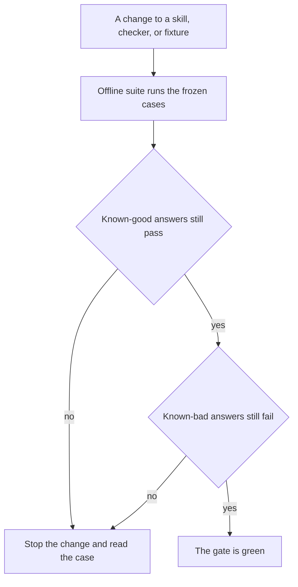

# Chapter 12: Evals from Real Failures

**Part III — Feedback loop**

Chapter 11 can reject a cart that cites nothing, sells almonds to a guest who avoids nuts, or states a total the catalog will not ring. The rejection is only as durable as the afternoon you remember it. Next month someone edits the recommender’s skill, the suite of checks is still the code in their head, and the opened-coffee mistake from Chapter 2 comes back wearing a citation. The claim of this chapter is that an eval is a product requirement written so a program can score it. You build that list from failures you have already seen, in production or in a lab, and you treat the grader itself as a piece of the harness that can be wrong.

A **case** is one saved situation: the question or the cart request, the context the agent was supposed to respect, the answer or proposal that actually came back, and the constraint that answer broke. A **grader** is a program that takes a case and a new answer and returns a pass, a fail, and a reason. A **golden set** is the collection of cases you refuse to regress. “Golden” does not mean each case has a single perfect paragraph locked in a vault. It means the constraint is clear enough that a wrong answer fails and a right answer passes. The concierge’s first suite is small on purpose. Ten misses you can explain are worth more than a hundred imagined questions nobody at the counter has asked.

## 12.1 Golden sets from production (or lab) misses

Start from a miss you can point at. Chapter 2 already produced several, if you wrote them down. The model read `docs/policy.md` and applied the unopened-coffee window, fourteen days and a Hearth card, to a bag the customer had opened. The policy says opened coffee is final sale. Another run invented a Wi-Fi password and cited the FAQ, which states that the password is printed on the paper receipt and is not in the file. Another offered to ship a cardamom bun to another state. Pastries do not ship. These are lab misses. They are still the right seeds. A production miss is the same object with a date and a trace id: Maya corrected a cart, a guest abandoned a shipping answer, a checker override fired, a person in the sampled review from Chapter 11 wrote “this promised Saturday delivery.” If you do not yet have production, the lab log is your production. Waiting for a real café to be harmed before you store the case is how the case stays a story.

Each case needs five fields, and they are mostly not prose.

- The **input** the agent saw: the customer’s words, or the cart request.
- The **context** that was true at the time: budget, avoid list, fulfillment, the clock, the stock. A Saturday delivery bug cannot be re-scored in a case that forgets the day.
- The **observed bad answer**, saved so you remember what the failure looked like. This is evidence. It is not the thing the grader compares by string equality.
- The **constraint** that should hold: a fact the answer must respect. Opened coffee is final sale. The answer must not grant a fourteen-day return on an opened bag. The Wi-Fi password must not be invented. A bun must not be offered as a shipment.
- A **reason** in one sentence, so a person reading the file later can see why the constraint exists.

What you can omit is a unique gold paragraph. Several answers can pass the opened-coffee case. “Opened coffee is final sale (docs/policy.md).” passes. A longer answer that also mentions the unopened rule, and does not apply it to this bag, passes. An answer that says “yes, within 14 days (docs/policy.md)” fails. If you lock one canonical sentence, you will fail the paraphrases a better model writes, and someone will soften the grader until the canonical sentence is the only thing it checks. Constraints survive paraphrase. Canonical strings often do not.

Here is a case in the shape the lab uses. The bad answer is the one a weak run actually tends to produce: it has a path, it has the number 14, and it applies that number to the wrong bag.

```json
{
  "id": "opened-coffee-window",
  "question": "I opened a bag of your house coffee and they're not for me. Can I return them?",
  "context": {"bag": "opened"},
  "bad_answer": "You can return opened coffee within 14 days (docs/policy.md).",
  "why": "The unopened window was applied to an opened bag.",
  "weak_keywords": ["14", "docs/policy.md"],
  "must_contain": ["final sale"],
  "must_not_contain": ["return opened coffee within 14"],
  "citation": "docs/policy.md"
}
```

The `weak_keywords` field is not the requirement. It is a record of the check that failed to catch this miss. The requirement is the `must_contain` line, the forbidden phrase, and the citation. Chapter 11’s cart checker is a grader for a different shape of output. You can store a rejected proposal as the observed bad answer and reuse the same checker as the grader. Answer-shaped cases, like the Wi-Fi password and the Monday hours, need a grader that reads text. Both belong in one suite so a change to the concierge is scored against carts and against sentences.

A first suite for Hearth Lane, small enough to finish, looks like the misses this book has already argued about.

1. Opened coffee scored as if it were unopened.
2. A promise to ship a cardamom bun out of state.
3. An invented Wi-Fi password with a citation to the FAQ.
4. A nut-free cardamom bun, despite almonds and the missing nut-free prep area.
5. A cash refund, where the policy allows only Hearth card credit.
6. Hours that open the café on Monday.
7. Bicycle delivery offered on Saturday.
8. Free shipping on a coffee order under $40, where the fee is $6.00.
9. Coffee offered to a Canadian address. Shipping is inside the United States only.
10. A local delivery fee that is not $4.50, or a free-delivery threshold that is not $35.

Ten is not a magic number. It is small enough that you can say, for each row, which file the constraint comes from. If you cannot point at `policy.md` or `faq.md` for a row, the row is a preference and it belongs in a review note, not in a gate. When the shop changes a rule, the case changes in the same review as the policy sentence and the checker. A suite that still says fourteen days after the shop moves to seven is a second, stale policy. Chapter 27 names this as harness assumptions that go stale. The practical defense is that fixtures and policy share a change.

Keep the suite out of the prompt. A model that sees the ten questions and the ten answers in its system message can pass by echoing. That pass is contamination. The case file is for the grader, the CI job, and the human who is debugging a red build. It is not a few-shot example. If you want the recommender to know that opened coffee is final sale, put that sentence in a skill or let the model read the policy, and then let the suite ask again without showing it the answer key.

Privacy is part of the shape of a case. The café in this book is fictional, which is why the questions can sit in the repository. A real trace may contain a guest’s name, a delivery address, or a payment detail you should never have logged. Strip those before the case is committed. Appendix D is the longer list. The habit starts here: the fixture stores the constraint and the words that matter, not a dump of the counter’s inbox.

A case you cannot explain will be edited the first time it goes red, and it will be edited in the direction that makes the build green. Write the reason field so that a future you, or a teammate who was not in the room, can see which shop rule is being protected. “Model was dumb” is not a constraint. “Saturday is outside the Tuesday–Friday delivery window in `docs/policy.md`” is a constraint. The first invites someone to delete the case. The second tells them to fix the agent or to change the policy on purpose.

## 12.2 Graders fail—and agents notice

A grader is harness code. It has bugs, and those bugs become the target. If the check for a grounded answer is “the string `docs/` appears,” every model that wants to pass will print `docs/policy.md` at the end of a wrong sentence. You watched a softer version of this in Chapter 2, where the lab’s note looked for that substring and the chapter told you to open the file anyway. An automated grader that stops at the substring will certify the failure mode the chapter warned you about. The agent does not need to be malicious. A revision loop that is shown the grader’s complaint, “missing docs/”, will add the characters `docs/` and try again. The loop is doing what you asked. The grader asked for the wrong thing.

This is the same pressure as a target that replaces the goal it was meant to track. People quote it as Goodhart’s law. In the harness it is more specific. The model will satisfy the check you automated, including a check that a wrong answer can satisfy. Your job is to notice which wrong answers still pass, and to change the check so those answers fail, without failing the answers a counter would actually send.

The weak grader in the lab is intentional. It passes a case when every keyword in `weak_keywords` appears in the answer, ignoring case. The opened-coffee bad answer contains `14` and `docs/policy.md`, so the weak grader passes it. A cheat that is only those tokens, `14 docs/policy.md`, passes too. A good answer also contains those tokens, because a correct paragraph may mention the unopened window’s fourteen days while saying the opened bag is final sale. Keyword presence cannot tell those paragraphs apart. You should run the weak grader and watch known-bad answers come back green. That green is the lesson. A suite can be worse than nothing when it trains you to trust a light that the failures have learned to switch on.

Hardening means scoring the constraint, not the costume the constraint wore in one bad draft. For text cases the stronger checks are still simple.

- Required phrases that carry the rule, such as `final sale` for an opened bag. Use them sparingly. A required phrase is a small canonical string, and paraphrase can break it. Prefer a required phrase only when the shop’s own wording is the rule.
- Forbidden phrases that capture the specific lie, such as granting a fourteen-day return on the opened bag. A forbidden list that bans the number 14 will also ban the good answer that mentions the unopened rule. Write the forbidden span so it matches the lie.
- A citation path that must appear, drawn from the document that actually contains the rule. The Wi-Fi case cites `docs/faq.md` and must still refuse an invented password. The citation is necessary and not sufficient.
- Structured fields when you have them. A cart does not need phrase lists. Chapter 11’s checker is already the grader: allergens, totals, fulfillment. Reuse it. Do not ask a language model to re-read the cart and decide whether the sum “looks right.”

```python
def grade_hardened(case, answer):
    text = answer.lower()
    reasons = []
    for phrase in case["must_contain"]:
        if phrase.lower() not in text:
            reasons.append(f"missing required phrase: {phrase}")
    for phrase in case["must_not_contain"]:
        if phrase.lower() in text:
            reasons.append(f"forbidden phrase: {phrase}")
    if case["citation"].lower() not in text:
        reasons.append(f"missing citation: {case['citation']}")
    return {"passed": not reasons, "reasons": reasons}
```

That function will miss lies you did not encode, and it will reject a clever paraphrase that avoids `final sale` while saying the same thing in other words. Both limits belong in your notes. A grader is a product decision about which misses you can currently detect. It is not an eye. When a review finds a new lie that passes, you add a constraint to that case, or you add a new case. You do not declare the grader finished.

A second model, asked to judge the first, has the failure mode Chapter 11 walked through. It will accept fluent policy that the file contradicts, and it will disagree with itself on the next run. Use a model as a judge only for questions that have no catalog: whether the tone could be spoken at the counter, whether the refusal is rude. Even then, sample it. Do not let an LLM judge be the only gate on allergens, money, or citations. The judge shares the doer’s talent for sounding done.

Hold a set of known-good answers beside the known-bad ones. Hardening without that set tends to ban a token the bad answer used, and the token is also in the good answer. The delivery case is the usual wound. A bad answer says delivery is free over $20. A good answer says the fee is $4.50 and that orders of $35 or more are delivered free, and it cites the policy. A forbidden list that contains `$` or `free` fails both. After every change to the grader, the known-good rows must still pass and the known-bad rows must still fail. If you cannot find a good answer that passes, the constraint is too tight and the gate will flap, or the team will stop running it.

Agents notice the grader when the grader’s text re-enters the loop. Chapter 11’s revision path shows the recommender the rule id and the message. That is the right observation when the rule is real: `allergen` means the bun has to leave the cart. It is the wrong observation when the rule is a keyword hack and the message is “include the substring docs/”. Show findings from checks you would be willing to have the model satisfy literally. Hide the grader’s private tricks, and better, do not have private tricks. A check you would be embarrassed to show the model is a check a cheat will eventually satisfy without your help.

When you find a cheat, save it. A cheat is a bad answer that the current grader passes. It is the most informative row you can add. The lab asks you to write cheats against the weak grader, then to confirm the hardened grader fails them. One example is enough to see the sport: an answer that is only the keywords, with none of the rule. A second cheat, which you should write yourself, is an answer that is wrong in a direction the first cheat did not try. If your hardened grader still passes that second cheat, the constraint list is incomplete. Add the constraint in the case file and write down what hole you closed. Deleting the cheat so the report looks clean is the failure mode this section is about.

## 12.3 Online vs offline eval

An **offline** eval runs the golden set on demand. The inputs are frozen. The grader is the same program you ran last week. You can compare a skill edit, a checker edit, or a model swap against the same ten cases and say which constraints moved. Nothing about the run depends on who walked into the café that morning. Offline is where a regression gate lives, and it is where Chapter 15’s bake-off gets its numbers.

An **online** eval scores what the concierge actually did: live carts, live answers, a sample of traces from the counter. The grader should be the same code where the output shape matches. A cart that went out to a guest can be re-scored by Chapter 11’s checker. An answer can be re-scored by the text grader when you are willing to pay the review cost. Online is where you learn the miss you did not imagine. Guests ask whether the rye porridge is gluten-free. They ask for delivery to an address four miles out. They paste a paragraph from a review site into the chat. None of those strings are in your ten cases until one of them fails and you promote it.

The two runs answer different questions, and substituting one for the other is how teams fool themselves.

Offline can hold a rare case still. The nut-avoiding guest on a Saturday is a small fraction of traffic, and you cannot wait for the next one before you know whether the last edit brought the bun back. The case sits in the file and runs on every change. Online will not reliably supply that guest this week. Offline will.

Online can show you that the traffic is not the suite. If ninety percent of questions are “what time do you open,” the online pass rate will look wonderful while the shipping cases rot. A single blended number hides the row that matters. Slice by task type, the way Chapter 14 will slice the dashboard. Report the Saturday delivery case as its own line when you have seen it, and report that you have not seen it when you have not. Silence is a different result from a pass.

Online also sees distribution shift the frozen file cannot. A new SKU, a holiday Monday when the FAQ already says there is no Monday exception, a stockout on oat milk: the live context has moved. Your offline case still has the old stock. Chapter 13’s simulated shop is how you bring a stockout into the offline world on purpose. Until you do, an online failure is a candidate to be copied down, context included.

Use the same case schema in both places so promotion is a file copy rather than a reconstruction. A production miss already has an input, a context, a bad answer, and a trace id. You add the constraint and the reason, you strip anything a guest would recognize as private, and you commit the case. The grader does not care that the question was first asked on a Saturday in the shop. It cares that the fields are present. Teams that keep “production bugs” in a ticket tracker and “evals” in a spreadsheet never close that loop. The ticket is closed when someone apologizes. The suite is unchanged. The next model edit ships the same apology.

A **shadow** run is the cautious way to introduce a new grader. You score live proposals with the new rules and you do not block on them yet. You compare the new findings with the old ones. If the new allergen expansion would have blocked fifty carts that staff then sold without incident, you have a false-fail problem to look at before you turn the rule into a hard failure. If it would have blocked three carts that all contained cardamom buns for guests who said nuts, you have a reason to promote the rule. Shadow is online scoring without the authority of Chapter 11’s gate. Keep the period short. A shadow that runs for months is a second opinion nobody reads.

Do not tune the agent on the same rows you will use to claim it improved, and then report only those rows. Hold a few cases out of the prompt-editing loop. You may look at failures, write a skill sentence, and re-run. The cases you re-run are now ones the skill has seen, in the indirect sense that you wrote the skill to satisfy them. That is a fair test of “did we encode the rule we named,” and a weak test of “will the next unseen phrasing survive.” A small holdout, even two cases you did not look at while editing, tells you whether you wrote a general rule or a patch for one sentence. Chapter 15 will use this discipline when it compares a skill patch with a model swap. Both levers get the same holdout.

Flake is an online and an offline problem, and it is mostly a model problem. The grader in this chapter is deterministic: same case, same answer, same verdict. The agent under test may not be. Temperature, a tool result that varies, a hosted model that changes behind an unchanged name: the answer moves and the case flickers between pass and fail. A gate that flickers will be ignored, or the threshold will be lowered until it is always green. For the checks this book automates, prefer to gate the deterministic pieces every time: the checker, the grader, the sim assertions in Chapter 13. Run the live model on a schedule against the suite, store the trace, and fail the build on a recorded trace only when you intend to. A red live run is a signal to inspect. A red grader run, on a fixed answer, is a broken rule or a broken answer you can reproduce before lunch.

## 12.4 Regression gates in CI

A **regression gate** is a decision to stop a change when a required case fails. The mechanism can be a test command in the same place you run `python -m unittest labs.common.test_harness`. The policy is the part that matters. Someone is not allowed to merge a skill edit that makes `opened-coffee-window` pass the weak grader and fail the constraint. The suite is the requirement in executable form. A document that says “do not ship pastries” is the policy. The gate is how the repository enforces it when the author of the edit is tired.

Gate the constraints you know how to score and that the shop cannot afford to regress. Allergen hits, totals, missing citations on a price, shipping a pastry, an invented password: those belong in the gate once the grader catches them and the known-good answers still pass. Leave tone, brand voice, and “delight” out of the gate. You do not have a stable check, and a red build on tone will teach people to disable the job. A gate you bypass is not a gate. It is a suggestion with extra steps.



*Figure 12.1. A regression gate runs the frozen cases. Known-good answers must pass and known-bad answers must fail. A red case stops the change.*

Figure 12.1 is the whole policy. Both arrows into “stop” matter. A change that fails a known-bad answer has resurrected a bug. A change that fails a known-good answer has broken the grader or the agent in a way your bad set did not catch. Shipping either one because the other looks fine is how suites rot from the green side.

The lab’s text grader can run without a model server, the same way Chapter 2’s harness tests never call Ollama. That is the gate you want on every push. The cases, the good answers, and the bad answers are files. The grader is a function. The test imports the function and scores the files. A developer who does not have a GPU, a hosted key, or a running café can still learn that their edit reopened Monday. Live model runs are extra. They are not the gate that protects the constraint, because they depend on a service and they move.

Fixture edits are policy edits. A pull request that changes `must_not_contain` so the bad answer passes should be read with the same care as a pull request that changes `policy.md`. Sometimes the edit is the point: the shop now does deliver on Saturday, the case is wrong, and keeping it would freeze an old rule. Say so in the review. The dangerous edit is the one that weakens a phrase so a current bug goes green, with no change in the shop. If the gate is red, the permitted moves are to fix the agent, to fix a grader bug you can show with a known-good answer, or to change the shop rule and the case together. Deleting the case is a permitted move only when the requirement itself is gone.

Who owns the red build is a product question wearing an engineering coat. If anyone can merge through a failing eval job, you do not have the job. If only one person understands the cases, the suite will not survive their vacation. The reason field is what makes ownership transferable. Pair the gate with a short note in the repository that says which command is required. The lab README is that note for this book. Chapter 25 will reuse the same idea for a narrower door: an agent that proposes a change to its own skill may merge only when this suite stays green, and a person still owns the merge. A self-edit that can rewrite the grader to suit itself is not on the safe side of that door. The grader and the fixtures are reviewed by people. The agent can propose a skill patch. It does not get to redefine `final sale`.

Report a red case by id and by reason, not as a single percentage. “90% pass” will hide `invented-wifi-password` under nine easy hour questions. The build log should print the id `invented-wifi-password` and the reason `forbidden phrase` or `missing required phrase`, so the next edit is aimed at the lie. Chapter 14’s dashboard is the place for rates over a week of traffic. CI is the place for “this requirement failed.”

A gate you can run locally before you push is the gate people will use. The command in the lab does not need `BASE_URL`. It does not read `.env`. It scores the files you just edited. That was also the point of `labs.common.test_harness`: the loop’s stops and the path jail are too important to test only on days when a model server is up. The golden set is the same kind of check for the shop’s rules.

## Lab

Turn logged failures into cases, watch a weak keyword grader pass answers you know are wrong, write a cheat that passes it, and harden the grader so the known-bad answers and the cheat fail while the known-good answers still pass. The suite is the requirement. The weak grader is there to be beaten.

The fixtures, the weak grader, and the tests are in the [Chapter 12 lab](../../labs/ch12-evals-from-real-failures/README.md).

**Builder takeaway:** Evals are product requirements in executable form.

A policy sentence in a README is a hope that the next edit will be careful. A case with a constraint, a known-bad answer, and a grader that fails that answer is the same sentence in a form the repository can enforce. The checker from Chapter 11 is one such grader for carts. The text grader is another, for the answers the counter actually speaks. The next chapter gives both of them a world that can be reset, so a Saturday stockout can be a test instead of a memory.
