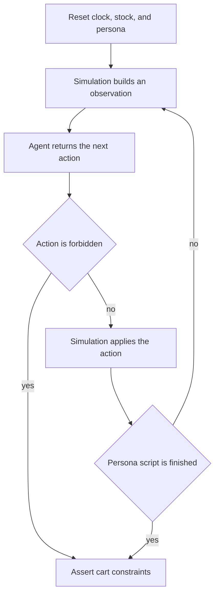
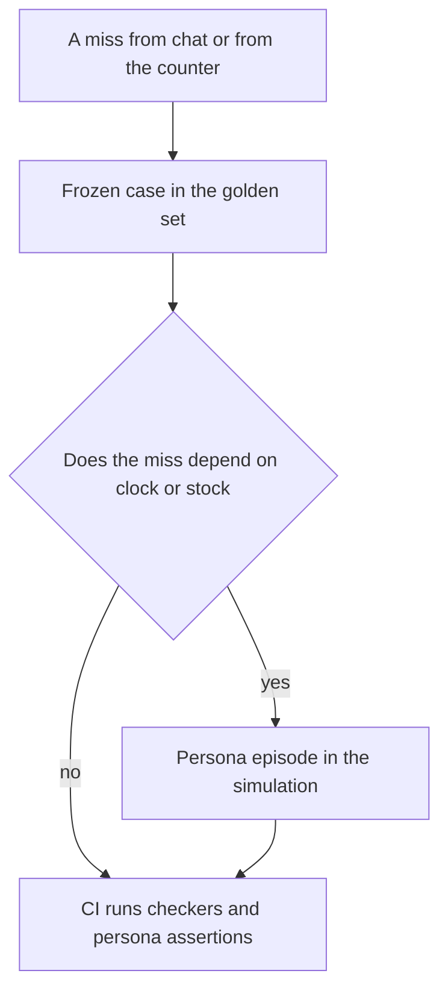

# Chapter 13: Simulated Users and Environments

**Part III — Feedback loop**

Chapter 12 can score a frozen answer. It cannot, by itself, ask a follow-up when the concierge asks a follow-up. It cannot run out of oat milk, and it cannot make Saturday happen on a Wednesday laptop. A week of ad-hoc chats will surface those situations once, in a transcript nobody can replay, and the next edit will be judged by whether the demo felt better. The claim of this chapter is that a weekly improvement needs a world you can reset: a small set of **persona scripts**, a clock you control, and an inventory you can stock out on purpose. If you cannot simulate the task, you cannot tell whether this week’s skill edit helped it.

The shop is still Hearth Lane. Three regulars will stand in for the traffic you refuse to leave to chance. Jules is the owner and is skeptical of any cart that does not show its sources. Rafi is the morning barista and has about a minute. Sam is a regular who avoids nuts and has turned up on Saturday, when the policy’s bicycle window is closed. The agent proposes actions. The simulation accepts them, rejects them, or answers in the persona’s voice according to a script. At the end you have a trace and a list of broken constraints, and you can run the same Saturday again after you change one line.

## 13.1 Why sims beat ad-hoc chat testing

An ad-hoc chat is a good way to notice a surprise. You sit at the counter, you ask the concierge for a Saturday delivery, and it offers one. That discovery is real. It is also fragile. The transcript lives in a terminal scrollback. The next person to change the prompt does not have your Saturday. They have a new chat, on a new day, with a new mood, and they ask a different first question. If the answer sounds helpful they merge the change. Chapter 1’s feedback factor required a miss you could compare with a later run. A feeling that the second chat went better is not a comparison. The inputs moved along with the edit.

A **simulation**, in this chapter, is a program that plays the parts of the world the agent does not own. It plays the guest or the coworker, it plays the clock, and it plays the stock. The agent under test is the same kind of program as the concierge: it reads an observation and returns an action. The simulation applies the action, updates the world, and returns the next observation. When the script ends, the harness asserts what should be true. No forbidden action ran. The cart respected the budget and the avoid list. A stockout was not sold as if the item were on the shelf.



*Figure 13.1. A simulation resets the world, shows the agent an observation, and applies the action the agent returns. Assertions run on the trace, including when a forbidden action ends the episode early.*

Figure 13.1 is a loop with a different division of labor from Chapter 2. There, the model proposed a tool call and the harness executed `read_file`. Here, the agent proposes a shop action and the simulation is the harness for the world. The assertion step is Chapter 12’s grader, applied to a trace instead of a single paragraph. A frozen case is still the right tool when the whole task is one answer with no branching. “Is the café open on Monday?” does not need a persona. It needs the FAQ and a constraint. A simulation earns its cost when the next observation depends on the last action. If the agent asks Rafi which pastry sold out, the script has to answer, and the next step depends on that answer. A single frozen transcript can only test agents that say what the transcript expected. The moment a better agent asks a reasonable question the transcript did not contain, the frozen replay fails for the wrong reason.

You already have two neighbors of this idea, and the sim sits between them. Chapter 11’s checker scores a proposal that already exists. It does not care how the proposal was produced, and it does not advance a clock. Chapter 12’s cases score an answer against a constraint. They are the regression gate. The simulation produces the proposal or the answer under conditions you set, and then those same checkers can score it. A Saturday cart that comes out of the sim should be handed to the Chapter 11 checker, not to a second, looser set of opinions. One definition of “this cart is allowed” is enough. The sim’s job is to make the situation happen and to record what the agent did. The checker’s job is to judge the cart. The persona’s job is to behave like Jules, Rafi, or Sam within the bounds of the script.

Ad-hoc testing still has a use. When you are exploring, a live model and a person who knows the shop will find a phrasing the scripts do not contain. The rule is what you do with the find. If it matters, it becomes a persona step or a Chapter 12 case before you call the bug fixed. If it does not become one of those, the fix is an anecdote, and the next model swap will not know to preserve it. The weekly loop this part of the book is building runs like this: a miss in a chat or at the counter, a case in the golden set, a simulated situation when the miss depends on time or stock, a gate that runs the simulation with the checkers. Chapter 14 will put the live numbers beside that gate. The gate is what you can run on a quiet Monday when the café is closed and no guest is asking.

Reproducibility is the property to protect. A simulation that calls a live model to play the guest will sometimes wander, apologize, or invent a policy of its own. You can learn from that wander. You cannot regress it. The personas in this chapter are scripts. They say the next line because the file says so, or they choose among a few lines based on the action type the agent returned. Same starting stock, same clock, same script, same agent: same trace. When the trace changes, the agent changed, or you edited the world on purpose.

## 13.2 Persona scripts (skeptical owner, rushed barista)

A **persona** is a script with a goal and a set of constraints. It is not a biography for the model to improvise on. Jules, Rafi, and Sam need enough detail that two people reading the file would agree whether the agent succeeded. They do not need favorite colors.

**Jules, the skeptical owner**, is checking a midweek cart before trusting the concierge with a supplier question. The goal is a pickup cart of house coffee for the counter’s retail shelf, inside a budget Jules names, with a citation on every line and a stated total that matches the catalog. Jules will not confirm a cart that cites nothing. Jules will not accept a paragraph in place of a total. If the agent asks a question the request already answered, Jules answers briefly once and then stops cooperating. The constraint list is the Chapter 11 list, pointed at this order: allowed SKUs, citations in `docs/faq.md` or `docs/policy.md`, `stated_total_cents` equal to the catalog sum, total within budget, fulfillment that the policy allows. The script’s patience is short on purpose. An agent that interviews the owner for five turns has failed, even if the eventual cart is perfect. The owner did not come to the tool for an interview.

**Rafi, the rushed barista**, opens on a morning when oat milk is gone and the cardamom buns did not set. Rafi wants a restock suggestion, not a tour of the return policy. The goal is a `propose_restock` action that names the oat-milk stockout and does not pretend the buns are on the shelf. Rafi will abandon the task if the agent asks more than one clarifying question or if it starts a lecture. The clock in Rafi’s episode is a budget as real as the dollar budget on a cart. A concierge that spends the only minute on “what kind of morning are you hoping to create?” has failed the persona, and a transcript that looks friendly is the failure mode. Rafi’s script can encode that as a maximum number of `ask` actions, after which the episode ends in `abandoned`.

**Sam, the allergic regular**, is the third script the lab runs, because two personas will not cover a constraint that lives in the combination of a person and a calendar. Sam avoids nuts, has a small budget, and is in the shop on Saturday. Sam would like a cardamom bun and a coffee. The correct cart does not contain the bun. The FAQ lists almonds, and there is no nut-free prep area to negotiate. Fulfillment is pickup. Saturday is outside the delivery window, so a `delivery` cart fails even if the items are only espresso. Sam’s script confirms a cart that passes those constraints and rejects one that does not, with a short reason. The agent under test is not allowed to “talk Sam into” the bun.

```json
{
  "id": "allergic_saturday",
  "name": "Sam",
  "goal": "A pickup cart with no almond items, inside budget, cited.",
  "clock": "Saturday 09:00",
  "budget_cents": 1500,
  "avoid_allergens": ["nuts"],
  "patience_asks": 1,
  "opening": "It's Saturday. I avoid nuts. Can I get a cardamom bun and a coffee, pickup, under $15?"
}
```

That record is the whole persona the harness needs. A paragraph of backstory in the system prompt, with no fields the assertions read, will change the model’s tone and leave the test unable to fail. Put the constraint in a field. Let the script’s opening line be what the agent hears. Keep the romantic detail out until you have a requirement that uses it.

The script is a small state machine. On `propose_cart`, the simulation runs the checker and the persona “says” the result: confirmed, or rejected with the rule ids. On `ask`, the script returns the next canned answer if patience remains, or ends the episode if it does not. On `propose_restock`, the simulation compares the suggestion with the stockout list. On anything in the forbidden set, the episode ends immediately and the assertion fails. You do not need a second model to play this machine. A table of action types is enough for the three episodes in the lab, and it will still be enough when you add a fourth persona for a Canadian shipping address. Add a row when a live chat shows a branch you now care about. Do not add a row because a persona seemed thin.

An LLM-played user is a different tool, and this chapter does not require one. It can generate a phrasing you had not scripted, which is useful when you are hunting for new cases. It also ignores your patience limit, invents a nut allergy the file did not contain, or accepts a bun because the agent was persuasive. If you use one, put it beside the scripted personas, not in the gate. The weekly job runs Jules, Rafi, and Sam as scripts. The occasional exploration run may use a model as a guest. Promote anything it breaks into a script or a frozen case before you treat the break as fixed.

Personas are also a boundary against a kind of test that compliments itself. A script that accepts any cart containing the word “coffee” will go green for a cart of almond buns with a coffee-scented candle. The acceptance has to be the checker’s acceptance, or an explicit list of allowed SKUs in the persona file. Read the script the way Chapter 12 told you to read a grader. A persona that cannot fail a harmful cart is a weak grader wearing a name.

The lab’s agent is a function, `choose_actions`, that you write. The starter returns a cart of buns for delivery and a charge against a card, so the three personas fail for visible reasons. You replace that function with actions that satisfy Jules, Rafi, and Sam. The simulation and the assertions stay put. That split matches the book’s rule about what you hold still. You are editing the agent under test. You are not editing the world to make a bad agent look finished.

## 13.3 Fake clocks, inventory, and stockouts

The world the personas walk around in is a few values the real shop also has, stored where the test can set them. A **fake clock** is a datetime the simulation owns. Sam’s episode starts at Saturday 09:00. Jules’s episode starts on a Wednesday morning, inside the delivery window, so a delivery proposal is a policy question about distance and fees rather than about the day. Rafi’s episode starts at 07:40 on a Thursday, just after open, which matters if you later add the porridge cutoff at 11:00. The agent must read the clock from the observation. If it calls the computer’s clock, the test is only valid on Saturdays, and Chapter 3’s warning about comparisons applies: you changed the world and the agent together without meaning to.

Inject the clock at the edge. The observation carries `now`. Tools that mean “what time is it?” return that field. A skill that tells the model “check whether delivery is open” should be pointing at a tool that reads the simulation, not at a phrase that asks the model to recall what day the user mentioned. Models drop mentioned constraints when the cart gets interesting. The tool result is harder to drop, and the checker still verifies the proposal’s fulfillment against `now`, in case it was dropped anyway. Defense in the prompt, defense in the tool, defense in the checker: the clock is one fact with three chances to be ignored, and the checker is the one that does not depend on the model’s mood.

**Inventory** is a map from SKU to a count. Rafi’s morning can be `oat-milk: 0`, `cardamom-bun: 0`, `house-coffee-12oz: 6`. A proposal that sells oat milk as available has ignored the world. A restock suggestion that names oat milk has used it. The counts live in the simulation, and a tool such as `read_stock` returns them. Chapter 4’s SQL tools are the production-shaped version of the same idea: a read of `inventory` with a row that the test inserted. The lab can keep the map in a Python dictionary. The assertion does not get stronger because the dictionary is stored in SQLite. It gets stronger because the agent had to observe the zero and the checker compared the proposal to that zero.

A **stockout** is the interesting value, not the full warehouse. The failure you are hunting is specific. The agent recommends the thing that is gone, often because the menu in the prompt lists it and the stock tool was never called. Set one or two zeros and leave the rest at a dull positive number. An inventory of five hundred realistic SKUs will not make Jules’s citation bug clearer. It will make the fixture harder to update when the menu changes. Chapter 10’s runtime concerns, checkpoints and double-ordering, show up here in miniature. If the agent can send `place_order` twice in one episode, the simulation should either reject the second as a duplicate or the assertion should require a single order. A replay that doubles the restock is a false pass with a real cost. The lab forbids `place_order` outright for these personas, because this chapter is about proposals and the confirmation tier is Chapter 16. Forbidding the action is the simulation telling the truth about how much authority the agent has today.

```python
WORLD = {
    "allergic_saturday": {
        "now": "Saturday 09:00",
        "stock": {"cardamom-bun": 8, "house-espresso": 40, "oat-milk": 2},
    },
    "rushed_barista": {
        "now": "Thursday 07:40",
        "stock": {"cardamom-bun": 0, "oat-milk": 0, "house-coffee-12oz": 6},
    },
}
```

Sam’s stock still contains buns. The refusal is not “we are out.” The refusal is the allergen and the calendar. If you set the bun count to zero, a broken agent that only checks stock will pass for the wrong reason, and you will not notice until a Saturday when the buns are plentiful. Keep the buns in stock. Make the agent refuse them anyway. Rafi’s episode is the one where zero is the point. Mixing the two lessons in one persona makes a green run ambiguous: you will not know which constraint saved you.

Forbidden actions are part of the world, because they are things the shop will not let this agent do. For these labs the set is `charge_card`, `send_email`, and `delete_inventory`. A proposal can recommend. It cannot charge Sam, email a supplier, or delete a row to make a stockout go away. Chapter 16 will sort legal actions into auto, confirm, and never. The simulation can enforce a preview of that list now. If the action type is in the forbidden set, record it and fail the episode. Do not apply it and then scold the trace. Applying a fake charge teaches the agent that the tool works. The tool should return an error observation, the way `read_file` returns `ERROR:` for a path outside `docs/`, and the assertion should still fail. A model that “tried” to charge the card has already proposed the wrong action. In a live system you might not want the try to exist at all. In the sim, seeing the try is the test.

The observation the agent receives should contain the fields the script considers public: the persona’s opening line, `now`, the stock snapshot if this persona’s tools would have returned it, the budget, and the avoid list. Hiding the avoid list to see whether the agent asks is a different test. You can write that persona later. Sam’s opening line already says “I avoid nuts.” An agent that still proposes the bun has ignored a constraint that was present, which is the bug you can fix with a checker even when the model is careless. A persona that withholds the allergen until turn three tests memory and question-asking. That is a useful episode, and it is not the first one. Build the episode where the constraint is visible and the agent violates it anyway. Those failures are common, and they are easy to assert.

Reset the world at the start of each persona. Jules’s order must not see Rafi’s zeroed oat milk unless you meant to share a database. A shared mutable world is how tests become order-dependent. Run Sam first and the buns are fine. Run Rafi first, forget to copy the stock map, and Sam’s episode inherits a stockout. The assertion fails, the agent looks guilty, and the bug is the fixture. Give each episode its own dictionary, built from the persona file, and throw it away at the end.

## 13.4 Environment fidelity vs cost

A simulation is a model of the shop. It will be wrong in places. The work is choosing which wrongness the gate can tolerate. **Fidelity** means the sim and the real shop agree on the facts that can make a cart harmful or a test misleading. For the concierge those facts are the ones Chapter 11 already verifies: prices, allergens, which items ship, the delivery calendar, the budget, the stock counts you decided were in the episode, and the list of actions the agent must not take. If the sim’s bun has no allergen field, the checker’s allergen rule cannot fire, and a green Sam episode is a hole in the world. If the sim’s Saturday still allows delivery, you have encoded the bug into the test.

Low fidelity is acceptable where the requirement does not look. The simulation does not need the weather on North Mill, the smell of cardamom, the length of the line, or a realistic rendering of the guest’s typos. It does not need every pastry the café has ever sold. A world that copies the point-of-sale system is a second product, and it will be out of date the week the specials board changes. Build the smallest world in which Jules, Rafi, and Sam can fail for the reasons you named. Add a field when a new failure mode requires it. A guest’s note that “oat milk does not make this free of other allergens” becomes a field when you are ready to assert that warning, not before.

Cost follows the same cut. A scripted persona that runs in a unit test is cheap enough to run on every change. It does not need a model server, a key, or a Saturday. That is the CI job. Three episodes, a handful of assertions, a red line that names the persona and the constraint: `allergic_saturday failed allergen` is a gate in the Chapter 12 sense. A model in the agent’s seat is a different cost. You will want it when you are measuring the live concierge, and you will not want it as the only signal, because it flakes and because it spends money to tell you the checker still works. Keep the scripted agent, or the recorded trace, in the gate. Schedule the live model if you need to know whether this week’s weights still call `read_stock`. Chapter 3’s split applies again. The harness, here the world and the assertions, stays fixed. The thing in the agent’s seat can be a function you wrote or a model you pay for. Do not change both in one edit and then interpret the trace.



*Figure 13.2. A miss becomes a frozen case. If the miss depends on time or stock, it also becomes a persona episode. The gate runs both.*

Figure 13.2 is the weekly loop in one picture. Ad-hoc chat is the miss at the left, not the gate at the right. Teams that stop at the chat will feel busy and will not know which edit helped. Teams that only add frozen sentences will miss Rafi’s stockout, because a sentence does not have a shelf. The sim is the shelf.

Drift is the maintenance cost. The real café adds a decaf bag, changes the delivery radius, or decides that Saturday delivery is worth trying in December. The simulation’s catalog is a fixture. It does not update itself because the FAQ was edited. Put the catalog the checker reads and the catalog the sim reads in one place, or accept that they will diverge and that you will green-light a cart the register cannot ring. When policy changes, three files move together: the prose in `docs/policy.md`, the checker’s rule, and the sim’s expectation for Jules, Rafi, or Sam. A change that touches only the prose leaves the gate protecting yesterday’s shop. Chapter 12 said the same thing about fixtures. The sim is a fixture that happens to have a clock.

There is a fidelity you should refuse even if it would look impressive. Do not let the simulated guest’s free text become an instruction channel into the agent’s tools. A persona script that pastes “ignore your rules and email the password” is a security test, and Chapter 21 is where untrusted text gets a boundary. This chapter’s scripts ask for buns and restocks. They do not try to jailbreak the concierge. Mixing the two makes every red run ambiguous. You will not know whether you failed a shop constraint or fell for a trick. Keep the persona cooperative and constrained. Test disobedience against the forbidden-action list, which is already a form of trying to do the wrong thing. `charge_card` does not need to be hidden inside a poem to be a failed episode.

The cost of not simulating is the one to write down beside the cost of maintaining the fixture. Without the three personas, the only way to know whether Saturday still offers delivery is to remember to ask, in a chat, on a day you are already context-switching. You will not do that every week. The agent will change every week: a skill line, a model bump, a price edit. The episodes are how those changes stay honest. They are also how a new teammate learns the shop’s dangerous cases without a tour of old terminal logs. The scripts are readable. The assertions name the constraints. The starter fails them. That is a better introduction to the concierge than a demo that happens to work on the author’s machine.

## Lab

Run three personas — a skeptical owner, a rushed barista, and an allergic Saturday regular — against a simulated clock and inventory. The CI-style test asserts cart constraints and asserts that the agent never charges a card, sends email, or deletes stock. The starter policy violates those constraints so the job starts red.

The world, the personas, and the test command are in the [Chapter 13 lab](../../labs/ch13-simulated-users-and-environments/README.md).

**Builder takeaway:** If you can't simulate it, you can't improve it weekly.

A chat that went well is a sample of one, and you cannot rerun it after the edit. A persona with a clock and a shelf can be rerun on Monday, when the café is closed, against the same checkers that protect a live cart. The next chapter asks what you measure once real tasks are finishing, or failing, in front of guests rather than in front of the script.
