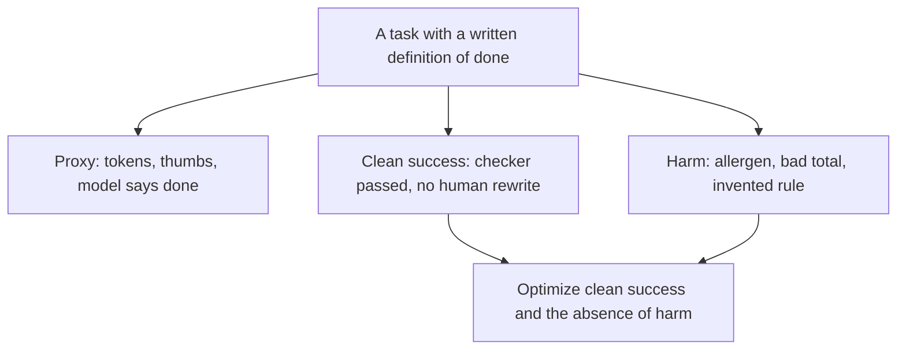
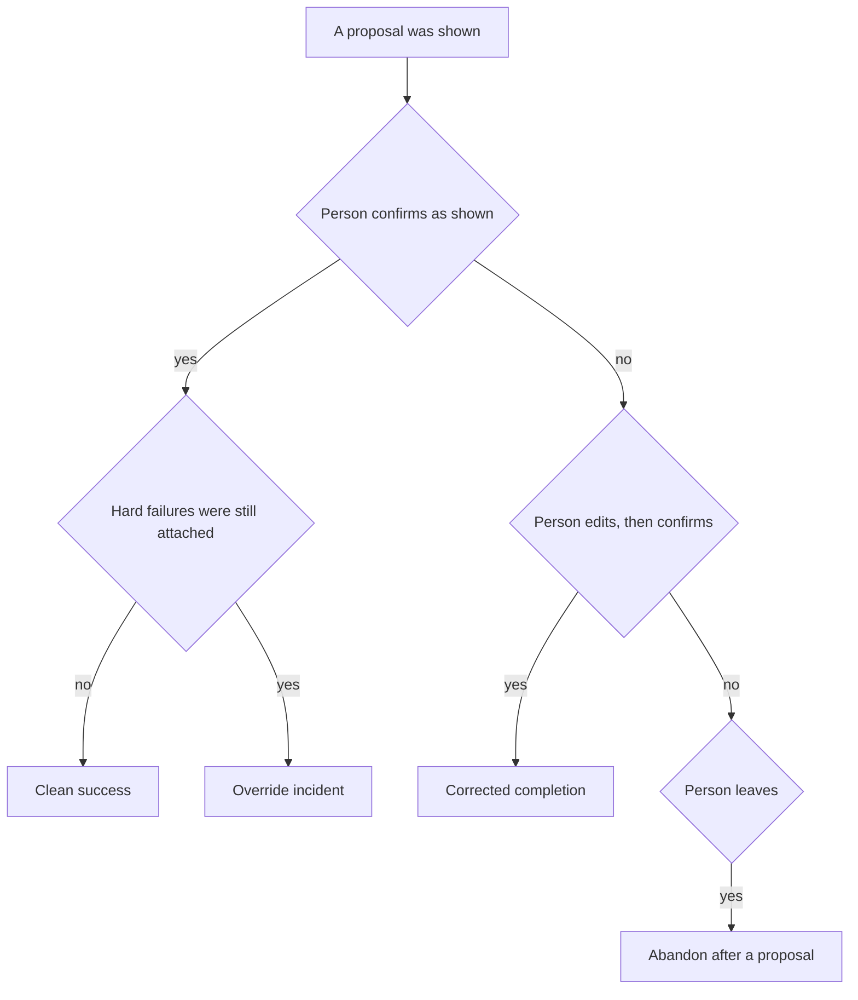
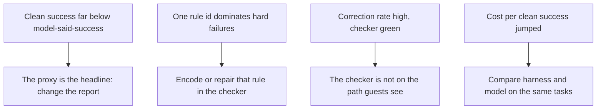

# Chapter 14: Production Signals and Honest Metrics

**Part III — Feedback loop**

Chapters 11 through 13 give you a checker, a suite, and a world you can reset. They do not tell you whether the concierge, on a real Tuesday, finished the work guests asked it to do. A dashboard full of token counts will move when you add a longer skill, and it will look like news. The claim of this chapter is that the number you optimize is a **finished task**: a cart or an answer that met the checker and the guest’s constraints, with the confirms, the corrections, the abandons, the money, and the wait attached to that task. Tokens are an ingredient. They are not the result.

Hearth Lane’s concierge, in this chapter, handles a week of small tasks. Some are carts. Some are questions about hours and shipping. A task ends when the guest confirms, when they correct the proposal and then confirm, when the checker blocks and nobody overrides, or when the guest leaves. The report you want is one page. It should be embarrassing in the right places. If clean successes are rare and the model’s own “done” flag is common, the page should show both, side by side, so you cannot confuse them.

## 14.1 Task success vs proxy metrics

A **task** is one request with an ending. “Two coffees for pickup under $40, with citations” is a task. “What time do you open on Monday?” is a different task. “What should we restock before the morning rush?” is a third. They do not share a definition of success, and a blended score will be dominated by whichever one is common. Monday hours are easy once the FAQ is in reach. The Saturday allergen cart is not. If you average them, the hours questions will hide Sam.

**Task success**, for a cart, means the proposal the guest was shown had an empty hard-failure list from Chapter 11’s checker, respected the constraints in the request, and was not quietly repaired by a person before it counted. For an hours question, it means the answer matched the FAQ, including the part where Monday is closed, and cited the file. For a restock, it means the suggestion named the stockout and did not sell a zero as a pile. Write the definition down per task type before anyone builds a chart. A metric without that sentence will be replaced by whatever the logging library already counted.

A **proxy** is a number that is easier to log than success and is only sometimes related to it. Proxies are useful as diagnostics. They are a bad thing to optimize, because the agent and the team will move the proxy. The concierge has a familiar set.

- **Tokens and tool calls.** A longer trace can be a model that read the policy and the FAQ, or a model that read them twice and still shipped the bun. Chapter 2’s step count is a trace field. It becomes a vanity metric when a weekly review celebrates “more tool use” after a change that added a useless retry.
- **The model’s own success flag.** If the prompt says “end with SUCCESS when you have helped,” the flag measures obedience to that sentence. A cart of almond buns can end with SUCCESS. Log the flag if you want to see the gap. Do not put it in the numerator of the rate you are trying to raise.
- **A citation substring.** Chapter 12’s weak grader passed wrong answers that contained `docs/`. A dashboard that counts “answers containing `docs/`” will rise as soon as the revision loop learns the same trick.
- **Thumbs and smiles.** A guest can thank a fluent wrong answer about the return window. Politeness is not the policy. A thumbs-up is a comment on the experience, and it belongs in a separate column from checker passes.
- **Sessions started.** Opening the concierge is not finishing a cart. A regression that makes the first reply slower can increase sessions, because people retry, and decrease finished pickups.

Here is a week in which the proxy and the task move in opposite directions. In week one the concierge answers in a single call, often from memory. It logs few tokens. It also tells three guests that opened coffee returns within fourteen days, and it proposes cardamom buns to one guest who said nuts. Clean task success is low. In week two you add the checker and a revision loop. Token counts rise. Two of those four tasks now end as refusals that the checker can defend, and one becomes a corrected cart of espresso. Clean successes may rise only a little, because a refusal is not a clean success, but harmful carts fall. A review that ranks the weeks by tokens will say week two got worse. A review that counts harmful carts and finished, checkable work will say week two started telling the truth. Chapter 1’s product of model, harness, and feedback is visible here. Week two changed the feedback factor. The token chart measured the harness getting longer.

*Figure 14.1. Proxies are logged beside the task. The number you optimize is clean success, together with the harms the checker knows how to name.*

Figure 14.1 keeps the proxy on the page and off the trophy. You still want token counts when you debug a bill. You want them in the cost section below, tied to finished tasks, not as a stand-in for whether the bun was legal.

Separate task types in the log. A record that says only `success: true` cannot be sliced. Include `task_type` with a small enum you will actually use: `cart`, `policy_question`, `restock`. Include the checker’s rule ids when it failed. Include a Boolean the model emitted, under a name that cannot be mistaken for the Boolean you computed. `model_said_success` next to `clean_success` is a healthy embarrassment when they disagree. In the lab fixture they disagree on purpose. If your report’s headline rate uses the model’s flag, the test should fail, because that is the proxy mistake in numeric form.

Clean success is allowed to be strict. A cart that passed only after Maya deleted the buns is not clean. It is a correction, and the next section counts it. A cart the checker rejected, which a staff override released anyway, is not a success. It is an override, and Chapter 11 asked you to log it as an incident. If you fold overrides into the success rate, the fastest way to raise the rate is to press the button. The metric will teach the behavior you were trying to inspect.

## 14.2 Confirms, corrections, abandons

The checker’s verdict is not the end of a task that a person has to accept. Guests and staff close the loop with three moves, and each one is a different signal. Logging only “the session ended” collapses them into a single shrug.

A **confirm** means a person accepted the proposal that was shown. For a cart, Jules taps the cart after the total and the citations are on the screen. For a restock, Rafi accepts the list. A confirm on a checker-clean cart is evidence that the artifact and the human’s standard met. It is not proof the catalog is right; it is proof this person did not object. A confirm on a cart that still has a hard failure is an override. Count those separately. A high override rate on `allergen` means the rule is wrong, or the button is too easy, or both. Do not average overrides into confirms and call the average “acceptance.”

A **correction** means the person edited the proposal before accepting it, or rejected it and stated what was wrong. Maya takes the buns off and leaves the espresso. A guest says “you quoted $6 shipping and then your total forgot it.” The session can still end in a completed order. That eventual completion is real, and it is not a clean success. The correction is a labeled failure of the proposal the agent made. It is also the most useful preference data you will get without a research project. Chapter 15 wants the pair: the rejected cart and the cart the person kept. If you log only the final cart, you have thrown away the mistake. Log the proposal before the edit and the proposal after, with the task id on both.

An **abandon** means the person left without a confirm. Abandons are ambiguous, and the log should keep the ambiguity instead of laundering it into a failure rate that pretends to be precise. A guest who asks for Monday’s hours, receives “closed (docs/faq.md),” and leaves has often finished in the only way that task finishes. There is nothing to confirm. A guest who was shown a cart and left without confirming has abandoned a proposal. A guest who never received a proposal, because the agent asked four questions and the guest had Rafi’s patience, abandoned the conversation. Split the rate. `abandoned_after_proposal` is a product signal. `answered_and_left` on a question-shaped task may be success. The schema can store `proposal_shown` so the split is possible later even if the first report uses a coarser rate.

*Figure 14.2. Confirms, corrections, and abandons are different endings. A confirm that ignores a hard failure is an override, not a clean success.*

Figure 14.2 is the state machine to implement in the logger. The labels are boring, and that is what you want when you read the page a month later. “Happy path” is not a state. `clean_success` is a state.

Eventual completion is the sum of clean successes and corrected completions. Report it beside the clean rate, not instead of it. A week in which every cart is corrected and then confirmed is a week the shop survived and the agent did not perform. The eventual-completion number will look like a win. The correction rate says the recommender is making drafts a person has to repair. If you optimize eventual completion alone, you will ship a talkative assistant that leans on Maya. Maya is the most expensive checker in the building, and Chapter 11 already argued that people are a poor adder of totals. A rising correction rate on `total_mismatch` means the checker is not in the path the guest sees, or the stated total is bypassing it. That is a harness bug with a number attached.

Abandons need a denominator you believe. Divide abandons after a proposal by tasks that showed a proposal, not by every session that loaded the front page. Divide question-task abandons only after you have decided that leaving was a failure for that task type. The lab’s fixture marks each task with `confirmed`, `corrected`, `abandoned`, and `proposal_shown`, so the report can compute the rates without guessing. When you instrument the real concierge, emit those Booleans from the harness at the moment they become true. Do not reconstruct them from whether the last message was polite. Reconstruction is how a proxy sneaks back in.

A correction is a gift only if someone reads it. Once a week, take the corrected carts, group them by what changed, and promote the pattern that repeats. Three corrections that remove cardamom buns are one Chapter 12 case you already know, plus evidence the checker is not running on that path. Three corrections that change a delivery address from outside the three-mile radius are a missing constraint. One correction about tone is a note, not a case. The promotion rule from Chapter 13 still applies: a signal that does not become a fixture will be forgotten by the next edit.

## 14.3 Cost and latency to a finished task

The bill and the wait are properties of the task, not of the call. A single cheap completion that proposes the wrong cart, followed by two revisions and a human correction, can cost more than a larger model that passed the checker on the first try. If you rank configurations by the price of one token, you will prefer the cheap wrong cart. **Cost to a finished task** adds up everything you spent to reach the ending, and then asks how that spend sits next to the endings you actually wanted.

Include, on the task record, the ingredients you can measure.

- Model spend, in money if you are on a hosted API, and in tokens either way. Chapter 3’s local Ollama path may show a money cost of zero. The wait is still real. Log both. A zero dollar figure that hides a twenty-second pause will send Rafi back to a paper list.
- Tool time, if a stock query or a file read dominates. A pathologically slow catalog lookup is a harness cost, not a model cost.
- Retries and revisions. The revision loop from Chapter 11 spends another call per pass. That spend belongs to the same task id. A new task id per retry will make every attempt look cheap and will hide the cart that took five tries.
- Human time only if you can do it without fiction. A correction costs Maya a moment. You may not have a timer on it. A count of corrections is an honest stand-in. An invented “five minutes per correction” presented as a measurement is a proxy in a costume. If you estimate, label the column as an estimate.

The summary number this chapter uses is **cost per clean success**: total spend across the tasks in the slice, divided by the number of clean successes. Failed tasks are in the numerator. They were not free, and a configuration that burns money on allergen retries should look expensive per good cart. Also report **cost per eventual completion**, so a week of corrected-then-confirmed carts has a number that is not infinite. If clean successes are zero, the cost per clean success is undefined. Print “no clean success” rather than dividing by zero and rather than falling back to cost per token. The absence is the result.

A second configuration can spend more per call and less per clean success, because it succeeds more often. Chapter 15 is the bake-off that puts a skill patch and a larger model in that comparison. This chapter only insists that the bake-off’s cost column be this one. A table that shows the large model “costs more” because its sticker price per token is higher has not finished the arithmetic.

**Latency to a finished task** is wall time from the request until the ending you named: the confirm, the defended refusal, or the abandon. It is not time-to-first-token. A fast first token followed by a long tool loop still makes Sam stand at the counter. Report a median and a tail. The median describes the ordinary cart. The tail describes the task that hit the revision cap, the hosted timeout, or the repeated `read_file` from Chapter 2. Rafi’s persona in Chapter 13 fails when the agent is slow, even if the eventual restock list is correct. The p95, or a simple high percentile you define once, is the Rafi number. An average hides it behind a pile of easy hour questions.

Define the percentile in code and keep the definition stable. The lab uses the lower median: sort the latencies of the tasks in the slice, and take the element at index `(n - 1) // 2`. Odd counts then land on a middle element, and you do not have to argue about averaging two floats. Use the same function for every arm of every later comparison. A dashboard that changes the definition between weeks will show movement that is only the definition.

Attribute spend and latency to `task_id` at log time. Reconstructing them from a vendor invoice is how a shared API key turns into a blended bill nobody can tie to Saturday’s carts. The harness already knows when a task starts and ends. Emit one record at the end, or emit spans and fold them in the report. Chapter 22 will talk about traces you can replay. The metric record is the small projection of that trace: outcome, rule ids, cost, latency, task type. You should be able to compute the page from the projection without opening every span, and you should be able to open the span when a number looks wrong.

Local and hosted paths from Chapter 3 need a label on the record. `provider` and `model` are dimensions, not details. A week that mixes a laptop model and a hosted model in one average will move when the mix moves, and you will narrate it as a quality change. Slice the page by model when both are in the log. The bake-off in the next chapter depends on that slice being possible.

Chapter 24 will treat routing, caching, and fewer turns as ways to change the cost of a finished task. This chapter does not build a router. It builds the receipt the router would have to improve. A cache that skips the checker to save a call has made the receipt dishonest. The cost went down and the harm came back, and only the task-level log will show both.

## 14.4 Dashboards builders actually use

The page that helps is short, current, and tied to decisions. It answers which factor to move next. It does not celebrate that the concierge exists. A builder’s page for Hearth Lane can be one screen with the following lines, computed over a window you name, such as the last seven days, and sliced by `task_type`.

- Clean success rate, with the count beside the rate. A rate with no count will swing when the week was quiet.
- Eventual completion rate, so corrections are visible as the gap between the two rates.
- Confirm rate, correction rate, and abandon-after-proposal rate, using the denominators from Section 14.2.
- Override count, not folded into success.
- Hard failures by rule id: `allergen`, `over_budget`, `missing_citation`, `total_mismatch`, `not_shippable`, `outside_delivery_window`. A single “failure” bucket hides the rule you could fix this week.
- Cost per clean success, and cost per eventual completion, with “no clean success” when the count is zero.
- Latency median and a high percentile, for finished tasks, by task type.
- The model-said-success rate, printed next to clean success so the proxy stays visible and unpromoted.
- A short list of the latest failures: task id, rule id, task type. The list is how you get from the rate to a Chapter 12 case.

Leave the rest off until you have a decision that needs it. Monthly active guests, a blended “quality” score, a token chart with no task id, a leaderboard of prompts: those pages fill up and do not tell you whether Sam was offered a bun. If a number does not change what you will edit, it does not earn a place above the fold. You can keep the raw log. You do not have to chart it.

*Figure 14.3. The page is for the next edit. Each pattern points at a factor: the report, the checker, the path, or a measured choice between harness and model.*

Figure 14.3 is how you read the page in a weekly review. Bring the Chapter 13 runs to the same meeting. If `allergic_saturday` is red in CI and `allergen` is also common in the live log, you are looking at one bug in two places, and the sim will tell you when it is gone. If the sim is green and the live log is red, the world has drifted. Guests are asking for something the persona does not cover, or the live path is not running the checker the sim runs. That is a harness finding. If both are green and guests still correct totals, the checker’s total and the number on the screen are different fields. Walk the path. Do not swap the model because the chart was red and a swap is available.

The review cadence can be weekly and short. Read the rates, read the top rule ids, open two traces, decide the one edit you will make, and name which number should move if the edit worked. Hold the other factors still, which has been the instruction since Chapter 1. A week that changes the model, the skill, and the checker together will move the page and will not teach you anything you can repeat. Chapter 15 is the controlled version of that decision. This page is where you notice you need it.

Privacy sits on the logging path. The lab’s events are fictional, and they contain no guest who can be recognized. A real counter’s log will try to grow an address, a receipt, a Wi-Fi password someone pasted, a card number that should never have reached the model. Do not put those fields in the metric record. The metric record needs task type, outcome, rule ids, cost, latency, and a task id you can join to a trace that is stored under a stricter rule. Appendix D is the place for the longer safety list. The dashboard requirement is narrower: the page people leave on a monitor should be readable without exposing a guest. Rule ids and rates satisfy that. Raw questions may not, once the questions are real.

Build the page as a report you can regenerate from the log, not as a screenshot you annotate. The lab’s script reads a fixture of task records and prints the page. When a number looks wrong, you fix the aggregation or the log, and you run it again. A spreadsheet that was edited by hand will not match next week’s export, and the argument in the review will be about the spreadsheet. The concierge’s log is the source. The report is a function.

One more cut keeps the page honest as the shop gets busier. Do not add a metric because a tool emitted it. Add it because a decision in Figure 14.3 needed it and the current page could not make that decision. Builders drown in dashboards that were easy to instrument. The concierge needs the opposite: a receipt for finished work, a list of the rules that blocked it, and enough cost and latency to know whether the fix is affordable at the counter.

## Lab

Log task outcomes, confirms, corrections, abandons, cost, and latency. Build a one-page report that separates clean success from the model’s own success flag, and that prices the work per finished task. The fixture is a week of the concierge. Your report is the function that reads it.

The records, the definitions, and the checks are in the [Chapter 14 lab](../../labs/ch14-production-signals-and-honest-metrics/README.md).

**Builder takeaway:** Optimize finished work, not tokens.

A token is a cost on the way to a cart, an answer, or a restock list. The finished task is the thing the guest and the shop can use. The checker says whether that thing was allowed. Confirms and corrections say whether a person agreed. Cost and latency say what it took. The last chapter of this part asks which lever you pull when those numbers are not good enough: another edit to the harness, or a different model, measured on the same page.
