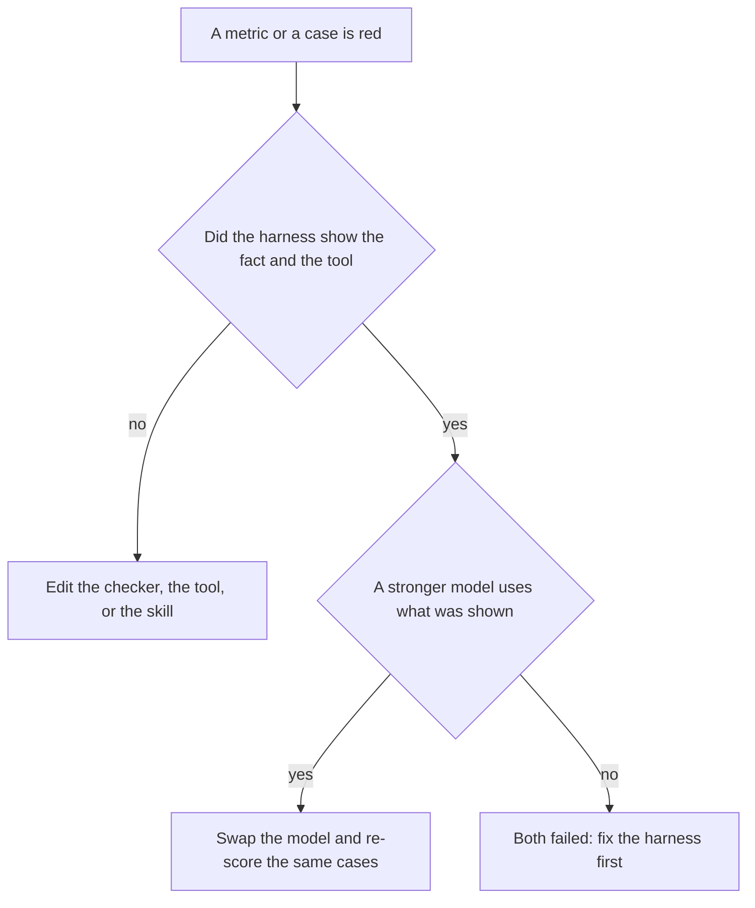
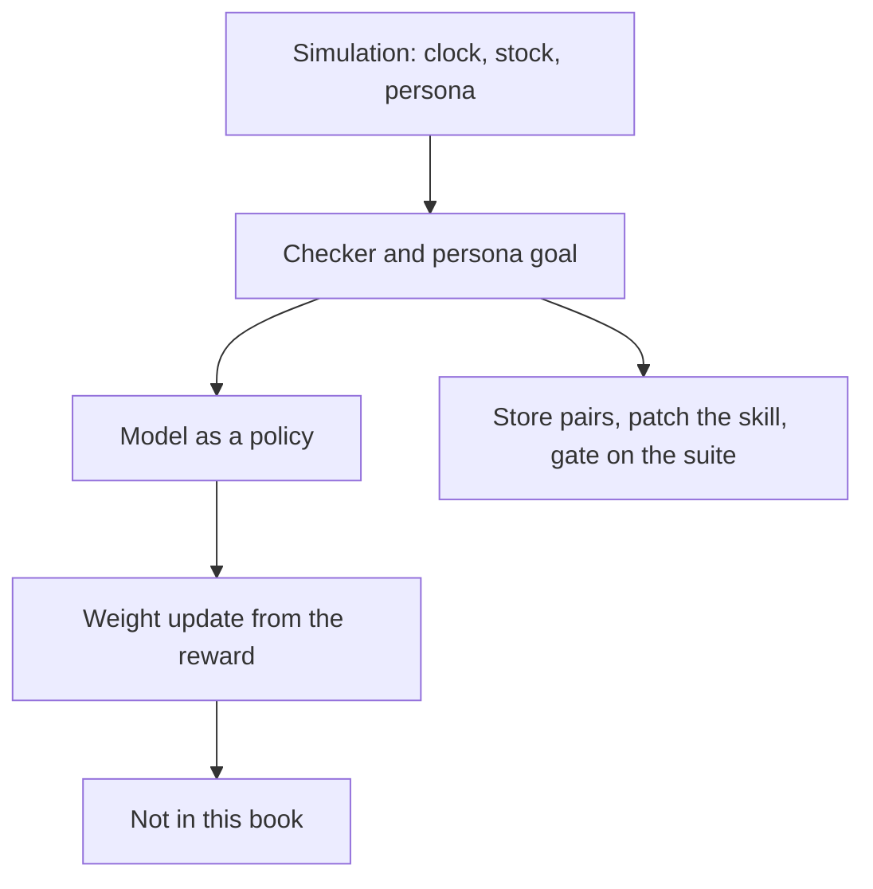
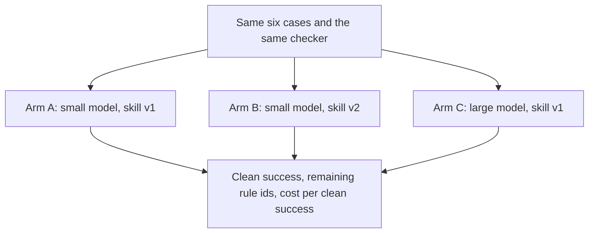

# Chapter 15: Pulling the Model Lever (Lightly)

**Part III — Feedback loop**

The last four chapters built a feedback loop you can run without worshipping the weights. A checker refuses carts. A suite refuses regressions. A simulation resets Saturday. A report says whether finished tasks got better, and what they cost. The remaining temptation is to answer every red number by changing the model. Sometimes that is the right edit. Often it hides a missing rule, and the bill goes up while the allergen bug stays. The claim of this chapter is that the model is one lever among the three from Chapter 1, and you pull it when a comparison says the weights are what failed. You compare it with a harness change — a skill or a prompt patch — on the same cases, the same checker, and the same metric. You do not train a new model in this book. You learn to tell when training would even be the question.

The concierge still serves Hearth Lane. The bake-off at the end uses recorded runs so you can do the arithmetic on a laptop, with no cluster and no second API key. The story those runs are built to show is a split you should expect in real comparisons. A tighter skill makes a small model refuse the almond bun and cite the FAQ. A larger model, given the old skill, calls the stock tool Rafi needs and still sells the bun, because nobody put the bun in the instructions. Neither lever, alone, finishes the suite. The page from Chapter 14 is how you see that, instead of declaring a winner from the demo that felt smart.

## 15.1 When to change the model vs the harness

Chapter 1 gave you the repair rule. Name the factor that failed, and hold the others still. Chapter 3 practiced it by swapping weights while the loop, the documents, and the sampling limits stayed put. This chapter applies the same rule after the feedback loop exists, because the loop changes what “the model failed” looks like.

Change the **harness** when the trace shows a missing or unused piece of program.

- The checker does not contain the rule. Saturday delivery succeeds because no function compares `now` with the Tuesday–Friday window. A larger model that happens to refuse Saturdays has memorized a calendar. It has not put the rule where the next model is forced to live with it. Write `outside_delivery_window`.
- The tool does not exist, or the observation does not include the stock. Rafi’s oat milk is zero in the database and absent from the message list. The model invents a count of “plenty.” Chapter 2’s empty tool log is this failure. Adding a model does not open a tool you did not register.
- The revision loop never runs, so the checker’s findings are printed in a log the model does not see. The next draft repeats the bun. Wiring the finding into the next observation is a harness edit. It is the loop in Figure 11.1.
- The skill contradicts the policy, or the policy sentence is only in a file the agent is not asked to read. Fix the skill or the read. Do not pay a larger model to guess which sentence you meant.
- The metric moved because you measured a proxy. Chapter 14’s `model_said_success` rose after you added the word SUCCESS to the prompt. That is a harness edit with a vanity result. Revert it. Do not “upgrade” it.

Change the **model** when the harness is actually offering the right information and the right tools, and this set of weights does not use them, while a comparison model does.

- `read_file` or `read_stock` is in the tool list. The small model answers from memory. A larger one returns a tool call. You saw the empty-log version in Chapters 2 and 3. The repair is the model, or a smaller harness change that the small model can follow, if you can write one. The bake-off is how you tell those repairs apart.
- The checker’s findings are in the next observation, the revision budget remains, and this model cannot repair a cart it has been told is over budget. A stronger model repairs it inside the same budget. The finding text was held still. The weights changed.
- The task needs a synthesis the skill should not hard-code: a short explanation that mentions two clauses of the shipping policy without dropping either. If both models see the file and only one of them keeps both clauses, you have a model gap. If neither sees the file, you are back in the harness list.



*Figure 15.1. Pull the harness lever when the fact never reached the model. Pull the model lever when the fact was in the trace and a comparison model could use it.*

Figure 15.1 is a filter against the expensive mistake. Most red cases in a young concierge fail the first question. The allergen was not in the checker. The clock was the laptop’s clock. The skill never mentioned pastries. A model swap on top of that miss is a larger voice repeating the miss, or a larger voice that happens to avoid it until the next phrasing. You will not know which, because you changed the weights and left the hole.

One change at a time is still the rule. A week that ships a new skill and a new model has two explanations for every moved number. Chapter 3 asked you to keep `TEMPERATURE` and `MAX_TOKENS` in `labs/common/client.py` while the provider changed, so a citation difference could be attributed to the weights. The bake-off in Section 15.4 does the analogous thing. Arm A is the baseline skill and the current model. Arm B changes only the skill. Arm C changes only the model. A fourth arm, both changes, is informative and is not required to make a decision. If you run only the fourth arm, you have recreated the muddy week.

Cost is part of the decision, and Chapter 14 already defined it. A model that raises clean success from one task in six to three, at several times the spend per success, may be the wrong buy for a counter that was missing a five-line skill. A model that raises the one case the skill cannot teach — a stock tool the small model never calls — may be the right buy for that case only. Chapter 24 will talk about routing small models to easy reads and larger models to the hard synthesis. Routing is a harness around two levers. You earn it by measuring the levers separately first. A router built on a hunch will send Sam’s cart to the cheap model and the hours question to the expensive one.

Write down what you held still, in the same note as the result. The cases, the checker version, the revision budget, the clock in the sim, the skill text, the model name: if the note omits one of them, the next person will change it accidentally and compare the new trace with yours. The lab’s recorded rows include `model` and `skill` so the held-still fields are visible. A live bake-off should print them the way Chapter 3’s script prints `BASE_URL` and `MODEL`.

## 15.2 Preference data from checker rejects

A **preference pair** is two proposals for the same request, with a judgment about which one is better. In this book the judgment comes from the checker and from a person, not from a training run. The rejected side failed a named rule. The preferred side passed the checker, and a person confirmed it or wrote it as the repair. You store the pair because it is the smallest record of “this cart, not that one” that a later process can use. The later process, here, is an eval case and a skill patch. It is not a fine-tune.

Checker rejects are a good source because they already have structure. Chapter 11 logs the proposal, the rule ids, and the computed total. When the revision loop produces a second proposal that passes, you have both sides of a pair from the same task id. When the loop gives up and Maya edits the cart, Chapter 14’s correction log has both sides, and the human edit is the preferred side. When you are building the first suite by hand, you may write the preferred cart once, from the policy, and pair it with a bad proposal you have already seen. That is legitimate if the request is the same. A preferred cart you wrote for a different budget, or a different guest, is not a pair. It is two unrelated orders, and a learner — human or otherwise — will draw a false lesson about prices.

```json
{
  "case_id": "allergy_saturday",
  "rule_ids": ["allergen", "outside_delivery_window"],
  "rejected": {
    "items": [{"sku": "cardamom-bun", "qty": 1}],
    "fulfillment": "delivery"
  },
  "preferred": {
    "items": [{"sku": "house-espresso", "qty": 1, "citations": ["docs/faq.md"]}],
    "fulfillment": "pickup"
  },
  "source": "human_correction"
}
```

The fields are the whole product. `case_id` joins the pair to the suite and to the sim. `rule_ids` says why the rejected side lost, so a pair that failed on a total is not mixed into a story about tone. `source` says whether a revision loop, a human, or a builder produced the preferred side. Those sources are not equal. A revision the checker accepted is a pair about the rules you encoded. A human correction the checker would still reject is a sign the checker is incomplete, and the pair belongs in the review queue from Chapter 11 before it belongs in a training pile. `source` keeps that argument possible.

What you do with pairs in this book:

- Turn the rejected side into a Chapter 12 case if the constraint is not already there. The preferred side becomes a known-good answer when it is an answer, or a cart the checker should accept.
- Read a stack of pairs before you edit a skill. If five rejects are `missing_citation` on menu prices, the skill’s first lines should say that a price cites `docs/faq.md`. The pairs are the evidence for the patch in Section 15.4. A skill written from taste will not match the stack.
- Keep the rejected side. A dataset of only final carts teaches the next reader nothing about the bun that was refused. The failure is the lesson. Chapter 12 made the same point about known-bad answers. Preference data that drops the loser is a trophy case.

What you do not do, in this book, is update weights from the pairs. There is no training loop in the labs, and there is no instruction for renting a cluster. The pairs are still worth collecting. They are the currency that a later training job, or a vendor who offers to “learn from your logs,” would consume. If you have not stored them, the only thing you can hand that job is a pile of final answers and a request to imitate them, including the ones Maya had to fix. Storing pairs is harness work. It is a schema and a log line. It is the same kind of work as storing the stop tag in Chapter 2.

Quality checks on a pair are simple enough to automate, and the lab does. The rejected proposal and the preferred proposal are both present. They are not identical. The rule id list is non-empty. The preferred cart passes the same checker that rejected the other side, unless `source` says the checker is under review. A pair whose preferred side fails `allergen` is a corrupted label. Training on it, later, would teach the harm. Even when you are only using pairs as evals, a corrupted preferred side becomes a known-good fixture that is not good, and Chapter 12’s gate will protect the wrong cart. Run the checker on both sides when you build the pair. Do not trust the log’s old verdict if the checker has changed since the log was written. Re-score.

Volume matters less than the coverage of rule ids. Thirty pairs about Monday’s hours will not help the shipping fee. A handful of pairs for each hard rule in Chapter 11 will show you whether the skill mentions that rule. When a rule has rejects and no preferred side, you do not yet know what the repair looks like. Leave those rows in the reject log and out of the pair file. Inventing a preferred cart you have not checked is how a fictional repair enters the suite. The lab’s raw log mixes complete pairs with rejects that have no repair yet. Your builder function keeps only the complete ones. That filter is the exercise. A function that emits a pair for every row will treat a missing repair as a preference.

## 15.3 Env-style training (survey; what you won't do in this book)

There is a family of training methods that treat an agent as a policy in an environment. The environment is a world that returns observations and rewards. The policy is the model. The training loop changes the weights so the policy collects more reward. Games made this picture famous. Shops borrow it. The simulation in Chapter 13 is an environment: a clock, a stock map, a persona, a set of forbidden actions. The checker is a candidate reward: a positive signal when the cart has no hard failures and the persona’s goal is met, a negative signal when the bun appears or the card is charged. **Environment-style training** is the attempt to adjust the model from that signal, instead of only adjusting the skill and the checker by hand.

You will see several names for pieces of this picture. Reinforcement learning from human feedback uses preferences like the pairs in Section 15.2, usually collected from people ranking answers, to train a reward model and then a policy. Reinforcement learning from verifier feedback, or from a checker, replaces or supplements the person with a program. Rejection sampling and supervised fine-tuning on the preferred side only are lighter variants: keep the carts the checker accepted, train the model to imitate them, discard the rest. Some vendors bundle these under “agent training” or “fine-tuning on your traces.” The bundle always hides a reward. If you cannot point at the reward, you do not know what the new weights will try to satisfy.

The picture is coherent, and it is easy to sell past the point where it helps a café. It helps when three things are already true. The environment matches the shop on the facts that matter, which is Chapter 13’s fidelity question. The reward matches the requirement, which is Chapter 12’s grader question. The harness is already showing the tools and the findings, which is Section 15.1. When those are true, a model that still will not follow a skill you have simplified may be a candidate for a training run you do outside this book, with a team that knows how to hold out a test set. When they are not true, training fits the hole. A reward that is “the string `docs/` appears” will produce the cheat from Chapter 12, in the weights, where a one-line skill edit would have been reversible. A sim that forgets allergens will train a policy that forgets them with confidence. A log of Maya’s overrides, used as positive reward, will train the model to propose carts she can rescue, including carts the checker should have blocked.

This book stops before that run. You will not provision a cluster, write a custom loss, fine-tune an open weight, or call a fine-tuning API. The labs stay inside a checker, a pair file, and a comparison of recorded outputs. The reasons are practical, and they are the same reasons the early chapters refused to train a model to answer the return question.

- The data you want is the pairs and the suite, and those are useful before any training. Build them first. Many apparent model gaps close when the skill states the rule the pairs keep repeating.
- A gameable grader becomes a gameable reward. Chapter 12 has to be boringly solid before a training loop should see it. The weak keyword grader is a demonstration of what you must not optimize.
- The sim has to be faithful on harm. Training against a Saturday that still allows delivery will spend real compute to preserve a bug.
- Evaluation has to stay in human hands. Chapter 25 allows a narrow kind of self-improvement: the agent may propose a patch to a skill, and a person merges it only if the Chapter 12 suite stays green. That is an edit to a text file. It is not an edit to the weights. The suite cannot gate a training run that the agent also uses to rewrite the suite.
- Customer data leaves your machine when a hosted training API receives traces. Chapter 3 already said that a tool result sent to a hosted chat API is a disclosure. A training upload is a longer-lived one. The fictional café can be uploaded without harm. A real receipt cannot.



*Figure 15.2. Environment-style training closes a loop from the simulation’s reward back into the weights. This book stores the pairs, patches the skill, and gates on the suite instead.*

Figure 15.2 is a survey, not a plan. If a vendor offers to train on the concierge’s traces, the questions are the figure’s boxes. What is the reward, in code? What did the sim omit? Which cases are held out of the training file? Who is allowed to change the grader after the run? What happens to a guest’s words when the job is done? A vendor who cannot answer those is offering a larger model with extra steps, or a smaller one that imitated your bugs. You already know how to swap a model honestly, from Chapter 3, and how to measure it, from Chapter 14. Training is a third operation. It needs the first two in place, and it needs a competence this book does not try to teach in a lab.

The honest summary for a product manager is short. Collect the rejects and the repairs. Make the checker something you would be willing to show the model. Simulate the harmful days. Measure finished tasks. Edit the skill when the pairs say the instruction is missing. Swap the model when the trace says the instruction was present and ignored. Revisit training only when those levers stall and the reward is a rule you can defend. Chapter 27 lists grader gaming as an open problem because that “only when” is easy to skip. The skip is how a café pays to bake a weak grader into a weight file.

## 15.4 Bake-off: skill/prompt patch vs model swap

A **bake-off** is a comparison with the factors named. Here there are three arms, scored by the Chapter 14 definitions, on the same six cases. The cases are the ones the book has been worrying about: an allergic guest on Saturday, a shipping total near $40, an hours answer that must cite the FAQ, a pastry that must not ship, a stockout of oat milk, and a simple espresso pickup that every arm should get right. The checker is held still. The revision budget is held still. What changes is written on the arm.

**Arm A, small model, skill v1.** The baseline. The skill is a short concierge brief. It does not mention allergens, it does not require a citation path, and it does not say that pastries stay in the building. The small model does not call the stock tool. On the fixture this arm cleanly succeeds only at the espresso pickup. The other five cases fail in the ways the earlier chapters named: the bun, the missing fee or the missing citation, Monday or the shipping sentence without a source, the bun on a truck, the oat milk that is not there.

**Arm B, small model, skill v2.** Only the skill changes. The patched skill states the rules the preference pairs kept surfacing. Cite `docs/faq.md` for a price and `docs/policy.md` for shipping and delivery. Do not propose an item whose catalog allergens hit the guest’s avoid list, and treat nuts as including almonds. Do not ship pastries. Compute totals from the catalog, including the $6.00 fee under $40. The small model can follow a short list of rules. It still does not call `read_stock`, so Rafi’s oat-milk stockout fails. The other cases pass. Clean success moves a lot. The remaining miss is the one the patch did not teach because it is not a sentence. It is a tool call.

**Arm C, large model, skill v1.** Only the model changes. The large model calls tools. It reads the policy and refuses to ship the bun. It reads the stock and does not sell oat milk that is gone. It still lacks the allergen rule and the citation requirement, because those were not in skill v1 and this arm was not allowed to sneak them in. Saturday delivery may be refused by a model that knows calendars; the bun can still be in the cart, and the case still fails. Clean success moves less than the skill patch, and it moves on different cases. The spend per task is higher, which Chapter 14 told you to put in the same table as the success rate.

```text
small + skill v1    1 of 6 clean    the suite’s misses, almost intact
small + skill v2    5 of 6 clean    stockout: the stock tool is never called
large + skill v1    3 of 6 clean    allergen and citations: the skill never stated them
```

That tally is what the lab’s recorded rows add up to. Your report should recompute it from the rows rather than trust this paragraph. If a later edit of the fixture changes a row, the paragraph in a chapter can go stale, and the report will not. That is the Chapter 14 rule applied to the bake-off itself.



*Figure 15.3. A bake-off holds the cases and the checker still. One arm changes the skill. One arm changes the model. The metric is Chapter 14’s, not a demo.*

Figure 15.3 is the whole method. Reading it as “the skill won” is too coarse. The skill won the cases that were missing sentences. The model won the case that was a missing tool call, and it did so without fixing the sentences. A shop that picks Arm B and stops will keep failing Rafi’s morning until the harness grows a tool the small model will use, or until a later arm puts the large model on that case only. A shop that picks Arm C and stops will keep proposing the bun, more fluently, and will pay more per finished espresso. The decision the table supports is a sequence. Patch the skill, because the pairs already said the rules were missing, and re-score. Then spend the larger model on the residual, which in this fixture is tool use, and re-score again. The fourth arm — large model plus skill v2 — is the obvious next measurement. It is not in the minimum bake-off, because two levers at once would have blurred the first reading. Run it after you know what each lever did alone.

Cost per clean success will not rank the arms the same way a sticker price does. Arm C can cost less per call than a dramatic invoice and still cost more per good cart, because the numerator includes the failed allergen tasks and the denominator is smaller than Arm B’s. Arm B can cost slightly more per call than Arm A, because the skill is longer, and still cost less per clean success, because five tasks finish clean instead of one. Use the Chapter 14 definition. If the lab’s micro-dollar figures surprise you, check whether you divided by attempts or by clean successes. The second division is the one that matches “what did a good cart cost.”

Holdout still matters when the bake-off is live rather than recorded. If you wrote skill v2 while staring at all six cases, Arm B’s score is “did the patch encode the cases you stared at.” Keep one case out of the editing session, even if it stays in the final table, and notice whether it moved. A patch that names `cardamom-bun` and fails on a new almond pastry has memorized a SKU. A patch that defers to the catalog’s allergen field will survive the new pastry. The pairs will tell you which patch you wrote, if the preferred carts were built from the catalog rather than from a single forbidden SKU.

The lab does not ask you to call two providers. The rows are recorded outputs with the checker’s verdict already on them, so the comparison is reproducible and the chapter does not depend on a hosted key. A live rerun is optional and should follow Chapter 3’s client: one `.env`, one model name at a time, the same cases, the checker from Chapter 11 left untouched. If you change `MAX_TOKENS` during the live rerun, you have pulled a third lever. Write that down or put it back. Recorded rows cannot drift. A live model can, especially a hosted name that points at a new snapshot. Pin the model id in the note next to the table when you go live. The recorded bake-off is the one the tests understand.

Bring the result back to the weekly page. The edit you merge is the one that moves the rule ids you meant to move, at a cost per clean success the counter can live with, without regressing the known-good espresso. Merge the skill patch as a diff you can read. Chapter 7’s framing is that a skill is a versioned procedure. A model swap is not a diff. It is a new behavior surface, and Chapter 12’s gate should be green on the frozen cases before you trust it with Saturday. If both arms are green on different subsets, you can ship the skill now and schedule the model comparison for the residual. Shipping both because the meeting is ending is the muddy week again.

Part III ends here. The feedback loop is a checker that can refuse, a suite built from the refusals, a world that can repeat the day the refusal matters, a page that counts finished work, and a rule for which lever moved that count. None of these steps trained a model. All of them make a later training decision, if you ever make one, harder to fake. Part IV starts from the cart this loop has accepted. Chapter 16 asks which actions may run once the cart is allowed: what the concierge may do by itself, what waits for a person, and what it must not do even when the model is sure.

## Lab

Build preference pairs from checker rejects, dropping rows that have no repair. Score a recorded bake-off of a skill patch against a model swap, using clean success and cost per clean success. No cluster, and no solution file: the rows are the evidence, and the summary is yours to compute.

The raw rejects, the skill texts, the recorded arms, and the checks are in the [Chapter 15 lab](../../labs/ch15-pulling-the-model-lever/README.md).

**Builder takeaway:** Model is one lever; measure which lever moved the metric.

A larger model can spend more to speak the same mistake. A skill patch can fix the mistake the pairs already named, and leave the tool call the small model never makes. The metric from Chapter 14, on a fixed suite, is how you see which lever moved which case. The weights are not the feedback loop. They are one factor the loop is finally able to judge.
