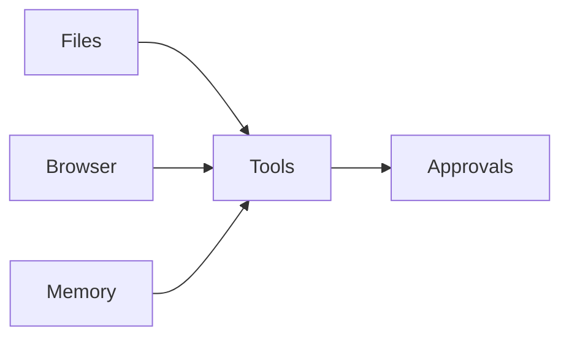

# Chapter 17: The Work-Agent Blueprint

A staff member at Hearth Lane can ask for a draft the customer will actually receive, and the dangerous moment is the moment the draft leaves the building. The claim of this chapter is that the desktop work agents of 2026 share one blueprint with the café concierge: files, sometimes a browser, a little memory, a set of tools, and an approval on the actions that commit a person. The domain changes which tools you register. It does not invent a new kind of program. The concierge that reads `policy.md` and the assistant that drafts a reply from the counter mailbox are the same loop, with a different principal standing in front of the confirm step.

The running example is a letter the shop owes a customer. Someone writes that they opened a bag of house coffee and want to know about a return. Chapter 2 answered that question in the window, from the policy file. Chapter 16 refused to let the customer-facing concierge email `sam@example.com` on its own. This chapter is the other desk: a staff work agent that may draft that email immediately, and may place it in the outbox only after the operator approves the exact text. The outbox in the lab is a folder on disk. Nothing in the exercise opens a mail server. The receipt of the action is the sent file, with a name on it for who approved.

**Agent quality = Model × Harness × Feedback loop** still applies, and the blueprint is mostly harness. The model proposes the wording and the next tool. The harness owns the files the draft may cite, the address the message may use as From, and the token that turns a draft into a sent record. The feedback is the pair of directories: a draft with `sent=0`, and, after the token, a sent file that names the operator. If those two states are not visible, you cannot tell a polite draft from a message that left.

## The 2026 landscape, as patterns

The products on offer in 2026 are easy to describe as a race and hard to use as a design. New names arrive faster than the failures do. The useful description is the pattern of work, because the pattern tells you which tier from Chapter 16 belongs on which tool. Five patterns cover most of what a practitioner is being sold. They are not a ranking, and they are not a promise that any one product implements them cleanly.

**A chat loop with tools** is Chapter 2, productized. The person types, the model requests a tool, the harness runs it, the result comes back, and a paragraph ends the turn. The café concierge is this pattern with `read_file` and, from the previous chapter, a price check. The failure mode you already know is an empty tool log: a fluent answer with the file still closed. The autonomy failure is newer only in the tools. If one of the tools sends, pays, or deletes, the pattern is incomplete until those names have tiers.

**A browser agent, or a computer-use agent,** looks at a page or a screen and proposes clicks. The page is a sensor, which is the subject of Chapter 8, and it is also untrusted text. A button on a page can be the exfil leg of the lethal trifecta from Chapter 16, because the model did not have to call `send_email` if it can click a form the page provided. Treat navigation that only reads as closer to auto, and treat a click that submits, purchases, or posts as confirm or never. "It is just the browser" is not a tier.

**A repository agent** reads and edits files in a project, and sometimes runs a shell. The files are the workspace. A patch that a person can diff is closer to a draft. A shell command is an action with a wide radius, and it belongs on confirm or never until you have jailed it the way Chapter 2 jailed `read_file`. The café analogue is small: the concierge may read `docs/` and may write a draft under the lab's own `var/` directory. It may not decide that the policy file itself should be rewritten because a customer was disappointed.

**An inbox or calendar assistant** drafts a reply or an event, then waits. This pattern is the lab. Drafting is auto, because the result is a file the person can open. Sending, or placing the event on a calendar other people can see, is confirm. The split is the whole product. An assistant that sends as it drafts has skipped the step the staff member was for.

**A research agent** browses, takes notes, and writes a memo. The memo is a draft. The pages it read are untrusted. The failure mode is a memo that cites a page the harness never fetched, which is the citation problem from Chapter 2 wearing a longer coat, plus the trifecta if the memo's tool can also post the memo somewhere. Saving the memo to a folder the person controls is a reasonable auto or confirm, depending on whether that folder is shared. Posting it is a different tool.

What these patterns share is easy to miss in a demo. Each one is a model in a loop. Each one needs a harness that performs side effects, or refuses them. Each one needs a person somewhere in front of the irreversible steps, unless you have a bound you can check in code and a record you can show afterward. Marketing that says the agent is autonomous is usually describing the loop, not the absence of a gate. The agents that are tolerable to leave running are the ones whose send, pay, and delete tools still stop.

A few things did change in the tooling around the pattern, and they are harness changes rather than a new species of model. Tool servers can be shared across products, which is the protocol point of Chapter 9. A task can outlive a single context window, which is Chapter 10. Memory can persist between sessions, which is Chapter 6, including the stale preference you forgot to delete. None of those additions pick a tier for you. A shared tool server that exposes `send_email` without a tier is a wider version of the same mistake, because every agent that connects inherits the exit.

When you evaluate a work agent you did not write, ask for the pattern first and the brand second. Which files can it read? Can it open the public web? What does it remember tomorrow? Which tool names exist? Which of those names are auto, which wait, and which are absent on purpose? A vendor that cannot answer the tier question has described a chatbot with extra buttons. You can still pilot it. You should pilot it on drafts.

## Files, browser, memory, tools, and approvals

The blueprint is five parts. You can draw them once and reuse the drawing when the shop problem becomes a support desk, a restock list, or someone else's product. The café concierge already has a small version of each part, even where the early labs left the part empty on purpose.

*Figure 17.1. The work-agent blueprint. Files, the browser, and memory feed tools. Approvals sit on the tools that commit someone.*

**Files** are the workspace. For the concierge, the workspace is `labs/ch02-your-first-loop/docs/`, and the tool that reads it refuses to climb out. For a desktop agent, the workspace might be a customer's folder, a repository, or an inbox export. The rule does not change with the folder's importance. Name the root. Reject paths that leave it. A draft written by Chapter 17's lab goes under that lab's `var/drafts/` directory, which is output, not a second copy of the policy. The policy stays the source. The draft quotes it.

**The browser** is an optional sensor, and it is never a trusted one. The early concierge does not browse. A work agent that does is reading text a stranger can change, which is Chapter 8. Put fetched text in the untrusted column of the trifecta review from Chapter 16. Do not promote a sentence from a page into a shop rule. The café's shipping fee remains the sentence in `policy.md`, not the sentence on a carrier's homepage that a model found more recently.

**Memory** is what survives the turn. Session memory is the message list. Durable memory is a store you chose, with a way to forget. Chapter 6 separates those. A work agent that remembers "this customer prefers oat milk" can be helpful at the counter and wrong after the customer changes their mind. The blueprint includes memory so you remember to bound it, not so you turn every chat into a permanent file. The email lab does not add a new memory store. The draft file is a document, and it is allowed to be deleted. Treat that as a feature.

**Tools** are the contract from Chapter 2: a name, arguments, a success result, and an error result the loop can carry back. The work-agent tools in this chapter are `read_file`, `draft_email`, and `send_draft`. A calendar version would be `draft_calendar` and a confirm step before the event exists where other people can see it. The contract is the same. Draft returns an id and a body. Send accepts that id and does nothing until the token matches the body the person was shown.

**Approvals** are Chapter 16's tiers, applied to this blueprint. Reads and drafts are auto. Send is confirm. Charge is still never, and it is not a tool in this lab. The approval is bound to the draft's id, the From address, the To address, the subject, and the body. Change the body after the token was printed, and the old token no longer matches. That is the slip from the previous chapter, now covering a letter instead of two buns.

A blueprint with a part missing fails in a recognizable way. No files, and the agent answers from habit, which is Chapter 1. No approvals, and a draft and a send are the same function, so the first fluent paragraph is also the message the customer received. No separation between browser text and shop files, and a page gets to write policy. Memory with no way to forget, and last year's preference outranks today's message. Tools with no error string, and the loop dies on the first bad address instead of telling the model the address was refused.

You can implement the five parts in a small program and still have the blueprint. The lab is that program. It reads the policy, writes a draft, and copies the draft to a sent folder only after `--confirm` carries the token for that exact text. `smtp=not_used` is printed on purpose. A local outbox is the right stand-in while you are proving the gate. A real mailbox is a later substitution of the transport, not a reason to skip the token.

## From the concierge to a desktop work agent

Lay the café agent next to a desktop agent and match the parts. The nouns change. The joints do not.

| Concierge | Desktop work agent |
|---|---|
| `docs/policy.md` and `docs/faq.md` | The brief, the contract, the repo, the inbox export |
| `read_file`, jailed to one directory | Read tools jailed to a workspace |
| `price_check` against the menu | A query against the system of record, not against the model's memory |
| `place_order` on confirm | Send, create the event, open the pull request, on confirm |
| `charge_card` never | Pay never, until a payments product with its own record exists |
| A citation such as `(docs/policy.md)` | A draft that names the file the sentence came from |
| One operator and one token | The same, with the person's name stored on the sent record |

The return letter is the walkthrough. The customer is Sam, at `sam@example.com`. The staff member wants a reply that states the shop's actual rule: opened coffee is final sale, an unopened bag with the valve seal intact may come back within 14 days, and the credit is a Hearth card, not cash. Those sentences live in `docs/policy.md`. The work agent is not allowed to soften them because a warmer email would feel more helpful.

The lab performs the walk in three tool calls, scripted so the trace does not depend on a model.

1. `read_file` on `policy.md`. The tier is auto. The observation begins with `PATH: docs/policy.md`. If that read errors, the draft is not written. A letter about returns that did not open the policy is the Chapter 1 failure with stationery.
2. `draft_email` to Sam, from `counter@hearthlane.example`, with a subject about the opened bag. The tier is auto. The body quotes the policy sentences rather than paraphrasing them into a new return window. The file lands in `var/drafts/`. The summary says `sent=0`. Sam has not been written to. The staff member can open the file and read it, which is the point of a draft.
3. `send_draft` for that draft id. The tier is confirm, including for Sam's external address, because this process is the staff agent and the flag that allows external mail is on. Without the token, the sent folder stays empty. With the token for this body, the harness writes `var/sent/` and records `confirmed_by=operator`, `acted_as=counter-staff`, and `smtp=not_used`.

The From address is not an argument the model may set. The lab fixes it to `counter@hearthlane.example`, the address `policy.md` already gives customers for damage in transit. A draft that tried to leave as Sam, or as some other mailbox, would be claiming a principal the operator did not grant. Chapter 16's customer concierge still cannot send this external message at all. The same `decide` function, called without the staff flag, returns denied even if you pass the token. The lab's self-check includes that call so the two maps stay visibly different. You did not weaken the concierge. You started a second program, with a person whose job is to send the shop's mail.

A calendar tool would use the same joints. `draft_calendar` would write an event the person can read: Tuesday, a delivery window, the address, the fee from the policy. Creating the event on a shared calendar would wait for a token bound to that event. The lab does not implement the calendar. If you can describe the draft, the confirm, and the record you would keep, you have the blueprint. Another tool name is not another architecture.

Desktop products add surfaces the café script does not have: a diff view, a mailbox picker, a tray icon. Those are the slip from Chapter 16, rendered for a different noun. If the surface shows a summary the token does not cover, the person approves a different action from the one that runs. Show the body. Bind the body. The long JSON line in the lab trace is ugly on purpose. It is the argument object the token hashes. The readable draft is printed above it so you can compare the two. If they ever diverge, the token is the one the harness believes.

## Who may act as the user

"Act as the user" is a phrase products use to mean that the outgoing mail, the calendar event, or the order will be read as if a particular person did it. That authority is easy to imply in a prompt and hard to justify from one. The prompt says the model is the concierge. The mailbox says the message is from the counter. Those are different claims, and only the harness can make the second one true or keep it false.

Three identities are already present in the return letter, and Chapter 22 will give them a fuller treatment. You need them now because the confirm button is meaningless until you know who it speaks for.

**The person** is the operator at the counter, or the customer in the window. They are not interchangeable. Sam asked a question. Sam did not grant the concierge the right to send mail from Sam's account, and Sam did not sit in front of this confirm button. The operator is the one who can put the café's name on a letter.

**The agent** is the process. In this lab it is labeled `work-agent`. It can read the policy and write a draft. It does not become the operator by being helpful. The sent record says `acted_as: counter-staff` only after the token matches, and it says `confirmed_by: operator`. Before that, the draft has a status of `draft` and no `confirmed_by` field that would pretend the send happened.

**The tool** is the outbox. It copies a file. It does not get to choose the From line, the recipient, or the moment of sending. A tool that accepted a From address from the model would let untrusted text pick a principal. The Chapter 16 warning about arguments applies: the address is part of the action. Here the harness overwrites it with the counter's address before the token is computed, so the person approves the address that will actually be used.

Delegation is a scope, not a vibe. For this letter the scope is small enough to write on the slip.

- **Mailbox.** From `counter@hearthlane.example` only.
- **Action.** Draft freely. Send only this draft.
- **Object.** This draft id, this subject, this body. A rewritten apology that offers cash is a different object and needs a different token. The policy does not allow cash refunds, and a token must not be reusable across a rewrite that violates it.
- **Time.** This run. The token is not a standing grant to send tomorrow's mail. A product that wants a standing grant has to show the limit in the same way Chapter 18's payment protocols talk about a pre-authorized bound, and it has to keep a record of each use. The lab does not issue a standing grant.
- **Principal.** Counter staff, confirmed by the operator. Not Sam. Not "the agent."

The customer-facing concierge and the staff work agent can sit on the same machine and still need different scopes. The concierge's external send stays never, because the person in that conversation is the customer, and the customer is not approving outbound mail. The staff agent's external send is confirm, because the person in that conversation is the operator, and the operator is looking at a letter from the shop. If you collapse the two into one process with one flag, the customer's pasted text inherits the operator's mailbox. That is the trifecta again, with the staff member's confirm dialog as the exit. Keep the processes apart, or keep the flags apart and test both, which is what the self-check does.

Shared machines need a name on the approval. "Operator" is enough for a lab with one person. A café where two people close, and both can press the button, should store which of them did. Otherwise the sent folder tells you that someone with the password approved the letter, which you already knew because the file exists. Identity in the log is the feedback loop for governance. Without it, a bad letter has a body and no author, and the next edit to the prompt is a guess.

There is a limit to what the confirm step proves. It proves that a person approved this text at this moment in this process. It does not prove that the person understood the policy, or that the quoted sentences still match the file if someone edits `policy.md` later and reuses the sent JSON as a template. The draft is grounded because the script refuses to write it when the quoted sentences are absent from the policy. That check is harness. A model asked to "sound friendly" can still drift if you let the model compose the body and you only confirm a subject line. Confirm the body you intend to stand behind. The café can be warm in the greeting. The return window has to be the one in the file.

## Lab

Run the staff work agent on the return letter. The first run reads the policy, writes a draft that quotes it, and leaves the sent folder empty. The second run passes the token printed for that draft. One sent file appears, From stays `counter@hearthlane.example`, and the record names the operator. The self-check also shows that the customer concierge, using the same send payload without the staff flag, still denies the external address.

The commands and the notes to write are in the [Chapter 17 lab](../../labs/ch17-work-agent-blueprint/README.md).

Files, a browser when you truly need one, memory you can delete, tools with a contract, and approvals on the steps that commit a person: that is the blueprint. The café changes the documents and the tool names. A desktop product changes them again. Product agents share a blueprint; domains change the tools.
