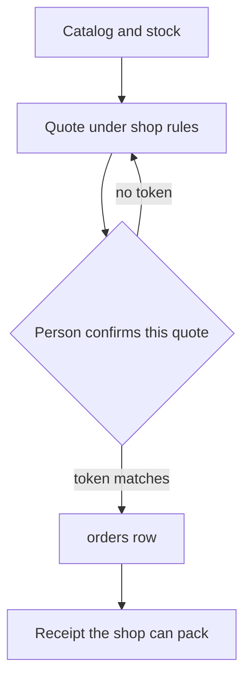
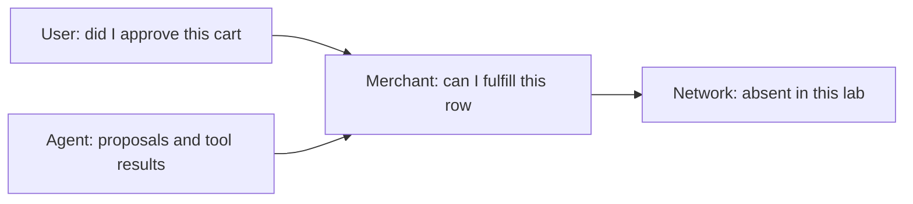

# Chapter 18: Agentic Commerce

A customer can ask the concierge to buy a bag of coffee, and the concierge can answer in a voice that sounds like the sale already happened. The claim of this chapter is that a commerce agent is the loop that carries a shop from a catalog, to a cart, to a recorded order, and then to what the shop does after the sale. The record is the product. A paragraph that says the bag is on its way, with no row behind it, is the same kind of miss as a return window in Chapter 1: fluent, and ungrounded. This chapter's checkout is a mock. It writes an `orders` row in a local database. It does not call a payment network, and it does not keep a card number.

Hearth Lane Café remains the merchant. The concierge can look up a bag, refuse to ship a cardamom bun, price a Tuesday shipment inside the United States, and, after a person approves that exact quote, insert one row. The row says the order is placed and that payment is `mock_not_charged`. A receipt printed from the row is what the shop can pack against. The chat is how the customer asked. When the chat and the row disagree, the person packing the bag follows the row.

**Agent quality = Model × Harness × Feedback loop** puts the receipt in the harness and the check of the receipt in the feedback loop. The model may propose a sku, a quantity, and a channel. The harness prices the sku from the catalog, applies the written shipping rules, and refuses `charge_card`. The feedback is the row itself: you can open it, read the total, and see that no card column exists. A demo that only shows the model's last sentence has thrown that feedback away.

## Catalog, cart, checkout, and after the sale

Commerce in this chapter is four states. Each state has a record, and each record has a source. The model is allowed to request a transition. It is not allowed to be the source.

**The catalog** is the list of what the shop sells, at what price, with what stock, and by which channels. The lab's catalog is `labs/ch18-agentic-commerce/catalog.json`, loaded into a `stock` table. Menu prices that also appear in `docs/faq.md` match that file: a cardamom bun is $4.75, a house espresso is $3.50, a pour-over is $4.25, rye porridge is $8.00. The 12 oz bag of house coffee is $18.00 in the catalog, and it is not in the FAQ. The FAQ lists the counter menu. It does not list a bag price. A concierge that quotes $18.00 has to be quoting the catalog, not a memory of other coffee shops, and not `faq.md`. If the sku is absent, the quote errors. The model does not invent a price to keep the conversation moving.

**The cart** is a draft. Adding a line does not promise the bag. The lab's story quotes a cart and stops short of calling that quote an order. Three bags on a quote, with free shipping because the subtotal has reached $40, are still a quote. They are not three rows, and they do not decrement stock. A cart is auto in the sense that building it does not yet commit the café. The moment of commitment is checkout.

**Checkout** is confirm. The harness prices the lines from stock, applies the fee, and builds one argument object: channel, address, day, lines with unit prices, subtotal, fee, and total, with `payment_status` already set to `mock_not_charged`. Chapter 16's `decide` treats `checkout` as confirm. The approval token hashes that object. A person who approves a $24.00 shipment has not approved a different quantity. Without the token, the `orders` table is unchanged. With the token, the harness inserts one row and decrements stock in the same transaction.

**After the sale** is the row, read back as a receipt. The lab prints the order id, the channel, the destination, the lines, the money, `status=placed`, `payment_status=mock_not_charged`, and the operator who confirmed. That printout is the post-purchase record this chapter owes you. Damage in transit, from `policy.md`, is a later message to `counter@hearthlane.example` within 48 hours, with a photo and the order number. The order number has to exist before that sentence can be true. A concierge that promises a replacement without an order id is offering work the receipt cannot identify.

*Figure 18.1. Checkout writes a row only after the quote is confirmed. A quote is not yet an order.*

Walk one shipment with the numbers the lab uses. One 12 oz bag, shipped on Tuesday to 14 Oak St, Columbus, in the US. The catalog price is $18.00. The policy says coffee orders under $40 ship for $6.00, inside the United States, packed within two business days, and nothing ships on Monday. The quote is $18.00 plus $6.00, total $24.00. The first run of the lab stops at `confirm_required` and reports `orders=0` and twenty bags still on hand. The second run, with that quote's token and a fresh database, inserts the row, leaves nineteen bags, and prints the receipt. The payment line on the receipt is the mock status. There is no approval you can pass that changes it to charged.

The same walk rejects the calls that should never become rows.

- A cardamom bun on a ship quote errors immediately. Pastries are not shipped. There is no token, because there is no legal quote to approve.
- The same bag on Monday errors. Nothing ships on Monday, when the café is closed.
- An address outside the United States errors. Coffee ships inside the United States only.
- A PO box errors. The policy refuses PO boxes and freight forwarders.
- `charge_card`, even with its own token, is denied. The card number is redacted in the trace. The database file does not contain it. The `orders` table has no card column.

Three bags are the fee boundary, shown as a quote and not checked out: $54.00 of coffee is at least $40, so the shipping fee is $0.00. The policy's other threshold sits in the self-check. Local delivery is $4.50, and free at $35 or more, Tuesday through Friday, within 3 miles. One bun delivered two miles is a $4.50 fee. A house espresso is not deliverable, because hot drinks stay at the counter. Four miles is outside the bike radius. Those rules are in `docs/policy.md`. The quote function is where they become true. A sentence in the reply that offers a Monday shipment of buns is the old action-boundary miss, now with a table beside it that you can count.

The cart, the quote, and the order are easy to smear together in conversation. Keep the words tied to records. A cart is lines you could still throw away. A quote is those lines priced under the rules, waiting for a person. An order is a row with an id. Post-purchase is whatever you can do with that id: pack the bag, answer "did my order go through?", or follow the damage rule. If you cannot point at the record, you are still in the chat.

## The merchant's rules and the inventory you can trust

The café is the merchant of record in this exercise. The concierge is an agent that may ask for an order. It does not become the merchant by placing one. The merchant's rules are the policy file plus the catalog. Both are harness inputs. The model's recollection of "how coffee shops usually work" is neither.

The rules the quote enforces are the ones you have already been citing.

- Pastries, drinks, milk, and anything refrigerated are not shipped. The catalog marks the bun, the espresso, the pour-over, and the porridge as not shippable. The bag of coffee is shippable.
- Coffee ships inside the United States only, not to PO boxes or freight forwarders, and not on Monday.
- The shipping fee is $6.00 under $40 and $0.00 at $40 or more. The function uses cents, so the boundary is 4000 cents, and a subtotal of 3999 still pays the fee.
- Bike delivery covers three miles, Tuesday through Friday, at $4.50, free at $35 or more. It covers sealed coffee and same-day pastry boxes. Hot drinks are not delivered.
- Stock is a number in the table. A quote that asks for more than `on_hand` errors, and no order is written.

Inventory truth means the number the checkout uses is the number in the stock table at that moment, not the number in the prompt, and not the number from a catalog file that has drifted from the database. The lab seeds the table from `catalog.json` when the database is empty. `--reset` deletes the database so the next run seeds again. After the seed, the table is what `quote` and `place` read. Editing the JSON without resetting leaves the running database on the old counts. That is the right kind of nuisance. It makes "which copy is true?" into a question you can answer by looking at the file the checkout opened.

A price follows the same rule. The unit price on the order line is the price in `stock` when the quote was built. If the model says the bag is "about sixteen dollars," the quote still says 1800 cents. The token covers the catalog price. Approving the quote approves 1800 cents, not the sentence. This is the citation habit from Chapter 2, applied to money. The source of a shop fact has to be a record the program opened.

Stock moves only when the order is inserted, and the two writes share a transaction. The update subtracts the quantity only if `on_hand` is still at least that quantity. If another checkout took the last bag first, this one rolls back and writes no row. The lab is a single process, so you will not see a race unless you stage one. The transaction is there so the receipt cannot claim a bag the table no longer has. A price check, or a quote, does not reserve stock. Two people can be shown the same last bag. Only a confirmed checkout takes it. If you need a hold, that is a different record, with its own expiry, and this chapter does not add one. Say "quoted" until the row exists.

Monday, the three-mile radius, and the pastry flag are not courtesy. They are the difference between an order the barista can fulfill and an order that creates a complaint. The agent does not get to negotiate them in the chat. A customer who needs a bun in another state gets the policy, not an exception the model felt empowered to grant. Chapter 16 said a confirmation is not a waiver. Here that sentence is the quote function returning `ERROR` before `decide` is asked for a token.

The merchant also decides what the order is allowed to store. The row holds a destination, lines, totals, a status, a payment status, and the name of the person who confirmed. It does not hold a card number, a CVC, or a network token. The lab attempts `charge_card` with a test number so you can see the denial, and the self-check reads the database bytes to be sure the number was not stored anyway. Collecting a number you have promised not to charge is how a mock becomes a real incident. Do not add the column "for later."

Returns and damage stay in the policy until a separate tool exists. Opened coffee is final sale. An unopened bag can come back within 14 days as Hearth card credit. A damaged bag is a replacement or credit if the customer writes to the counter within 48 hours with the order number. None of those outcomes are side effects of checkout. Checkout's job ends at a truthful row. A support agent, Chapter 19, can draft the reply. A refund tool, Chapter 20, can require a second person. This chapter's harness should not quietly issue the credit because the checkout prompt sounded generous.

## Four parties, and the gap between them

A sale that involves an agent has at least four parties, and each one sees a different slice of the truth. The gap between those slices is where a fluent concierge becomes a dispute.

**The user** is the customer. Sam wants to know whether this bag, at this total, to this address, was actually requested. Sam's evidence in a real product is whatever Sam approved. In this lab the operator approves, because the exercise is the merchant's counter, not a customer's phone. The principle is the same. The approver should see the quote that will be stored.

**The merchant** is Hearth Lane. The café needs to know that the bag can be packed, that the fee matches the policy, and that a person authorized this order. The merchant's evidence is the `orders` row and the stock count. The café remains responsible for the goods. An agent that "bought" a bun the café does not ship has not moved that responsibility. It has created a promise the merchant will be asked to keep.

**The agent** is the concierge process. It proposes lines and channels. It sees tool results. It does not hold a card, and it does not get to rewrite the row after the fact by saying a warmer sentence. Its authority is the tool list. `lookup` and `quote` prepare a record. `checkout` writes one, on confirm. `charge_card` is absent in effect, because the tier is never.

**The network**, in a live payment, is the party that moves money: a processor, a card network, a wallet. That party is not in this lab. The receipt says `network: none`. Leaving the party out is a teaching choice and a safety rule. Appendix D's note on live payments is the same rule from the other direction. You can learn the shape of an order without creating a charge. A mock that calls a real sandbox with a real key is a different exercise, and it is not this one.

*Figure 18.2. Each party sees a different record. This lab gives the merchant a row and leaves the network out.*

The gap is concrete. The customer sees a chat that may say "you're all set." The merchant sees zero rows or one row. The agent sees a tool result that said `confirm_required` or a receipt. A live network would see a payment message the shopping agent should not be able to forge. If those accounts disagree, pack from the row and treat the chat as a claim to investigate. The lab makes the disagreement easy to produce: run checkout without the token, and the model could still be prompted to say the order was placed. Your write-up should prefer `orders=0` over that sentence. Chapter 11's separate checker is the later version of the same preference. The checker you have today is your own eyes on the summary line.

What would narrow the gap in a live system is a set of records the parties can compare, not a more confident tone. The customer, or the operator, needs a copy of the exact cart they approved. The merchant needs to re-check that cart against stock at the moment of commit, which the lab's transaction already sketches. The network needs evidence that the payer authorized that cart, and it needs a credential that is not a raw card number sitting in the shopping agent's prompt. Chapter 16's never tier on `charge_card` is the local version of the last requirement. The protocols in the next section are the industry version. This lab closes only the merchant's side: one row, written after confirm, with payment explicitly not taken.

Trust also fails in smaller ways that never reach a network. A quote built at 10:00 and confirmed at 16:00 may no longer match stock. The lab re-reads stock inside `place`. A destination the model "cleaned up" into another city is a different order, and the token should change because the address is part of the hashed object. A fee the model waived in prose is ignored because the fee function does not read prose. Each of those is a gap between the agent and the merchant. You close them by making the merchant's function the writer of the row.

## Protocols you can read and should not wire up yet

The 2025 and 2026 protocol work is aimed at the gap in the previous section. It tries to give the user, the merchant, the agent, and the payment network a shared description of a cart and of an authorization. You should be able to say what each protocol is for. You should not add one to the café lab. The lab's job is a mock row. A production integration would be a live payment path, which these chapters do not build.

**The Universal Commerce Protocol (UCP)** is an open description of the shopping journey, published for the agentic-commerce conversation in January 2026 and documented at ucp.dev. The pieces it names are the ones this chapter already used in miniature: catalog discovery, cart and checkout, identity linking, and order updates after the sale. A business publishes the capabilities it actually supports. A platform or an agent is supposed to discover that list instead of hard-coding a private integration for every shop. The merchant stays the merchant of record. Business rules stay with the business. UCP is designed to travel over ordinary APIs and also over the agent transports from Chapter 9, including MCP and agent-to-agent messaging. Hearth Lane, in that picture, would publish a profile that says it can quote coffee, refuse pastry shipments, and take a checkout. The profile would not grant an agent the power to invent a Monday ship window. This book does not stand up a UCP server. The catalog JSON and the quote function are the teaching stand-in for "the merchant declares what is possible."

**The Agent Payments Protocol (AP2)** is a payment-authorization protocol. Google announced it in September 2025, as an open way for an agent to initiate a payment with evidence a processor can check, alongside existing payment rails rather than as a replacement for them. In April 2026 the published v0.2 materials added a clearer autonomous case, and Google donated the protocol to the FIDO Alliance so it would not be owned by one vendor. AP2's core objects are mandates. A checkout mandate binds the cart the user authorized. A payment mandate binds the authority to pay for that checkout. The useful distinction for this chapter is who is present when the mandate is sealed. In the human-present flow, the user approves the specific checkout. That is the lab's `--confirm` token, without the cryptography: one closed quote, approved by a person, then acted on. In the human-not-present flow, the user approves a bounded mandate ahead of time, and the agent may complete a checkout that fits the bound. That is the "small automatic purchase" Chapter 16 refused to sneak in as a fourth tier. If you ever build it, the bound has to be explicit, expiring, and checkable by the merchant, and a mismatch has to be able to pull the user back. UCP's documents describe an optional place to carry AP2 mandates when a merchant wants that proof. The café database does not store a mandate. It stores a row that says the network was never called.

**Mastercard Agent Pay** is a network program, introduced in 2025, for registered agents to take part in payments with tokenized credentials and with evidence of user intent. A 2026 extension, Agent Pay for Machines, aims at high-frequency, low-value payments between machines. The café exercise is not that traffic. What matters for the concierge is the separation Agent Pay is built around: the shopping agent is identified, the credential is a token rather than a raw card number in the prompt, and a payment is supposed to carry verifiable intent for that action. Our `charge_card` denial is the classroom version of the same separation. The concierge is the wrong place to hold a primary account number. A network token, if you someday integrate a real program, would live with a payments component that this repository does not include.

Other names sit in the same conversation, including OpenAI's Agentic Commerce Protocol, which payment networks have discussed alongside UCP and AP2. Treat them as reading. They differ in who hosts the checkout and in how a cart is described. They agree on the part this chapter cares about: shopping and paying are different steps, more than one party has to be able to check the cart, and a receipt beats a transcript. None of them are imported by `checkout.py`.

The map from those documents back to the lab is short.

| Idea in the protocols | What the lab actually does |
|---|---|
| A merchant-declared catalog and checkout | `catalog.json`, the stock table, and `quote` |
| The merchant remains merchant of record | The café's policy and stock decide; the model does not |
| Human-present approval of a closed cart | `--confirm` with the token of one quote |
| Human-not-present, inside a bound | Not implemented. Auto-pay stays off |
| A payment mandate or a network token | Not implemented. `charge_card` is never |
| An order the merchant can update later | One `orders` row, `placed`, `mock_not_charged` |

If you want to go further, read the specifications and write down, in your own words, which party is allowed to create each object. Stop before you add a dependency, a key, or an endpoint. A protocol client that can reach a live or sandbox payment API is outside this chapter even when the README of that client says the charges are small. The feedback you owe is the local row.

## Lab

Run the mock checkout. The first run quotes one bag at $18.00 plus $6.00 shipping, refuses the bun and the Monday ship, shows three bags shipping free as a quote only, denies `charge_card`, and leaves `orders=0`. The second run passes the one-bag token after a reset and prints a receipt whose payment status is `mock_not_charged`. The self-check covers the delivery radius, the $40 and $35 boundaries, and the absence of the card number from the database file.

The commands and the notes to write are in the [Chapter 18 lab](../../labs/ch18-agentic-commerce/README.md).

A commerce agent that cannot show the order it claims to have placed has not finished the sale. It has finished a sentence. The catalog, the quote, and the row are the harness. The receipt is how you check them. Commerce agents need receipts, not vibes.
