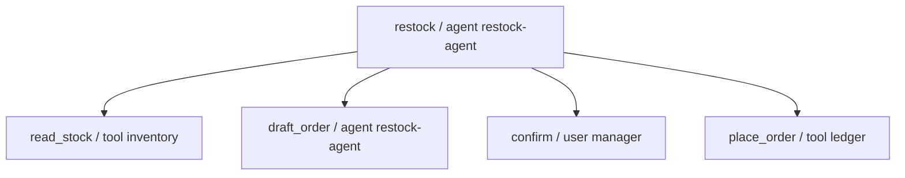
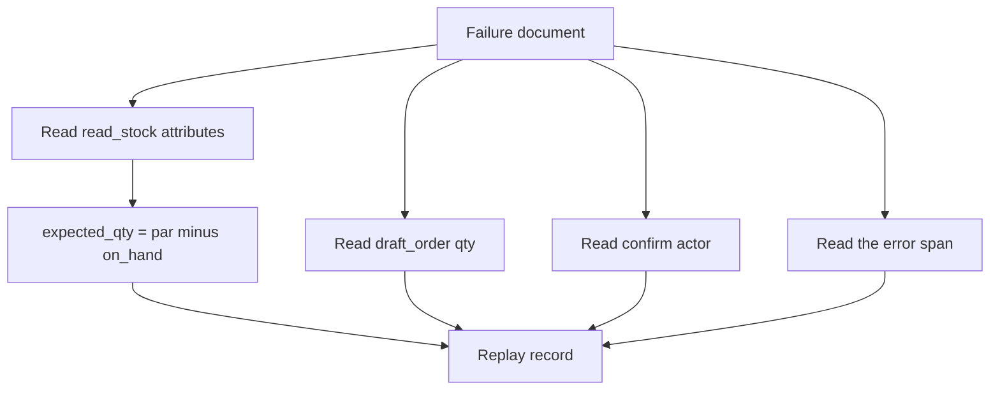

# Chapter 22: Identity and Observability

A restock that fails on Tuesday has to be explainable on Wednesday by someone who was not watching the terminal. The claim of this chapter is that identity and a trace are part of the harness: every span says who acted, the bytes you keep are yours, and a failure is replayable from the log alone. A dashboard that only you can click through is a view. It is not the record. Chapter 10 stored a checkpoint so a killed job would not order twice. Chapter 17 put `confirmed_by` on a sent letter. This chapter is the same habit, applied to a whole run, in a shape you can export.

Hearth Lane is restocking house coffee. Session `restock-1842` is the one from Chapter 10. The shelf has 4 bags on hand and a par of 16, so the draft quantity is 12. The bag is the 12 oz house coffee. The manager confirms that draft. The ledger tool places one mock order, `po-1842`, with the session id as the idempotency key. Nobody charges a card. The lab also contains a canned failure of that same session: the draft says 20, the confirm span is the agent rather than the manager, and the place span ends in error with no order id. You should be able to say all of that from the file, without rerunning the job and without asking the model what it remembers.

**Agent quality = Model × Harness × Feedback loop.** The model may narrate the restock. The harness writes the spans and refuses to let the agent occupy the manager's slot. The feedback loop is the replay. If the only account of the failure is a sentence the model writes after the fact, you have a story, and Chapter 1 already warned you that fluency is what the model is built to produce. The log has to be able to disagree with the story.

## 22.1 Actor identity: user, agent, and tool

Three actors are already in the restock, and collapsing them is how a log becomes useless. Chapter 17 named them for a letter. The names are the same here, and the restock makes the cost of mixing them easier to see, because a wrong actor is the reason the place step refuses.

**The user** is a person. For this session the person is the manager who confirms the draft. The manager is not Sam at `sam@example.com`, and the manager is not Maya, who runs the weekday counter and the checker samples in Chapter 11, unless Maya is actually the one who pressed confirm and you recorded that name. The lab uses `manager` because Chapter 10's confirmation is the manager's. A customer talking to the concierge does not get to confirm a supplier order by being in the building. Identity is the principal the action will be blamed on later. If the span says user, a person did the thing.

**The agent** is the process that proposes. In the lab it is `restock-agent`. It may read the stock observation and draft a quantity. It does not become the manager by drafting a polite note. Chapter 17's sent file said `acted_as: counter-staff` only after a token matched, and `confirmed_by: operator`. The restock's confirm span is the same joint. `actor.kind` is `user` and `actor.id` is `manager`, or the confirm did not happen. An agent that writes a confirm span with its own id has approved its own purchase. The canned failure is that span.

**The tool** is the function that touches a system of record. `inventory` reads on-hand and par. `ledger` appends the order, once, under the idempotency key. A tool does not choose the quantity and does not confirm. It does what the arguments say, or it returns an error. Chapter 2's `read_file` was already this kind of actor: the model proposed a path, the function returned bytes or `ERROR:`, and the function did not decide that the café was closed on Monday. The ledger is the same shape with a side effect. Side effects are why the actor field matters. A read can be repeated. An order that the log attributes to "the system" cannot be audited.

```text
read_stock     actor.kind=tool   actor.id=inventory
draft_order    actor.kind=agent  actor.id=restock-agent
confirm        actor.kind=user   actor.id=manager
place_order    actor.kind=tool   actor.id=ledger
```

The customer-facing concierge and the restock agent can share a machine and still must not share an actor id. Chapter 16's concierge never sends external mail. Chapter 17's staff agent can confirm a letter. If both processes write spans under `actor.id=concierge`, Wednesday's review cannot tell which principal read the competitor page from Chapter 21 and which principal ordered coffee. Use a stable id per principal. Put it on every span that principal causes. A human-readable name in a paragraph is not a substitute. The field is what a test can check.

Delegation stays a scope, as it was for the return letter. For `restock-1842` the scope is small enough to fit on the confirm span.

- **Action.** Draft freely. Place only after this confirm.
- **Object.** This sku, this quantity, this session. A draft of 20 bags is a different object from a draft of 12, and it needs its own confirm. The token in Chapter 16 hashed the arguments for that reason. The span should carry the quantity the person saw.
- **Principal.** The manager. Not the agent. Not the ledger.
- **Time.** This session. A confirm for `restock-1842` is not a standing yes for next Tuesday. Next Tuesday is a new trace id.

"The system ordered coffee" is what you say when the span was never written. It is not a finding you can act on. You cannot tell whether to fix the prompt, the confirm button, or the ledger. The actor field is how the feedback loop points at a factor. An agent id on confirm is a harness bug: the code let the model occupy a person's slot. A tool id on a span whose quantity is wrong is a different bug: the tool obeyed a bad argument, and the argument came from the draft. Replay, in section 22.4, uses the field this way. It does not ask the model which of those bugs you meant.

Shared machines need the person's id, not the word `user`. Chapter 17 said two closers on one button should store which of them pressed it. The lab has one manager. A second id is a string change, not a new architecture. If you leave the id blank because the demo has only one person, the first time two people use the button you will have a pile of spans that all look like the same approval. Fill the field while it is still easy.

## 22.2 Traces, spans, and tool payloads

Chapter 2 prints a tool log: a step number, a name, arguments, a result, a stop line. That log is a trace of one conversation. It dies with the terminal scrollback unless you save it. A **trace** here is the saved tree for one session. A **span** is one node in that tree: a named operation with a start, an end, a status, and the attributes you will need later. The parent span is the session. The children are the steps. You should be able to draw `restock-1842` without remembering the terminal.

The lab's document is OpenTelemetry-shaped. OpenTelemetry, often shortened to OTel, is a common way to name traces and spans so more than one tool can read them. This book does not ask you to run a collector, install a vendor agent, or send the café's restock to a network service. It asks you to use the ideas those systems already agree on: a trace id, a span id, a parent span id, a name, a status, and attributes. If you keep those fields, a later exporter is a translation. If you keep only a paragraph, the exporter has nothing honest to translate.

A successful run of `restock-1842` has five spans. The ids in the lab are short on purpose (`span-read`, `span-draft`) so a person can replay them without decoding a hex string. A production exporter can use the 16-byte ids OTel specifies. The field names are the contract. The id format is a choice you may tighten later without changing what the replay asks.

1. `restock`, the root. `parent_span_id` is empty. The actor is `restock-agent`. Attributes include `session.id` and the sku. Status is `ok` when the children finished, including the case where place was refused, if you want the root to mean "the session was recorded." The lab's success trace uses `ok` because place succeeded.
2. `read_stock`. Parent is the root. Actor `inventory`, kind `tool`. Attributes: `sku=house-coffee`, `on_hand=4`, `par=16`. Status `ok`. This is the shelf, not the model's memory of the shelf.
3. `draft_order`. Actor `restock-agent`, kind `agent`. Attribute `qty=12`, which is par minus on hand. The agent proposes. The number on the span is the number the runtime stored, the same pin Chapter 10 put in the checkpoint. A later sentence that says "make it 20" does not edit this attribute.
4. `confirm`. Actor `manager`, kind `user`. Attribute `qty=12`. Status `ok` only if that person confirmed this quantity. There is no confirm span with kind `agent` on the success path.
5. `place_order`. Actor `ledger`, kind `tool`. Attributes: `qty=12`, `order_id=po-1842`, `idempotency_key=restock-1842`. Status `ok`. The tool writes the mock ledger. It does not invent a second id if this key already has one.



*Figure 22.1. One trace for session restock-1842. Each span names an actor. Place is a tool. Confirm is a person.*

The payload is the tool's result, stored as attributes you chose, not as a dump of the process. `on_hand` and `par` are the payload of the read. `order_id` is the payload of the place. A stack trace, a full copy of the supplier's HTML, and the supplier token are not payloads you want on the span. Chapter 21's rule is unchanged because the sink changed: a secret in a span is a secret in a log, and logs are copied to vendors more casually than prompts are. The lab constant `SUPPLIER_TOKEN` stands in for that token. `emit_restock_trace` must not place it in the document. The starter does, under a convenient key, which is the Chapter 10 temptation in miniature. The test searches the serialized JSON.

Status is `ok` or `error`. An error span carries `attributes.reason` as a string a person can read. "Tool error" is the vague denial Chapter 16 told you not to write. "confirm actor was agent, expected user" is a reason replay can return unchanged. The model can see that string if you also append it to the message list. The span is where it lives for the person who was not in the loop.

Parent ids are how you know the confirm belongs to this restock and not to a letter the staff agent sent in the same minute. A flat list of lines without parents is a Chapter 2 log. It is enough for a single terminal session. It breaks when two sessions interleave. Write the parent even when you are tempted to skip it because the demo only runs one job. The failure fixture in the lab has a root and four children. Replay does not need the parent to compute 16 minus 4. An auditor needs the parent to know those children are one session. Keep the field so the document stays one shape.

Chapter 14's one-page report is a projection of traces like this: outcome, cost, latency, task type, on a task id. You should be able to compute the page from a small set of attributes without opening every span, and you should be able to open the span when the page looks wrong. The restock's projection is short. Session `restock-1842`, sku `house-coffee`, qty 12, order `po-1842`, confirmed by `manager`, status placed. If the projection says placed and the place span says error, the projection is the bug. Own both, and make the projection a function of the spans rather than a second story someone typed.

## 22.3 Own your schema

The schema is the list of fields you promise will be there. Own it means you can write the document to a file, read it back next month, and replay it without the vendor whose UI you were logged into when the job ran. A hosted trace viewer is allowed. It is not the system of record. Chapter 9 made the same point about tool schemas: a contract test pins the shape, and a blog post does not. The restock document is a contract you pin the same way.

The lab's document is a JSON object:

- `trace_id`, the session. `restock-1842`.
- `service`, the program that emitted the trace. `hearth-lane-restock`.
- `spans`, a list. Each span has `span_id`, `trace_id`, `parent_span_id`, `name`, `actor` (`kind` and `id`), `status`, and `attributes`.

Those names are the book's, chosen so they map onto an OTel span without requiring the SDK. `actor.kind` is one of `user`, `agent`, or `tool`. `status` is `ok` or `error`. Attributes are a JSON object of scalars you would be willing to show the manager. If a field is missing, replay should fail the test, not guess. A guess is how a missing confirm turns into a successful place in the report.

Portable means boring. JSON in the repo's fixture, or JSON your script prints, is something `json.loads` can read in the standard library. A proprietary binary, a log line that only one agent framework's pretty-printer understands, and a screenshot of a waterfall are not portable. You may still use that framework. Emit this document from it, in addition to whatever it stores for itself, or accept that you will not replay the day the framework's UI changes. Chapter 3 told you to swap weights behind a stable client. Swap viewers behind a stable file.

Write down what you refuse to store, next to the schema, so the next person does not "enrich" the span into a leak.

- **Secrets.** Supplier tokens, API keys, the canary from Chapter 21, card numbers. Chapter 16 redacts a card before it prints. A span is a print that lasts longer. Leave the token in the process environment.
- **Raw untrusted pages.** Store that a fetch happened, the URL you allowed, and a short quote if the quote is the point, the way Chapter 8 stored a price comparison. Do not store the whole page if the page was an injection. You would be archiving the attacker's keyboard inside the audit log, and a later model that is handed the log as context will read it as instructions.
- **Chain-of-thought dumps.** They are large, they are not the record of what the tool did, and they tempt you to skip the attributes. The attributes are the record. The draft quantity is a number. A paragraph about why twelve felt right is optional color, and it is not what replay subtracts.
- **A second copy of policy prose** when a version pin will do. Chapter 10 asked for the skill and policy version on the checkpoint. Put `policy_version` on the root span if the draft depended on a rule. The file in git remains the text. The span records which text.

Versions are part of owning the schema. An additive attribute, such as `policy_version`, can appear without breaking a replay that ignores unknown keys. A breaking change, such as renaming `qty` to `quantity` or storing bags as a float, is a new document version you can put on the root as `schema_version`. The contract test pins the version the lab understands. Chapter 9's rule for tool schemas is the rule here. Repair the emitter and the test together. Do not teach the replay function to accept every alias anyone has ever printed. Aliases are how `order_id` and `po_number` drift apart and the auditor misses the row.

The metric record from Chapter 14 should be derivable. Given the success trace, a fold can emit: task type `restock`, task id `restock-1842`, outcome placed, quantity 12, confirmed by `manager`. Given the failure fixture, the same fold emits outcome error and quantity 20, and it does not emit an order id. If you cannot write that fold, the schema is missing a field, and the dashboard you buy will invent one. Invented fields are how "the system" returns. Prefer a missing key, which fails the test, over a default that says the manager confirmed.

Owning the schema also means the emitter is code you run, not a side effect you hope the library turned on. `emit_restock_trace` returns the dict. The script prints it. A test reads the dict. There is no network call and no API key. That is deliberate. A trace path that only works when the vendor is up will be empty on the outage you most wanted to replay. Write the file first. Export it later if you still want a viewer.

## 22.4 Replay for debugging and audits

Replay means a function reads the document and returns the failure, without the process that produced it, without the model, and without your memory of Tuesday. The lab's function is `replay_failure`. The input is the canned file `fixtures/restock-1842-failure.json`. The output is a small dict. If you have to open the Python that ran the job in order to explain the job, you do not have a replay. You have a source-code reading.

The canned session is the same id, `restock-1842`, so you cannot tell the runs apart by the title. You tell them apart by the spans. The read succeeded: `on_hand` 4, `par` 16. The draft span says `qty` 20. The confirm span is present and its actor is `restock-agent`, kind `agent`. The place span's status is `error`, its reason is `confirm actor was agent, expected user`, and its `order_id` is null. Nothing in the file says "expected quantity." You compute it. Par minus on hand is 12. The draft is 8 bags high, and the confirm was not a person. The ledger was right to refuse. There is no order to void.

That is two defects, and they are both visible. A replay that returns only "place failed" has hidden the quantity. A replay that returns only "qty should be 12" has hidden the actor, and someone will "fix" the draft while leaving the agent allowed to confirm. Return both. The fields the lab expects are the trace id, the failed span's name, its status, its reason, `on_hand`, `par`, `draft_qty`, `expected_qty`, the confirm actor's kind and id, and `order_id`. `expected_qty` is computed. The others are read. A test in the lab copies the fixture, changes the draft quantity to 18, and expects `draft_qty` 18 with `expected_qty` still 12. If your function returns 20 because you memorized the chapter, that test fails. Good. Replay is a parser with one subtraction, not a summary you wrote by hand.



*Figure 22.2. Replay uses the log alone. The expected quantity is computed from the shelf span. It is not stored as a story beside it.*

Debugging and audit are the same read for different questions. Debugging asks why place returned error, so you can change the harness. The answer is on the span: the confirm actor was the agent. The edit is to stop emitting a confirm span unless `actor.kind` is `user`. Audit asks who approved an order, so the shop can stand behind it. The success trace answers with `manager`. The failure trace answers with nobody, and the order id is null, which is the correct audit of a refused place. A log that cannot support the second question will be rewritten under pressure into whatever the model says the manager meant. Do not accept that rewrite. The span is the statement.

A few gaps show up the moment you try to replay and the field is absent. Treat them as schema bugs.

- **No on-hand or par.** You cannot compute 12. The draft quantity is an unexplained integer. Chapter 10's checkpoint had the same requirement: store the number, do not hope the model recomputes it the same way.
- **No actor on confirm.** You know a confirm span exists and not who it binds. That is the shared password again. Fail the replay rather than defaulting to `manager`.
- **An order id on an error span.** Either the place partially happened, which is a ledger bug, or the emitter copies the id before the tool returns. The mock ledger should not have a row. Check the idempotency key. One key, one row, matching Chapter 10.
- **The supplier token in attributes.** You can replay the quantity and you have also stored the key. Delete the attribute, rotate the token, and add the canary test. Replay is not a reason to keep secrets "so the picture is complete."
- **Two place spans for one trace id.** The job ordered twice or the emitter duplicated the span. The idempotency key distinguishes a real double order from a double write of the same span. Count ledger rows if you still have them. The trace should have been enough. If it is not, the schema needs a field you omitted.

The model is optional on this path. A manager's note can be a completion that reads the replay dict and writes one sentence. The note is not the replay. If the note says the order was placed and `order_id` is null, the note is wrong and the dict is right. Chapter 10 already refused to let the model's later prose edit the checkpoint. Do not let a summary edit the trace. Summaries are downstream.

You will be tempted to skip spans for the steps that "always work." The read is the step that makes `expected_qty` possible. Without it, a draft of 12 and a draft of 20 look like opinions. With it, one of them matches the shelf and the other does not. Log the boring step. The boring step is the ground truth.

## Lab

Emit an OTel-shaped trace for the successful restock, and replay the canned failure from the fixture alone. The starter returns no spans and echoes the supplier token. `replay_failure` returns an empty dict. `test_trace.py` fails until both functions match the schema in this chapter. Neither the script nor the test calls a model server.

The commands and the notes to write are in the [Chapter 22 lab](../../labs/ch22-identity-and-observability/README.md).

If you can't replay it, you don't operate it. A restock you can only explain by rerunning, or by asking the model, is a demo that happened to print an order id. The span names the actor, the schema is a file you can move, and the failure fixture still yields 12 bags and a refused confirm after the process that wrote it is gone.
