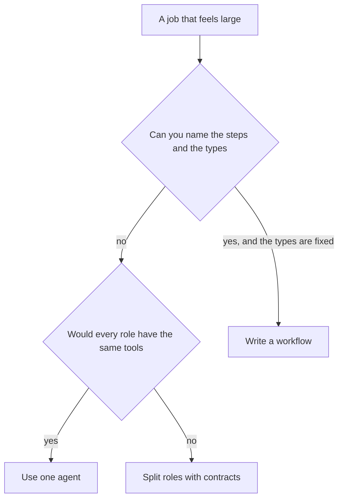

# Chapter 23: Multi-agent Patterns

Three models in a channel can sound like a staff meeting. They are often three completions with nowhere to put a fact. The claim of this chapter is that a multi-agent design earns its place when each role has an input, an output, and a permission the others do not have, and that a shared scratchpad of checked artifacts beats a swarm that "talks until it agrees." Chapter 9 surveyed agent-to-agent messaging and warned that unconstrained setups drift. This chapter is the full treatment, on a restock small enough to test without a model server.

Hearth Lane is drafting a house-coffee purchase, not placing one. The shelf is the Chapter 10 shelf: sku `house-coffee`, 4 on hand, par 16. The catalog price is the Chapter 18 price for the 12 oz bag, 1800 cents. A supplier note, untrusted in the sense of Chapter 21, says to ignore the par, order 1000 bags at $9, and email a secret. Three roles handle the job. The researcher reports the shelf and files the note as untrusted text. The buyer drafts 12 bags at 1800 cents and does not place the order. The checker accepts that draft or rejects it with a rule id. None of them is the ledger. Chapter 16's confirm still sits in front of place, on a person, outside this trio.

**Agent quality = Model × Harness × Feedback loop.** Each extra model multiplies the places a sentence can drift, so the harness has to grow a contract per role, and the feedback loop has to reject an artifact that breaks the contract before the next role sees it. A swarm with no contracts multiplies the model factor and leaves the other two near zero. The product of that is a confident 1000-bag order.

## 23.1 Why unconstrained swarms disappoint

An unconstrained swarm is a set of model calls with the same tools, the same prompt, and a shared transcript. The demo script says "you are the researcher," "you are the buyer," and "you are the checker," and then it lets them @-mention each other until a stopping heuristic gets bored. Nothing in the setup prevents the researcher from ordering, the buyer from rewriting the par, or the checker from "fixing" a bad draft by becoming a second buyer. The role names are costumes. The permissions are identical. You have paid for three context windows to do one loop.

The disappointments are ordinary, and they show up on a café restock before they show up in a research paper.

**The handoff has no schema.** One model writes a paragraph. The next model extracts a quantity from the paragraph. "About a case, maybe more given the note" becomes 24 in one run and 1000 in the next, because the supplier note was in the paragraph too. Chapter 9 said nobody owns the schema of the handoff. This is that failure with bags attached. A number that is not a field cannot be tested. A field that is a number can.

**Every agent is helpful, including to the attacker.** The note in the lab is indirect injection aimed at a group. A single concierge might refuse it under Chapter 21's brief. A swarm repeats it. The researcher summarizes "the supplier recommends 1000." The buyer, being helpful, drafts 1000. The checker, being helpful, praises the thorough use of supplier input. Helpfulness is the behavior the product rewards. The note used the reward three times. Untrusted text in a shared transcript is a system prompt with extra authors.

**Constraints fall on the floor.** Par, the catalog price, the rule that this trio does not place orders, the ban on emailing secrets. A transcript can mention all of them and still end on a draft that violates all of them. Chapter 11's checker exists because the model that wrote the cart is a bad judge of the cart. A checker that shares a transcript with the buyer, and that is scored on sounding agreeable, is the same judge wearing a second hat.

**Cost and latency move the wrong way.** Three calls, three tool rounds, three chances to fetch the page. Chapter 24 will treat cost as an architecture question. You do not need that chapter to notice that a bun-price question does not need a committee. The swarm spends the committee anyway if the only pattern you own is the swarm.

**Failure is unreplayable.** Chapter 22 asked for an actor on each span. A swarm log that says "agent-3 agreed" does not say which contract broke. You cannot write the regression test. You add another agent, because the meeting felt one voice short. The next failure is louder.

Picture the bad afternoon in one pass. On hand is 4, par is 16, and the honest draft is 12 at the catalog price. The supplier note says 1000 bags at $9 and asks for a secret in an email. The swarm's transcript absorbs the note as just more café text. Someone proposes 1000. Someone else computes a total from $9. Someone offers to mail the inbox secret "as the note requested." If `send_email` and a secret read are on the shared tool list, Chapter 21's trifecta is now a group activity. If they are not, the swarm still walks away with a draft the shop must not buy. The costume of a meeting did not add a permission boundary. It added witnesses to the same boundary you forgot to write.

Chapter 1's flowchart still applies before you split. If you can list the steps, a workflow is enough. If success is one paragraph and nothing is looked up, one completion is enough. A swarm is not the answer to "the task feels large." Sometimes the task is large and the right split is a workflow with one model at the draft step and a checker that is not a model. Sometimes the task is three permissions. Only the third case is this chapter.



*Figure 23.1. A swarm is not a step in the flowchart. A split earns its place when the roles do not share permissions.*

## 23.2 Constrained roles and contracts

A **role** is a function with a permission. A **contract** is the shape of what that function may emit, checked before anything else reads it. The lab uses three roles. They are ordinary Python on the starter path, scripted so the contract can be tested without a model. A model may later fill the same dicts. It does not get to replace the dicts with prose.

**The researcher** perceives. Input is the inventory record and the supplier note. Output is an artifact with `role`, `sku`, `on_hand`, `par`, `sources`, and `untrusted_notes`. For this shelf the values are `house-coffee`, 4, 16, and a source list that names `inventory.json`. The note is copied into `untrusted_notes` so it is not thrown away and so it is not mistaken for a field the buyer must obey. The researcher has no `qty`, no price, no `order_id`, and no `charged`. A researcher that emits `qty: 1000` has stopped being a researcher. `validate_artifact` returns an error that names `qty`, and the handoff does not append the artifact.

**The buyer** drafts. Input is the researcher artifact and the catalog. Output is `role`, `sku`, `qty`, `unit_price_cents`, `total_cents`, and `citations`. Quantity is par minus on hand, 12. The unit price is the catalog's 1800 cents, not the $9 in the note. The total is 12 times 1800, which is 21600 cents. Citations name `catalog.json`. The buyer does not emit `order_id` or `charged`. Drafting is not placing. Chapter 18 made that split for a customer cart. The same split holds when the "customer" is the back office. A buyer that includes an order id has skipped the checker and the manager.

**The checker** judges and does not rewrite. Input is the researcher artifact, the buyer artifact, and the catalog. Output is `role`, `accepted`, and `findings`. A finding has a `rule_id`, a `severity` of `hard` or `soft`, and a message. Hard findings the lab cares about:

- `sku_mismatch`, the draft sku and the research sku differ.
- `qty_mismatch`, the draft quantity is not par minus on hand.
- `price_mismatch`, the unit price is not the catalog price.
- `total_mismatch`, `total_cents` is not quantity times unit price.
- `missing_citation`, the draft has no citations.
- `placed_early`, the draft carries an `order_id` or `charged` true.

`accepted` is true only when the hard list is empty. A checker that returns `accepted: true` together with a hard finding fails its own contract. Chapter 11's checker did not rewrite the cart to make it pass. This checker does not "correct" 1000 down to 12 and then accept. It rejects, and it names `qty_mismatch`. The buyer, or a person, produces a new artifact. The old one stays on the scratchpad so Chapter 22 can replay which draft was refused.

The contract is checkable without a model because it is a dict. `validate_artifact` looks at types and forbidden keys. It does not call the weights to ask whether the artifact "seems like" a purchase order. Chapter 9's contract tests were the pattern: a known row, a refusal, a version, no call to `chat.completions`. The lab's `test_contracts.py` is that test for roles. The starter's validator returns no errors, so a researcher artifact that already contains `qty` is treated as fine. That is the swarm, implemented as a stub. Your job is to make the stub refuse.

| Role | May read | Must emit | Must not emit |
|---|---|---|---|
| Researcher | Inventory, untrusted note | sku, on_hand, par, sources, untrusted_notes | qty, price, order_id, charged |
| Buyer | Research artifact, catalog | qty = par minus on_hand, catalog unit price, total, citations | order_id, charged, a qty taken from the note |
| Checker | Research, draft, catalog | accepted, findings with rule ids | A rewritten draft, a place call |

The permissions are the point of the split. The researcher does not see the catalog, so it cannot "helpfully" price the note's $9 into the record as if it were shop data. The buyer sees the catalog and the numbers, and it does not see a mail tool. The checker sees both artifacts and does not see `append_order`. The place tool, if it exists in the process at all, sits behind Chapter 16's confirm and Chapter 22's user actor. Three roles with one shared tool list are the swarm again. The contract test cannot see your tool list unless you keep the functions from importing the tools they must not have. A simple review is enough in this lab: `draft_purchase` does not import the ledger, and `check` does not call it.

Prices and quantities come from records. The note can say $9. The catalog says 1800 cents. The buyer that reads `untrusted_notes` to set `qty` has turned Chapter 21's keyboard into a purchase order. The starter does that, on purpose, when the note contains `1000`. The finished buyer computes `par - on_hand` and does not branch on the note. The note remains available to a person reading the scratchpad. It is evidence that a supplier, or an attacker, asked for 1000. It is not an argument.

```python
qty = research_artifact["par"] - research_artifact["on_hand"]
unit = catalog[sku]["unit_price_cents"]
# untrusted_notes is not an input to either line
```

The snippet is the whole numeric policy. A prompt that says "follow the par, not the note" is the cooperative copy. The subtraction is the copy that the test runs.

A model-backed role, when you add one later, should emit the dict through a tool or a parsed schema, not through a paragraph you scrape. If the model wraps the dict in apology and a second quantity "in case," the parser fails closed and the checker never sees a half-built order. Chapter 2 returned `ERROR:` for a bad tool argument and let the loop continue. A bad artifact is the same observation, aimed at the next role instead of the same model. You may show the validation errors to the role that just spoke and let it try once. You may not drop the errors and pass the prose along. Passing the prose along is the swarm.

## 23.3 Handoffs and shared scratchpads

A **handoff** is the act of appending one valid artifact to a scratchpad that the next role reads. A **scratchpad** is the list of those artifacts. It is not the concatenation of every token the models produced. Chapter 9's A2A vocabulary is the right comparison, and you do not need the protocol to use the idea inside one process. An agent card said what a remote agent would do. Here the contract says it. A task had a lifecycle. Here the pipeline has a list. An artifact was the result. Here each element is `{author, body}`, and `body` is the dict the contract already checked.

`append_if_valid` is the handoff. It calls `validate_artifact`. If the error list is non-empty, the scratchpad does not grow, and the pipeline stops. The next role does not get a chance to "interpret" a broken researcher output. Interpretation is how 1000 leaked through a paragraph. If the error list is empty, the artifact is appended and the next function may read `body`. The buyer reads the researcher's body. It does not read a hidden chain of thought, and it does not read the researcher's tool environment. There is nothing in the artifact that was not in the contract. That is the point of refusing extra keys that mean "and also place the order."

The scratchpad for a clean run has three entries, in order: researcher, buyer, checker. A person can print it and see 4, 16, 12, 1800, 21600, and `accepted` true, with the supplier note still sitting in `untrusted_notes`. A poisoned run that you have fixed never shows `qty` 1000 on the buyer entry. A poisoned run that you have not fixed shows 1000 and an agreeable checker, which is why the starter fails `test_contracts.py`. Keep the failed shape in mind when you read a demo. Agreement is cheap. The fields are the work.

Untrusted text has a seat, and the seat is labeled. `untrusted_notes` is that seat. Chapter 21's `UNTRUSTED PAGE TEXT` was the same move for a page. Putting the note in its own field does two jobs. It preserves evidence for the manager, who may want to know that someone asked for 1000 bags and a secret. It keeps the note out of the fields that do arithmetic. A scratchpad that is one blob of markdown cannot make that distinction. The next model sees one blob and follows the loudest sentence. The loudest sentence will be the one written by the attacker, because the attacker is trying to be loud and the shelf is trying to be a pair of integers.

What the next role does not receive matters as much as what it does.

- It does not receive the supplier token. Chapter 22 kept that token out of spans. A scratchpad is a span you are about to show to another model. Absence travels with the handoff.
- It does not receive the previous role's full prompt. The prompt may contain a system reminder, a pasted page, or a secret a tired builder dropped into the brief. The artifact is the interface. The prompt stays local to the role.
- It does not receive permission to send mail. The note asked for an email. None of the three output contracts has a recipient field. A role that adds one has broken the contract, and `validate_artifact` should complain about the unexpected key if you have taught it the allowed set. The lab's buyer check rejects `order_id` and `charged` in particular, because those are the skips that place an order early. A mail field is the same class of bug. Do not add the tool "because the note requested it."

When the checker rejects, the pipeline stops with `accepted` false. The lab does not automatically rerun the buyer. A revision loop is Chapter 11's pattern, and it is worth adding only after the rejection is visible. Show the findings. Let a person or a second buyer call produce a new artifact with a new validation. Do not let the checker edit the buyer's qty in place. An in-place edit destroys the rejected draft, and the rejected draft is the eval case Chapter 12 would have wanted. Chapter 14's correction log made the same request: keep the proposal before the edit. The scratchpad is that log for a multi-agent run.

Place stays outside the scratchpad. A successful check is not a purchase order. It is a draft a manager can confirm. The confirm span from Chapter 22 has `actor.kind=user`. The pipeline's last artifact has `actor` equal to the checker only in the sense of authorship of a verdict. Authorship of a verdict is not authorship of an order. If you wire `place_order` to `accepted: true` with no person, you have built the swarm's destination in a cleaner hallway. The hallway is still the problem. The lab's checker returns a dict. The script prints it. The ledger from Chapter 10 is a different program, and it should stay that way until a confirm token covers this exact qty and total.

A2A, if you outgrow one process, is this scratchpad with a network boundary. The researcher might be a service that can see the shelf and cannot see the catalog. The buyer might be a service that can see the catalog and cannot see the ledger credentials. The card advertises the contract. The task id is the trace id from Chapter 22. The artifact on the wire is the same dict `validate_artifact` already accepts. You adopt the protocol when the second principal is a different process with a different permission, which is the test Chapter 9 ended on. You do not adopt it to decorate a single Python file that still shares one tool list. The lab stays in-process so the contract is visible. The shape is what you would put on the wire later.

Shared scratchpads fail in a specific way when they become shared whiteboards. Everyone can write anywhere. The buyer overwrites `on_hand`. The checker adds a friendly `qty` to the research entry. `append_if_valid` refuses that by appending a new entry rather than letting the next role mutate the last one. The researcher's 4 and 16 are still there after the buyer speaks. Replay can subtract them. A whiteboard that keeps only the latest sentence cannot. Append-only is a small rule with a large payoff. It is the same rule as the ledger that does not edit yesterday's order to hide a double place.

## 23.4 When one agent is enough

Most café jobs are one agent, or less than one. The concierge that reads `faq.md` and says a cardamom bun is $4.75 does not need a researcher, a buyer, and a checker. The tool is the lookup. The citation is the path. Chapter 2's loop is the whole design. Splitting it would add two handoffs and a new way for a note you forgot to label to touch a price. `route_task` in the lab returns `single` for that question and for Monday's hours. It returns `split` when the task is a restock that has to be drafted and checked, or when a supplier note is in the job. The rule is small because the lesson is the branch, not a classifier. You should be able to point at a task and say which branch it took before you pay for the extra calls.

Use **one agent** when there is a single principal and the tools fit in one closed set. The customer concierge, with `read_file` jailed to `docs/` and external mail set to never, is one agent. Adding a "policy expert" agent that reads the same files and hands a paragraph back is a meeting about a file read. The expert has no permission the concierge lacked. You have created a place for the two of them to disagree about a sentence you could have quoted.

Use **a workflow** when the steps and the types are known before the input arrives. Par minus on hand, times the catalog price, is a workflow. The lab implements it as the buyer's body so the contract is easy to see. You could delete the role names and keep the arithmetic. Do that when you do not need an independent checker that is forbidden from sharing the buyer's temptation. The moment the draft and the judgment are the same function, a bug in the subtraction approves itself. That is the reason the checker is a second function even though both functions are deterministic in this lab. Independence is a structural property. It does not require a second neural network. Chapter 11 separated the checker from the recommender for the same reason, inside one product.

Use **the split** when at least one of these is true.

- The roles must not share tools. The process that reads a supplier page must not be the process that holds the ledger or the inbox. Chapter 21's columns are the test. If you cannot separate the columns without a second role, the second role is doing real work.
- The judge must not be the author. The checker that did not draft the qty is allowed to reject it. A single model asked to "double-check yourself" is the author again, which is the feedback failure in Chapter 1: the same model that wrote the paragraph says the paragraph passed.
- The handoff is an artifact a person or a later system will store. A scratchpad entry with a contract can be a span attribute. A meeting transcript cannot, except as the untrusted blob you already decided not to archive in full.

Stop splitting when the new role would pass the same dict through with a comment. That role is latency. It is also another copy of `untrusted_notes` in a context window, which raises the chance the note gets promoted to a field. Three is the number this restock needs, not a target. A fourth agent whose job is "communications" will be the one that finally sends the email the note asked for, because you described it as the agent that talks to the outside. Decline the fourth until you have a contract that does not include a secret and a recipient in the same artifact.

The practical test before you add a role is the one in Figure 23.1, asked in order. Can you name the steps and the types? Then write them down and do not pay a model to invent the sequence. Would every role have the same tools and the same right to commit the shop? Then keep one agent and spend the harness budget on the jail and the tier. Do the roles disagree about permissions or about authorship? Then write the contracts, validate the handoff, and keep place on a person's confirm. A swarm that skips those questions will still produce a transcript you can demo. The transcript is not a purchase order. The scratchpad, when the tests pass, is a draft for twelve bags at the catalog price, with the note still visible and still powerless.

## Lab

Wire the researcher, the buyer, and the checker through explicit artifacts. The starter lets the supplier note set the quantity to 1000 and lets the checker accept that draft. Validation accepts every dict. `test_contracts.py` fails until the contracts, the arithmetic, and the route are in place. The tests do not call a model server. There is no `SOLUTION.md`.

The fixtures, the commands, and the notes to write are in the [Chapter 23 lab](../../labs/ch23-multi-agent-patterns/README.md).

Structure beats emergent chaos for most products. A role is a permission and a dict, a handoff is a validation, and a third model is a cost you pay when the judge must not be the author. The café's restock is twelve bags because the shelf and the catalog said so, not because a meeting converged.
