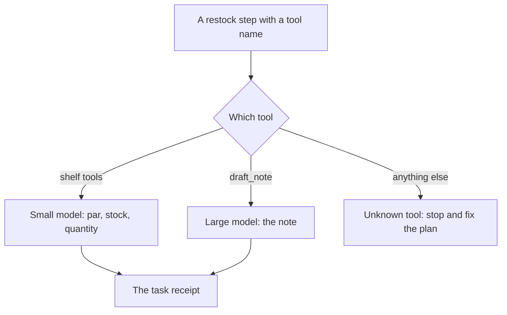
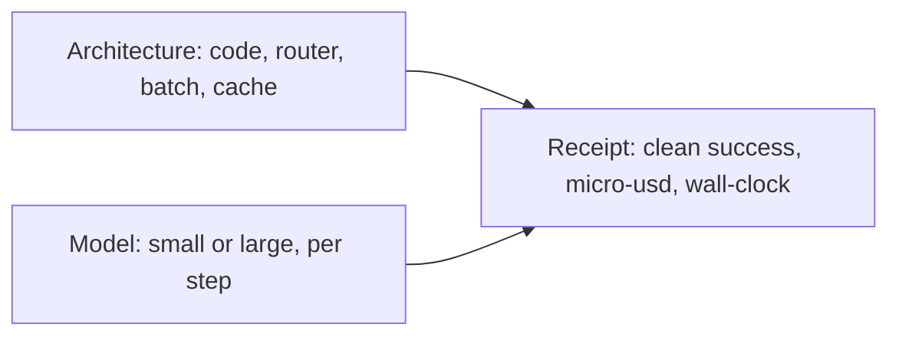

# Chapter 24: Cost, Latency, and Architecture

**Part V -- Security, multi-agent, ops**

Rafi's Tuesday list is a finished task, or it is a second morning. Hearth Lane needs twelve cartons of oat milk on the Wednesday dairy delivery, twelve bags of house coffee, no cardamom buns on Wednesday, and twenty-four buns on Thursday. The concierge can read the shelf, subtract a par, and write the note Maya will order from. The claim of this chapter is that the price of that work is the receipt of the finished task, not the sticker on a single call. Architecture -- which model runs which step, which steps are not a model, which reads you batch, which results you cache -- is a lever on that receipt. A smaller token bill on a note that forgets Wednesday is not a saving. Rafi still has to make the list.

**Agent quality = Model × Harness × Feedback loop.** The model factor, here, is which weights ran on which step. The harness factor is the router, the cache, the batch, and the subtraction you refused to leave in prose. The feedback factor is the receipt Chapter 14 already defined: clean success, the money, and the wait, attached to the task. Chapter 15 showed that a skill and a larger model move different cases. This chapter assumes you have measured that, and asks how the program spends the two models on one restock without changing what "finished" means.

The lab scores three recorded ways of running the same restock shape. One sends every step to a small model. One sends every step to a large model. One routes shelf work to the small model and the note to the large model. You do not need a live key to add the receipt. The rows are the bill.

## The price of a finished task

Chapter 14's page is the definition this chapter will not renegotiate. A **finished task** is one restock with an ending: a note a person can confirm, a defended refusal, or a correction. **Clean success** means the note met the constraints and nobody rewrote it first. **Cost to a finished task** sums every call you spent to reach that ending, including the calls on mornings that failed. **Cost per clean success** divides that sum by the number of clean successes, with integer floor division, and is undefined when the count is zero. Print "no clean success" rather than dividing by zero or falling back to the price of a token. **Latency to a finished task** is wall-clock from the request until that ending. It is not time-to-first-token. The lab's runs are sequential, so a task's wall-clock is the sum of its step latencies. The median on the page is the lower median from Chapter 14: sort the clean tasks, take the element at index `(count - 1) // 2`. Failed mornings stay in the cost and in the total wait. They stay out of the latency median, because that median describes mornings that actually finished clean.

A token price answers a different question. It says what one completion cost on a rate card. The Tuesday restock is not one completion. It is a shelf read, a par read, a quantity, and a note that has to hold two days of buns at once. Four cheap calls that drop the Wednesday hold can cost less per call than one careful note and still cost the shop a morning. The failed calls are in the numerator. The denominator did not move. The receipt says the configuration has no clean success, and it says what you spent to learn that.

Walk Tuesday with the quantities the earlier chapters already fixed. Oat milk, sku OM-32, has three cartons on the shelf and a par of sixteen, so the order is twelve, on the usual Wednesday dairy delivery. House coffee has four on hand and a par of sixteen, so the order is twelve, the same difference Chapter 10's restock drafted for `house-coffee`. Cardamom buns are not a par subtraction. The huddle in Chapter 5 already decided: none on Wednesday, twenty-four on Thursday. A small model that treats buns as another `par - on_hand` will order buns for a day the shop held them back. The note looks like a list. It is the wrong list. If Maya catches it, Chapter 14 counts a correction, not a clean success. If nobody catches it, Wednesday's bake is a tray the café did not want, and the metric is worse than a red row.

The large model, asked to do every step including the shelf read, can hold the Wednesday line and the Thursday line in one note. The task can be a clean success. The receipt is still honest about the waste. A shelf read is a query. Paying a synthesis model to repeat a row the database already returned is a harness choice, and the wall-clock is the sum of those calls because Rafi is waiting on the last one. Chapter 14's Rafi number is the tail, not the average: he fails a slow agent even when the eventual list is right. The median of clean tasks describes the ordinary morning. An average that mixes the slow note with a pile of instant reads will hide the morning he abandons.

Keep task types apart, as Chapter 14 insisted. A restock and an hours question do not share a success definition, and they should not share a blended cost. Monday's hours are a short read of the FAQ. Tuesday's list is a constraint problem. If you average them, the hours questions will make the program look cheap and the restock will keep failing in a footnote. The lab's three mornings are all restocks of the same shape: a Tuesday rush, a Wednesday dairy order, a Friday close. Compare arms inside that slice. Do not declare a winner from a demo that only ran the easy morning.

Money on a hosted API is micro-dollars in the fixture so the arithmetic stays in integers. A million micro-dollars is one dollar. The unit is small so a single call does not round away. A local model from Chapter 3 may show a money cost of zero. The wait is still on the receipt. Log both, and do not let a zero dollar figure hide a pause that sends Rafi back to a paper list. Human minutes, when you do not have a timer on Maya's correction, stay a count of corrections. A made-up labor rate presented as a measurement will be optimized, and it will not match the next week. The lab does not invent one.

The comparison you are allowed to make is the one Chapter 15 already required. Same scenario, same checker, same definition of the note. Change the route, or the model, or the skill, one at a time. A week that also rewrites the skill and turns the checker off has two explanations for every moved number, and the cheaper explanation may be the one that stopped looking. Chapter 12's suite stays on. A cache that skips it, which the next sections refuse, can shrink the bill and bring the bun back. Only the task-level receipt shows both.

Write the held-still fields in the same note as the table. The task ids, the tool names, the model ids, the checker version, the skill version: if the note omits the route map, the next person will move `draft_note` onto the small model and compare their trace with yours. Chapter 3 printed `MODEL` so a swap was visible. The restock receipt should print the route the same way.

## A small model for the shelf, a large one for the note

Chapter 15's warning was specific. Routing is a harness around two levers you have already measured separately. A router built on a hunch sends Sam's cart to the cheap model and the hours question to the expensive one. The restock version of that hunch sounds sensible in a meeting. "It is just a list, use the small model." Or, "the note is important, use the large model for the shelf too, to be safe." Neither sentence names the step. The router you can defend names the step.

Two kinds of work show up on this morning.

**CRUD** is a read or a write the harness already knows how to check. `read_par` returns the par. `read_stock` returns on-hand. `write_qty` records a quantity for a sku whose rule really is subtraction: oat milk, house coffee. The observation is a row. A small model can copy a row into a tool call when you have not yet moved the subtraction into code. The failure mode of putting a large model here is spend and wait, not a better par. The database was the authority. Chapter 4's tool was the sensor. A fluent paraphrase of a stock row is not a second source of truth.

**Synthesis** is the note that has to hold constraints the subtraction does not express. No cardamom buns on Wednesday. Twenty-four on Thursday. The dairy order lands Wednesday, not Saturday, because delivery in the policy runs Tuesday through Friday. The note must not invent a nut-free bun, a cash term, or a shipping fee the policy does not have. That is the work a short skill can state and a stronger model is more likely to follow when several clauses have to survive in one paragraph. Chapter 15's bake-off was this split in another costume. The skill fixed the sentences the pairs kept repeating. The larger model was the one that called the stock tool. On the restock, the stock tool is the easy part and the sentences in the note are the hard part. The router should not assume "tool call" means "large" and "paragraph" means "small." It should follow the split you measured.

The lab's rule is that split, written as code so a hunch cannot override it on a busy morning.

- `read_par`, `read_stock`, and `write_qty` route to the small model.
- `draft_note` routes to the large model.
- Any other tool name is a bug in the plan, not a default to small. `charge_card` and `place_order` are not routed to a model at all. Chapter 16 already marked the charge as never and the order as confirm. A router that "handles" them by picking a model has skipped the tier. Chapter 10 still wants one ledger row for the order, after a person confirms. The router does not get a vote.

The router looks at the tool name the harness assigned when the step was planned. It does not ask the model which model it would like to be. A model that can upgrade itself will upgrade on the shelf read, and it will "save money" on the note, which is the expensive mistake in both directions. The choice is harness, the way the directory jail in Chapter 2 is harness.

*Figure 24.1. The router is a function of the tool name. Shelf steps go to the small model. The note goes to the large model. A tool the plan does not know is not silently cheap.*

Figure 24.1 is the whole policy for this lab. It is deliberately boring. A learned router that inspects the prose of the note and decides mid-sentence has put a new model in the control path. You will not know whether Tuesday's bill moved because the note was hard or because the router was unsure. Fix the tool names first. If a later measurement says `write_qty` is where the small model turns twelve into a hundred and twenty, you change that one arrow and you re-score the same mornings. You do not throw out the map because one arrow was wrong.

Misroutes have signatures on the receipt. All-small is fast and cheap and not clean: the Wednesday hold disappears, clean successes stay at zero, and cost per clean success is undefined. You still spent the morning. All-large can be clean and still a bad buy, because the shelf reads were priced like essays and the wall-clock is the sum of them. Routed, in the fixture, keeps the clean successes of the large model on the note and the small model's prices on the shelf. That is the comparison the lab asks you to recompute. If your router sends `draft_note` to the small model, you have rebuilt the all-small arm. The recorded routed rows used the large model on that step only, and the test that joins the two should fail.

Hold the rest still. The skill text, the checker, and the scenario do not change between arms. Chapter 15's problem with changing two levers at once applies here. If the routed arm also carries a new skill, you cannot tell whether the Wednesday line survived because of the model or because of the sentence. The lab's rows vary the route. They do not smuggle a better procedure into the cheap arm.

The router picks a model for a step the harness has already decided to run. It does not promote a confirm into an auto. A retry that routes the same `place_order` to a "more reliable" model and appends a second order has optimized the wrong receipt. Idempotency stays in the runtime from Chapter 10. Slow is not a reason to place the order twice.

## Batching, caching, and fewer turns

The loop from Chapter 2 will read `policy.md` once per sentence if you let it. Each read is a turn, a tool result, and more text in a window Chapter 5 already called a budget. The restock has a worse version: one model call per sku, each call repeating the par table, each call waiting on the one before it because the harness ran them in series. Wall-clock becomes a tour of the shelf. The note has not started, and Rafi is already looking at the clock.

**Batching** means one observation where the program already knows the rows belong together. A single stock read that returns every sku under par is the query Chapter 4's SQL can already express. The model sees one tool result and writes one note. You do not batch across a tier. The draft of the order and the placement of the order are not one call with a flag inside it. Chapter 16 split them on purpose. A batch that includes `place_order` because "we are already here" has turned a latency trick into an autonomy change. Batch reads. Keep the confirm as its own step, with its own token, bound to the quantities the person was shown. Chapter 17's mail token covered the body, not a summary. The restock token covers the quantities, not the phrase "the usual order."

**Caching** means not paying again for a read whose result you still believe. The policy file and the FAQ do not change mid-morning. A session cache keyed by path, and by a version or a modification time the harness checks, can skip a second `read_file` of the shipping paragraph. The citation in the note still names `docs/policy.md`. The cache saved a read. It did not invent a new rule. Stock is a different key. The dairy delivery that lands at ten changes on-hand. A cache that serves the 6 a.m. count at noon will order twelve cartons on top of the twelve already on the dock. That is Chapter 6's stale belief, now with a supplier attached. Invalidate stock when a write lands, or give that cache a life shorter than a delivery window, and put the rule in code. A sentence that asks the model to "prefer the latest shelf" will be skipped on the turn you most needed it.

The cache you do not build is a cache of verdicts. Chapter 14 named the failure, and a cost chapter is where teams ship it by accident. A cache that skips the checker because the last note looked similar has made the receipt dishonest. The cost went down. The harm came back. Similar is not a pass. The next morning's bun decision is not this morning's oat-milk quantity. Saturday is not Tuesday. Cache tool observations inside a boundary you can name. Re-run the checker on the note you are about to show Rafi. The checker's cost belongs on the finished task. It is cheaper than a wrong tray, and it is part of the definition of clean success. Taking it off the path to save a call is how a green bill and a red café happen on the same day.

**Fewer turns** means the stop conditions you already own, pointed at a bill. Chapter 2 stops a repeated `read_file`. Chapter 11 caps a revision loop. A restock that re-reads the shelf after every sentence is burning wall-clock that the checkpoint from Chapter 10 could have prevented. On resume, load the stock from the session and do not ask again unless the checkpoint says the stock was invalidated. The prompt is a view of the record. The second read is justified when the record might have changed, and only then.

Fewer turns is not a shorter prompt that drops a constraint to go faster. Chapter 5's budget decides what enters the window. It does not delete the Wednesday hold so the call returns sooner. A one-shot note that never saw the huddle is the fastest wrong list in the building. If the budget forces a cut, cut the weather and the sweetness complaint, the way that chapter already cut them, and keep the quantities. The receipt tells you if you cut the wrong paragraph. Clean success falls. Saved latency does not repair a denominator of zero.

When two reads do not depend on each other, overlapping them changes wall-clock from a sum into a critical path. The note cannot start until both are back, and the slower read is the wait. The lab does not overlap anything. Its recorded latencies add, and your summary should add them. If you later parallelize `read_par` and `read_stock`, change the definition in the report on purpose and recompute every arm with the new definition. A page that sometimes sums and sometimes takes a maximum will show a victory that is only the formula. That is Chapter 14's warning about a percentile that changes between weeks, applied to the clock.

Each of these moves is a harness edit. Measure it the way you measured a model swap. Same mornings, same suite, the receipt next to the trace. A batch that drops a sku, a cache that freezes Tuesday's count, a stop that cuts the note off before the Thursday line: those are regressions with a smaller bill. Ship them when clean success held and the wall-clock you report is the one Rafi waited through.

## Architecture is a cost lever

The model is one lever. Chapter 15 said to pull it when the trace shows the fact was present and these weights did not use it. Architecture is how the harness spends that lever, or declines to call it. Three edits change the Tuesday receipt without a new weight file.

**Put the subtraction in code.** The order quantity for oat milk and for house coffee is the par minus the quantity on hand, computed by the program that read both numbers. The model does not get a chance to order a hundred and twenty cartons because a digit drifted. Chapter 11 already refused to let a model be the adder of a cart total. A restock quantity is the same kind of fact. The cheapest route for that step is no model at all. The lab still records `write_qty` as a small-model step, so the router has a CRUD call you can price against the large model. The further cut -- deleting that call and writing the integer in the harness -- should make the next receipt smaller, and it should not move the Wednesday line. If you delete it and the note's constraints change, the quantity step was doing work you had not named. Put that work back where a test can see it.

**Route the note, and leave the shelf on the small model.** Figure 24.1 is this edit. All-large shows that the note can be clean and that you can overpay for a stock row. All-small shows that a low sticker can sit next to zero clean successes. Routed is the architecture claim: the same scenario, fewer micro-dollars per clean success than all-large, less wall-clock than all-large, clean successes intact. If the routed arm is cheaper because the note failed, you do not have the claim. You have the all-small story with an extra box on a slide.

**Change the loop, and leave the definition of done alone.** Batch the shelf. Cache the policy for the session, with a version on the key. Stop repeated reads. Leave the checker, the autonomy tiers, and the Chapter 12 cases on the path they are already on. A cost project that relaxes the suite until the build is green has edited the product and called it a performance win. The moves you are allowed are the ones that keep a known-good note passing and a known-bad note failing. Chapter 12's gate is not a latency feature. It is the reason a fast note is allowed to count.

*Figure 24.2. Architecture and the model both land on the same receipt. You design for the receipt.*

Figure 24.2 is why a token chart is the wrong north star. Both levers are real. Only the receipt says whether Tuesday finished. Chapter 17's blueprint does not grow a sixth part for cost. Files, tools, and approvals stay the work-agent shape. Cost decides which model, if any, sits behind a tool, and which tools may run a second time. A browser fetch the restock does not need is both a wait and a page of untrusted text, which is Chapter 8. Leave it out. The shelf is already in the database. The policy is already a file.

A second agent is a second receipt. Chapter 23 asks when one agent is enough. The cost version of that question is immediate: each extra role that calls a model adds a bill and a wait to the same finished list. A researcher, a buyer, and a writer can be three large-model loops for a subtraction and a paragraph. Add a role when the contract needs a separate principal. Chapter 17 kept the customer concierge and the staff mail agent apart so a guest's pasted text could not inherit the counter's outbox. That split is worth a second process. A committee that drafts the oat-milk quantity three times is not. One loop, a router, and a confirm will finish this morning. Another model in the middle will invoice it.

Bring the arms back to the weekly page from Chapter 14. The arm you ship keeps clean success and spends less per clean success, at a wall-clock the counter will actually wait for. Hold the scenario still so the difference is the architecture. If both the routed arm and the all-large arm are clean, and the routed arm is the one Rafi can stand next to, ship the route and keep the large model on the residual, which in this fixture is the note. Shipping all-large because the meeting is ending, or all-small because the invoice looks kind, repeats the muddy week Chapter 15 warned you about.

The lab computes that table from recorded rows, so the chapter does not depend on a hosted key. A live rerun is optional. It should follow Chapter 3: one client, one model name at a time, the same steps, the checker left untouched. If you edit the route map in the middle of the live rerun, you have pulled the lever you were trying to measure. Pin the map in the note beside the table. Recorded rows stay put. A hosted model name can point at a new snapshot next month, and the bill will move for a reason that is not your architecture.

## Lab

Score a recorded comparison of the restock router. The same three mornings run all-small, all-large, and routed. Report micro-dollars and wall-clock for the finished tasks. Failed mornings stay in the spend. They stay out of the clean-success median. The router itself is a function of the tool name. There is no solution file. The rows are the bill, and the summary is yours to compute.

The fixture, the two functions, and the checks are in the [Chapter 24 lab](../../labs/ch24-cost-latency-and-architecture/README.md).

**Builder takeaway:** Design for the task receipt, not the token bill alone.

A token is a line on the way to a list Rafi can hand to a supplier. The finished restock is the thing the shop can use. Clean success says the Wednesday hold survived. Micro-dollars and wall-clock say what that survival cost. Architecture is how you move those numbers without quietly changing what survival means. The next chapter is what happens when the agent wants to edit the procedure that survival depends on, and why that edit does not merge itself.
