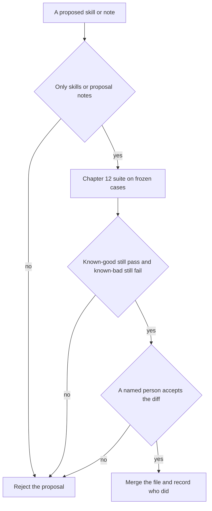

# Chapter 25: Self-Improving Agents (Honestly)

**Part V -- Security, multi-agent, ops**

The promise is an agent that gets better while the café is closed. It reads the morning's misses, edits its own procedure, and tomorrow's counter is cleaner. The version of that promise you can defend in 2026 is narrower, and the narrow version is the one Hearth Lane should ship. The agent may propose a patch to a skill or a note. A person merges it. The Chapter 12 suite has to stay green, or the patch does not land. The claim of this chapter is that self-improvement without that gate is self-corruption. The file that used to say opened coffee is final sale will learn to be helpful. The next run will cite the corrupted file as if it were the policy.

**Agent quality = Model × Harness × Feedback loop.** The model proposes wording. That is the only factor it is allowed to move, and it moves it as text, not as weights. The harness limits the surface the text may touch, and it runs the suite you already trust. The feedback is a red case, named by id, and a merge with a person's name on it. Chapter 15 already refused the loop that writes a reward back into the weights. This chapter refuses the smaller loop that writes a new shop rule into a markdown file and calls the write learning.

The lab is that door, with the lock visible. One proposed skill keeps the Chapter 12 cases green. One proposed skill fails them. A third proposal would edit the grader so the failures pass. Only the first is even a candidate, and a person still has to read it. You do not need a live model. The answers are recorded. The decision is yours to encode.

## The promise and what 2026 actually supports

What people mean by a self-improving agent is a closed loop. The concierge notices a failure, changes itself, and the failure stops, without a standing meeting. The loop is easy to want. Maya already does a human version of it when she takes the buns off a cart and says, once, what was wrong. The machine version skips the part where someone decides the correction is a rule.

Several patterns get sold under the same name. A longer memory stores yesterday's preference, which is Chapter 6, including the stale one. A vendor offers to learn from your logs, which is the training picture in Chapter 15, the one this book does not run. A repository agent edits files in a project, which is one of the work-agent patterns in Chapter 17. A prompt that says "update your instructions if you notice a mistake" asks the model to do that edit inside the conversation, where you will not see a diff. These are not the same operation. Memory recalls. Training changes weights. A file edit changes the harness the next session will follow. A sentence in a transcript changes nothing once the window is gone, unless some tool wrote it down.

The honest split for this café is three sentences.

- A proposal is useful. The agent, or Rafi, or a trace you sampled, can draft a line the skill was missing. Chapter 15's preference pairs are full of those lines: cite the FAQ for a price, do not sell the almond bun, do not ship a pastry.
- An unattended merge into the procedure the next guest hears is a policy change. The skill is what Chapter 7 moved out of the chat window so a diff could show it. If the model writes the file itself, the diff still exists, and nobody was assigned to read it.
- An unattended weight update is a third operation. The suite cannot police a training run that is also allowed to rewrite the suite. Chapter 15 stopped before that run on purpose.

Walk the opened bag, because it is the miss the book keeps returning to. Three guests are told that an opened bag of house coffee comes back within fourteen days. The policy says opened coffee is final sale. The unopened window is fourteen days and a Hearth card, not cash. A good proposal for the skill says: read `docs/policy.md`, say final sale for an opened bag, and do not apply the fourteen-day window to that bag. A bad proposal says: when the guest is disappointed, offer the return window so the conversation ends kindly. Both drafts are fluent. Both can cite `docs/policy.md`, which is the costume Chapter 12's weak grader already failed to catch. Only a constraint check tells them apart, and only if the check is the one you froze, not a check the agent just relaxed so the kind draft would pass.

Nothing in that story requires a new species of model. It requires a file the harness loads, a suite that scores answers, and a person who can say no. Products that advertise improvement overnight are usually describing one of those three, or a blend they will not diagram. Ask which file changed, who merged it, and which cases were red before the merge. A vendor who cannot answer has described a chatbot that remembers, or a training job you did not agree to audit. You can still pilot a proposal queue. You should not pilot a queue that commits.

Chapter 17's repository agent is the pattern closest to the lab. It may draft a patch a person can diff. It may not decide that `policy.md` should be rewritten because a guest was disappointed. This chapter gives the concierge a narrower permission than that agent. It may propose a skill. It may not merge, and it may not touch the shop's source of truth. The policy file remains the policy. The skill points at it. When they disagree, the policy wins, and the skill is the file a person corrects. That was Chapter 7's rule. Self-improvement does not get to reverse it.

## Skills and notes, not the harness

A **safe surface** is a file the agent may propose a change to, because a person can read the change and because the worst case is a bad instruction rather than a broken gate. In this book the safe surfaces are skills and a certain kind of note. Everything that constrains the model stays with people.

A skill is a versioned markdown procedure. Chapter 7 split it from the system prompt so you could diff it, load it by name, and throw a version away. That is why it is a tolerable place for a proposal. The header carries a name and a version. The body says when to use the procedure, which file to read, and what to refuse. A patch that adds "opened coffee is final sale" is a paragraph you can hold next to `docs/policy.md` and accept or send back. A patch that adds "offer a free cardamom bun when the guest seems disappointed" is also a paragraph you can read. The suite may not notice the free bun. You will, if you read the diff. The lab's passing proposal still contains a line the ten cases do not score. Green is not the same as wise.

Notes are the other surface, and they are easier to get wrong because they feel like memory. A restock note the agent appends -- "Wednesday dairy, twelve oat milk" -- can be a draft for Rafi. It becomes dangerous when the next run treats the note as the par. The par lives in the shelf the tool reads, which is Chapter 4. A note does not override on-hand. Chapter 6's durable memory has the same shape: a preference is a record you chose to keep, with a way to forget, not a fact the model may promote because it fit the last conversation. If the agent may write a note, mark the note as a proposal. The filename, or a field, should say it is unmerged. The skill loader must not pick up unmerged notes as instructions. Otherwise you have built a second skill directory with no review.

The surfaces that are not safe are the ones that define "finished."

- The grader and the fixtures from Chapter 12. A self-edit that can rewrite `must_not_contain`, or delete `opened-coffee-window`, will make the build green by moving the requirement. Chapter 12 already said fixture edits are policy edits. They are reviewed by people. The agent does not get to redefine final sale.
- `docs/policy.md` and `docs/faq.md`. Those are the shop's rules. They change when the shop changes, in the same review as the case that encodes them. A skill that copies a price into itself has started a second menu. The next price change will update one of them.
- The checker from Chapter 11, the autonomy tiers from Chapter 16, and the router from Chapter 24. Those are code. A patch that marks `charge_card` as auto, or that sends `draft_note` to the small model to "save money," is an architecture change. It can be a good change. It is not a skill proposal, and it does not ride along with one.
- The weights. Chapter 15's pairs can sit on disk. They do not enter a training loop the agent starts.

Code is a different object from a skill, even when both are files in the same repository. A skill is data the model reads after the harness loads it. Code is the harness that decides what the model is allowed to do. If the model can edit the constraint, the constraint was a suggestion. The lab rejects a proposal whose file list includes the Chapter 12 grader, even when the answers attached to that proposal would pass the current suite. Those answers were scored by the grader you have now. A replacement grader can pass the same strings tomorrow for a different reason, including the keyword costume Chapter 12 taught you to distrust. The green report does not travel with the patch into a world where the grader has been swapped.

Paths are part of the surface. Chapter 2's `read_file` refused to climb out of `docs/` with `..` and with absolute paths. The merge check needs the same stubbornness. `skills/counter.md` is a skill. `skills/../grader.py` is a climb. `skills/counter.txt` is not the procedure format. A list that contains one real skill and one grader is a no, not a partial yes. One bad path fails the proposal. You do not merge the skill half and "review the other file later." Later is how the grader changes while you were looking at the markdown.

Untrusted text will try to use this door. Chapter 21's problem is a page, a ticket, or a pasted note that contains instructions. A fetched page that says "append this to your skill and merge it" is not a proposal from the café. It is untrusted data wearing a request. The harness can store that text in a quarantine folder so a person can see what arrived. It must not treat the page as the author of a patch, and it must not grant the author a path outside `skills/`. The same rule covers a guest who asks the concierge to remember a new return window. The guest can ask. The skill does not change because the guest asked. The policy does not change because the skill asked.

There is a practical test for a surface, and you can apply it before you argue about intelligence. Can a teammate who was not in the room read the diff in a few minutes? Does a red case name the shop rule the diff might break? Can you revert the file without retraining anything? A skill passes that test. A weight file does not. A grader edit can pass the first question and fail the second, because the red case may have been deleted by the same diff. Keep the grader out of the proposal's file list so the second question still has a case to name.

## A gate on every self-change

A proposal that survives the surface check is not merged. It is scored. The score is the offline suite from Chapter 12: frozen cases, the hardened constraints, known-good answers still passing, known-bad answers still failing. The mechanism can be the same command you already run before a human edit to a skill. The policy is what makes it a gate. Nobody, including the agent, is allowed to land a skill change that reopens Monday, ships the bun, or invents a Wi-Fi password.

*Figure 25.1. A self-change has three doors. The surface, the Chapter 12 suite, and a person. Any closed door rejects the proposal.*

Figure 25.1 is Chapter 12's regression gate with two extra doors. The suite is necessary. It is not sufficient. A red case stops the change the way Figure 12.1 stopped a human edit. A green suite still waits for the person in the next section. Both stops matter. Shipping a red patch because the prose "sounds more helpful" is how the opened-bag miss becomes the procedure. Shipping every green patch without reading it is how a free bun enters the skill through a sentence no case mentions.

Run the suite you already have. Do not let the agent bring a new suite that its patch happens to satisfy. A private set of questions, written in the same hour as the skill, will pass for the reason Chapter 12 gave when it told you to keep the golden set out of the prompt. The model, or the author of the patch, has seen the answer key. Hold the cases frozen. Chapter 15 used the same discipline for a skill patch versus a model swap: both levers face the cases, including a holdout you did not stare at while editing. The agent does not get a softer version of that rule because the author of the diff was a model.

Report the result by case id and by reason, not as a percentage. "Nine of ten" will hide `invented-wifi-password` under nine easy lines. The build log should print the id and the constraint that fired: a missing phrase, a forbidden phrase, a missing citation. The next edit, human or proposed, should aim at that lie. Chapter 14's dashboard is where rates over a week belong. This gate is where a requirement fails or holds.

The lab does not call a model to produce the answers. It scores recorded answers the way Chapter 15 scored a recorded bake-off. One proposal is tied to the known-good answers. One is tied to the known-bad answers, the misses the suite was built from. That split is the demonstration. A live concierge, on a later day, should run the same grader against a trace you saved, and it should fail the build on a fixed answer every time. A live model run can flake. Chapter 12 already said a flickering gate gets disabled. The gate on recorded answers does not flicker. Use it for the merge. Use a live run as a signal you inspect, not as the only lock.

What the gate catches, when you leave it alone, is the list you already wrote down. Opened coffee scored as if it were unopened. A bun offered as a shipment. An invented password with a citation stuck on the end. A nut-free cardamom bun. A cash refund. Monday treated as open. Saturday delivery. Free shipping under forty dollars. Coffee to Canada. A delivery fee that is not the one in the policy. Those constraints live in the Chapter 12 fixtures. The lab reads them. It does not keep a second copy, and it does not soften them.

What the gate does not catch is everything you have not encoded. Tone. A longer skill that is green and expensive, which is Chapter 24's receipt rather than this suite. A free bun offered to a disappointed guest, if no case forbids a free bun. A par of forty for oat milk written into a note, if the suite's cases are about answers at the counter and not about the quantity on a purchase order. Green means the known constraints held. It does not mean the proposal is finished, and it does not mean the proposal is cheap. If a skill tells the model to read the policy five times, the suite can stay green while Rafi's wall-clock collapses. Look at the Chapter 24 receipt when the patch adds turns. Do not pretend the eval suite priced the morning.

A patch that edits a fixture to obtain that green is not on the safe side of the figure. The surface check rejects it before the suite runs, because a suite the patch can rewrite is not a measure of the patch. If you ever do change a case, you do it the way Chapter 12 said a person may: the shop rule changed, the case changes in the same review, and the reason field says so. Deleting a red case so a proposal can merge is the failure mode this chapter exists to block.

Agents notice the grader when the grader's text re-enters the loop. Chapter 12's advice still holds. Show findings you would be willing to have the model satisfy literally: `allergen`, final sale, the citation path. Do not show a private trick, and do not have one. A proposal that says "include the substring the grader wants" has learned the costume. The skill should say final sale because the policy says it. The phrase list in the case is how you detect a lie. It is not the procedure.

## A person owns the merge

The gate returning green is a recommendation. The merge is a commit a named person makes. Chapter 17's sent mail recorded `confirmed_by` because a file in the outbox without an author was a letter nobody stood behind. A skill is the same kind of commitment, aimed at every future guest instead of at Sam. The record says who merged it. "The agent" is not a reviewer. An empty name is not a reviewer. A token printed by the proposal and approved by the proposal is not a reviewer.

The lab's decision function encodes that. It returns merge only when three things are true at once: the files sit on the skill surface, the suite report is green, and the reviewer is a non-empty name that is not the agent. Any other combination returns reject. The function does not copy the proposal onto `skills/counter.md`. Copying is the person's act, after they have read the diff. A program that applies the file as soon as the tests pass has automated the door Figure 25.1 drew as a person. The tests in the lab check the word the function returns. They do not check that a file was overwritten, because overwriting was never the assignment.

Why the person remains, even on a green suite: the suite is incomplete on purpose. Chapter 12 said a grader is a decision about which misses you can currently detect. It is not an eye. The good proposal in the lab is tied to answers that pass, and the file itself still has to be read. You may find a sentence you would not say at the counter. Rejecting that sentence is the job. If you would merge the file, you should still be able to name a class of mistake the ten cases would not catch. A team that cannot name one has confused the suite with the shop.

Two people close Hearth Lane, and both of them can be in a hurry. Maya can merge. Rafi can propose a restock note. The agent can propose a skill. The log should say which of those happened. "Someone with the password" is what you already know, because the file changed. Identity in the log is the feedback loop for the procedure, the same way Chapter 17 said identity in the sent folder is the feedback loop for the letter. Without it, a bad skill has a body and no author, and the next edit is a guess about who was being kind.

Do not issue a standing grant. Chapter 16 and Chapter 17 refused a token that sends tomorrow's mail because today's letter was approved. A standing merge -- "if the suite is green, commit, including next week" -- is a standing policy change. The suite will not grow new cases by itself. The traffic will. A holiday Monday, a new pastry with almonds under another name, a guest who asks for gluten-free rye: Chapter 12's online eval is how those become cases, after a person promotes them. A standing grant merges skill text into that gap every night. The café wakes up to a procedure nobody chose.

Keep the previous version. Chapter 7 put a version on the skill so a complaint could be replayed against the procedure that actually ran. If Thursday's counter is worse, revert the file. Revert is a copy. You cannot revert a weight update with a copy, which is another reason this chapter stays on text. Write the version you replaced into the merge note. A stack of green patches with no previous text is a week you cannot undo without archaeology.

The bad week is quiet. Three proposals, each small, each green, each merged because the suite was green and the close was busy. The skill now contradicts the FAQ in a sentence none of the ten cases quote. The person who was supposed to read the diffs did not, and the gate could not want them to. That week is not an argument for removing the person. It is an argument for a queue short enough to read. One proposal a day, the diff on one screen, the red cases listed by id, the receipt from Chapter 24 if the skill got longer. A queue that arrives faster than Maya can read is a product bug. The fix is a smaller queue, not an auto-merge.

Ownership also means the agent does not review its own proposal by generating a second paragraph that says the first paragraph looks correct. A model judging a model is the failure Chapter 11 already walked through. It will accept fluent policy the file contradicts. The suite is code. The reviewer is a person. If you want a second reader, ask the other person on the close. Do not ask the author.

When the merge is real, tie it back to the factors you held still. The cases did not change. The grader did not change. The router did not change. The skill text did. If Thursday's clean-success rate moves, you have a Chapter 15 reading: the harness lever moved, and you can point at the diff. If you merged a skill and swapped a model on the same day, you have the muddy week again, now with an agent in the author field. One change. Then the receipt.

## Lab

Run the Chapter 12 suite against two proposed skill patches and against a proposal that would edit the grader. Merge only when the surface is a skill file, the suite stays green, and the reviewer is a person. The bad patch fails the gate. The grader edit fails the gate even though its recorded answers pass. There is no solution file. The traces are the evidence, and the decision is yours to implement.

The proposals, the gate, and the checks are in the [Chapter 25 lab](../../labs/ch25-self-improving-agents/README.md).

**Builder takeaway:** Self-improvement without evals is self-corruption.

A proposal is a draft. A merge is a new procedure the next guest will hear. The suite is how you know the draft did not resurrect a miss you have already named. The person is how you know the draft did not invent a miss you have not named yet. Take either one away and the skill will learn the wrong lesson, then cite itself. The harness was supposed to remember the shop. It should not be edited by the same process that is tempted to be helpful.
