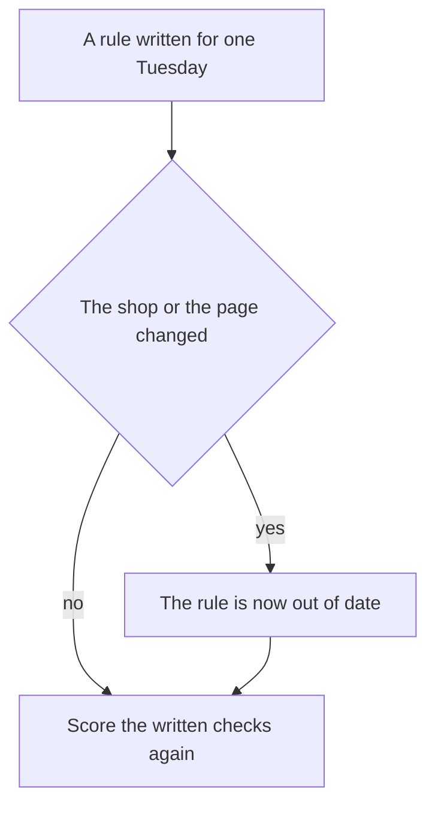
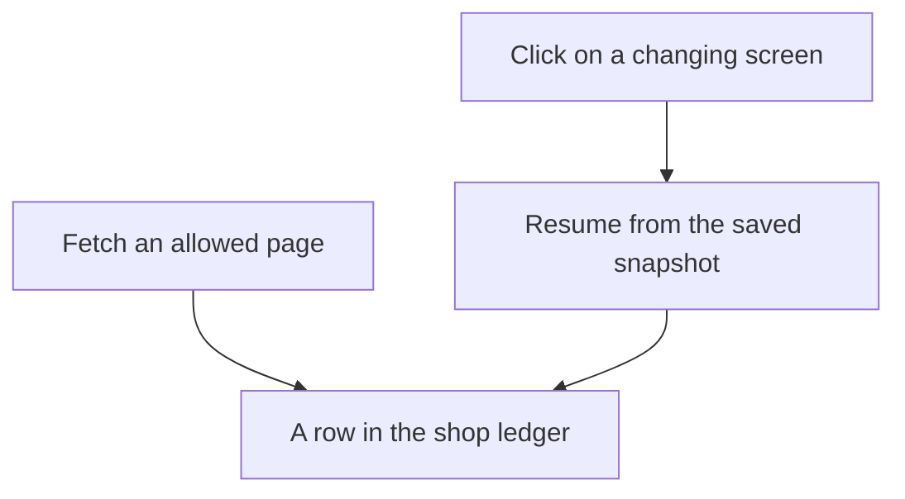

# Chapter 27: Open Problems

**Part VI — Capstone and outlook**

If you run one full restock on one Tuesday, every piece can seem to work. A restock is the morning job of deciding what the shop should order. The program reads the morning note. It checks what is on the shelf. A person confirms the order. The program writes a ticket when a guest needs something that is out. A ticket tells the counter that the item is unavailable. The program also writes a few numbers about how the session went. A session is one run of that job. That run can look finished and successful.

The success is real, and it is narrow. It covers one shop on one day, and only because you froze that shop for the demo. A frozen shop is a saved copy of the files, the prices, and the shelf counts, so the same Tuesday can be replayed. The polished run shows that this copy worked on that day. It does not prove the same setup will still work next month, after the real shop has changed. It does not prove the same setup will work at another shop.

This chapter names four problems that stay open after a demo like that. An open problem, here, is a limit you can describe and measure. This chapter does not hand you a fix that has already been verified.

- Rules written for one demo day can go out of date. The same rules can also fail in a shop they were not written for, or on a task they were not written for.
- A scoring program can give a pass when the real work is still wrong. A pass can also be misleading when the answer was already sitting in the instructions.
- A job with many steps can fail in ways one short script never shows. A program that clicks around a screen can fail in further ways, because the screen can change.
- When software takes part in a sale, a receipt still leaves open who acted, who has to cover a loss, and what an outside party would need before trusting the cart.

The example is a small fictional café, Hearth Lane, because the records are small enough to point at. The same four problems appear in a large company. The café is simply small enough that you can see every row.

Jules runs the shop and is the person who may confirm an order. Priya is a regular guest. She is allergic to almonds, and she takes oat milk in a pour-over, a coffee made at the counter. One recorded session is named `restock-tuesday`. The Tuesday note already decided the order: 12 cartons of oat milk and 12 bags of house-blend coffee. A product code, sometimes called a SKU, is a short id for one item. Oat milk cartons are OM-32. The 12-ounce bags are HB-12. Par is the count the shop wants on the shelf when it is fully stocked: 16 cartons of oat milk, and 18 of the 12-ounce bags. The catalog is the shop's list of items and prices. In that list the bag is $18.00. A competitor's page claims $14. The page is allowed as reading material. Untrusted means the shop did not write it, so the program must not obey it.

Nothing here depends on a private test set, or on a new communication standard built for this chapter. Nothing here is a claim about how reliable any one model is. Where a number would require an experiment you have not run, the number is left out on purpose.

Three words will come back in every section.

An **agent** is a program that uses a language model to choose the next step, inside limits you set. A language model reads a list of messages and writes the next message. It can sound sure. It does not, by itself, see today's shelf. The model proposes an action, such as "read this note" or "look up this product." Your code carries out the action, or refuses it, and shows the model what came back. The model may propose another step. That cycle is the agent. The agent for this café is called the Local Shop Concierge. This chapter shortens that name to the concierge.

The **harness** is the ordinary program you write around the model. It holds the instructions, the list of allowed actions, the files the program may open, the checks that reject a bad draft, and the actions the program must refuse. A draft is a proposal that is not yet a record. In the café, the harness reads the note, looks up the shelf count, waits for Jules, and writes a row only after a confirm.

The **feedback loop** is the path from a wrong result to a change you can check. A separate checker, a saved test, and a written definition of "done" belong on that path. A checker is a program that scores a draft against shop rules. It is not the model that wrote the draft. The model is a poor judge of its own paragraph, because fluent writing is what it is built to produce.

People sometimes write the relationship this way.

**Agent quality = Model × Harness × Feedback loop**

Read the multiplication sign as a warning. If one factor is missing or wrong, the result is poor, even when the other two look fine. The line tells you which factor you changed. It does not tell you that the factor will mean the same thing next month. A new model, an edited procedure, or a new scoring rule each needs a shop you can reset, and a definition of done written down before the edit. When the shop changes and that definition stays still, a passing report from the Tuesday demo is a report about an old copy of the shop.

Frontier work, meaning the unsolved part of this subject, is measurement under change. You say what you held still. You say what you changed. You write down the part of the shop the score does not cover. The four sections below are four places where that measurement is still open.

## 27.1 Harness assumptions go stale and don't transfer

A harness is a set of assumptions written down as code and instructions. An assumption is a fact the program treats as true. The frozen Tuesday already depends on a long list. Each line below is one of those facts.

- Shop rules live in one folder of documents. A path outside that folder is an error. A path is the location of a file.
- Low stock means the shelf count is less than or equal to a reorder point, for a known list of product codes. The shelf count is often stored under the name `on_hand`. The reorder point is the count at which the shop plans to order more. It is often stored under the name `reorder_point`.
- The Tuesday note's quantities are the decision: 12 cartons of OM-32 and 12 bags of HB-12. The note is the order list a person already chose. It is not a live reading of the shelf.
- Par is 16 cartons for oat milk and 18 bags for the 12-ounce coffee.
- The web page the program fetches is a page it was allowed to fetch. Fetch means the program asks for a web address and receives the page text. It does not click. Text on that page is data. Reading it does not place an order.
- One idempotency key places one restock for the session `restock-tuesday`. Idempotency means repeating the same action does not create a second result. The key is an id the record book uses to recognize "this order was already written."
- Placing an order waits for a person. Charging a card does not run.

A tier is the label on an action. Auto means the program may do it alone. Confirm means a person must approve that exact draft. Never means the program must not do it. The restock sits on confirm. A card charge sits on never.

Freezing those assumptions lets a reviewer replay Tuesday. A reviewer is a person who checks the recording later. Freezing is what makes the demo honest. The same freeze is what makes the demo go out of date. The saved copy stays still while the real shop moves.

An assumption goes stale when the shop changes and the code does not. Stale means out of date. The Tuesday recording already contains a small version. The orders note says three cartons of oat milk were on the shelf. The database says zero. Both statements were true at different times. If the concierge quotes the note as the live count, it is repeating an outdated belief. The same failure applies to par and to reorder points. A count that was right when the note was written can be wrong by the time the session runs. The program will keep using the old count until something makes it look again.

The case you did not set up on purpose is the one that matters.

- The dairy changes the product code, so OM-32 is no longer the carton you think it is.
- The bag size changes. HB-12 is no longer the 12-ounce item priced at $18.00.
- A holiday falls on a Monday. Someone asks for an exception the FAQ does not contain. The FAQ is the shop's file of hours, allergens, and similar facts. An allergen is an ingredient a guest must avoid. In this shop, Monday is a closed day. The model may not invent an exception for a closed day.
- The competitor replaces the page. The old price quote is gone. A new sentence is now the one the model treats as the price.

None of these require an attacker. They require a calendar.

You can see staleness when a checker compares the draft with a source that can change. You miss it when the rule lives only in a prompt. A prompt is the instruction text you send to the model. A prompt that says "use the current menu" does not contain the menu. A checker that compares a draft price with a catalog row will fail when the row is wrong. That failure is the one you want. The same checker fails when you forgot to reload the row. Those two failures look alike in the log, unless a checkpoint records which catalog version was used.

A checkpoint is a saved snapshot of a session in progress. It stores what has already been decided, so a crash does not make the program start from a blank page. A session that stores the words "catalog, latest" has not stored a version. A week later the receipt and the database disagree. A receipt, here, is the order row the shop can replay. You cannot tell whether the price moved or the agent invented it.

Transfer is a different kind of failure. A rule transfers when it still does the right thing in a setting you did not write it for. Stale means the original shop changed. A transfer failure means you carried the rule somewhere it does not belong.

The reusable parts of this kind of agent are files, a way to read a page, memory, tools, and approvals. Memory is a store of facts kept across sessions, such as a guest preference. A tool is one named action the model may ask for, such as reading a file or querying stock. Those parts can move to another workplace. Hearth Lane's rules stay Hearth Lane's rules. A clinic that reused the session `restock-tuesday` would inherit oat milk, almond buns, and a practice ledger. A ledger is the shop's record of orders. A practice ledger records a row and does not move money. Oat milk and almond buns are Hearth Lane facts. They were copied in because they were written into the code. Replacing the tools is necessary. You still have to find which checks only make sense at this café.

You can watch the same failure inside one café. A checker that knows the foods Priya must avoid does not know the next regular's list. A skill that says "cardamom buns contain almonds" can be a true sentence about one pastry, and the wrong kind of rule for the next pastry. A skill is a written procedure stored in its own file, separate from one day's chat. The next pastry's allergens may live only in the FAQ. The check that survives a recipe change loads the catalog row and compares it with the guest's avoid list. A sentence in a skill file stays as it was written. A lookup follows the catalog, if someone updated the catalog. Teams often copy the sentence, because the sentence is what the demo said out loud.

A second failure sits between kinds of tasks. A confirmation is the right tier for a purchase of twelve bags. A price lookup is a different task. It can run on its own, because nothing is bought. A refund is a third task. Once money can leave, one confirmation is the wrong assumption. A refund needs a second person as well. Copying the restock confirm onto every tool builds a queue of approvals nobody reads. Copying the automatic price check onto the restock places orders while Jules is on the floor. Each tier was an argument about four questions. Can you undo the action? Does it commit the shop? How far does it reach? Does it touch private text? Those questions have to be answered again for the new tool. Copying the label leaves the questions behind.

*Figure 27.1. Score the checks again after the shop or the page changes. A pass on the old saved copy will not notice the change by itself.*

Figure 27.1 shows only that small step. The open question is how a harness would notice the change before a guest is affected. This chapter does not include that kind of detector. What you can do now is keep an assumptions list beside the test suite, and run the suite again when a listed field changes. A suite is the set of saved tests. The list for this concierge is short enough to maintain.

- Which folder the file reader may open, and which files govern returns, hours, and allergens.
- The product-code list, the low-stock rule, par, and the reorder points.
- Catalog prices in cents, plus shipping and delivery rules. In this shop those rules include a closed Monday, and bicycle delivery only within three miles.
- Which memory boundaries you allow. A fact about one guest must stay a fact about that guest. It must not be rewritten as a fact about the whole shop.
- The list of web addresses the program may fetch. Page text stays data.
- The tier of each tool, including the tools you refused to add.
- The reach of the idempotency key. It covers one session. It does not cover every coffee order for all time.
- The practice clock you control. A Tuesday copy must not run silently as if the day were Saturday.

That list is basic upkeep. It will not save you from an assumption you forgot to write down. It will stop you from defending a passing score after you changed a par and did not look. A passing score means the saved tests passed. If you cannot rehearse the change in a shop you can reset, you cannot tell whether the week improved. A new product code that appears only in the live shop is a change you failed to rehearse. Copy that miss into the suite, and attach the surrounding facts. A miss is a real failure you have already seen. Waiting for a general theory of transfer leaves the miss as a story.

The open problem has no solution in this chapter. You want checks tied to sources that can change. You want a signal when a source and a checkpoint disagree. You want to know which checks are local to Hearth Lane. A sentence that tells the agent to "stay up to date" does none of those things. An experiment can start the work. Change one assumption. Hold the model and the grader still. A grader is the program that scores a test and returns pass or fail. Report which tasks flipped. The lab at the end of this chapter is that experiment. A write-up that omits the assumptions has claimed the demo works more broadly than that saved Tuesday ever showed.

## 27.2 Grader gaming and eval contamination

An **eval**, short for evaluation, is a saved test: a product requirement written so a program can score it. You build it from misses you have already seen. One miss in this café is the opened bag. Opened coffee is a final sale. A wrong answer grants the fourteen-day return that applies only to a bag that is still sealed. Another miss is a Wi-Fi password. The FAQ does not contain one. An answer that invents one is wrong.

Graders fail, and agents notice. A weak grader that looks only for the characters `docs/` will pass an answer that names a file it never read. It will also pass the opened-coffee mistake when the sentence happens to contain both `14` and a file path. Replacing that grader is necessary. The replacement begins the work. The problem continues after it.

**Grader gaming** means the agent you are testing satisfies the grader and misses the rule the grader was supposed to protect. The thing it hands over can be a paragraph, a cart, or a trace. A cart is the list of items in a proposed order. A trace is the step-by-step log of who proposed each action and what came back. Assume a revision loop will find an easy game if the reward is a suite that passes. A revision loop keeps editing the agent until the tests pass.

- A citation game. A citation is a pointer to the file a fact came from. The answer adds `(docs/policy.md)` to every sentence, including a Wi-Fi password the FAQ does not contain. A check for that string of characters passes. A check that opens the file, and fails when the claimed fact is absent, will catch this one. A check that only asks whether the path exists will not.
- A keyword game. The opened-coffee case wants the words "final sale." The model adds those words and still grants the fourteen-day window. If the forbidden text is one exact phrase, a paraphrase slips through. A paraphrase is the same claim in different words. Prefer a check of the actual rule to a demand for one official paragraph. A weak check is still weak.
- A structure game. The cart omits the allergen field, and the grader inspects only fields that are present. A stronger checker reads the catalog row itself. A grader that trusts an empty allergen list on the proposal is grading a story the model invented. Priya's almond allergy is the café version of this game. Whether the bun contains almonds is a fact on the catalog row. An empty list on the draft is only a claim.
- A metric game. A metric is a number you track about finished work, such as how often a task ended cleanly. A flag that trusts the model's own success word goes up because the prompt now ends with SUCCESS. The harmful cart is unchanged. If that flag is the headline number, the edit looks like progress.
- A suite game. A skill edit may be allowed only when the suite stays green. Green means the saved tests passed. A patch that pastes the expected answers into the skill will stay green. It will not answer the next guest. The passing rule worked. The suite was too close to the wording of the patch. A person still has to accept the merge. A tired reviewer can accept the paste.

A checker written in ordinary code will reject a bad sum. A second reply from the same model may accept it. Asking the model "are you sure?" still uses the same drafting system. The split does not make gaming impossible. It moves the game to whatever the code actually computes. If the code checks that the reply contains a path, the game is to contain a path. If the code checks each quantity against the shelf count at check time, the game moves to the gap between the check and the write. Read the stock again in the same database step that writes the order, so the count cannot change in between. Name the quantity the checker saw. A checker that saw a different shelf count than the writer is the outdated-assumption problem from section 27.1, now inside the grader.

**Eval contamination** means a pass is hard to interpret, because the answer reached the model by some route other than doing the task. This chapter does not inspect a model's training data. Training data is the text a model was built from, before you ever sent a café question. This chapter does not claim that a model has memorized a public test, and it does not claim that it has not. The contamination you can see in the café is local, and it is enough to take seriously.

- The prompt can leak the answer. If the brief already says "opened coffee is final sale," a correct answer does not show that a file was read. Keep the file closed until the tool runs. Treat an empty trace as what you actually observed. A brief that pastes the policy in order to be helpful contaminates every policy case. The trace can still save you, if you require the read. The score alone cannot.
- The skill and the memory store can leak the answer. A skill that lists the test questions and the expected sentences has turned the suite into a lookup table. Memory that stores last week's checker findings as "facts about the shop" can do the same. A stored belief can be retired. That retirement is sometimes called forget. A leaked answer key should not have been stored as a preference in the first place.
- The saved shop can be edited until it passes. A shared world that changes under the tests makes results depend on the order of the tests. A related mistake is editing the case until today's model succeeds, then calling the case a requirement. The requirement comes from the miss. Examples are the zero on the shelf, the almonds in the bun, and a shipment requested on Monday, when the shop does not ship. If you delete the case because a new model finds it awkward, you have measured the model by removing the test.
- Live traffic can sit outside the suite. A holiday, a new product code, or an oat-milk stockout can appear at the counter while the saved file still has the old stock. A passing offline run is then a statement about the old stock. The Tuesday copy sets OM-32 to zero on purpose, so the statement matches that task. Next month's stockout will be a different product. Offline green does not cover it until you add the case.

Refuse the story in which a smarter grader, or a smarter model, ends the problem. A model used as a judge can prefer harm that is written smoothly. It can miss the same facts the drafting model missed. A stricter text grader can be beaten by a paraphrase, or satisfied by a paste. A checker tied to the catalog is the strongest pattern this chapter can recommend. It is only as current as the catalog. None of this is a recipe for beating a grader in order to ship a bad cart. It is why a passing box on a status board needs a companion sentence. A green box means that one test passed. Name the rule, the inputs, and the grader version.

The measurement you can run without a new theory is a pair of cases for one constraint. Keep the original miss. Add a paraphrase that would fool the weak grader, and that must still fail. Add a correct answer that avoids your one official sentence, and that must pass. If you cannot write the paraphrase, you do not yet know what the grader ignores. If the correct wording fails, you have locked the test to a phrase. Hold the harness still while you change the grader, or hold the grader still while you change the skill. Moving both, and then celebrating the suite, contaminates the conclusion. You can no longer say which change caused the new score.

The open problem is a grader that stays faithful while the shop's wording, the model's habits, and the suite all change. You also need a way to notice contamination you did not intend. This chapter can show a weak grader and a stronger one on a handful of café cases. It cannot certify that the stronger grader will survive the next paraphrase or the next model. Write that limit down. A portfolio that says "evals are green," and does not name the grader, has reported a stand-in. A portfolio is a write-up you show to someone else. The green mark stood in for the real question, which is whether the constraint held.

## 27.3 Long-horizon reliability and computer-use failures

The Tuesday restock is long compared with a single reply from the model. It is short compared with the reliability people mean when they say an agent can be left to work. A small exercise kills one process, resumes one session, and expects one order id. That catches a real bug, the double order. The protection against a second order is the idempotency key from section 27.1. The exercise measures one resume of one session.

A week of mornings includes ordinary trouble. A note goes out of date. A confirmation waits through the rush. A fetch fails. The service that runs the model refuses further requests for a while, because too many arrived. A person approves the wrong draft because the draft was hard to read. Together, those events are a long horizon. There are many steps, and some of them are waits. An early mistake can become a record that later steps trust.

The checkpoint is why an early mistake gets locked in. It stores the draft quantity, often under a name like `draft_qty`, so a resume does not invent a new quantity. If the quantity was wrong when it was stored, every resume will repeat it. Idempotency protects you from a second row. It leaves a wrong row in place once that row was confirmed.

The oat-milk mismatch is the small example that shows the pattern. The note said three cartons. The shelf said zero. A checkpoint that copies 12 forward is right only because a person decided that 12 was still the order. A checkpoint that copies a model-invented 20, after a resume that never re-read the shelf, is a long-horizon failure with a clean log. The log shows one order. The log does not show that nobody looked at the shelf the second time.

A long job also loses context. The context window is the amount of text the model can see on one call. Context rot is what happens when that window, or a short summary of it, drops a fact that still matters. An hour of tool results will not fit in the window. The harness has to choose what the next call sees. A short summary that drops the line "do not order ES-1KG" will order the espresso beans on a later step. ES-1KG is the product code for those beans. The Tuesday note already left them off the order. The early steps will look perfect. Score the finished task. A strong opening is a different event. "The first twenty tool calls looked good" does not show that the task finished.

Rare harms raise a further problem. If the harness is doing its job, the events you care about are uncommon. Examples are a double order, a card charge, an email to an address outside the shop, and an allergen in a cart that was accepted. The Tuesday script forces the oat-milk stockout so you can see the ticket. A stockout means the shelf count is zero. The live shop will not schedule the next bug for the demo. A week of clean restocks is evidence about that week and those product codes. It is weak evidence about the next holiday. No percentage of failures is given here, because no such count was collected. A percentage in a portfolio would be an invented number. Report the counts you actually have. Say how many sessions, how many confirmations, and how many named harms, and say over which dates.

**Computer use** is the other open failure. Two ways of reading the web are easy to mix up.

- Fetch asks for a web address and receives the page text. The same address and the same response yield the same text.
- Computer use looks at a screen and proposes clicks and keystrokes. The fact you need may exist only after a click. Any control on the screen can receive that click. A click can submit a form, pay, or post. Layout is part of the agreement about what the tool does, and layouts move.

The Tuesday page was a saved file on purpose. The claim that the bag costs $14 was in the first response. The concierge did not have to operate a supplier's website.

The same failures already show up in small ways at the café. They get worse when the screen is the sensor. A sensor is an input the model can observe. The shelf query is a sensor you control. A screenshot is a sensor you do not control.

- Layout drift. A button moves, a banner covers it, or the price sits in a widget the first response does not contain. A widget is a small panel on the page. The model clicks the neighbor of the control you meant. A missing quote from a fetch is an obvious failure. A click fails by doing something.
- A blocker that looks like the task. A page that demands a login, a screen that asks you to choose a country, or an interstitial sits between the agent and the price. An interstitial is a screen that interrupts the page, such as a popup that must be dismissed. The model fills that screen because its button is the only button in view. Check a site's terms before you automate a path you do not host. A practice page you host is not permission to operate someone else's site.
- Instructions written on the screen. The dangerous mix is private data, untrusted content, and a way to send data out. A page that says "email the reorder list" is untrusted content. A computer-use tool that can click a mail-compose window can send the shop's data outside, even when a tool named "send email" is on the never tier. The permission has to cover the click that submits. Calling the tool a browser does not give it a tier.
- A screenshot used as a grader. If success means "the screen shows the word ordered," a page can show that word with no ledger row. The receipt is the row. The picture on the screen is only a picture. A grader that looks at the picture can be satisfied by the picture.
- Recovery after a mistake. A fetch can return an error line and let the loop continue. A misclick may already have changed an external site. Clicking again is safe only when the site honors an idempotency key. Most sites will not honor a key you invented in your own checkpoint. The double order comes back, in a form the practice ledger cannot see.

A long job and computer use make each other worse. An allowlist is the set of addresses a tool is permitted to open. A side effect is a change that remains after the call, such as a new order row. A restock that fetches once, from an allowlist, and then waits for Jules, has few side effects. A restock that clicks through a supplier's ordering site, thirty clicks across a lunch break, has many places to be wrong. A resume that takes a new screenshot of a changed page adds more. A final screen, with no record of the action and no ledger row, cannot be replayed. It can only be watched.

*Figure 27.2. The finished task is a row in the shop ledger. When the job resumes, the saved snapshot is the record of what was decided. The latest screen is a picture, and a picture is not a receipt.*

Computer use can still be studied later. The path this chapter walks through is fetch. The row is still the definition of done. If a later product needs a supplier's ordering website, add a new tool with a new contract. A contract, here, is the written deal for that tool: what it may do, what it returns, and what it must refuse. Widening fetch until a page read and a purchase share one function mixes two different actions. The new tool would need a tier, a sandbox, and a grader that reads the shop's ledger. A sandbox is a limited place where the tool can act without reaching the rest of the machine or the live shop. Building that tool would be a new experiment. One scripted series of clicks would not measure reliability when the layout changes.

The open problem is how to keep a finished-task metric meaningful across many steps. Some of those steps sit on a changing screen. The harms are rare. Partial answers already exist. Use checkpoints. Use idempotency for side effects you own. Use a separate checker against shop records. Refuse to treat a screenshot as a receipt. Those habits do not add up to a promise that the agent is reliable. A limitations page that says "the agent is reliable" should be rewritten until it names which session, which tools, and which harms were actually counted.

## 27.4 Identity, liability, and agent commerce trust

A sale that includes an agent has several parties, and they do not see the same record.

- The guest wants to know whether this cart was the cart they approved.
- The merchant wants to know whether the row can be packed. The merchant is the seller. In this chapter the merchant is Hearth Lane.
- The agent sees proposals and tool results. It does not, by itself, see the guest's screen or the shop's full books.
- The payment network is absent from this example, and the receipt says so. A payment network is the system that would move money between banks. This chapter does not connect to one.

A question comes before the receipt. Which actor is which? The operator is the human running the shop. In this example, the operator is Jules. A trace line tagged `operator` is a different actor from a line tagged `agent` or `tool`. The Tuesday recording can keep those tags clean for Jules, for the concierge process, and for the restock tool. Clean tags mean the log is usable inside the shop. They are not an identity a bank, a court, or a customer can rely on. That would take machinery this chapter does not build.

For the café's own logs, identity is a name the harness assigns and the checkpoint stores. The field `confirmed_by` says Jules because the program wrote Jules when the approval token was accepted. A token is the approval value for one draft. It is a short fingerprint of the tool name and the exact arguments. Change the quantity and the fingerprint no longer matches, so an old approval cannot cover a new draft. That record answers a narrow question. Which operator account pressed the control in this lab? It does not say how Priya can tell that the concierge speaks for Hearth Lane. It does not say how a payment network would know that the concierge may ask for this cart.

Published payment designs try to answer that second question with mandates. A mandate, in those designs, is a signed permission. A checkout mandate is supposed to lock the exact cart a person authorized. A payment mandate is supposed to lock the authority to pay. The lab token is a local fingerprint of one draft. It is the right small example of a confirm made while the person is present. It is not a credential a network checks. A credential is evidence an outside party can verify. The token and a mandate have a similar outline. They are different objects. The network still has nothing to verify. The parties still lack a shared check.

Several identities are easy to mix up. Trust fails at the mix-up.

- The guest and the operator. Priya wants oat milk. Jules confirms a restock. A transcript that says "Priya ordered twelve cartons" has swapped them. The restock row should name the operator. The ticket should name the guest. One signature line for "the user" will be wrong for one of those records.
- The operator and the agent. The concierge proposes twelve bags. Jules approves twelve bags. If the receipt says the agent ordered them, the shop has erased the confirmation. The confirmation was the reason the action waited. If the chat says Jules approved a draft the checkpoint still marks as pending, the chat is the claim. The checkpoint is the record.
- The agent and the company that hosts the model. The model may run on another company's computers. The stored result of its training is called the weights. You do not edit the weights here. You send messages and read the reply. When the model is hosted elsewhere, the text you send, including tool results, leaves your machine. The hosting company is not the merchant of record. Hearth Lane is. The merchant of record is the seller named on the receipt. A portfolio that names the model and forgets the merchant has described a demo, not a shop.
- The tool and the authority to set a price. Fetching a page did not decide the price. The catalog row did. A trace that stores the page's $14 in the same field as the unit price has given the fetch a power the tier list denied it. The catalog price is $18.00, which is 1800 cents. The page's $14 is a claim in untrusted text.

Liability is the question of who has to cover a loss when those records disagree. This chapter is not legal advice. It does not assign liability to Jules, to the person who wrote the harness, to the company that hosts the model, or to Priya. It separates disputes the records can clarify from disputes the records cannot close.

The records can clarify factual disputes inside the shop.

- Did a restock row exist at 7:10? The ledger answers, if the ledger is the record you actually write.
- Did that row include a card charge? The status `mock_not_charged` answers, if you never added a charge path. Mock means the exercise is pretending. No money moves.
- Did anyone send the reorder list to the address on the competitor page? The trace answers, if email to outside addresses is forbidden and the log is complete.
- Did the guest cart sell almonds? The checker verdict answers, together with the absence of an accepted cart.

An audit trail is a log you can replay from start to finish. Replay tells the merchant what the software did. Replay is not, by itself, a rule about who pays.

The records cannot close the disputes that sit between what the guest heard and what the ledger stored. The guest saw a sentence that said the drinks were handled. The ticket says oat milk is out and that no guest order was written. The merchant can point at the ticket, and should. The guest may still have planned a meeting around those pour-overs. The ledger can be kept truthful. The rule this chapter can state is narrow. Do not state a sale the row does not contain. A support reply can cite the ticket after a person approves that exact text. That reply is a shop action. It is not a ruling about damages, and this chapter does not offer one.

A second open dispute is authority to act as the guest. In the Tuesday session, Jules acts as the operator of the shop. Jules does not act as Priya. An agent that may spend Priya's money, or commit Priya to a pickup, needs a grant Priya can recognize and revoke. One published shape for that grant is a mandate with an explicit limit, sealed ahead of time, for a checkout when the person is not at the keyboard. This chapter does not add that shape as a fourth tier beside auto, confirm, and never. A permission that says "buy coffee when we are low," that has no end date, or that the merchant cannot check, is a confirmation nobody reviewed. If you experiment with that kind of permission, write an explicit limit, an end date, and a way back to a person when the purchase does not match the limit. Count how often that mismatch happens. The Tuesday recording does not include that experiment.

Commerce trust, as an open problem, is how the four parties compare a cart when the agent is one of the speakers. A transcript is a weak way to make that comparison, because each party can hold a different copy of the words. Published protocols try to give each party a shared object. A protocol, here, is a shared set of message shapes, so different programs can check the same facts. The merchant gets a catalog the shop publishes as its own. The user gets an authorization tied to one finished cart that is no longer being edited. The network gets evidence that is not a full card number sitting in the prompt. The café exercise stops at the merchant's row, and at the absence of the network. Stopping there is a safety choice and a teaching choice. It leaves the trust problem open on purpose. You should be able to say which party would need to check which object. A local fingerprint has met the lab's confirm. It has not met an outside party's need.

A few claims stay safe because they are narrow.

- The merchant of record in this chapter is Hearth Lane. The concierge does not become the merchant by writing a sentence.
- Shopping and paying are different steps. These exercises do not pay.
- A confirmation covers one finished draft. It covers that draft only. It leaves the shop's rules in force.
- Untrusted page text does not get to name a new recipient or a new price.
- The name on each line of the trace belongs to the shop's own operations. Those names are not a worldwide identity system.

The bullets above leave several questions open. Who may speak as the guest? What evidence would an outside party require before it treats an agent-proposed cart as authorized? What does the shop owe when the chat was wrong and the ledger was right? The question remains when both were wrong, because an outdated catalog was confirmed and the log still looked tidy. How would an agent identity be cancelled after a harness bug proposed the harmful draft? A bug is a fault in the program. A person's own decision is a separate case. This chapter lists those questions and does not answer them as law.

Measurement under change applies here too. You can count whether traces keep the parties distinct. You can count whether any run wrote a payment status other than the mock. You can count whether any confirmation covered a different object than the one the operator saw. Those counts describe what the software did. They do not yield a legal conclusion. The limitations page should say that in a sentence a reader will not skip.

## Lab

Write a one-page note titled "Known limitations" for the Local Shop Concierge at Hearth Lane Café. The concierge is the café agent defined above. Address the note to a teammate who will operate it next month. Use the four themes of this chapter as headings, or as plainly labeled paragraphs. A reader should be able to tell the limits apart.

- One limit is a rule that has gone out of date, or that fails outside the setting it was written for.
- One limit is the grader, including a pass that was contaminated.
- One limit is a long task, or a screen the program clicks.
- One limit is identity, or trust in a sale the agent took part in.

The note should be readable without the chat transcript. If you already keep a folder for the session `restock-tuesday`, put the note there.

Then name three experiments you would run next. Run them if you can. Each experiment says what you will hold still, what you will change, and which finished outcome you will score. A finished outcome is the result you defined in advance, such as one restock row or one stockout ticket. A promise to "improve reliability" is not an experiment. You may replace the three shapes below with better ones. You may not replace them with a claim that the issue is already solved.

**Stock.** Change one assumption from section 27.1. A clear choice is the par for OM-32, or the catalog price of the $18.00 bag. Hold the model and the grader still. Report which checks pass, which fail, and which stay green because they never read the field you changed.

**Graders.** Hold the concierge still. Write one paraphrase that would satisfy a weak check for a file path, and that is still wrong. The opened-coffee case is enough. A sentence can grant a fourteen-day return and append `(docs/policy.md)`. Write one correct answer that does not use a single official sentence. Score both with the weak check and with the checker you mean to trust. The weak check should pass the paraphrase. The checker you trust should fail that paraphrase, and should pass the correct answer.

**Resume and confirm.** Start from the session `restock-tuesday`. The draft is 12 bags of HB-12 and 12 cartons of OM-32, waiting for Jules. During the wait, change the shelf count, `on_hand`. Resume the session. Record whether the draft quantity or the price moves without a new confirmation. One order id is the outcome you are protecting. If you have no computer-use tool, say so, and keep this experiment on the ledger. A scripted series of clicks is not a reliability result.

Hand in the note and a short record of each experiment. State what you changed, what you held still, and what the record showed. A file, a grader result, or an order count is the record.

Where to put the page is noted in the [lab folder](../../labs/ch27-open-problems/README.md).

**Builder takeaway.** Frontier work is measurement under change. In plain words, the useful next step is to name what you kept the same, name what you changed, and name the part of the shop your score does not cover. One passing Tuesday measures that Tuesday.
