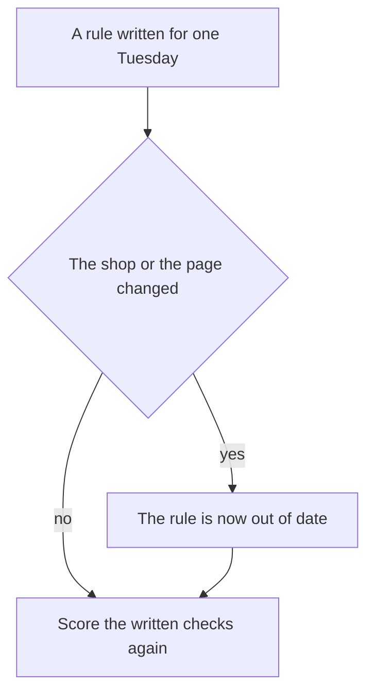
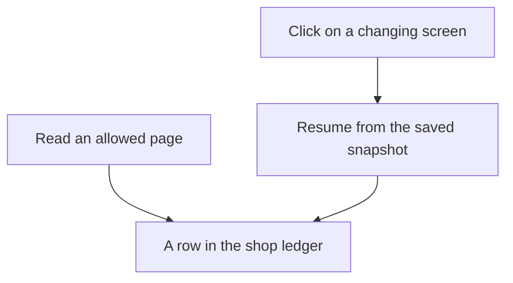

# Chapter 27: Open Problems

**Part VI — Capstone and outlook**

The previous chapter can show one Tuesday restock that looks finished. The helper reads the morning note. It checks the shelf. A person confirms the order. A record gets written. If you did not run that restock, the idea is still simple. One saved morning can look successful.

That success is real, and it is narrow. It covers one shop on one day, because you froze a copy of the files, the prices, and the shelf counts. A passing replay shows that the copy worked. Next month the real shop can be different. The same setup has not been shown to work at another shop.

This chapter names four problems that stay open after a demo like that.

- Rules written for one demo day can go out of date. They can also fail in a new setting.
- A scoring program can give a pass when the real work is still wrong.
- A job with many steps can fail in ways one short script never shows. Clicks on a changing screen add more ways to fail.
- When a helper takes part in an order, a tidy receipt still does not say who is responsible.

The café is only a short example, used when a small record makes the problem easier to see. You do not need to memorize names or product codes. Oat milk and coffee bags are enough. The helper in the examples is the concierge. It uses a language model to choose the next step, inside limits you set. A language model reads a list of messages and writes the next message. It can sound sure. It does not, by itself, see today's shelf.

Three factors decide whether that helper is any good.

**Agent quality = Model × Harness × Feedback loop**

- The **model** proposes the next step.
- The **harness** is the program around the model. It holds the allowed actions, the files the program may open, and the actions it must refuse.
- The **feedback loop** is how a wrong result gets caught. A checker, a saved test, and a written definition of "done" belong on that path. A checker scores a draft against shop rules. It is a different program from the model that wrote the draft.

The line tells you which factor you changed. It does not tell you that the factor will mean the same thing next month. A new model, an edited rule, or a new scoring program each needs a shop you can reset, and a definition of "done" you wrote down before the edit. When the shop changes and that definition stays still, a passing Tuesday report is a report about an old copy of the shop.

Frontier work, at the scale of this book, is measurement under change. You name what you held still. You name what moved. You write down the part of the shop the score does not cover.

## 27.1 Rules written for one day go out of date

A harness is a set of assumptions written down as code and instructions. An assumption is a fact the program treats as true. The Tuesday restock freezes a few of them.

- Shop rules live in one folder. A file outside that folder is an error.
- Low stock means the shelf count has fallen to the number where the shop plans to order more. The rule applies to a known list of products.
- The morning note is the order a person already chose. In the café, that order is oat milk and coffee bags. The note is a decision. A look at the shelf is a separate measurement.
- The program may read only pages it was allowed to read. Words on a page are data. Reading them does not place an order.
- One morning produces one order. Run the job again, and you get that same order, not a second one. The id that makes the repeat safe is called an idempotency key. You can remember it as "this order was already written."
- A restock waits for a person. A card charge does not run.

Each action also has a permission level. Auto means the program may do it alone. Confirm means a person must approve that exact draft. Never means the program must not do it. The restock sits on confirm. A card charge sits on never.

Saving those assumptions is what makes the demo honest. Someone can replay that Tuesday. The same save is what makes the demo go out of date. The copy stays still while the real shop moves.

An assumption goes stale when the shop changes and the code does not. Stale means out of date. The Tuesday restock already contains a small version. The note said oat milk was on the shelf. A later look at the database said it was out. Both can be true, at different times. If the concierge quotes the note as the live count, it is repeating an old belief. The same failure applies to "how many we want on the shelf," and to the reorder numbers. Shops sometimes call that target count par. The name does not keep the number current.

The case you did not set up on purpose is the one that matters.

- The dairy changes which oat milk the shop stocks.
- The coffee bag changes size, so last month's row on the price list is the wrong item. A price list is the shop's own table of products and prices.
- A holiday falls on a closed day. Someone asks for an exception the shop's FAQ does not contain. The model may not invent one.
- The competitor replaces the page. A price you used to find is gone. The model treats a new sentence as the price.

None of these require an attacker. They require a calendar.

The competitor page from the previous chapter is untrusted. Untrusted means the shop did not write it. The concierge may quote the page. The concierge must not obey it. A sentence on that page does not get to change the price list or name a new recipient.

You can see staleness when a checker compares the draft with a source that can change. You miss it when the rule lives only in the instructions you send the model. A line that says "use the current menu" does not contain the menu. A checker that compares a draft price with a row on the price list will fail when the row is wrong. That failure is the one you want. The same checker fails when you forgot to reload the row. Those two failures look alike in the log, unless you saved which version of the price list was used.

A checkpoint is a saved snapshot of a run in progress. It stores what has already been decided, so a crash does not make the program start from a blank page. A snapshot that stores the words "price list, latest" has not stored a version. A week later the receipt and the database disagree. A receipt, here, is the order row the shop can replay. You cannot tell whether the price moved or the concierge invented it.

A rule can also fail to transfer. Transfer means the rule still does the right thing in a setting you did not write it for. Stale means the original shop changed. A transfer failure means you carried the rule somewhere it does not belong.

The reusable parts are files, a way to read a page, memory, tools, and approvals. Memory is a store of facts kept across runs, such as a guest preference. A tool is one named action the model may ask for. Those parts can move to another workplace. The café's rules stay the café's rules. A clinic that reused the Tuesday restock would inherit oat milk and a practice order book. Oat milk is a café fact. It came along because it was written into the code. Replacing the tools is necessary. You still have to find which checks only make sense at this café.

You can watch the same failure inside one café. A checker that knows one guest avoids almonds does not know the next guest's list. A sentence that says "this bun contains almonds" can be true, and it is the wrong kind of rule for the next pastry. A skill is a procedure stored in its own file, separate from one day's chat. The next pastry's allergens may live only in the FAQ. The check that survives a recipe change loads the menu row and compares it with the guest's avoid list. A sentence in a skill file stays as it was written. A lookup follows the menu, if someone updated the menu. Teams often copy the sentence, because the sentence is what the demo said out loud.

A second failure sits between kinds of tasks.

- A confirmation is the right level for the restock. A person should see that draft before a row is written.
- A price lookup is a different task. It can run on its own, because nothing is bought.
- A refund is a third task. Once money can leave, one confirmation is the wrong assumption. A refund needs a second person as well.
- Copy the restock confirm onto every tool, and you get a queue of approvals nobody reads.
- Copy the automatic price check onto the restock, and the concierge places orders while the manager is on the floor.

Each permission level was an argument about four questions. Can you undo the action? Does it commit the shop? How far does it reach? Does it touch private text? Those questions have to be answered again for the new tool. Copying the label leaves the questions behind.

*Figure 27.1. Score the checks again after the shop or the page changes. A pass on the old saved copy will not notice the change by itself.*

Figure 27.1 shows only that small step. The open question is how a harness would notice the change before a guest is affected. This chapter does not include that kind of detector. What you can do now is keep a list of assumptions beside the tests, and run the tests again when a listed field changes. The list for this concierge is short enough to maintain.

- Which folder the file reader may open, and which files govern returns, hours, and allergens.
- The product list, the low-stock rule, how many you want on the shelf, and the reorder numbers.
- Prices on the price list, plus shipping and delivery rules, including which days are closed.
- Which memories you allow. A fact about one guest stays a fact about that guest. It must stay off the record of the whole shop.
- Which web addresses the program may read. Page text stays data.
- The permission level of each tool, including the tools you refused to add.
- The reach of the once-only key. It covers one morning. It does not cover every coffee order for all time.
- The practice clock you control. A Tuesday copy must not run silently as if the day were Saturday.

That list is basic upkeep. It will not save you from an assumption you forgot to write down. It will stop you from defending a passing score after you changed how many cartons you want on the shelf and did not look. If you cannot rehearse the change in a shop you can reset, you cannot tell whether the week improved. A new product that appears only in the live shop is a change you failed to rehearse. Copy that miss into the tests, and attach the surrounding facts. A miss is a real failure you have already seen. Waiting for a general theory of transfer leaves the miss as a story.

The open problem has no solution in this chapter. You want checks tied to sources that can change. You want a signal when a source and a checkpoint disagree. You want to know which checks are local to this café. A sentence that tells the concierge to "stay up to date" does none of those things. An experiment can start the work. Change one assumption. Hold the model and the grader still. A grader is the program that scores a test and returns pass or fail. Report which tasks flipped. The lab at the end of this chapter is that experiment. A write-up that leaves out the assumptions has claimed the demo works more broadly than that saved Tuesday ever showed.

## 27.2 A passing score can hide a wrong answer

An eval, short for evaluation, is a saved test. It is a product requirement written so a program can score it. You build it from misses you have already seen.

- One miss is an opened bag of coffee. Opened coffee is a final sale. A wrong answer grants the fourteen-day return that applies only to a bag that is still sealed.
- Another miss is a Wi-Fi password. The shop's FAQ does not contain one. An answer that invents one is wrong.

Graders fail, and agents notice. A weak grader that looks only for the characters `docs/` will pass an answer that names a file it never read. It will also pass the opened-coffee mistake when the sentence happens to contain both `14` and a file path. Replacing that grader is necessary. The replacement begins the work. The problem continues after it.

Grader gaming means the thing you are testing satisfies the grader and misses the rule the grader was supposed to protect. The thing it hands over can be a paragraph, a cart, or a trace. A cart is the list of items in a proposed order. A trace is the step-by-step log of what ran. Assume a revision loop will find an easy game if the reward is a set of tests that pass. A revision loop keeps editing until the tests go green. Green means the saved tests passed.

- A citation game. The answer adds `(docs/policy.md)` to every sentence, including a Wi-Fi password the FAQ does not contain. A check for that string of characters passes. A check that opens the file, and fails when the claimed fact is absent, will catch this one. A check that only asks whether the file location exists will not.
- A keyword game. The opened-coffee case wants the words "final sale." The model adds those words and still grants the fourteen-day window. If the forbidden text is one exact phrase, a paraphrase slips through. A paraphrase is the same claim in different words. Prefer a check of the actual rule over a demand for one official paragraph. A weak check is still weak.
- A structure game. The cart leaves out the allergen field, and the grader inspects only fields that are present. A stronger checker reads the menu row itself. A grader that trusts an empty allergen list on the proposal is grading a story the model invented. Whether a bun contains almonds is a fact on the menu. An empty list on the draft is only a claim.
- A metric game. A metric is a number you track about finished work, such as how often a task ended cleanly. A flag that trusts the model's own success word goes up because the instructions now end with SUCCESS. The harmful cart is unchanged. If that flag is the headline number, the edit looks like progress.
- A suite game. A skill edit may be allowed only when the tests stay green. A patch that pastes the expected answers into the skill will stay green. It will not answer the next guest. The passing rule worked. The tests were too close to the wording of the patch. A person still has to accept the change. A tired reviewer can accept the paste.

A checker written in ordinary code will reject a bad sum. A second reply from the same model may accept it. Asking the model "are you sure?" still uses the same drafting system. The split does not make gaming impossible. It moves the game to whatever the code actually computes. If the code checks that the reply contains a file path, the game is to contain a file path. If the code checks each quantity against the shelf count at check time, the game moves to the gap between the check and the write. Read the stock again in the same database step that writes the order, so the count cannot change in between. Name the quantity the checker saw. A checker that saw a different shelf count than the writer is the outdated-assumption problem from section 27.1, now inside the grader.

Eval contamination means a pass is hard to interpret, because the answer reached the model by some route other than doing the task. This chapter does not inspect a model's training data, and it does not claim that a model has memorized a public test. The leaks you can see in the café are local, and they are enough to take seriously.

- The instructions can leak the answer. If the brief already says "opened coffee is final sale," a correct answer does not show that a file was read. Keep the file closed until the tool runs. Treat an empty trace as what you actually observed. A brief that pastes the policy in order to be helpful contaminates every policy case. The trace can still save you, if you require the read. The score alone cannot.
- A skill file and the memory store can leak the answer. A skill that lists the test questions and the expected sentences has turned the tests into a lookup table. Memory that stores last week's checker findings as "facts about the shop" can do the same. A stored belief can be retired. A leaked answer key should not have been stored as a preference in the first place.
- The saved shop can be edited until it passes. A shared world that changes under the tests makes results depend on the order of the tests. A related mistake is editing the case until today's model succeeds, then calling the case a requirement. The requirement comes from the miss: an empty shelf, almonds in a pastry, or a shipment on a day the shop does not ship. If you delete the case because a new model finds it awkward, you have measured the model by removing the test.
- Live traffic can sit outside the tests. A holiday, a new product, or an oat-milk stockout can appear at the counter while the saved file still has the old stock. A passing offline run is then a statement about the old stock. The Tuesday copy sets oat milk to zero on purpose, so the statement matches that task. Next month's stockout will be a different product. Offline green does not cover it until you add the case.

Refuse the story in which a smarter grader, or a smarter model, ends the problem.

- A model used as a judge can prefer harm that is written smoothly. It can miss the same facts the drafting model missed.
- A stricter text grader can be beaten by a paraphrase, or satisfied by a paste.
- A checker tied to the price list is the strongest pattern this chapter can recommend. It is only as current as the price list.

None of this is a recipe for beating a grader in order to ship a bad cart. It is why a passing box on a status board needs a companion sentence. Name the rule, the inputs, and the grader version.

The measurement you can run without a new theory is a pair of cases for one rule. Keep the original miss. Add a paraphrase that would fool the weak grader, and that must still fail. Add a correct answer that avoids your one official sentence, and that must pass. If you cannot write the paraphrase, you do not yet know what the grader ignores. If the correct wording fails, you have locked the test to a phrase. Hold the harness still while you change the grader, or hold the grader still while you change the skill. If you move both and then celebrate the tests, you can no longer say which change caused the new score.

The open problem is a grader that stays faithful while the shop's wording, the model's habits, and the tests all change. You also need a way to notice a leak you did not intend. This chapter can show a weak grader and a stronger one on a handful of café cases. It cannot promise that the stronger grader will survive the next paraphrase or the next model. Write that limit down. A write-up that says "the evals are green," and does not name the grader, has reported a stand-in. The green mark stood in for the real question, which is whether the rule held.

## 27.3 Long jobs fail in ways a short script hides

The Tuesday restock is long compared with a single reply from the model. It is short compared with leaving an agent to work for a week. A small exercise stops one process, starts the same run again, and expects one order id. That catches a real bug, the double order. The protection is the once-only key from section 27.1. The exercise measures one restart. People call a much longer stretch a long-horizon problem. This section is about that stretch, and about a second problem that shows up when the program clicks a screen.

A week of mornings includes ordinary trouble.

- A note goes out of date.
- A confirmation waits through the rush.
- A page read fails.
- The service that runs the model refuses further requests for a while, because too many arrived.
- A person approves the wrong draft because the slip was hard to read.

Together, those events are a long job. There are many steps, and some of them are waits. An early mistake can become a record that later steps trust.

The checkpoint is why an early mistake gets locked in. It stores the draft quantity so a restart does not invent a new number. If the quantity was wrong when it was stored, every restart will repeat it. The once-only key protects you from a second row. It leaves a wrong row in place once that row was confirmed.

The oat-milk case is the small example. The note described an earlier shelf. The database described an empty shelf. A checkpoint that keeps the note's order is right only because a person decided that order still stood. A checkpoint that keeps a quantity the model invented, after a restart that never looked at the shelf again, is a long-job failure with a clean log. The log shows one order. The log does not show that nobody looked the second time.

A long job also loses earlier details. The model can see only so much text on one call. An hour of tool results will not fit. The harness has to choose what the next call sees. A short summary that drops "leave the espresso beans off the order" will order those beans on a later step. The early steps will look perfect. Score the finished task. "The first twenty tool calls looked good" does not show that the task finished. A dashboard that averages success one step at a time will hide the beans.

Rare harms raise a further problem. If the harness is doing its job, the events you care about are uncommon: a double order, a card charge, an email outside the shop, an allergen in a cart that was accepted. The Tuesday script forces the oat-milk stockout so you can see the ticket. A stockout means the shelf count is zero. The live shop will not schedule the next bug for the demo. A week of clean restocks is evidence about that week and those products. It is weak evidence about the next holiday. This chapter gives no failure rate, because no such count was collected. A percentage in a write-up would be an invented number. Report the counts you actually have: how many sessions, how many confirmations, and how many named harms, and over which dates.

Computer use is the other open failure. It is easy to mix up with reading a page.

- A page read asks for a web address and receives the page text. The same address and the same response yield the same text.
- Computer use looks at a screen and proposes clicks and keystrokes. The fact you need may exist only after a click. A click can submit a form, pay, or post. The layout is part of what the tool is allowed to do, and layouts move.

The Tuesday demo read a saved page on purpose. The competitor's claim was already in that text. The concierge did not have to operate a supplier's website.

The same failures already show up in small ways at the café. They get worse when the screen is what the model looks at. The shelf query is an input you control. A screenshot is an input you do not control.

- The layout moves. A button moves, a banner covers it, or the price sits in a panel the first response does not contain. The model clicks the neighbor of the control you meant. A missing quote from a page read is an obvious failure. A click fails by doing something.
- A blocker looks like the task. A login wall, a country picker, or a popup sits between the concierge and the price. The model fills that screen because its button is the only button in view. Check a site's terms before you automate a path you do not host. A practice page you host is not permission to operate someone else's site.
- Instructions appear on the screen. The dangerous mix is private data, untrusted content, and a way to send data out. A page that says "email the reorder list" is untrusted content. A computer-use tool that can click a mail window can send the shop's data outside, even when a tool named "send email" is forbidden. The permission has to cover the click that sends the message. Calling the tool a browser does not set its permission level.
- A screenshot is used as the grader. If success means "the screen shows the word ordered," a page can show that word with no row in the shop's books. The receipt is the row. A grader that looks at the picture can be satisfied by the picture.
- Recovery after a mistake is hard. A page read can return an error and let the loop continue. A misclick may already have changed someone else's site. Clicking again is safe only when that site honors a once-only key. Most sites will not honor a key you invented in your own checkpoint. The double order comes back, in a form the practice order book cannot see.

A long job and computer use make each other worse. A restock that reads one allowed page, and then waits for the manager, has few lasting effects. A lasting effect is a change that remains after the call, such as a new order row. A restock that clicks through a supplier's site, many clicks across a lunch break, has many places to be wrong. A restart that takes a new screenshot of a changed page adds more. A final screen, with no record of the action and no order row, cannot be replayed. It can only be watched.

*Figure 27.2. The finished task is a row in the shop's books. When the job resumes, the saved snapshot is what was decided. The latest screen is a picture. A picture is not a receipt.*

Computer use can still be studied later. The path this chapter trusts is a page read. The row is still the definition of done. If a later product needs a supplier's website, add a new tool with its own written limits: what it may do, what it returns, and what it must refuse. Do not stretch "read a page" until a page read and a purchase share one function. The new tool would need a permission level, a limited place to act, and a grader that reads the shop's books. Building that tool would be a new experiment. One scripted series of clicks would not measure what happens when the layout changes.

The open problem is how to keep a finished-task score meaningful across many steps. Some of those steps sit on a changing screen. The harms are rare. Partial answers already exist. Use checkpoints. Use a once-only key for lasting effects you control. Use a separate checker against shop records. Refuse to treat a screenshot as a receipt. Those habits do not add up to a promise that the agent is reliable. A limitations page that says "the agent is reliable" should be rewritten until it names which session, which tools, and which harms were actually counted.

## 27.4 A receipt does not settle who is responsible

A sale that includes an agent has several parties, and they do not see the same record.

- The guest wants to know whether this cart was the cart they approved.
- The shop wants to know whether the row can be packed. The seller named on the receipt is the café. People sometimes call that seller the merchant of record.
- The concierge sees proposals and tool results. It does not, by itself, see the guest's screen or the shop's full books.
- A payment network is the system that would move money between banks. This chapter does not connect to one, and the receipt says so.

A question comes before the receipt. Which actor is which? A log line tagged "operator" is a different actor from a line tagged "agent" or "tool." The operator is the person running the shop. In the Tuesday restock, that person is the manager who may confirm an order. The recording can keep those tags clean for the manager, for the concierge, and for the restock tool. Clean tags help inside the shop. They are not an identity a bank, a court, or a customer can rely on. That would take machinery this chapter does not build.

For the café's own logs, identity is a name the harness writes into the checkpoint. The log can say the manager confirmed the draft, because the program wrote that name when the approval was accepted. The approval is a short fingerprint of the tool name and the exact arguments. Change the quantity and the fingerprint no longer matches, so an old approval cannot cover a new draft. That record answers a narrow question. Which shop account pressed the button in this exercise? It does not say how a guest can tell that the concierge speaks for the café. It does not say how a payment network would know that the concierge may ask for this cart.

Published payment designs try to answer the network question with a signed permission. In those designs, one permission is supposed to lock the exact cart a person approved. Another is supposed to lock the authority to pay. The lab's fingerprint is a local mark on one draft. It is the right small example of a confirm made while the person is present. It is not evidence an outside party can check. The local mark and a signed network permission have a similar outline. The network still has nothing to verify.

Several identities are easy to mix up. Trust fails at the mix-up.

- The guest and the manager. A guest wants oat milk. The manager confirms a restock of oat milk for the shop. A transcript that says the guest ordered that restock has swapped them. The restock row should name the manager. A ticket about the guest's drink should name the guest. One signature line for "the user" will be wrong for one of those records.
- The manager and the concierge. The concierge proposes the coffee bags. The manager approves that draft. If the receipt says the concierge ordered them, the shop has erased the confirmation. The confirmation was the reason the action waited. If the chat says the manager approved a draft the checkpoint still marks as waiting, the chat is the claim. The checkpoint is the record.
- The concierge and the company that hosts the model. The model may run on another company's computers. When it does, the text you send, including tool results, leaves your machine. That company is not the seller on the receipt. The café is. A write-up that names the model and forgets the seller has described a demo, not a shop.
- The tool and the authority to set a price. Reading the competitor's page did not decide the price. The price-list row did. A trace that stores the page's price in the same field as the shop's price has given the page a power the permission list denied it.

Liability is the question of who has to cover a loss when those records disagree. This chapter is not legal advice. It does not decide who must pay. It does not assign fault to the manager, to the person who wrote the harness, to the company that hosts the model, or to the guest. It separates facts the records can show from disputes the records cannot close.

The records can show facts inside the shop.

- Did a restock row exist at a stated time? The order book answers, if that book is the record you actually write.
- Did that row include a card charge? A status that means "practice order, not charged" answers, if you never added a charge path. No money moves in these exercises.
- Did anyone send the reorder list to an address on the competitor page? The trace answers, if email to outside addresses is forbidden and the log is complete.
- Did a guest cart include almonds? The checker result answers, together with the absence of an accepted cart.

An audit trail is a log you can replay from start to finish. Replay tells the shop what the software did. Replay is not, by itself, a rule about who pays.

The records cannot close the gap between what a guest heard and what the order book stored. The guest saw a sentence that said the drinks were handled. The ticket says oat milk is out and that no guest order was written. The shop can point at the ticket, and should. The guest may still have planned around those drinks. The rule this chapter can state is narrow. Do not claim a sale the row does not contain. A support reply can cite the ticket after a person approves that exact text. That reply is something the shop does. This chapter does not decide damages, and it does not offer a legal conclusion.

A second open question is who may act as the guest. In the Tuesday restock, the manager acts for the shop. The manager does not act as the guest. A concierge that may spend a guest's money, or commit a guest to a pickup, needs a permission the guest can recognize and cancel. One published shape for that permission is a signed limit, sealed ahead of time, for a checkout when the person is away from the keyboard. This chapter does not add that shape as a fourth permission level beside auto, confirm, and never. A line that says "buy coffee when we are low," with no end date, or with no way for the shop to check it, is a confirmation nobody reviewed. If you experiment with that kind of permission, write an explicit limit, an end date, and a path back to a person when the cart does not match the limit. Count how often that mismatch happens. The Tuesday recording does not include that experiment.

Trust in this kind of sale is an open problem: how the four parties compare one cart when the concierge is one of the speakers. A chat transcript is a weak way to make that comparison. Each party can hold a different copy of the words. Published message formats try to give each party a shared object. The shop gets a price list it publishes as its own. The guest gets an approval tied to one finished cart. The payment network gets evidence that is not a full card number sitting in the instructions. The café exercise stops at the shop's row, and at the absence of the network. Stopping there is a safety choice and a teaching choice. The trust problem stays open on purpose. You should be able to say which party would need to check which object. A local fingerprint meets the exercise's confirm. It does not meet an outside party's need.

A few claims stay safe because they are narrow.

- The seller on the receipt in this chapter is the café. The concierge does not become the seller by writing a sentence.
- Shopping and paying are different steps. These exercises do not pay.
- A confirmation covers one finished draft. It covers that draft only. The shop's rules stay in force.
- Untrusted page text does not get to name a new recipient or a new price.
- The name on each line of the trace belongs to the shop's own operations. Those names are not a worldwide identity system.

The bullets above leave several questions open. Who may speak as the guest? What evidence would an outside party require before it treats an agent-proposed cart as approved? What should happen when the chat was wrong and the order book was right, or when both were wrong because an outdated price list was confirmed and the log still looked tidy? How would you cancel an agent's identity after a bug in the harness proposed the harmful draft? This chapter lists those questions. It does not answer them as law.

Measurement under change applies here too. You can count whether traces keep the parties distinct. You can count whether any run wrote a payment status other than "not charged." You can count whether any confirmation covered a different object than the one the manager saw. Those counts describe what the software did. They do not yield a legal conclusion. The limitations page should say that in a sentence a reader will not skip.

## Lab

Write a one-page note titled "Known limitations" for the concierge. Address it to a teammate who will run the helper next month. Use the four themes of this chapter as headings, or as plainly labeled paragraphs. A reader should be able to tell the limits apart.

- One limit is a rule that has gone out of date, or that fails outside the setting it was written for.
- One limit is the grader, including a pass that leaked the answer.
- One limit is a long task, or a screen the program clicks.
- One limit is identity, or trust in a sale the helper took part in.

The note should be readable without the chat transcript. If you already have the Tuesday restock folder from the previous chapter, put the note there.

Then name three experiments you would run next. Run them if you can. Each experiment says what you will hold still, what you will change, and which finished outcome you will score. A finished outcome is the result you defined in advance, such as one restock row or one stockout ticket. A promise to "improve reliability" is not an experiment. You may replace the three shapes below with better ones. You may not replace them with a claim that the issue is already solved.

**Stock.** Change one assumption from section 27.1. A clear choice is how many oat-milk cartons you want on the shelf, or the coffee bag's price on the price list. Hold the model and the grader still. Report which checks pass, which fail, and which stay green because they never read the field you changed.

**Graders.** Hold the concierge still. Write one paraphrase that would satisfy a weak check for a file path, and that is still wrong. The opened-coffee case is enough. A sentence can grant a fourteen-day return and add `(docs/policy.md)`. Write one correct answer that does not use a single official sentence. Score both with the weak check and with the checker you mean to trust. The weak check should pass the paraphrase. The checker you trust should fail that paraphrase, and should pass the correct answer.

**Resume and confirm.** Start from the Tuesday restock. The draft is the note's oat milk and coffee bags, waiting for the manager. During the wait, change the shelf count. Resume the session. Record whether the draft quantity or the price moves without a new confirmation. One order id is the outcome you are protecting. If you have no tool that clicks a screen, say so, and keep this experiment on the order book. A scripted series of clicks is not a reliability result.

Hand in the note and a short record of each experiment. State what you changed, what you held still, and what the record showed. A file, a grader result, or an order count is the record.

Where to put the page is noted in the [lab folder](../../labs/ch27-open-problems/README.md).

**Builder takeaway.** Frontier work is measurement under change. You name what you kept the same, you name what you changed, and you name the part of the shop your score does not cover. One passing Tuesday measures that Tuesday.
