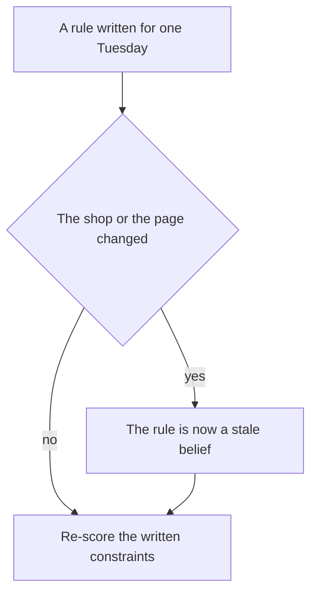
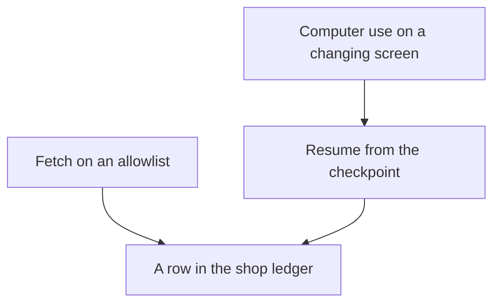

# Chapter 27: Open Problems

**Part VI — Capstone and outlook**

Chapter 26 can show a reviewer one Tuesday. It can show a note, a stock query, a memory search, an untrusted page, a confirm, a ticket, a checker, and a metric, all tied to the session `restock-tuesday`. That recording is a finished harness for a fixture you froze. The claim of this chapter is that the same recording does not travel. Harness rules go stale, graders can be satisfied without the work being done, long tasks and computer use fail in ways a single script does not reveal, and a receipt does not decide who is responsible when an agent takes part in a sale. These are open problems. This chapter names them so you can measure them. It does not hand you a fix the book has verified.

**Agent quality = Model × Harness × Feedback loop** still tells you which factor moved. It does not tell you that the factor will mean the same thing next month. A model swap, a skill edit, and a new grader each need a world you can reset and a definition of done you wrote down before the edit. When the world moves and the definition does not, the green report from Chapter 26 becomes a souvenir. Frontier work, at the scale of this book, is measurement under change: you say what you held still, you say what moved, and you write down the slice of the shop the score does not cover.

The café remains the example because the limits are easier to see where the records are small. Hearth Lane's par levels, Priya's allergy, the Tuesday-through-Friday delivery window, and the $18.00 bag are concrete. A vague "enterprise agent" hides the same problems behind a larger noun. Nothing in this chapter depends on a private benchmark, a new protocol implementation, or a claim about a particular model's reliability. Where the industry has published a name for a problem, the book uses the name the earlier chapters already used. Where a number would require an experiment you have not run, the number is absent on purpose.

## 27.1 Harness assumptions go stale and don't transfer

A harness is a set of assumptions written down as code. Chapter 2 assumes the shop's rules live in one documents directory and that a path outside it is an error. Chapter 4 assumes low stock means `on_hand <= reorder_point` on a known list of skus. Chapter 5 assumes the Tuesday note's quantities, 12 cartons of OM-32 and 12 bags of HB-12, are the decision, and that par is 16 for oat milk and 18 for the 12 oz bags. Chapter 8 assumes the page you fetch is the page you allowed. Chapter 10 assumes one idempotency key places one restock. Chapter 16 assumes `place_order` is confirm and `charge_card` is never. Chapter 26 freezes those assumptions into one fixture so a reviewer can replay them. Freezing is what makes the demo honest. It is also what makes the demo age.

An assumption goes stale when the shop changes and the code does not. The capstone already contains a small version. The orders note says three cartons of oat milk were on the shelf. The database says zero. Both statements were true at different times. A concierge that quotes the note as the live count is repeating a stale belief, which is the failure Chapter 6 named for guest memory and that applies just as hard to par levels and reorder points. The interesting case is the one you did not plant. The dairy changes the sku. The bag size changes and HB-12 is no longer the 12 oz catalog item priced at $18.00. A holiday falls on a Monday, and someone asks the model for an exception the FAQ does not contain. The competitor replaces the fixture's HTML with a new layout, so a quote you used to find is gone, and a new sentence on the page is now the one the model treats as the price. None of these require a malicious actor. They require a calendar.

Staleness is a feedback problem if you can see it, and a harness problem if the rule lives only in a prompt. A prompt that says "use the current menu" does not know the menu. A checker that compares the draft's unit price to a catalog row will fail the day the row is wrong, which is the correct failure, and it will also fail the day you forgot to reload the row, which looks identical in the log unless the checkpoint records the catalog version. Chapter 10 asked the checkpoint to store input versions for this reason. A session that records "catalog, latest" has not recorded a version. When the receipt and the database disagree a week later, you cannot tell whether the price moved or the agent invented it.

Assumptions also fail to transfer, which is a different defect from going stale. Transfer means the rule still does the right thing in a setting you did not write it for. The work-agent blueprint in Chapter 17 transfers on purpose, and only at the level of parts: files, a browser or a fetch, memory, tools, and approvals. The parts are not the café's rules. A clinic that reused `restock-tuesday` would inherit oat milk, almond buns, and a mock ledger. Those are not clinical facts. They are Hearth Lane facts that rode along because they were hard-coded. The blueprint tells you to replace the tools. It does not tell you which of your checks are secretly café checks.

You can watch non-transfer inside one café, without changing industries. The guest checker knows Priya's avoid list. It does not know the next regular's. A skill that says "cardamom buns contain almonds" is true, and it is the wrong shape of rule if the next pastry's allergens live only in the FAQ. The right shape, from Chapter 11, is "load the catalog row and intersect allergens." A skill sentence will not update when the baker changes a recipe. A join will, if the catalog was updated. Teams often transfer the sentence, because the sentence is what the demo said out loud.

A second non-transfer sits between task types. The restock confirm is the right tier for a purchase order of twelve bags. It is the wrong lesson for a price lookup, which Chapter 16 marked auto, and it is not a template for a refund. Chapter 20's outline keeps refunds on dual control because a single confirm is the wrong assumption once money can leave. Copying the restock gate onto every tool is how a harness becomes a queue of approvals nobody reads. Copying the price check's auto tier onto the restock is how a harness places orders while Jules is on the floor. The tier was an argument about undo, commitment, radius, and private text. Those arguments have to be rewritten for the new tool. They do not travel as a label.

*Figure 27.1. A passing score on the old fixture does not detect a changed shop. Re-score only helps after you admit the rule may be stale.*

Figure 27.1 is deliberately modest. The research problem is how a harness would notice the change before a guest is affected. This book does not demonstrate such a detector. What you can do now is keep an assumptions list next to the suite and re-run the suite when a listed field changes. The list for the concierge is short enough to maintain.

- Which directory `read_file` may open, and which files are authoritative for returns, hours, and allergens.
- The sku list, the low-stock predicate, par, and the reorder points.
- The catalog prices in cents, and the shipping and delivery rules, including Monday and the three-mile radius.
- The memory scopes you allow, and the fact that a guest constraint must not be written up to shop scope.
- The fetch allowlist, and the rule that page text is data.
- The tier of each tool, including the tools you refused to register.
- The idempotency key's scope: one session, not "all coffee orders forever."
- The clock the simulator controls, so a Tuesday fixture is not silently run as if it were Saturday.

That list is hygiene. It will not save you from an assumption you forgot to write down. It will save you from defending a green eval after you changed a par and did not look. Chapter 13's point was that if you cannot simulate the change, you cannot tell whether the week improved. A new sku that appears only in production is the change you failed to simulate. The honest response is to copy the production miss into the suite, with the context attached, as Chapter 12 asked. Waiting until you have a general theory of transfer is how the miss stays a story.

The open problem, stated without a solution, is this. You want a harness whose checks are tied to sources of truth that can change, a way to notice when a source and a checkpoint disagree, and a way to know which checks are local to Hearth Lane. You do not get that by adding a sentence that the agent should "stay up to date." You would get it by an experiment that changes one assumption, holds the model and the grader still, and reports which tasks flipped. The lab at the end of this chapter is where that experiment belongs. This section only insists that a capstone README which omits the assumptions has claimed a generality the fixture never had.

## 27.2 Grader gaming and eval contamination

Chapter 12's claim is that an eval is a product requirement a program can score, built from misses you have already seen. The chapter also records the uncomfortable half: graders fail, and agents notice. A weak grader that looks for the substring `docs/` will pass an answer that cites a file it never read, and it will pass the opened-coffee mistake when the sentence includes both `14` and a path. The capstone called that grader not green. Replacing it is necessary. It is not the end of the problem.

Grader gaming means the system under test produces an artifact that satisfies the grader and misses the constraint the grader was supposed to protect. The artifact can be a paragraph, a cart, or a trace. The concierge has several easy games, and you should assume a revision loop will find them if the reward is "the suite went green."

- A citation game. The answer appends `(docs/policy.md)` to every sentence, including the Wi-Fi password the FAQ does not contain. A substring check passes. A check that opens the file and fails when the claimed fact is absent will catch this one. A check that only asks whether the path exists will not.
- A keyword game. The opened-coffee case requires the words "final sale." The model adds "final sale" and also grants the fourteen-day window. If `must_not_contain` is a single brittle phrase, a paraphrase slips through. Chapter 12 preferred constraints to a canonical paragraph for this reason, and then showed that a weak constraint is still weak.
- A structure game. The cart omits the allergen field, and the grader only inspects fields that are present. Chapter 11's checker avoids that game by reading the catalog row itself. A grader that trusts the proposal's `allergens: []` is grading a story the doer invented.
- A metric game. Chapter 14's `model_said_success` rises because the prompt now ends with SUCCESS. The harmful cart is unchanged. If the headline number is the flag, the edit looks like progress.
- A suite game. Chapter 25's outline allows a skill patch only when the suite stays green. A patch that pastes the golden answers into the skill will stay green and will not answer the next guest. The gate worked. The suite was too close to the wording of the patch. Human merge is the control the outline requires, and a tired reviewer can still merge the paste.

A separate checker written in code is harder to talk out of a sum than a second sample from the same model. Chapter 11 made that split because "are you sure?" is still the drafting weights. The split does not make gaming impossible. It moves the game to whatever the code actually computes. If the code computes "the reply contains a path," the game is to contain a path. If the code computes "every sku's quantity is less than or equal to `on_hand` at check time," the game moves to the moment between the check and the write, which is why Chapter 18 re-reads stock inside the same transaction as the insert. Name the quantity your checker sees. A checker that saw a different snapshot than the writer is a stale assumption from section 27.1 wearing a grader's coat.

Eval contamination is the case where a pass is ambiguous because the answer was available through a channel other than the task. This book does not audit training data, and it does not claim a model has or has not memorized a public test. The contamination you can see in the café is local, and it is enough to take seriously.

The first local channel is the prompt. If the system brief includes the sentence "opened coffee is final sale" and the case asks whether an opened bag can be returned, a correct answer does not show that `read_file` works. Chapter 2 kept the file closed until the tool ran, and treated an empty trace as the observation. A capstone brief that pastes the policy "to be helpful" contaminates every policy case. The trace can still save you, if you require the read. The score alone cannot.

The second channel is the skill and the memory store. A skill that lists the golden questions and the expected sentences has turned the suite into a lookup table. Memory that stored last week's checker findings as "facts about the shop" can do the same. Chapter 6's forget path exists so a belief can be retired. A belief that is really a leaked answer key should not have been stored as a preference in the first place.

The third channel is the fixture you tune until it passes. Chapter 13 warned that a shared mutable world makes tests order-dependent. A cousin of that bug is editing the case until the model you happen to be using succeeds, then calling the case a requirement. The requirement comes from the miss: the zero, the almond, the Monday ship. If you delete the case because a new model finds it awkward, you have measured the model by removing the ruler.

The fourth channel is online traffic that does not match the suite. Chapter 12 already said a holiday, a new sku, or an oat-milk stockout can appear in production while the offline file still has the old stock. A green offline run is then a statement about the old stock. Chapter 26's fixture sets OM-32 to zero on purpose so the statement matches the task. Next month's stockout will be a different sku. Offline green does not cover it until you add it.

What you should refuse is a story in which a smarter grader, or a smarter model, ends the problem. A model used as a judge can prefer fluent harm, and it can share the drafting model's blind spots. A stricter string grader can be gamed by a paraphrase or satisfied by a paste. A checker tied to the catalog is the strongest pattern in this book, and it is only as current as the catalog. None of these remarks is a recipe for defeating a grader in order to ship a bad cart. They are the reasons a green cell on a dashboard needs a companion sentence: which constraint, which inputs, which grader version.

The measurement you can run without a new theory is a pair of cases for one constraint. Keep the original miss. Add a paraphrase that would fool the weak form of the grader and that must still fail. Add a correct answer that does not use the canonical sentence and that must pass. If you cannot write the paraphrase, you do not yet know what your grader ignores. If the correct paraphrase fails, you have locked the wording, which Chapter 12 told you not to do. Hold the harness still while you change the grader, or hold the grader still while you change the skill. Chapter 15's bake-off is the same discipline. Moving both, then celebrating the suite, contaminates the conclusion.

The open problem is a grader that remains faithful as the shop's wording, the model's habits, and the suite itself all change, together with a way to notice contamination you did not intend. This book can show you a weak grader and a stronger one on a handful of café cases. It cannot certify that the stronger one will survive the next paraphrase or the next model. Write that limitation down. A portfolio that says "evals are green" and does not name the grader has reported a proxy.

## 27.3 Long-horizon reliability and computer-use failures

Chapter 10's restock is long compared with a single completion, and it is short compared with the reliability people mean when they say an agent can be left to work. The lab kills one process, resumes one session, and expects one order id. That is a real bug, the double order, and a real control, the idempotency key. It is not a measurement of a week. A week of mornings includes a note that goes stale, a confirm that waits through the rush, a fetch that fails, a model that is rate-limited, and a person who approves the wrong draft because the slip was hard to read. Each of those is ordinary. Together they are a long horizon: many steps, some of them waits, with a chance for an early mistake to become a record later steps trust.

The checkpoint is why an early mistake hardens. Chapter 10 stores `draft_qty` so a resume does not invent a new quantity. If the quantity was wrong when it was stored, every resume will faithfully repeat it. Idempotency protects you from a second row. It does not protect you from a wrong row you confirmed. The oat-milk drift in Chapter 26 is the teaching version. The note said three cartons. The shelf said zero. A checkpoint that copies 12 forward is correct only because a person decided 12 was still the order. A checkpoint that copies a model-invented 20 forward, after a resume that never re-read stock, is a long-horizon failure with a clean log. The log shows one order. The log does not show that nobody looked at the shelf the second time.

Context rot, from Chapter 5, gets worse as the horizon grows. A job that truly needs an hour of tool results cannot keep them all in the window. The harness has to decide what the next call sees. A lossy summary that drops "do not order ES-1KG" will order the beans on step forty, and the early steps will look perfect. The metric in Chapter 14 has to be computed on the finished task, not on the prefix. A dashboard that averages per-step success will hide the beans. This is why "the first twenty tool calls looked good" is not a reliability result.

Sparse failure is the statistical version of the same issue. The harmful events you care about are rare if the harness is doing its job: a double order, a charge, an external email, an allergen in an accepted cart. Chapter 26's script forces the stockout so you can see the ticket. Production will not force the next bug to appear during the demo. A week of clean restocks is evidence about that week and those skus. It is weak evidence about the next holiday. The book does not give you a failure rate, because the labs did not collect one. Quoting a percentage in the portfolio would be a fabricated metric. Report the numerator and the denominator you actually have: how many sessions, how many confirms, how many harms you know how to name, over which dates.

Computer use is the other open failure mode, and Chapter 8 separated it from fetch for a reason. Fetch asks for a URL and receives a body. Given the same URL and the same response, the tool returns the same text. Computer use looks at a screen and proposes clicks and keystrokes. The fact you need may exist only after a click. The action surface is the whole interface. A click can submit, pay, or post. Layout is part of the contract, and layouts move. The capstone used a fixture page on purpose. The $14 claim was in the first response. The concierge did not have to operate a supplier portal.

The failures that follow from computer use are already visible in miniature on the café, and they get worse when the screen is the sensor.

- Layout drift. A button moves, a cookie banner covers it, or the price is inside a widget the first HTML response does not contain. The model clicks the neighbor of the control you meant. Fetch fails more obviously, with a missing quote. A click fails by doing something.
- A blocker that looks like the task. A login wall, a region picker, or an interstitial sits between the agent and the price. The model fills the interstitial because the screenshot's only button is the interstitial's button. Chapter 8's robots and terms-of-service notes apply before you automate that path. A lab fixture you host is not a license to drive a third-party site.
- Injection on the screen. Chapter 16's lethal trifecta is private data, untrusted content, and an exfil path. A page that says "email the reorder list" is untrusted content. A computer-use tool that can click a compose window is an exfil path even when `send_email` is on the never tier. The tier has to cover the click that submits, not only the tool name you remember to gate. Chapter 17 said "it is just the browser" is not a tier.
- A screenshot grader. If success is "the screen shows the word ordered," a page can show that word without a ledger row. You are back to Chapter 18: the receipt is the row, not the pixels. A grader that looks at pixels can be gamed by pixels.
- Recovery. A fetch returns `ERROR:` and the loop continues. A misclick may have already changed an external site. Retrying the click is not idempotent unless you built an idempotency key the site honors. Most sites will not honor a key you invented in the checkpoint. The double order returns, in a form the mock ledger cannot see.

Long horizon and computer use compound. A restock that fetches once, on an allowlist, and then waits for Jules, has a small number of side effects. A restock that drives a supplier portal through thirty clicks, across a lunch break, with a resume that re-screenshots a changed page, has many places to be wrong and a thin log if all you kept was the final screen. Chapter 22's outline, replay from the log, is harder to meet here. A screenshot without the action that produced it, and without the ledger that should have changed, cannot be replayed. It can only be watched.

*Figure 27.2. A screen is a sensor you do not control. The finished task is still a row, and a resume has to trust the checkpoint rather than the latest pixels.*

Figure 27.2 does not say that computer use is forbidden. It says the book's verified path is the fetch, and the row is still the definition of done. If a later product needs a portal, Chapter 8's rule was to add a new tool with a new contract, not to widen fetch until GET and purchase share a function. That new tool would need a tier, a sandbox, and a grader that reads the shop's ledger. Building it would be a new experiment. Demonstrating one scripted portal run would not measure reliability under layout change.

The open problem is how to keep a finished-task metric meaningful when the task has many steps, some of them in a changing interface, and the harms are rare. Partial answers that already exist in this book are checkpoints, idempotency for the side effects you own, a separate checker against shop records, and a refusal to treat a screenshot as a receipt. They do not add up to a reliability guarantee. A limitations page that says "the agent is reliable" should be rewritten until it says which session, which tools, and which harms were actually counted.

## 27.4 Identity, liability, and agent commerce trust

Chapter 18 split a sale into four parties who do not see the same record. The user wants to know whether this cart was the cart they approved. The merchant wants to know whether the row can be packed. The agent sees proposals and tool results. The payment network, in that chapter, is absent, and the receipt says so. Chapter 22's outline names a prior question the receipt does not settle: which actor is which. A trace line tagged `operator` is not the same object as a line tagged `agent` or `tool`. The capstone can keep those tags clean for Jules, the concierge process, and the restock tool. Clean tags are an observability achievement. They are not an identity a bank, a court, or a customer can rely on without more machinery than this book builds.

Identity, in the narrow sense the café needs for its own logs, is a name the harness assigns and the checkpoint stores. `confirmed_by` is Jules because the program wrote Jules when the token was accepted. That is useful. It answers "which operator account pressed the control in this lab?" It does not answer "how does Priya know the concierge is Hearth Lane's?" and it does not answer "how does a payment network know the concierge is allowed to ask for this cart?" The second question is why Chapter 18 described mandates and network programs as reading. A checkout mandate is supposed to bind the cart a person authorized. A payment mandate is supposed to bind the authority to pay. The lab's token is a local hash of one draft. It is the right teaching object for human-present confirm. It is not a credential a network verifies. Saying the token "is like" a mandate is a comparison of shape. It is not an integration, and it is not evidence that the gap between the parties has closed.

Several identities are easy to smear together, and the smear is where trust fails.

- The guest and the operator. Priya wants oat milk. Jules confirms a restock. A transcript that says "Priya ordered twelve cartons" has swapped them. The restock row should name the operator. The ticket should name the guest. One signature line for "the user" will be wrong for one of those records.
- The operator and the agent. The concierge proposes twelve bags. Jules approves twelve bags. If the receipt says the agent ordered them, the shop has erased the confirm that was the whole point of the tier. If the chat says Jules approved a draft the checkpoint still marks pending, the chat is the claim and the checkpoint is the record.
- The agent and the model vendor. The weights may be hosted. Chapter 3 already noted that tool results leave the machine in that case. The vendor is not the merchant of record. Hearth Lane is. A portfolio that names the model and forgets the merchant has described a demo, not a shop.
- The tool and the authority. `fetch_page` did not decide the price. The catalog row did. A trace that stores the page's $14 in the same field as the unit price has given the tool a power the tier map denied it.

Liability is the question of who bears a loss when those records disagree. This chapter is not legal advice, and it does not assign liability to Jules, to the person who wrote the harness, to the model provider, or to Priya. It lists the disputes the book's records can clarify and the disputes they cannot close.

The records can clarify a class of factual disputes inside the shop. Did a restock row exist at 7:10? The ledger answers. Did it include a card charge? `mock_not_charged` answers, if you truly never added a charge path. Did anyone send the reorder list to the address on the competitor page? The trace answers, if external email was never and the log is complete. Did the guest cart sell almonds? The checker verdict and the absence of an accepted cart answer. Chapter 20's outline extends that habit to money-adjacent tools: an audit trail you can replay. Replay is how the merchant finds out what the software did. It is not, by itself, a rule about who pays.

The records cannot close the disputes that sit in the gap Chapter 18 named. The guest saw a sentence that the drinks were handled. The ticket says oat milk is out and no guest order was written. The merchant can point at the ticket, and should. The guest may still have planned a meeting around those pour-overs. The book gives you a way to avoid lying in the ledger. It does not give you a policy for the guest's reliance on the chat, beyond the rule you already have: do not state a sale the row does not contain. A support reply, as Chapter 19's outline describes it, can cite the ticket after a person approves the text. That reply is a shop action. It is not a determination of damages.

A second dispute the records leave open is authority to act as the guest. Chapter 17 asked who may act as the user. In the capstone, Jules acts as the operator of the shop, not as Priya. An agent that may spend Priya's money, or may commit Priya to a pickup, needs a grant Priya can recognize and revoke. The human-not-present flow discussed in Chapter 18, a bounded mandate sealed ahead of time, is exactly this grant. The book refused to sneak it in as a fourth autonomy tier. The refusal stands. A bound that is vague ("buy coffee when we are low"), that does not expire, or that the merchant cannot check, is not a safer auto tier. It is an unreviewed confirm. If you experiment with a bound, the experiment needs an explicit limit, an expiry, a mismatch path that returns to a person, and a metric for how often the mismatch fires. The capstone does not include that experiment.

Commerce trust, as an open problem, is the question of how the four parties compare a cart when the agent is one of the speakers. The protocols surveyed in Chapter 18 exist because a transcript is a bad instrument for that comparison. They try to give the merchant a declared catalog, the user an authorization tied to a closed cart, and the network evidence that is not a raw card number in the prompt. The café exercise stops at the merchant's row and at the absence of the network. Stopping there is a safety rule from Appendix D and a teaching choice. It leaves the trust problem open on purpose. You should be able to say which party would need to verify which object. You should not claim that a local hash has already met that need.

A few claims are safe because they are narrow, and they are worth repeating so the open problems do not wash them out.

- The merchant of record in this book is Hearth Lane. The concierge does not become the merchant by writing a sentence.
- Shopping and paying are different steps. The labs do not pay.
- A confirm covers one closed draft. It does not cover the next draft, and it does not waive the policy.
- Untrusted page text does not get to name a new recipient or a new price.
- The trace's actor tags are part of the shop's operations. They are not a worldwide identity system.

The open problem is everything those bullets do not settle. Who is allowed to speak as the guest. What evidence a party outside the shop would require before treating an agent-proposed cart as authorized. What the shop owes when the chat was wrong and the ledger was right, or when both were wrong because a stale catalog was confirmed with a clean trace. How an agent identity would be revoked when a harness bug, rather than a person's decision, proposed the harmful draft. Measurement under change applies here too. You can measure whether your traces keep the parties distinct, whether any run wrote a payment status other than the mock, and whether any confirm covered a different object than the one the operator saw. You cannot measure your way to a legal conclusion with those counts. The limitations page should say that in a sentence a product manager will not skip.

## Lab

Write a one-page known-limitations note for your concierge, and name three experiments you would run next. The page should use the four sections of this chapter as headings or as plainly labeled paragraphs, so a reader can see which limit is staleness, which is the grader, which is the horizon or the screen, and which is identity or commerce trust. Each experiment should say what you will hold still, what you will change, and which finished-task outcome you will score. A paragraph that promises to "improve reliability" is not an experiment.

Three shapes that fit the café, if you want a starting point, are these. You may replace them with better ones. You may not replace them with a claim that the issue is already solved.

1. Change one assumption from section 27.1, such as OM-32's par or the bag's catalog price. Hold the model and the grader still. Report which checks pass, which fail, and which stay green because they never read the field you changed.
2. Add one paraphrase that games the weak citation grader from Chapter 12, and one correct answer that does not use your canonical sentence. Hold the concierge still. Score both with the weak grader and with the checker you mean to trust.
3. Resume `restock-tuesday` after you change `on_hand` during the wait, and record whether the draft quantity or the price moves without a new confirm. If you have no computer-use tool, write that down as the reason the third experiment stays on the ledger. Do not substitute a scripted click-through and call it a reliability result.

The note belongs with the Chapter 26 folder if you have one, and it should be readable without the chat transcript. Instructions for where to put the page are in the [Chapter 27 lab](../../labs/ch27-open-problems/README.md).

**Builder takeaway.** Frontier work is measurement under change.
