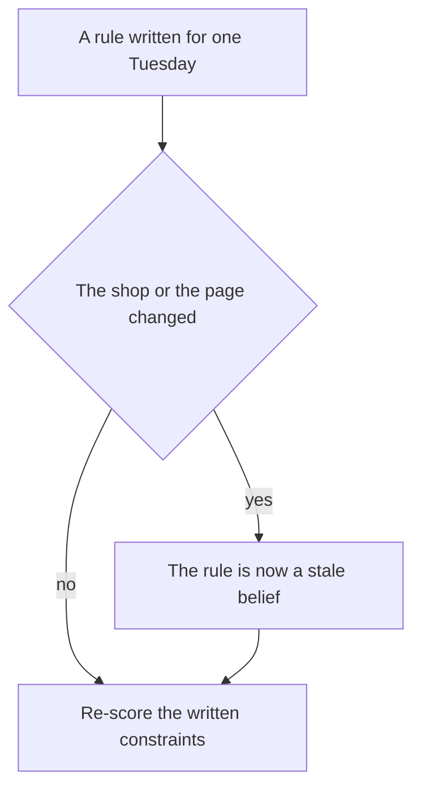
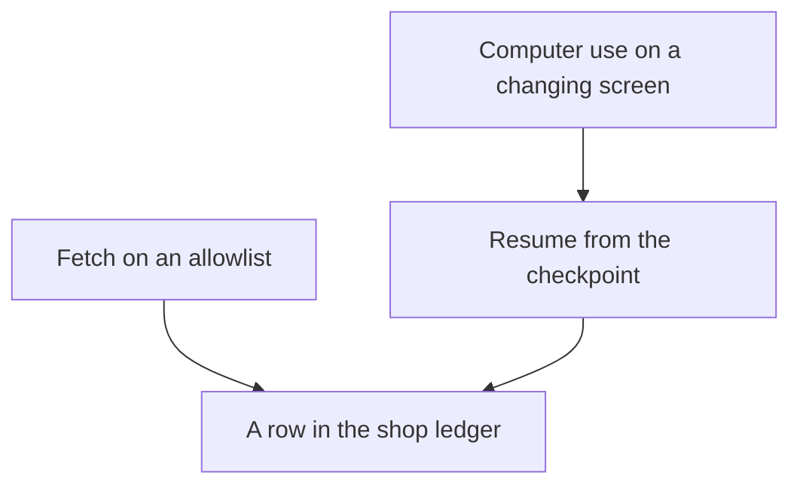

# Chapter 27: Open Problems

**Part VI — Capstone and outlook**

A passing replay of one Tuesday restock is a real result, and it is a narrow one. The recording can show a note, a stock query, a memory search, a fetched page, a confirmation, a ticket or a restock row, a checker, and a metric, all tied to a single session. That session runs on a fixture: a frozen copy of the files, the prices, and the shelf counts, built so a reviewer can reset it and run it again. The replay shows that this copy worked. Next month the shop can differ, and the same recording has not been shown to work at another shop.

The claim of this chapter is that four problems stay open after a demo of that kind. The work here is to name them precisely enough to measure. A repair would be a later experiment, and this book has not verified one.

- Harness assumptions go stale, and they fail to transfer into a setting they were not written for.
- A grader can report a pass while the constraint it was meant to protect is still broken.
- A long task, and a task that acts through a changing screen, can fail in ways one short script never shows.
- When an agent takes part in a sale, a tidy receipt still leaves open the question of who is responsible.

The limits are easier to see on the café's records, which are small. The Tuesday restock is enough of an example: an orders note, a shelf that can go empty, and a page the shop did not write.

**Agent quality = Model × Harness × Feedback loop** tells you which factor moved. The model proposes the next step. The harness is the program around the model: it offers tools, runs a call only when its rules allow the call, and records what happened. The feedback loop is everything that can catch a wrong result without asking the drafting model to grade itself. A checker is one piece of that loop. It scores a draft against rules you can read, in code that did not write the draft. An eval is another piece: a product requirement turned into a case a program can score, built from a miss you have already seen. A grader is the program that scores the case and returns pass or fail.

The equation names the factor you changed. Whether that factor will mean the same thing next month is a separate question. A model swap, a skill edit, and a new grader each need a world you can reset and a definition of done you wrote down before the edit. A skill is a versioned procedure stored apart from one day's chat. When the shop moves and the definition stays still, a Tuesday report can stay green — the suite of cases still passes — while describing an old copy of the shop.

Frontier work, at the scale of this book, is measurement under change. You name what you held still, you name what moved, and you write down the slice of the shop the score does not cover. Nothing here depends on a private benchmark, or on a claim about one model's reliability. Where a number would require an experiment you have not run, the number is absent on purpose.

## 27.1 Harness assumptions go stale and do not transfer

A harness is a set of assumptions written down as code and instructions. An assumption is a fact the program treats as settled. The Tuesday restock freezes a short list of them so one morning can be replayed. Freezing is what makes the demo honest. The same freeze is what makes the demo age: the copy stays still while the shop moves.

The frozen list is small enough to write down.

- Shop rules live in one documents directory. A path outside that directory is an error.
- Low stock means `on_hand` has fallen to or below `reorder_point`, on a known list of products. `on_hand` is the count stored now. The reorder point is the level at which the shop treats the item as low.
- The morning note is an order a person already chose. A shelf query is a separate measurement. In the café example the note orders oat milk and house coffee. A low-stock flag on some other product is a measurement, and the note has already left that product off the order.
- The program may fetch only pages on its allowlist, the set of addresses it was permitted to read. Text on a page is data. A read returns an observation. It leaves the order unplaced.
- One session produces one restock. The control is an idempotency key: an identifier stored with the order so a repeated run returns the original row instead of writing a second one.
- A restock waits for a person. A card charge stays off the tool list.

Each tool also carries an autonomy tier. Auto means the program may act alone. Confirm means a person must approve that exact draft. Never means the action is unavailable. The restock sits on confirm. A card charge sits on never.

An assumption goes stale when the shop changes and the code does not. The Tuesday fixture already contains a small case. The note described oat milk on the shelf. A later query found the shelf empty. Both statements can be true, at different times. A concierge that quotes the note as the live count is repeating a stale belief: a fact the shop once recorded that is no longer the fact in force. The same failure applies to par, the target quantity the shop wants on the shelf, and to reorder points.

The case you did not plant is the one that matters.

- The supplier changes which oat milk the shop stocks, so yesterday's product code names a different item.
- The bag size changes, and last month's catalog row is no longer the item on the note.
- A holiday falls on a closed day. Someone asks for an exception the FAQ does not contain, and the model is in a position to invent one.
- The competitor replaces the page. A price the fixture used to contain is gone, and a new sentence is the one the model treats as the price.

None of these require an attacker. They require a calendar. The competitor page is untrusted: the shop did not write it. The concierge may quote the page. The page stays data, so a sentence found there cannot rewrite the catalog or name a new recipient.

Staleness is a feedback problem when a checker can see it, and a harness problem when the rule lives only in the prompt. A line that says "use the current menu" does not contain the menu. A checker that compares a draft's unit price with a catalog row will fail on the day the row is wrong, which is the failure you want, and it will also fail on the day you forgot to reload the row. Those two failures look alike in the log unless the run records which catalog it used. A checkpoint is a saved snapshot of a run in progress. It exists so a crash does not force the program to begin from a blank page. A checkpoint that stores the words "catalog, latest" has not stored a version. A week later the receipt and the database disagree, and you cannot tell whether the price moved or the agent invented it. A receipt, in this chapter, is the order row the shop can replay.

Failure to transfer is a different defect. Transfer means the rule still does the right thing in a setting you did not write it for. Staleness is change inside the original shop. A transfer failure is a rule carried somewhere it does not belong.

The parts that are meant to travel are files, a way to read a page, memory, tools, and approvals. Memory is a store of facts kept across runs, such as a guest preference. A tool is one named action the model may request. The café's rules stay with the café. A clinic that reused the Tuesday restock would inherit oat milk and a practice ledger, because those facts were written into the code. Replacing the tools is necessary. You still have to find which checks only make sense in this shop.

You can watch the same failure inside one café. A checker that knows one guest avoids almonds knows nothing about the next guest's list. A skill sentence that says "this bun contains almonds" may be accurate for that bun. The next pastry needs a lookup when its allergens live only in the FAQ. The check that survives a recipe change loads the catalog row and intersects it with that guest's avoid list. A sentence in a skill file stays as it was written. A lookup follows the catalog, once the catalog has been updated. Teams often copy the sentence, because the sentence is what the demo said out loud.

A second failure sits between kinds of tasks.

- Confirm is the right tier for the restock. A person should see that draft before a row is written.
- A price lookup can sit on auto. Nothing is bought.
- A refund is a third task. Once money can leave, one confirmation is the wrong assumption, and a second person has to agree.
- Copy the restock gate onto every tool, and the harness becomes a queue of approvals nobody reads.
- Copy the price check's auto tier onto the restock, and the concierge places orders while the operator is on the floor.

A tier records an argument. The argument has four questions: whether the action can be undone, whether it commits the shop, how far it reaches, and whether it touches private text. Each new tool needs those four questions answered again. Copying the label leaves the argument behind.

*Figure 27.1. A passing score on the old fixture leaves a changed shop invisible. Re-scoring starts to help once you treat the rule as possibly stale.*

Figure 27.1 is modest on purpose. The research problem is how a harness would notice the change before a guest is affected. This book stops short of that detector. What you can do now is keep an assumptions list beside the suite — the saved set of eval cases — and run the suite again when a listed field changes. The list for this concierge is short enough to maintain.

- Which directory the file reader may open, and which files are authoritative for returns, hours, and allergens.
- The product list, the low-stock predicate, par, and the reorder points.
- Catalog prices, and the shipping and delivery rules, including which days the shop is closed.
- The memory scopes you allow. A constraint about one guest stays at guest scope. It must not be promoted into a fact about the whole shop.
- The fetch allowlist, and the rule that page text is data.
- The tier of each tool, including the tools you refused to register.
- The scope of the idempotency key. It covers one session.
- The clock the simulator controls, so a Tuesday fixture stays a Tuesday when you run it.

That list is hygiene. It earns its keep when you change a par and run the suite again. An assumption you never wrote down stays invisible. If you cannot simulate a change, you cannot tell whether the week improved. A product that appears only in the live shop is a change you failed to simulate. Copy that miss into the suite, with the surrounding context attached. Waiting for a general theory of transfer leaves the miss as a story.

The open problem, stated without a solution, is a harness whose checks are tied to sources of truth that can change, a way to notice when a source and a checkpoint disagree, and a way to know which checks are local to this shop. A sentence that tells the agent to "stay up to date" does none of that work. An experiment can start it. Change one assumption, hold the model and the grader still, and report which tasks flipped. The lab at the end of this chapter is that experiment. A write-up that omits the assumptions has claimed a generality the fixture never had.

## 27.2 Grader gaming and eval contamination

An eval is only as honest as the grader that scores it. Graders fail, and agents notice. A weak grader that looks for the substring `docs/` will pass an answer that cites a file it never read. It will also pass the opened-coffee mistake when the sentence happens to contain both `14` and a path. Opened coffee is final sale. The fourteen-day window applies to a bag that is still sealed. Replacing the substring grader is necessary. The games below survive that replacement.

Two misses are enough to keep the rest of the section concrete. The opened-coffee case is one. The other is a Wi-Fi password. The shop's FAQ does not contain one, and an answer that invents one is wrong even when a path is printed beside it.

Grader gaming means the system under test produces an artifact that satisfies the grader and misses the constraint the grader was supposed to protect. The artifact can be a paragraph, a cart, or a trace. A cart is a proposed order. A trace is the log of what the harness actually ran. Assume a revision loop will find an easy game if the reward is a suite that reports pass.

- A citation game. The answer appends `(docs/policy.md)` to every sentence, including a Wi-Fi password the FAQ does not contain. A substring check passes. A check that opens the file, and fails when the claimed fact is absent, will catch this one. A check that only asks whether the path exists will not.
- A keyword game. The opened-coffee case wants the words "final sale." The model adds those words and still grants the fourteen-day window. A check for one brittle phrase, often stored as `must_not_contain`, lets a paraphrase through. The constraint has to name the rule. Locking a single official sentence will fail answers that are right in other words.
- A structure game. The cart omits the allergen field, and the grader inspects only fields that are present. A stronger checker reads the catalog row itself. A grader that trusts the proposal's `allergens: []` is grading a story the model invented.
- A metric game. The counter `model_said_success` rises because the prompt now ends with the word SUCCESS. The harmful cart is unchanged. When that counter is the number you manage to, the edit looks like progress.
- A suite game. A skill edit is allowed only when the suite stays green. A patch that pastes the expected answers into the skill will stay green, and it will not answer the next guest. The gate worked. The suite was too close to the wording of the patch. A person still has to merge the change, and a tired reviewer can merge the paste.

A checker written in code is harder to talk out of a bad sum than a second sample from the same model. Asking the drafting model "are you sure?" still uses the drafting weights. The split does not make gaming impossible. It moves the game to whatever the code actually computes. If the code checks that the reply contains a path, the game is to contain a path. If the code checks that every quantity is at most `on_hand` at check time, the game moves to the gap between the check and the write. Read the stock again inside the same transaction that inserts the order, so the count cannot change in between. Name the quantity the checker saw. A checker that saw a different snapshot than the writer has imported the stale assumption from section 27.1 into the grade.

Eval contamination is the case where a pass is ambiguous because the answer was available through a channel other than the task. This chapter does not audit training data, and it does not claim that a model has or has not memorized a public test. The contamination you can see in the café is local, and it is enough to take seriously.

- The prompt can leak the answer. If the brief already says "opened coffee is final sale," a correct reply shows that the sentence was already in the brief. Keep the file closed until the tool runs, and treat an empty trace as the observation. A brief that pastes the policy in order to be helpful contaminates every policy case. Requiring the read makes the leak visible in the trace. The score by itself leaves the leak hidden.
- The skill and the memory store can leak the answer. A skill that lists the golden questions beside the expected sentences has turned the suite into a lookup table. Memory that stores last week's checker findings as "facts about the shop" can do the same. A stored belief can be retired. A leaked answer key should never have been stored as a preference.
- The fixture can be edited until it passes. A shared world that mutates under the tests makes results depend on order. A cousin of that bug is editing the case until today's model succeeds, then calling the case a requirement. The requirement comes from the miss: an empty shelf, almonds in a pastry, a shipment requested on a day the shop does not ship. If you delete the case because a new model finds it awkward, you have measured the model by removing the ruler.
- Live traffic can sit outside the suite. A holiday, a new product, or an oat-milk stockout can appear at the counter while the offline file still holds the old stock. A green offline run is then a statement about the old stock. The Tuesday fixture sets oat milk to zero on purpose, so the statement matches that task. Next month's stockout will be a different product. Offline green does not cover it until you add the case.

Refuse the story in which a smarter grader, or a smarter model, ends the problem.

- A model used as a judge can prefer fluent harm, and it can share the drafting model's blind spots.
- A stricter string grader can be beaten by a paraphrase, or satisfied by a paste.
- A checker tied to the catalog is the strongest pattern this book can recommend, and it is only as current as the catalog.

None of this is a recipe for beating a grader in order to ship a bad cart. It is why a green cell on a dashboard needs a companion sentence: which constraint, which inputs, which grader version.

The measurement you can run without a new theory is a pair of cases for one constraint. Keep the original miss. Add a paraphrase that would fool the weak grader and that must still fail. Add a correct answer that avoids your canonical sentence and that must pass. If you cannot write the paraphrase, you do not yet know what the grader ignores. If the correct paraphrase fails, you have locked the wording. Hold the harness still while you change the grader, or hold the grader still while you change the skill. If you change both in the same edit and then treat the new score as progress, the conclusion is contaminated. You can no longer say which change produced it.

The open problem is a grader that remains faithful while the shop's wording, the model's habits, and the suite itself all change, together with a way to notice contamination you did not intend. This book can show a weak grader and a stronger one on a handful of café cases. It cannot certify that the stronger grader will survive the next paraphrase or the next model. Write that limit down. A portfolio that says "the evals are green," and does not name the grader, has reported a proxy.

## 27.3 Long-horizon reliability and computer-use failures

The Tuesday restock is long compared with a single completion, and short compared with the reliability people mean when they say an agent can be left to work. Stopping one process, resuming one session, and expecting one order id catches a real bug, the double order, with a real control, the idempotency key. The result is evidence about one restart. A week is a different measurement.

A week of mornings includes ordinary trouble.

- A note goes stale.
- A confirmation waits through the rush.
- A fetch fails.
- The model service rate-limits the harness, and further calls are refused for a while.
- A person approves the wrong draft because the slip was hard to read.

Together those events are a long horizon: many steps, some of them waits, with a chance for an early mistake to become a record that later steps trust.

The checkpoint is why an early mistake hardens. It stores the draft quantity so a resume does not invent a new number. If the quantity was wrong when it was stored, every resume will repeat it. Idempotency protects you from a second row. It leaves a wrong row in place once that row was confirmed. The oat-milk case is the teaching version. The note described an earlier shelf. The database described an empty one. A checkpoint that carries the note's quantity forward is right only because a person decided that quantity still stood. A checkpoint that carries a model-invented quantity forward, after a resume that never re-read stock, is a long-horizon failure with a clean log. The log records one order. A second look at the shelf is absent from that log.

Context rot gets worse as the horizon grows. Context rot is the loss of an earlier constraint as the message list fills and the harness starts to summarize. A job that needs an hour of tool results cannot keep them all in the window. The harness has to decide what the next call sees. A lossy summary that drops "do not order the espresso beans" will order those beans on a later step, and the early steps will look perfect. Compute the metric on the finished task. A dashboard that averages per-step success will hide the beans, and "the first twenty tool calls looked good" is a statement about a prefix. Reliability, here, is a statement about the task you defined in advance.

Sparse failure is the statistical form of the same issue. If the harness is doing its job, the harms you care about are rare: a double order, a card charge, an email sent outside the shop, an allergen in a cart that was accepted. The Tuesday script forces the oat-milk stockout so you can see the ticket. Production will not schedule the next bug for the demo. A week of clean restocks is evidence about that week and those products. It is weak evidence about the next holiday. This book states no failure rate, because the labs did not collect one. A percentage in a portfolio would be a fabricated metric. Report the counts you actually have: how many sessions, how many confirmations, how many harms you know how to name, and over which dates.

Computer use is the other open failure, and it is a different tool from fetch.

- Fetch asks for a URL and receives a body. The same URL and the same response yield the same text.
- Computer use looks at a screen and proposes clicks and keystrokes. The fact you need may exist only after a click. A click can submit, pay, or post. Layout is part of the contract, and layouts move.

The Tuesday demo fetched a fixture page on purpose. The competitor's price claim was already in that body, so the session never had to drive a supplier portal.

The failures that follow are already visible in miniature at the café. They get worse when the screen is the sensor. A shelf query is an input the shop controls. A screenshot is an input the shop did not author.

- Layout drift. A button moves, a banner covers it, or the price sits inside a widget the first response does not contain. The model clicks the neighbor of the control you meant. A missing quote from a fetch is an obvious failure. A click fails by doing something.
- A blocker that looks like the task. A login wall, a region picker, or an interstitial — a full-screen step inserted before the page you wanted — sits between the agent and the price. The model fills that step because its button is the only button in view. A site's terms apply before you automate a path you do not host. A fixture you host is permission for that fixture alone.
- Injection on the screen. The dangerous combination is private data, untrusted content, and an exfiltration path, a way for data to leave the shop. That combination is sometimes called the lethal trifecta. A page that says "email the reorder list" is untrusted content. A computer-use tool that can click a compose window is an exfiltration path even when a tool named `send_email` sits on the never tier. The tier has to cover the click that submits. Calling the tool a browser does not assign it a tier.
- A screenshot grader. If success means "the screen shows the word ordered," a page can show that word with no row in the ledger. The receipt is the row. A grader that looks at pixels can be satisfied by pixels.
- Recovery. A fetch can return `ERROR:` and let the loop continue. A misclick may already have changed an external site. Clicking again is idempotent only when that site honors a key. Most sites will not honor a key you invented in your own checkpoint. The double order returns, in a form the practice ledger cannot see.

A long horizon and computer use compound. A restock that fetches once, on an allowlist, and then waits for the operator has one lasting change in view, and that change waits for a confirm. A restock that drives a supplier portal through many clicks, across a lunch break, with a resume that screenshots a page which has since changed, has many places to be wrong. If all you kept was the final screen, the log is too thin to replay. Replay needs the action that produced the screen and the ledger row that should have changed. A screenshot alone can be watched. Replay asks for more than a picture.

*Figure 27.2. A screen is a sensor the shop does not author. The finished task is a ledger row. On resume, the checkpoint holds what was decided, and the latest pixels are only the current screen.*

The path this book has actually run is the fetch, and the row remains the definition of done. Computer use can be studied as its own tool. If a later product needs a portal, give that portal its own contract: a new tool, a tier, a sandbox (a restricted environment in which the tool may act), and a grader that reads the shop's ledger. Fetch stays a read. A page read and a purchase are different functions, and they need different contracts. Building the portal tool would be a new experiment. One scripted click-through would measure one layout, on one afternoon.

The open problem is how to keep a finished-task metric meaningful when the task has many steps, some of them on a changing interface, and the harms are rare. Partial answers already in hand are checkpoints, idempotency for the side effects you own, a separate checker against shop records, and a refusal to treat a screenshot as a receipt. They do not add up to a reliability guarantee. A limitations page that says "the agent is reliable" should be rewritten until it names which session, which tools, and which harms were actually counted.

## 27.4 Identity, liability, and agent commerce trust

A sale that includes an agent splits across parties who do not see the same record.

- The guest wants to know whether this cart is the cart they approved.
- The merchant wants to know whether the row can be packed. The merchant of record in this book is the café. The concierge does not become the merchant by writing a sentence.
- The agent's record is the proposals and the tool results. The guest's screen and the shop's books are other records.
- A payment network would move money between accounts. The receipt in this chapter records that no such network was contacted.

A question comes before the receipt: which actor is which. A trace line tagged `operator` is a different actor from a line tagged `agent` or `tool`. The operator is the person who may confirm a draft for the shop. The recording can keep those tags clean for the operator, the concierge process, and the restock tool. Clean tags are an observability result: from the log alone, the shop can tell its own actors apart. A bank, a court, or a customer would need further machinery, and this book does not build it.

Identity, in the narrow sense the café needs for its own logs, is a name the harness assigns and the checkpoint stores. The field `confirmed_by` names the operator because the program wrote that name when the approval token was accepted. The token is a local hash of one tool name and one set of arguments. Change the quantity and the hash no longer matches, so an old approval cannot cover a new draft. That record answers which operator account pressed the control in this exercise. Two further questions stay open. How can a guest tell that the concierge speaks for the café? How would a payment network know that the concierge may ask for this cart?

Published payment designs try to close the network question with mandates. A checkout mandate is supposed to bind the exact cart a person authorized. A payment mandate is supposed to bind the authority to pay. The exercise's token is the right teaching object for a confirm made while the person is present. A network would need a credential it can verify, and the local hash is not that credential. The token and a mandate share an outline. The network still has nothing to check.

Several identities are easy to smear together. Trust fails at the smear.

- The guest and the operator. A guest wants oat milk. The operator confirms a restock of oat milk for the shop. A transcript that says the guest ordered that restock has swapped them. The restock row should name the operator. A ticket about the guest's drink should name the guest. One signature line for "the user" will be wrong for one of those records.
- The operator and the agent. The concierge proposes the coffee order. The operator approves that draft. If the receipt says the agent ordered it, the shop has erased the confirmation, and the confirmation was the reason the action waited. If the chat says the operator approved a draft the checkpoint still marks as pending, the chat is the claim and the checkpoint is the record.
- The agent and the model vendor. The weights may be hosted. In that case the text you send, including tool results, leaves your machine. The café remains the merchant of record. A portfolio that names the model and omits the merchant has described a demo.
- The tool and the authority to set a price. The catalog row sets the price. A fetch of the competitor page returns a claim about a price. A trace that stores the page's figure in the same field as the unit price has given the page a power the tier map withheld.

Liability is the question of who bears a loss when those records disagree. This chapter is not legal advice. It does not assign liability to the operator, to the person who wrote the harness, to the model provider, or to the guest. It separates disputes the records can clarify from disputes the records cannot close.

The records can show a class of facts inside the shop.

- Did a restock row exist at a stated time? The ledger answers, if the ledger is the record you actually write.
- Did that row include a card charge? A status of `mock_not_charged` answers, if you never added a charge path. These exercises do not move money.
- Did anyone send the reorder list to an address on the competitor page? The trace answers, if external email sits on never and the log is complete.
- Did an accepted cart contain almonds? The checker verdict answers, together with the absence of an accepted cart.

An audit trail you can replay tells the merchant what the software did. Replay is not, by itself, a rule about who pays.

The records cannot close the gap between what a guest heard and what the ledger stored. The guest saw a sentence that the drinks were handled. The ticket says oat milk is out and that no guest order was written. The shop can point at the ticket, and should. The guest may still have planned around those drinks. The rule this chapter can state is narrow: do not claim a sale the row does not contain. A support reply can cite the ticket after a person approves that exact text. That reply is a shop action. It is not a determination of damages.

A second dispute stays open as well: who may act as the guest. In the Tuesday restock the operator acts for the shop. The guest is a different party. An agent that may spend a guest's money, or commit a guest to a pickup, needs a grant the guest can recognize and revoke. One published shape for that grant is a bounded mandate, sealed ahead of time, for a checkout when the person is away from the keyboard. The autonomy tiers in this book remain three: auto, confirm, and never. A bound that says "buy coffee when we are low," with no expiry, or with no way for the merchant to check it, is an unreviewed confirm. If you experiment with a bound, the experiment needs an explicit limit, an expiry, a mismatch path that returns to a person, and a count of how often the mismatch fires. The Tuesday recording leaves that experiment for later.

Commerce trust is the question of how the four parties compare one cart when the agent is one of the speakers. A transcript is a weak instrument for that comparison, because each party can hold a different copy of the words. The protocols that try to do better give the merchant a catalog it publishes as its own, the user an authorization tied to one closed cart, and the network evidence that is not a raw card number in the prompt. The café exercise stops at the merchant's row and at the absence of the network. Stopping there is a safety choice and a teaching choice. The trust problem stays open on purpose. You should be able to say which party would need to verify which object. A local hash meets the exercise's confirm. An outside party needs an object it can check on its own.

A few claims stay safe because they are narrow, and they are worth repeating so the open problems do not wash them out.

- The merchant of record is the café. The concierge does not become the merchant by writing a sentence.
- Shopping and paying are different steps. These exercises do not pay.
- A confirmation covers one closed draft. It covers that draft only, and the shop's rules stay in force.
- Untrusted page text does not get to name a new recipient or a new price.
- Actor tags on the trace belong to the shop's own operations. They are not a worldwide identity system.

The open problem is everything those bullets leave unsettled. Who may speak as the guest. What evidence a party outside the shop would require before treating an agent-proposed cart as authorized. What should happen when the chat was wrong and the ledger was right, or when both were wrong because a stale catalog was confirmed and the trace still looked clean. How an agent's identity would be revoked when a harness bug, rather than a person's decision, proposed the harmful draft. This chapter lists those questions. It does not answer them as law.

Measurement under change applies here too. You can count whether traces keep the parties distinct, whether any run wrote a payment status other than `mock_not_charged`, and whether any confirmation covered a different object than the one the operator saw. Those counts describe what the software did. They do not yield a legal conclusion. The limitations page should say that in a sentence a reader will not skip.

## Lab

Write a one-page note titled "Known limitations" for your concierge. Address it to a teammate who will run the concierge next month. Use the four sections of this chapter as headings, or as plainly labeled paragraphs, so a reader can tell the limits apart: staleness and transfer, the grader, the horizon or the screen, and identity or commerce trust. The note should be readable without the chat transcript. If you already have the restock folder, put the note there.

Then name three experiments you would run next. Run them if you can. Each experiment states what you will hold still, what you will change, and which finished-task outcome you will score. A finished outcome is a result you defined before the run, such as one restock row or one stockout ticket. A paragraph that promises to "improve reliability" is not an experiment. You may replace the three shapes below with better ones. You may not replace them with a claim that the issue is already solved.

1. **One changed assumption.** Change one assumption from section 27.1, such as the oat-milk par or the coffee bag's catalog price. Hold the model and the grader still. Report which checks pass, which fail, and which stay green because they never read the field you changed.
2. **A paraphrase and a fair pass.** Hold the concierge still. Add one paraphrase that would satisfy the weak citation grader and that is still wrong. The opened-coffee case is enough: a sentence can grant the fourteen-day window and append `(docs/policy.md)`. Add one correct answer that does not use your canonical sentence. Score both with the weak grader and with the checker you mean to trust. The weak grader should pass the paraphrase. The checker you trust should fail that paraphrase and pass the correct answer.
3. **Resume after the shelf moves.** Start from the Tuesday restock, with the note's draft waiting for the operator. During the wait, change `on_hand`. Resume the session. Record whether the draft quantity or the price moves without a new confirmation. The outcome you are protecting is one order id for one confirmed draft. If you have no computer-use tool, write that down, and keep the experiment on the ledger. A scripted click-through is not a reliability result.

Hand in the note and a short record of each experiment: what you changed, what you held still, and what the record showed. A file, a grader result, or an order count is the record. Where to put the page is noted in the [Chapter 27 lab](../../labs/ch27-open-problems/README.md).

**Builder takeaway.** Frontier work is measurement under change.
