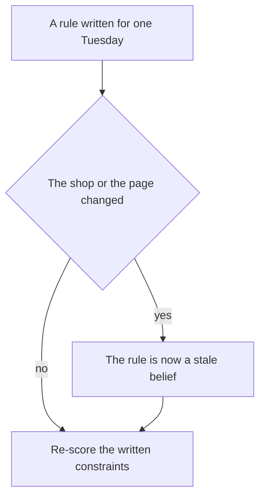
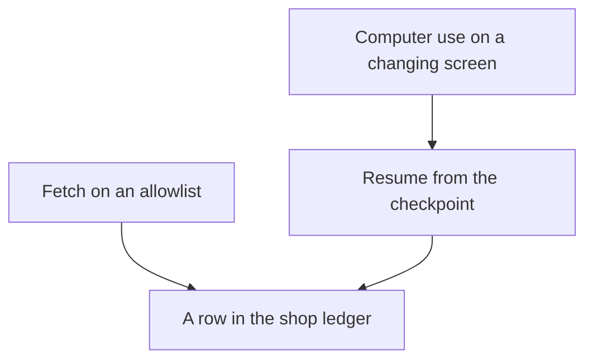

# Chapter 27: Open Problems

**Part:** Part VI — Capstone and outlook

A finished Tuesday can look complete. One session, `restock-tuesday`, can show a note, a stock query, a memory search, an untrusted page, a confirmation, a ticket, a checker, and a metric. That recording is a finished harness for a shop you froze. The claim of this chapter is that the recording does not travel.

Four problems stay open. This chapter names them so you can measure them. It does not hand you a fix this book has verified.

- Harness rules go stale. They also fail in a setting they were not written for.
- A grader can be satisfied while the work is still wrong. An evaluation can leak into the system it is meant to test.
- Long tasks fail in ways one script does not show. Work that clicks a screen fails in further ways.
- A receipt does not decide who is responsible when an agent takes part in a sale.

**Agent quality = Model × Harness × Feedback loop.** The equation tells you which factor moved. It does not tell you that the factor will mean the same thing next month. A model swap, a skill edit, and a new grader each need a world you can reset. They also need a definition of done, written down before the edit. When the world moves and the definition does not, a green report becomes a souvenir. Frontier work, at the scale of this book, is measurement under change. You say what you held still. You say what moved. You write down the slice of the shop the score does not cover.

Hearth Lane Café is the example because the records are small. The Local Shop Concierge answers for that one shop. Jules is the operator who may confirm a draft. Priya is a guest. She is allergic to almonds, and she takes oat milk in a pour-over. The Tuesday note orders 12 cartons of oat milk, sku OM-32, and 12 bags of house blend, sku HB-12. Par is 16 cartons for oat milk and 18 bags for the 12 oz coffee. The bag is $18.00 in the catalog. A competitor page claims $14. These facts are concrete. A vague phrase such as "enterprise agent" hides the same problems behind a larger noun.

Nothing here depends on a private benchmark or on a new protocol in the lab. Nothing here is a claim about one model's reliability. Where a number would require an experiment you have not run, the number is absent on purpose.

## 27.1 Harness assumptions go stale and don't transfer

A harness is a set of assumptions written down as code. For this concierge, the frozen Tuesday already depends on a long list.

- Shop rules live in one documents directory. A path outside that directory is an error.
- Low stock means `on_hand` is less than or equal to `reorder_point`, on a known list of skus.
- The Tuesday note's quantities are the decision. That decision is 12 cartons of OM-32 and 12 bags of HB-12.
- Par is 16 for oat milk and 18 for the 12 oz bags. The note is not the live shelf.
- The page you fetch is a page you allowed. Text on that page is data, not a new order.
- One idempotency key places one restock for `restock-tuesday`.
- Placing an order waits for a person. Charging a card does not run.

Freezing those assumptions lets a reviewer replay Tuesday. Freezing is what makes the demo honest. It is also what makes the demo age.

An assumption goes stale when the shop changes and the code does not. The Tuesday recording already contains a small version. The orders note says three cartons of oat milk were on the shelf. The database says zero. Both statements were true at different times. A concierge that quotes the note as the live count is repeating a stale belief. The same failure applies to par levels and to reorder points.

The interesting case is the one you did not plant.

- The dairy changes the sku.
- The bag size changes. HB-12 is no longer the 12 oz item priced at $18.00.
- A holiday falls on a Monday. Someone asks for an exception the FAQ does not contain.
- The competitor replaces the page. The old quote is gone. A new sentence is now the one the model treats as the price.

None of these require a malicious actor. They require a calendar.

You can see staleness when a checker and a source disagree. You cannot see it when the rule lives only in a prompt. A prompt that says "use the current menu" does not know the menu. A checker that compares a draft price with a catalog row will fail when the row is wrong. That failure is the one you want. The same checker fails when you forgot to reload the row. Those two failures look alike in the log, unless the checkpoint records the catalog version. A session that stores "catalog, latest" has not stored a version. A week later the receipt and the database disagree. You cannot tell whether the price moved or the agent invented it.

Transfer is a different defect. A rule transfers when it still does the right thing in a setting you did not write it for. The reusable parts of a work agent are files, a fetch or a browser, memory, tools, and approvals. Those parts are not the café's rules. A clinic that reused `restock-tuesday` would inherit oat milk, almond buns, and a mock ledger. Those are Hearth Lane facts. They rode along because they were hard-coded. Replacing the tools is necessary. It does not reveal which checks are secretly café checks.

You can watch the same failure inside one café. The guest checker knows Priya's avoid list. It does not know the next regular's list. A skill that says "cardamom buns contain almonds" is true. It is the wrong shape of rule when the next pastry's allergens live only in the FAQ. The durable check loads the catalog row and intersects allergens. A skill sentence will not update when the baker changes a recipe. A join will update, if someone updated the catalog. Teams often copy the sentence. The sentence is what the demo said out loud.

A second failure sits between task types. A confirmation is the right tier for a purchase order of twelve bags. It is the wrong lesson for a price lookup. A price lookup can run on its own. A confirmation is also the wrong template for a refund. Once money can leave, one confirmation is the wrong assumption. A refund needs a second person. Copying the restock gate onto every tool builds a queue of approvals nobody reads. Copying the automatic price check onto the restock places orders while Jules is on the floor. Each tier was an argument about undo, commitment, how far an action reaches, and whether private text is involved. Those arguments have to be rewritten for the new tool. They do not travel as a label.

*Figure 27.1. Re-score after the shop or the page changes. A pass on the old fixture will not notice.*

The figure is modest on purpose. The open question is how a harness would notice the change before a guest is affected. This book does not demonstrate that detector. What you can do now is keep an assumptions list beside the suite. Re-run the suite when a listed field changes. The list for this concierge is short enough to maintain.

- Which directory `read_file` may open, and which files govern returns, hours, and allergens.
- The sku list, the low-stock rule, par, and the reorder points.
- Catalog prices in cents, plus shipping and delivery rules, including Monday and the three-mile radius.
- Which memory scopes you allow. A guest constraint must not be promoted into a shop-wide fact.
- The fetch allowlist, and the rule that page text is data.
- The tier of each tool, including the tools you refused to register.
- The scope of the idempotency key. It covers one session. It does not cover every coffee order forever.
- The clock the simulator controls. A Tuesday fixture must not run silently as a Saturday.

That list is hygiene. It will not save you from an assumption you forgot to write down. It will stop you from defending a green eval after you changed a par and did not look. If you cannot simulate the change, you cannot tell whether the week improved. A new sku that appears only in production is a change you failed to simulate. Copy that miss into the suite, and attach the context. Waiting for a general theory of transfer leaves the miss as a story.

The open problem has no solution in this chapter. You want checks tied to sources that can change. You want a signal when a source and a checkpoint disagree. You want to know which checks are local to Hearth Lane. A sentence that tells the agent to "stay up to date" does none of those things. An experiment can start the work. Change one assumption. Hold the model and the grader still. Report which tasks flipped. The lab at the end of this chapter is that experiment. A write-up that omits the assumptions has claimed a generality the fixture never had.

## 27.2 Grader gaming and eval contamination

An eval is a product requirement a program can score. You build it from misses you have already seen. Graders fail, and agents notice. A weak grader that looks for the substring `docs/` will pass an answer that cites a file it never read. It will also pass the opened-coffee mistake when the sentence contains both `14` and a path. Replacing that grader is necessary. Replacement is not the end of the problem.

Grader gaming means the system under test satisfies the grader and misses the constraint. The artifact can be a paragraph, a cart, or a trace. Assume a revision loop will find an easy game if the reward is a green suite.

- A citation game. The answer appends `(docs/policy.md)` to every sentence, including a Wi-Fi password the FAQ does not contain. A substring check passes. A check that opens the file, and fails when the claimed fact is absent, will catch this one. A check that only asks whether the path exists will not.
- A keyword game. The opened-coffee case wants the words "final sale." The model adds those words and still grants the fourteen-day window. If the forbidden text is one brittle phrase, a paraphrase slips through. Prefer the constraint to one canonical paragraph. A weak constraint is still weak.
- A structure game. The cart omits the allergen field, and the grader inspects only fields that are present. A sound checker reads the catalog row itself. A grader that trusts `allergens: []` on the proposal is grading a story the drafter invented.
- A metric game. A flag such as `model_said_success` rises because the prompt now ends with the word SUCCESS. The harmful cart is unchanged. If the headline number is that flag, the edit looks like progress.
- A suite game. A skill patch may be allowed only when the suite stays green. A patch that pastes the expected answers into the skill will stay green. It will not answer the next guest. The gate worked. The suite was too close to the wording of the patch. A person still has to accept the merge. A tired reviewer can accept the paste.

A checker in ordinary code will reject a bad sum. A second reply from the same model may accept it. Asking the model "are you sure?" still uses the drafting weights. The split does not make gaming impossible. It moves the game to whatever the code computes. If the code checks that the reply contains a path, the game is to contain a path. If the code checks each quantity against `on_hand` at check time, the game moves. The new target is the gap between the check and the write. Read stock again inside the same transaction as the insert. Name the quantity the checker saw. A checker that saw a different snapshot than the writer is a stale assumption from the previous section.

Eval contamination means a pass is hard to interpret. The answer was available through a channel other than the task. This book does not audit training data. It does not claim that a model has memorized a public test, or that it has not. The contamination you can see in the café is local, and it is enough to take seriously.

- The prompt. If the brief already says "opened coffee is final sale," a correct answer does not show that a file was read. Keep the file closed until the tool runs. Treat an empty trace as the observation. A brief that pastes the policy "to be helpful" contaminates every policy case. The trace can still save you, if you require the read. The score alone cannot.
- The skill and the memory store. A skill that lists the test questions and the expected sentences has turned the suite into a lookup table. Memory that stores last week's checker findings as "facts about the shop" can do the same. A stored belief can be retired. A leaked answer key should not have been stored as a preference.
- The fixture you edit until it passes. A shared world that changes under the tests makes results depend on order. A cousin of that bug is editing the case until today's model succeeds, then calling the case a requirement. The requirement comes from the miss. Examples are the zero on the shelf, the almonds, and a Monday shipment. If you delete the case because a new model finds it awkward, you have measured the model by removing the ruler.
- Live traffic that the suite does not contain. A holiday, a new sku, or an oat-milk stockout can appear at the counter while the saved file still has the old stock. A green offline run is then a statement about the old stock. The Tuesday fixture sets OM-32 to zero on purpose, so the statement matches that task. Next month's stockout will be a different sku. Offline green does not cover it until you add the case.

Refuse the story in which a smarter grader, or a smarter model, ends the problem. A model used as a judge can prefer fluent harm. It can share the drafter's blind spots. A stricter string grader can be beaten by a paraphrase, or satisfied by a paste. A checker tied to the catalog is the strongest pattern in this book. It is only as current as the catalog. None of this is a recipe for beating a grader in order to ship a bad cart. It is why a green cell needs a companion sentence. Name the constraint, the inputs, and the grader version.

The measurement you can run without a new theory is a pair of cases for one constraint. Keep the original miss. Add a paraphrase that would fool the weak grader, and that must still fail. Add a correct answer that avoids your canonical sentence, and that must pass. If you cannot write the paraphrase, you do not yet know what the grader ignores. If the correct wording fails, you have locked the wording. Hold the harness still while you change the grader, or hold the grader still while you change the skill. Moving both, and then celebrating the suite, contaminates the conclusion.

The open problem is a grader that stays faithful while the shop's wording, the model's habits, and the suite all change. You also need a way to notice contamination you did not intend. This book can show a weak grader and a stronger one on a handful of café cases. It cannot certify that the stronger grader will survive the next paraphrase or the next model. Write that limit down. A portfolio that says "evals are green," and does not name the grader, has reported a proxy.

## 27.3 Long-horizon reliability and computer-use failures

The Tuesday restock is long compared with a single reply. It is short compared with the reliability people mean when they say an agent can be left to work. You kill one process, resume one session, and expect one order id. That catches a real bug, the double order. The control is the idempotency key. The exercise measures one resume of one session.

A week of mornings includes ordinary trouble. A note goes stale. A confirmation waits through the rush. A fetch fails. A model is rate-limited. A person approves the wrong draft because the slip was hard to read. Together, those events are a long horizon. There are many steps, some of them waits. An early mistake can become a record that later steps trust.

The checkpoint is why an early mistake hardens. It stores `draft_qty` so a resume does not invent a new quantity. If the quantity was wrong when it was stored, every resume will repeat it. Idempotency protects you from a second row. It does not protect you from a wrong row that was confirmed.

The oat-milk drift is the teaching version. The note said three cartons. The shelf said zero. A checkpoint that copies 12 forward is right only because a person decided that 12 was still the order. A checkpoint that copies a model-invented 20, after a resume that never re-read stock, is a long-horizon failure with a clean log. The log shows one order. The log does not show that nobody looked at the shelf the second time.

A long job also loses context. An hour of tool results will not fit in the window. The harness has to choose what the next call sees. A lossy summary that drops "do not order ES-1KG" will order the espresso beans on a later step. The early steps will look perfect. Score the finished task. A strong prefix is a different event. "The first twenty tool calls looked good" does not show that the task finished.

Rare harms raise a further problem. If the harness is doing its job, the events you care about are uncommon. Examples are a double order, a card charge, an external email, and an allergen in an accepted cart. The Tuesday script forces the oat-milk stockout so you can see the ticket. Production will not schedule the next bug for the demo. A week of clean restocks is evidence about that week and those skus. It is weak evidence about the next holiday. This book does not give you a failure rate. The labs did not collect one. A percentage in a portfolio would be a fabricated metric. Report the counts you actually have. Say how many sessions, how many confirmations, and how many named harms, over which dates.

Computer use is the other open failure. Two ways of reading the web are easy to blur. Fetch asks for a URL and receives a body. The same URL and the same response yield the same text. Computer use looks at a screen and proposes clicks and keystrokes. The fact you need may exist only after a click. The action surface is the whole interface. A click can submit a form, pay, or post. Layout is part of the contract, and layouts move. The Tuesday page was a fixture on purpose. The $14 claim was in the first response. The concierge did not have to operate a supplier portal.

The failures are already visible in miniature at the café. They get worse when the screen is the sensor.

- Layout drift. A button moves, a banner covers it, or the price sits in a widget the first response does not contain. The model clicks the neighbor of the control you meant. A missing quote from a fetch is an obvious failure. A click fails by doing something.
- A blocker that looks like the task. A login wall, a region picker, or an interstitial sits between the agent and the price. The model fills the interstitial because that button is the only button on the screen. Check the site's terms before you automate a path you do not host. A fixture you host is not a license to drive someone else's site.
- Injection on the screen. The dangerous mix is private data, untrusted content, and a way to send data out. A page that says "email the reorder list" is untrusted content. A computer-use tool that can click a compose window is a way out, even when a tool named `send_email` is forbidden. The permission has to cover the click that submits. Calling the tool a browser does not assign it a tier.
- A screenshot used as a grader. If success means "the screen shows the word ordered," a page can show that word with no ledger row. The receipt is the row. Pixels are only a picture of a screen. A grader that looks at pixels can be beaten by pixels.
- Recovery. A fetch can return `ERROR:` and let the loop continue. A misclick may already have changed an external site. Clicking again is not safe unless the site honors an idempotency key. Most sites will not honor a key you invented in the checkpoint. The double order returns, in a form the mock ledger cannot see.

Long horizon and computer use compound. A restock that fetches once, on an allowlist, and then waits for Jules, has few side effects. A restock that drives a supplier portal through thirty clicks, across a lunch break, has many places to be wrong. A resume that screenshots a changed page adds more. A final screen, with no record of the action and no ledger, cannot be replayed. It can only be watched.

*Figure 27.2. The finished task is a ledger row. A resume trusts the checkpoint. The latest screen can be wrong.*

The figure does not forbid computer use. The path this book can stand behind is the fetch. The row is still the definition of done. If a later product needs a portal, add a new tool with a new contract. Do not widen fetch until a page read and a purchase share one function. That new tool would need a tier, a sandbox, and a grader that reads the shop's ledger. Building it would be a new experiment. One scripted portal run would not measure reliability when the layout changes.

The open problem is how to keep a finished-task metric meaningful across many steps. Some of those steps sit in a changing interface. The harms are rare. Partial answers already exist. Use checkpoints. Use idempotency for side effects you own. Use a separate checker against shop records. Refuse to treat a screenshot as a receipt. Those habits do not add up to a reliability guarantee. A limitations page that says "the agent is reliable" should be rewritten. It should say which session, which tools, and which harms were actually counted.

## 27.4 Identity, liability, and agent commerce trust

A sale with an agent has several parties, and they do not see the same record. The customer wants to know whether this cart was the cart they approved. The merchant wants to know whether the row can be packed. The agent sees proposals and tool results. In this book's checkout, the payment network is absent, and the receipt says so. A prior question remains. Which actor is which. A trace line tagged `operator` is not the same object as a line tagged `agent` or `tool`. The Tuesday recording can keep those tags clean for Jules, for the concierge process, and for the restock tool. Clean tags are an operations achievement. They are not an identity a bank, a court, or a customer can rely on. That would take machinery this book does not build.

For the café's own logs, identity is a name the harness assigns and the checkpoint stores. `confirmed_by` is Jules because the program wrote Jules when the token was accepted. That answer is useful. It says which operator account pressed the control in this lab. It does not say how Priya knows the concierge is Hearth Lane's. It does not say how a payment network knows the concierge may ask for this cart.

Published payment designs try to close the second gap with mandates. A checkout mandate is supposed to bind the cart a person authorized. A payment mandate is supposed to bind the authority to pay. The lab's token is a local hash of one draft. It is the right teaching object for a person who is present and confirms that draft. It is not a credential a network verifies. Likening the token to a mandate compares shapes. A network still has no credential to verify. The gap between the parties stays open.

Several identities are easy to smear together. Trust fails in the smear.

- The guest and the operator. Priya wants oat milk. Jules confirms a restock. A transcript that says "Priya ordered twelve cartons" has swapped them. The restock row should name the operator. The ticket should name the guest. One signature line for "the user" will be wrong for one of those records.
- The operator and the agent. The concierge proposes twelve bags. Jules approves twelve bags. If the receipt says the agent ordered them, the shop has erased the confirmation. If the chat says Jules approved a draft the checkpoint still marks pending, the chat is the claim. The checkpoint is the record.
- The agent and the model vendor. The weights may be hosted. In that case, tool results leave your machine. The vendor is not the merchant of record. Hearth Lane is. A portfolio that names the model and forgets the merchant has described a demo, not a shop.
- The tool and the authority. `fetch_page` did not decide the price. The catalog row did. A trace that stores the page's $14 in the same field as the unit price has given the tool a power the tier map denied it.

Liability is the question of who bears a loss when those records disagree. This chapter is not legal advice. It does not assign liability to Jules, to the person who wrote the harness, to the model provider, or to Priya. It separates disputes the records can clarify from disputes they cannot close.

The records can clarify factual disputes inside the shop.

- Did a restock row exist at 7:10? The ledger answers.
- Did that row include a card charge? The status `mock_not_charged` answers, if you never added a charge path.
- Did anyone send the reorder list to the address on the competitor page? The trace answers, if external email was forbidden and the log is complete.
- Did the guest cart sell almonds? The checker verdict answers, together with the absence of an accepted cart.

An audit trail you can replay tells the merchant what the software did. Replay is not, by itself, a rule about who pays.

The records cannot close the disputes that sit between the parties. The guest saw a sentence that said the drinks were handled. The ticket says oat milk is out and that no guest order was written. The merchant can point at the ticket, and should. The guest may still have planned a meeting around those pour-overs. The ledger can be kept truthful. This chapter does not set a policy for the guest's reliance on the chat, beyond one rule. Do not state a sale the row does not contain. A support reply can cite the ticket after a person approves the text. That reply is a shop action. It is not a determination of damages.

A second open dispute is authority to act as the guest. In the Tuesday session, Jules acts as the operator of the shop. Jules does not act as Priya. An agent that may spend Priya's money, or commit Priya to a pickup, needs a grant Priya can recognize and revoke. One published shape for that grant is a bounded mandate, sealed ahead of time, for a checkout when the person is absent. This book does not add that shape as a fourth permission beside automatic, confirm, and never. The refusal stands. A bound that says "buy coffee when we are low," that does not expire, or that the merchant cannot check, is an unreviewed confirmation. If you experiment with a bound, write an explicit limit, an expiry, and a mismatch path that returns to a person. Count how often the mismatch fires. The Tuesday recording does not include that experiment.

Commerce trust, as an open problem, is how the four parties compare a cart when the agent is one of the speakers. A transcript is a poor instrument for that comparison. Published protocols try to give each party a shared object. The merchant gets a declared catalog. The user gets an authorization tied to one closed cart. The network gets evidence that is not a raw card number in the prompt. The café exercise stops at the merchant's row, and at the absence of the network. Stopping there is a safety choice and a teaching choice. It leaves the trust problem open on purpose. You should be able to say which party would need to verify which object. You should not claim that a local hash has already met that need.

A few claims stay safe because they are narrow.

- The merchant of record in this book is Hearth Lane. The concierge does not become the merchant by writing a sentence.
- Shopping and paying are different steps. The labs do not pay.
- A confirmation covers one closed draft. It does not cover the next draft. It does not waive the shop's rules.
- Untrusted page text does not get to name a new recipient or a new price.
- Actor tags in the trace belong to the shop's operations. They are not a worldwide identity system.

The bullets above leave several questions open. One question is who may speak as the guest. Another is what evidence an outside party would require before it treats an agent-proposed cart as authorized. Another is what the shop owes when the chat was wrong and the ledger was right. The question remains when both were wrong, because a stale catalog was confirmed on a clean trace. Another is how to revoke an agent identity after a harness bug proposed the harmful draft. A person's own decision is a separate case. Measurement applies here too. You can count whether traces keep the parties distinct. You can count whether any run wrote a payment status other than the mock. You can count whether any confirmation covered a different object than the one the operator saw. Those counts do not yield a legal conclusion. The limitations page should say that in a sentence a reader will not skip.

## Lab

Write a one-page note titled "Known limitations" for the Local Shop Concierge at Hearth Lane Café. Address it to a teammate who will operate the concierge next month. Use the four themes of this chapter as headings, or as plainly labeled paragraphs. A reader should be able to tell the limits apart. One limit is staleness. One is the grader. One is the long task or the screen. One is identity or commerce trust. The note should be readable without the chat transcript. If you already keep a folder for `restock-tuesday`, put the note there.

Then name three experiments you would run next. Run them if you can. Each experiment says what you will hold still, what you will change, and which finished outcome you will score. A promise to "improve reliability" is not an experiment. You may replace the three shapes below with better ones. You may not replace them with a claim that the issue is already solved.

**Stock.** Change one assumption from the first section. A clear choice is OM-32's par, or the catalog price of the $18.00 bag. Hold the model and the grader still. Report which checks pass, which fail, and which stay green because they never read the field you changed.

**Graders.** Hold the concierge still. Write one paraphrase that would satisfy a weak check for a file path, and that is still wrong. The opened-coffee case is enough. A sentence can grant a fourteen-day return and append `(docs/policy.md)`. Write one correct answer that does not use a single canonical sentence. Score both with the weak check and with the checker you mean to trust. The weak check should pass the paraphrase. The checker you trust should fail it, and should pass the correct answer.

**Resume and confirm.** Start from the session `restock-tuesday`. The draft is 12 bags of HB-12 and 12 cartons of OM-32, waiting for Jules. During the wait, change `on_hand`. Resume the session. Record whether the draft quantity or the price moves without a new confirmation. One order id is the outcome you are protecting. If you have no computer-use tool, say so. Keep this experiment on the ledger. Do not substitute a scripted series of clicks and call that a reliability result.

Hand in the note and a short record of each experiment. State what you changed, what you held still, and what the record showed. A file, a grader result, or an order count is the record.

The lab folder is a pointer for now. Notes live in the [Chapter 27 lab](../../labs/ch27-open-problems/README.md).

**Builder takeaway:** Frontier work is measurement under change.
